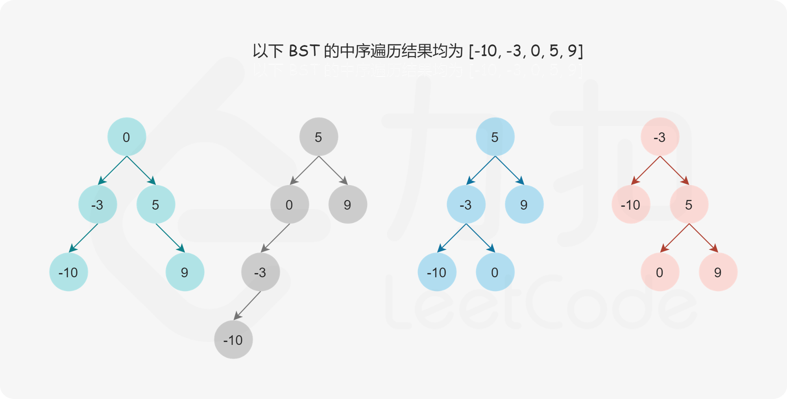
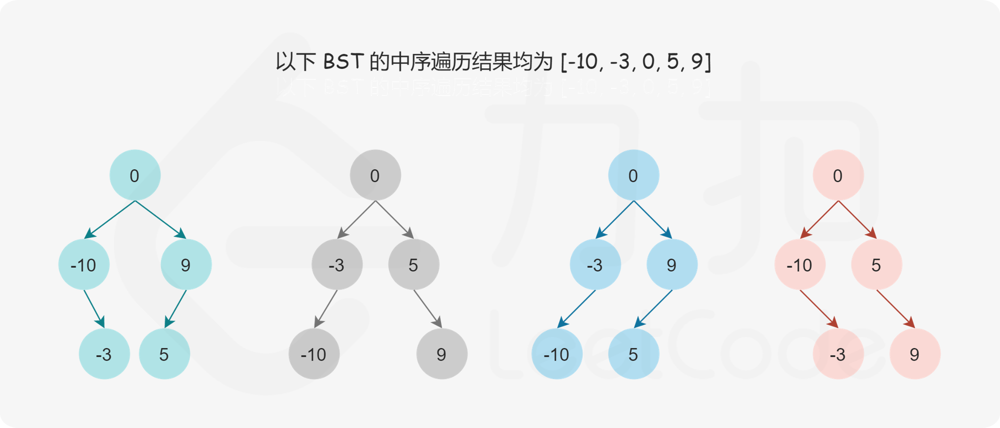
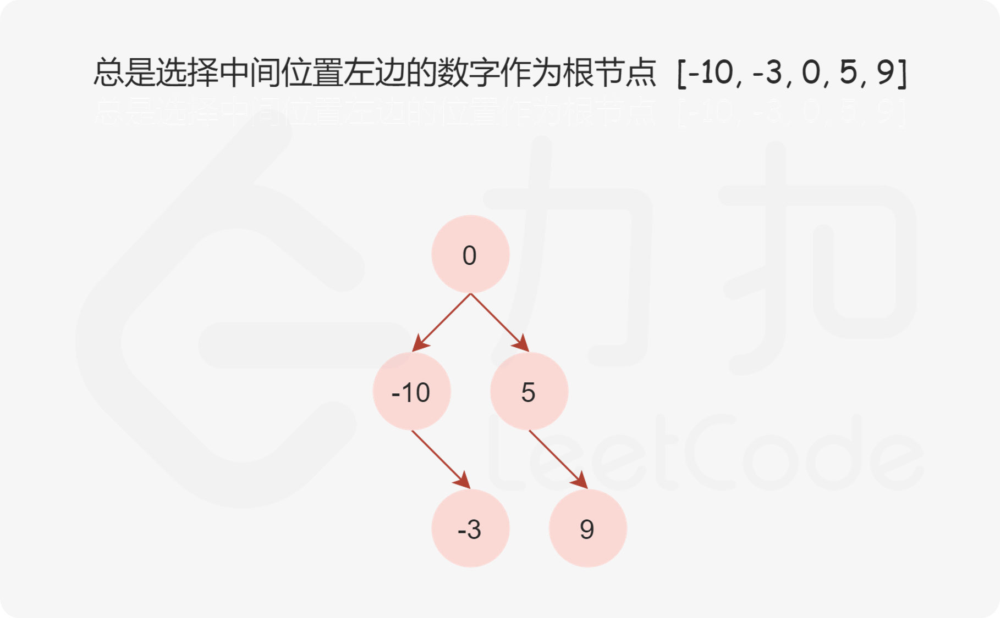
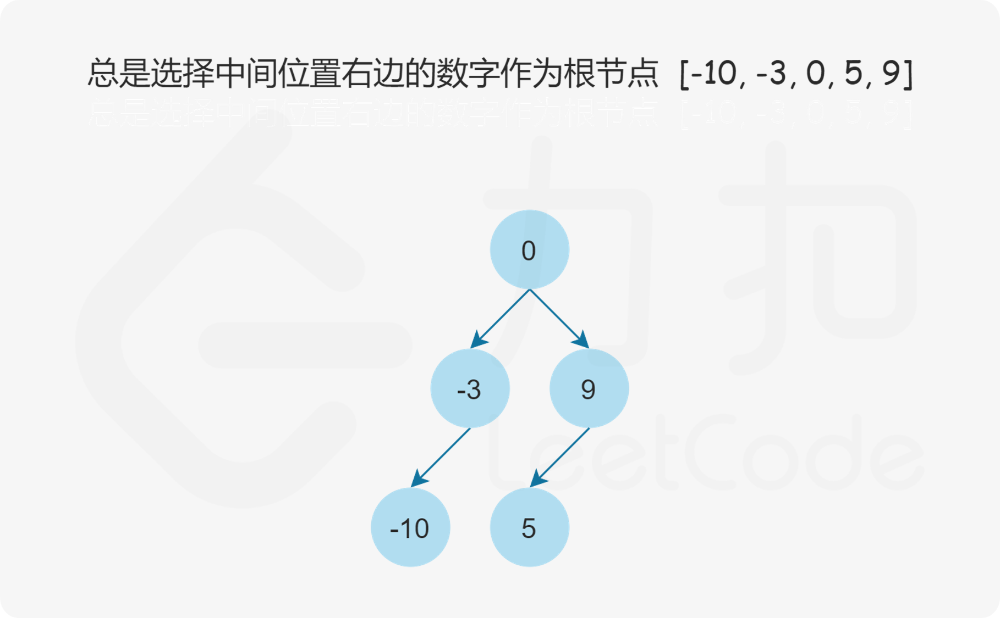

#### [前言](https://leetcode.cn/problems/minimum-height-tree-lcci/solutions/1801461/zui-xiao-gao-du-shu-by-leetcode-solution-t8d1/)

二叉搜索树的中序遍历是升序序列，题目给定的数组是按照升序排序的有序数组，因此可以确保数组是二叉搜索树的中序遍历序列。

给定二叉搜索树的中序遍历，是否可以唯一地确定二叉搜索树？答案是否定的。如果没有要求二叉搜索树的高度最小，则任何一个数字都可以作为二叉搜索树的根节点，因此可能的二叉搜索树有多个。



如果增加一个限制条件，即要求二叉搜索树的高度最小，是否可以唯一地确定二叉搜索树？答案仍然是否定的。



如果二叉搜索树中有 $n$ 个节点，则二叉搜索树的最小高度是 $\lfloor \log n \rfloor$，最大高度是 $n - 1$。为了使二叉搜索树的高度最小，左右子树的节点数应尽可能接近，因此我们选择中间数字作为二叉搜索树的根节点，这样分给左右子树的数字个数相同或只相差 $1$，可以使得二叉搜索树的高度最小。如果数组长度是奇数，则根节点的选择是唯一的，如果数组长度是偶数，则可以选择中间位置左边的数字作为根节点或者选择中间位置右边的数字作为根节点，选择不同的数字作为根节点则创建的最小高度二叉搜索树也是不同的。


确定最小高度二叉搜索树的根节点之后，其余的数字分别位于最小高度二叉搜索树的左子树和右子树中，左子树和右子树分别也是最小高度二叉搜索树，因此可以通过递归的方式创建最小高度二叉搜索树。

递归的基准情形是最小高度二叉搜索树不包含任何数字，此时最小高度二叉搜索树为空。

在给定中序遍历序列数组的情况下，每一个子树中的数字在数组中一定是连续的，因此可以通过数组下标范围确定子树包含的数字，下标范围记为 $[left, right]$。对于整个中序遍历序列，下标范围从 $left=0$ 到 $right=nums.length-1$。当 $left>right$ 时，最小高度二叉搜索树为空。

以下三种方法中，方法一总是选择中间位置左边的数字作为根节点，方法二总是选择中间位置右边的数字作为根节点，方法三是方法一和方法二的结合，选择任意一个中间位置数字作为根节点。

#### 方法一：中序遍历，总是选择中间位置左边的数字作为根节点

选择中间位置左边的数字作为根节点，则根节点的下标为 $mid=(left+right)/2$，此处的除法为整数除法。



```java
class Solution {
    public TreeNode sortedArrayToBST(int[] nums) {
        return helper(nums, 0, nums.length - 1);
    }

    public TreeNode helper(int[] nums, int left, int right) {
        if (left > right) {
            return null;
        }

        // 总是选择中间位置左边的数字作为根节点
        int mid = (left + right) / 2;

        TreeNode root = new TreeNode(nums[mid]);
        root.left = helper(nums, left, mid - 1);
        root.right = helper(nums, mid + 1, right);
        return root;
    }
}
```

```python
class Solution:
    def sortedArrayToBST(self, nums: List[int]) -> TreeNode:
        def helper(left, right):
            if left > right:
                return None

            # 总是选择中间位置左边的数字作为根节点
            mid = (left + right) // 2

            root = TreeNode(nums[mid])
            root.left = helper(left, mid - 1)
            root.right = helper(mid + 1, right)
            return root

        return helper(0, len(nums) - 1)
```

```csharp
public class Solution 
{
    public TreeNode SortedArrayToBST(int[] nums) 
    {
        return Helper(nums, 0, nums.Length - 1);
    }

    public TreeNode Helper(int[] nums, int left, int right) 
    {
        if (left > right)
        {
            return null;
        }

        // 总是选择中间位置左边的数字作为根节点
        int mid = (left + right) / 2;

        TreeNode root = new TreeNode(nums[mid]);
        root.left = Helper(nums, left, mid - 1);
        root.right = Helper(nums, mid + 1, right);
        return root;
    }
}
```

```cpp
class Solution {
public:
    TreeNode* sortedArrayToBST(vector<int>& nums) {
        return helper(nums, 0, nums.size() - 1);
    }

    TreeNode* helper(vector<int>& nums, int left, int right) {
        if (left > right) {
            return nullptr;
        }

        // 总是选择中间位置左边的数字作为根节点
        int mid = (left + right) / 2;

        TreeNode* root = new TreeNode(nums[mid]);
        root->left = helper(nums, left, mid - 1);
        root->right = helper(nums, mid + 1, right);
        return root;
    }
};
```

```c
struct TreeNode* helper(int* nums, int left, int right) {
    if (left > right) {
        return NULL;
    }

    // 总是选择中间位置左边的数字作为根节点
    int mid = (left + right) / 2;

    struct TreeNode* root = (struct TreeNode*)malloc(sizeof(struct TreeNode));
    root->val = nums[mid];
    root->left = helper(nums, left, mid - 1);
    root->right = helper(nums, mid + 1, right);
    return root;
}

struct TreeNode* sortedArrayToBST(int* nums, int numsSize) {
    return helper(nums, 0, numsSize - 1);
}
```

```go
func sortedArrayToBST(nums []int) *TreeNode {
    return helper(nums, 0, len(nums) - 1)
}

func helper(nums []int, left, right int) *TreeNode {
    if left > right {
        return nil
    }
    mid := (left + right) / 2
    root := &TreeNode{Val: nums[mid]}
    root.Left = helper(nums, left, mid - 1)
    root.Right = helper(nums, mid + 1, right)
    return root
}
```

**复杂度分析**

- 时间复杂度：$O(n)$，其中 $n$ 是数组的长度。每个数字只访问一次。
- 空间复杂度：$O(\log n)$，其中 $n$ 是数组的长度。空间复杂度不考虑返回值，因此空间复杂度主要取决于递归栈的深度，递归栈的深度是 $O(\log n)$。

#### [方法二：中序遍历，总是选择中间位置右边的数字作为根节点](https://leetcode.cn/problems/minimum-height-tree-lcci/solutions/1801461/zui-xiao-gao-du-shu-by-leetcode-solution-t8d1/)

选择中间位置右边的数字作为根节点，则根节点的下标为 $mid=(left+right+1)/2$，此处的除法为整数除法。



```java
class Solution {
    public TreeNode sortedArrayToBST(int[] nums) {
        return helper(nums, 0, nums.length - 1);
    }

    public TreeNode helper(int[] nums, int left, int right) {
        if (left > right) {
            return null;
        }

        // 总是选择中间位置右边的数字作为根节点
        int mid = (left + right + 1) / 2;

        TreeNode root = new TreeNode(nums[mid]);
        root.left = helper(nums, left, mid - 1);
        root.right = helper(nums, mid + 1, right);
        return root;
    }
}
```

```python
class Solution:
    def sortedArrayToBST(self, nums: List[int]) -> TreeNode:
        def helper(left, right):
            if left > right:
                return None

            # 总是选择中间位置右边的数字作为根节点
            mid = (left + right + 1) // 2

            root = TreeNode(nums[mid])
            root.left = helper(left, mid - 1)
            root.right = helper(mid + 1, right)
            return root

        return helper(0, len(nums) - 1)
```

```csharp
public class Solution 
{
    public TreeNode SortedArrayToBST(int[] nums) 
    {
        return Helper(nums, 0, nums.Length - 1);
    }

    public TreeNode Helper(int[] nums, int left, int right) 
    {
        if (left > right)
        {
            return null;
        }

        // 总是选择中间位置右边的数字作为根节点
        int mid = (left + right + 1) / 2;

        TreeNode root = new TreeNode(nums[mid]);
        root.left = Helper(nums, left, mid - 1);
        root.right = Helper(nums, mid + 1, right);
        return root;
    }
}
```

```cpp
class Solution {
public:
    TreeNode* sortedArrayToBST(vector<int>& nums) {
        return helper(nums, 0, nums.size() - 1);
    }

    TreeNode* helper(vector<int>& nums, int left, int right) {
        if (left > right) {
            return nullptr;
        }

        // 总是选择中间位置右边的数字作为根节点
        int mid = (left + right + 1) / 2;

        TreeNode* root = new TreeNode(nums[mid]);
        root->left = helper(nums, left, mid - 1);
        root->right = helper(nums, mid + 1, right);
        return root;
    }
};
```

```c
struct TreeNode* helper(int* nums, int left, int right) {
    if (left > right) {
        return NULL;
    }

    // 总是选择中间位置右边的数字作为根节点
    int mid = (left + right + 1) / 2;

    struct TreeNode* root = (struct TreeNode*)malloc(sizeof(struct TreeNode));
    root->val = nums[mid];
    root->left = helper(nums, left, mid - 1);
    root->right = helper(nums, mid + 1, right);
    return root;
}

struct TreeNode* sortedArrayToBST(int* nums, int numsSize) {
    return helper(nums, 0, numsSize - 1);
}
```

```go
func sortedArrayToBST(nums []int) *TreeNode {
    return helper(nums, 0, len(nums) - 1)
}

func helper(nums []int, left, right int) *TreeNode {
    if left > right {
        return nil
    }

    // 总是选择中间位置右边的数字作为根节点
    mid := (left + right + 1) / 2
    root := &TreeNode{Val: nums[mid]}
    root.Left = helper(nums, left, mid - 1)
    root.Right = helper(nums, mid + 1, right)
    return root
}
```

**复杂度分析**

- 时间复杂度：$O(n)$，其中 $n$ 是数组的长度。每个数字只访问一次。
- 空间复杂度：$O(\log n)$，其中 $n$ 是数组的长度。空间复杂度不考虑返回值，因此空间复杂度主要取决于递归栈的深度，递归栈的深度是 $O(\log n)$。

#### [方法三：中序遍历，选择任意一个中间位置数字作为根节点](https://leetcode.cn/problems/minimum-height-tree-lcci/solutions/1801461/zui-xiao-gao-du-shu-by-leetcode-solution-t8d1/)

选择任意一个中间位置数字作为根节点，则根节点的下标为 $mid=(left+right)/2$ 和 $mid=(left+right+1)/2$ 两者中随机选择一个，此处的除法为整数除法。


```java
class Solution {
    Random rand = new Random();

    public TreeNode sortedArrayToBST(int[] nums) {
        return helper(nums, 0, nums.length - 1);
    }

    public TreeNode helper(int[] nums, int left, int right) {
        if (left > right) {
            return null;
        }

        // 选择任意一个中间位置数字作为根节点
        int mid = (left + right + rand.nextInt(2)) / 2;

        TreeNode root = new TreeNode(nums[mid]);
        root.left = helper(nums, left, mid - 1);
        root.right = helper(nums, mid + 1, right);
        return root;
    }
}
```

```python
class Solution:
    def sortedArrayToBST(self, nums: List[int]) -> TreeNode:
        def helper(left, right):
            if left > right:
                return None

            # 选择任意一个中间位置数字作为根节点
            mid = (left + right + randint(0, 1)) // 2

            root = TreeNode(nums[mid])
            root.left = helper(left, mid - 1)
            root.right = helper(mid + 1, right)
            return root

        return helper(0, len(nums) - 1)
```

```csharp
public class Solution 
{
    public TreeNode SortedArrayToBST(int[] nums) 
    {
        return Helper(nums, 0, nums.Length - 1);
    }

    public TreeNode Helper(int[] nums, int left, int right) 
    {
        if (left > right)
        {
            return null;
        }

        // 选择任意一个中间位置数字作为根节点
        int mid = (left + right + new Random().Next(2)) / 2;

        TreeNode root = new TreeNode(nums[mid]);
        root.left = Helper(nums, left, mid - 1);
        root.right = Helper(nums, mid + 1, right);
        return root;
    }
}
```

```cpp
class Solution {
public:
    TreeNode* sortedArrayToBST(vector<int>& nums) {
        return helper(nums, 0, nums.size() - 1);
    }

    TreeNode* helper(vector<int>& nums, int left, int right) {
        if (left > right) {
            return nullptr;
        }

        // 选择任意一个中间位置数字作为根节点
        int mid = (left + right + rand() % 2) / 2;

        TreeNode* root = new TreeNode(nums[mid]);
        root->left = helper(nums, left, mid - 1);
        root->right = helper(nums, mid + 1, right);
        return root;
    }
};
```

```c
struct TreeNode* helper(int* nums, int left, int right) {
    if (left > right) {
        return NULL;
    }

    // 选择任意一个中间位置数字作为根节点
    int mid = (left + right + rand() % 2) / 2;

    struct TreeNode* root = (struct TreeNode*)malloc(sizeof(struct TreeNode));
    root->val = nums[mid];
    root->left = helper(nums, left, mid - 1);
    root->right = helper(nums, mid + 1, right);
    return root;
}

struct TreeNode* sortedArrayToBST(int* nums, int numsSize) {
    return helper(nums, 0, numsSize - 1);
}
```

```go
func sortedArrayToBST(nums []int) *TreeNode {
    rand.Seed(time.Now().UnixNano())
    return helper(nums, 0, len(nums) - 1)
}

func helper(nums []int, left, right int) *TreeNode {
    if left > right {
        return nil
    }

    // 选择任意一个中间位置数字作为根节点
    mid := (left + right + rand.Intn(2)) / 2
    root := &TreeNode{Val: nums[mid]}
    root.Left = helper(nums, left, mid - 1)
    root.Right = helper(nums, mid + 1, right)
    return root
}
```

**复杂度分析**

- 时间复杂度：$O(n)$，其中 $n$ 是数组的长度。每个数字只访问一次。
- 空间复杂度：$O(\log n)$，其中 $n$ 是数组的长度。空间复杂度不考虑返回值，因此空间复杂度主要取决于递归栈的深度，递归栈的深度是 $O(\log n)$。
