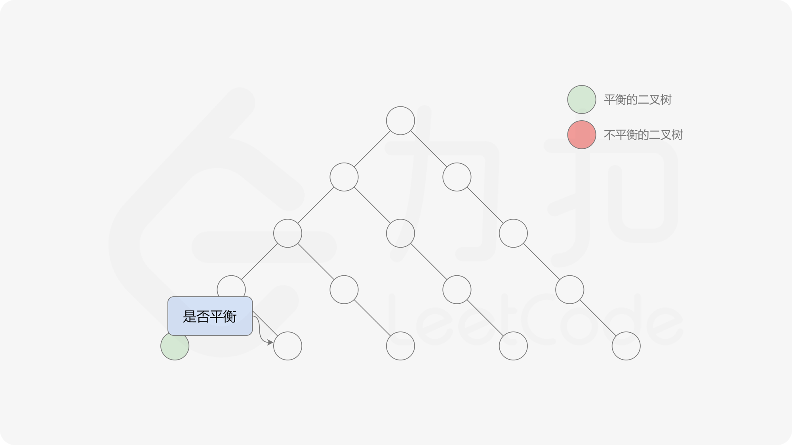
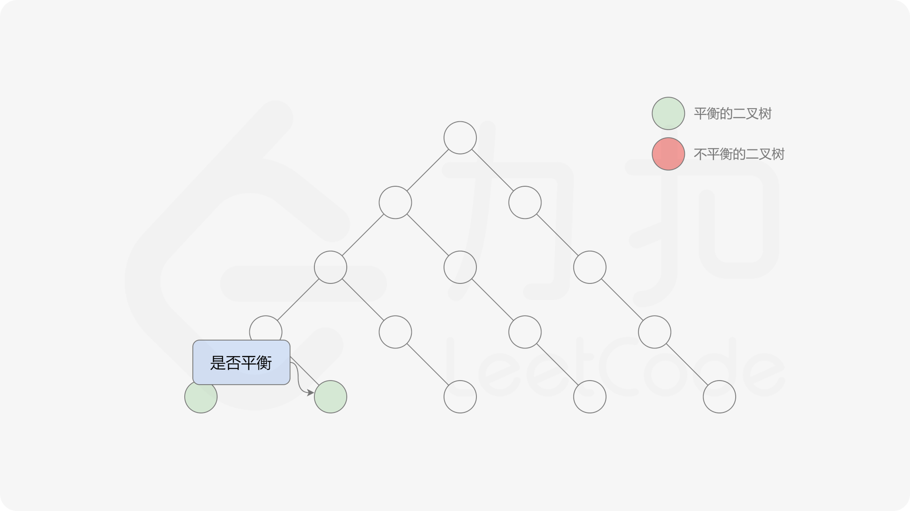

### [检查平衡性](https://leetcode.cn/problems/check-balance-lcci/solutions/531799/jian-cha-ping-heng-xing-by-leetcode-solu-c5yo/)

#### 前言

这道题中的平衡二叉树的定义是：二叉树的每个节点的左右子树的高度差的绝对值不超过 $1$，则二叉树是平衡二叉树。根据定义，一棵二叉树是平衡二叉树，当且仅当其所有子树也都是平衡二叉树，因此可以使用递归的方式判断二叉树是不是平衡二叉树，递归的顺序可以是自顶向下或者自底向上。

#### 方法一：自顶向下的递归

定义函数 $\texttt{height}$，用于计算二叉树中的任意一个节点 $p$ 的高度：

$$\texttt{height}(p) = \begin{cases} 0 & p \text{ 是空节点}\\ \max(\texttt{height}(p.left), \texttt{height}(p.right))+1 & p \text{ 是非空节点} \end{cases}$$

有了计算节点高度的函数，即可判断二叉树是否平衡。具体做法类似于二叉树的前序遍历，即对于当前遍历到的节点，首先计算左右子树的高度，如果左右子树的高度差是否不超过 $1$，再分别递归地遍历左右子节点，并判断左子树和右子树是否平衡。这是一个自顶向下的递归的过程。


##### 代码

```java
class Solution {
    public boolean isBalanced(TreeNode root) {
        if (root == null) {
            return true;
        } else {
            return Math.abs(height(root.left) - height(root.right)) <= 1 && isBalanced(root.left) && isBalanced(root.right);
        }
    }

    public int height(TreeNode root) {
        if (root == null) {
            return 0;
        } else {
            return Math.max(height(root.left), height(root.right)) + 1;
        }
    }
}
```

```c++
class Solution {
public:
    int height(TreeNode* root) {
        if (root == NULL) {
            return 0;
        } else {
            return max(height(root->left), height(root->right)) + 1;
        }
    }

    bool isBalanced(TreeNode* root) {
        if (root == NULL) {
            return true;
        } else {
            return abs(height(root->left) - height(root->right)) <= 1 && isBalanced(root->left) && isBalanced(root->right);
        }
    }
};
```

```python
class Solution:
    def isBalanced(self, root: TreeNode) -> bool:
        def height(root: TreeNode) -> int:
            if not root:
                return 0
            return max(height(root.left), height(root.right)) + 1

        if not root:
            return True
        return abs(height(root.left) - height(root.right)) <= 1 and self.isBalanced(root.left) and self.isBalanced(root.right)
```

```c
int height(struct TreeNode* root) {
    if (root == NULL) {
        return 0;
    } else {
        return fmax(height(root->left), height(root->right)) + 1;
    }
}

bool isBalanced(struct TreeNode* root) {
    if (root == NULL) {
        return true;
    } else {
        return fabs(height(root->left) - height(root->right)) <= 1 && isBalanced(root->left) && isBalanced(root->right);
    }
}
```

```go
func isBalanced(root *TreeNode) bool {
    if root == nil {
        return true
    }
    return abs(height(root.Left) - height(root.Right)) <= 1 && isBalanced(root.Left) && isBalanced(root.Right)
}

func height(root *TreeNode) int {
    if root == nil {
        return 0
    }
    return max(height(root.Left), height(root.Right)) + 1
}

func max(x, y int) int {
    if x > y {
        return x
    }
    return y
}

func abs(x int) int {
    if x < 0 {
        return -1 * x
    }
    return x
}
```

#### 复杂度分析

- 时间复杂度：$O(n^2)$，其中 $n$ 是二叉树中的节点个数。
    最坏情况下，二叉树是满二叉树，需要遍历二叉树中的所有节点，时间复杂度是 $O(n)$。
    对于节点 $p$，如果它的高度是 $d$，则 $\texttt{height}(p)$ 最多会被调用 $d$ 次（即遍历到它的每一个祖先节点时）。对于平均的情况，一棵树的高度 $h$ 满足 $O(h)=O(\log n)$，因为 $d \leq h$，所以总时间复杂度为 $O(n \log n)$。对于最坏的情况，二叉树形成链式结构，高度为 $O(n)$，此时总时间复杂度为 $O(n^2)$。
- 空间复杂度：$O(n)$，其中 $n$ 是二叉树中的节点个数。空间复杂度主要取决于递归调用的层数，递归调用的层数不会超过 $n$。

#### 方法二：自底向上的递归

方法一由于是自顶向下递归，因此对于同一个节点，函数 $\texttt{height}$ 会被重复调用，导致时间复杂度较高。如果使用自底向上的做法，则对于每个节点，函数 $\texttt{height}$ 只会被调用一次。

自底向上递归的做法类似于后序遍历，对于当前遍历到的节点，先递归地判断其左右子树是否平衡，再判断以当前节点为根的子树是否平衡。如果一棵子树是平衡的，则返回其高度（高度一定是非负整数），否则返回 $-1$。如果存在一棵子树不平衡，则整个二叉树一定不平衡。






##### 代码

```java
class Solution {
    public boolean isBalanced(TreeNode root) {
        return height(root) >= 0;
    }

    public int height(TreeNode root) {
        if (root == null) {
            return 0;
        }
        int leftHeight = height(root.left);
        int rightHeight = height(root.right);
        if (leftHeight == -1 || rightHeight == -1 || Math.abs(leftHeight - rightHeight) > 1) {
            return -1;
        } else {
            return Math.max(leftHeight, rightHeight) + 1;
        }
    }
}
```

```c++
class Solution {
public:
    int height(TreeNode* root) {
        if (root == NULL) {
            return 0;
        }
        int leftHeight = height(root->left);
        int rightHeight = height(root->right);
        if (leftHeight == -1 || rightHeight == -1 || abs(leftHeight - rightHeight) > 1) {
            return -1;
        } else {
            return max(leftHeight, rightHeight) + 1;
        }
    }

    bool isBalanced(TreeNode* root) {
        return height(root) >= 0;
    }
};
```

```python
class Solution:
    def isBalanced(self, root: TreeNode) -> bool:
        def height(root: TreeNode) -> int:
            if not root:
                return 0
            leftHeight = height(root.left)
            rightHeight = height(root.right)
            if leftHeight == -1 or rightHeight == -1 or abs(leftHeight - rightHeight) > 1:
                return -1
            else:
                return max(leftHeight, rightHeight) + 1

        return height(root) >= 0
```

```c
int height(struct TreeNode* root) {
    if (root == NULL) {
        return 0;
    }
    int leftHeight = height(root->left);
    int rightHeight = height(root->right);
    if (leftHeight == -1 || rightHeight == -1 || fabs(leftHeight - rightHeight) > 1) {
        return -1;
    } else {
        return fmax(leftHeight, rightHeight) + 1;
    }
}

bool isBalanced(struct TreeNode* root) {
    return height(root) >= 0;
}
```

```go
func isBalanced(root *TreeNode) bool {
    return height(root) >= 0
}

func height(root *TreeNode) int {
    if root == nil {
        return 0
    }
    leftHeight := height(root.Left)
    rightHeight := height(root.Right)
    if leftHeight == -1 || rightHeight == -1 || abs(leftHeight - rightHeight) > 1 {
        return -1
    }
    return max(leftHeight, rightHeight) + 1
}

func max(x, y int) int {
    if x > y {
        return x
    }
    return y
}

func abs(x int) int {
    if x < 0 {
        return -1 * x
    }
    return x
}
```

#### 复杂度分析

- 时间复杂度：$O(n)$，其中 $n$ 是二叉树中的节点个数。使用自底向上的递归，每个节点的计算高度和判断是否平衡都只需要处理一次，最坏情况下需要遍历二叉树中的所有节点，因此时间复杂度是 $O(n)$。
- 空间复杂度：$O(n)$，其中 $n$ 是二叉树中的节点个数。空间复杂度主要取决于递归调用的层数，递归调用的层数不会超过 $n$。
