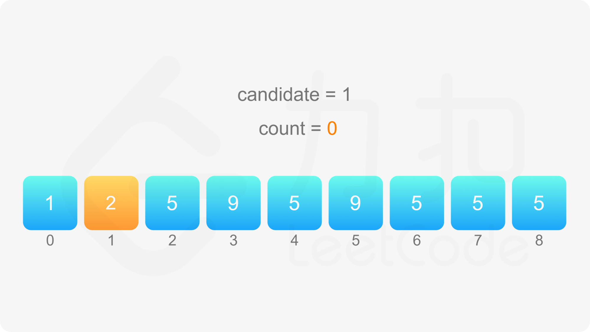
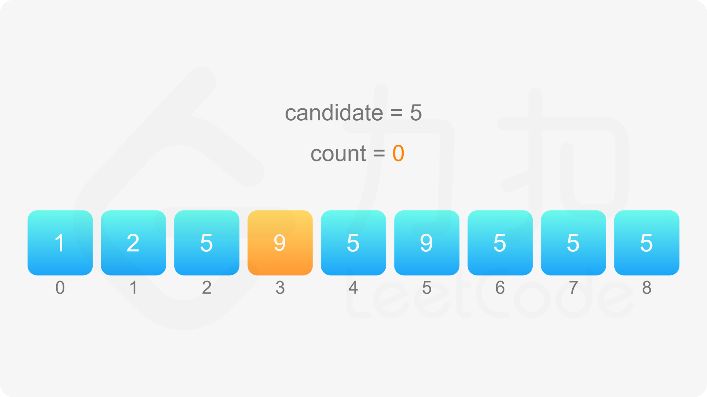

### [主要元素](https://leetcode.cn/problems/find-majority-element-lcci/solutions/865863/zhu-yao-yuan-su-by-leetcode-solution-xr1p/)

#### 方法一：$\text{Boyer-Moore}$ 投票算法

由于题目要求时间复杂度 $O(n)$ 和空间复杂度 $O(1)$，因此符合要求的解法只有 $\text{Boyer-Moore}$ 投票算法。

$\text{Boyer-Moore}$ 投票算法的基本思想是：在每一轮投票过程中，从数组中删除两个不同的元素，直到投票过程无法继续，此时数组为空或者数组中剩下的元素都相等。

- 如果数组为空，则数组中不存在主要元素；
- 如果数组中剩下的元素都相等，则数组中剩下的元素可能为主要元素。

$\text{Boyer-Moore}$ 投票算法的步骤如下：

1. 维护一个候选主要元素 $\textit{candidate}$ 和候选主要元素的出现次数 $\textit{count}$，初始时 $\textit{candidate}$ 为任意值，$\textit{count}=0$；
1. 遍历数组 $\textit{nums}$ 中的所有元素，遍历到元素 $x$ 时，进行如下操作：
    a. 如果 $\textit{count}=0$，则将 $x$ 的值赋给 $\textit{candidate}$，否则不更新 $\textit{candidate}$ 的值；
    b. 如果 $x=\textit{candidate}$，则将 $\textit{count}$ 加 $1$，否则将 $\textit{count}$ 减 $1$。
1. 遍历结束之后，如果数组 $\textit{nums}$ 中存在主要元素，则 $\textit{candidate}$ 即为主要元素，否则 $\textit{candidate}$ 可能为数组中的任意一个元素。

由于不一定存在主要元素，因此需要第二次遍历数组，验证 $\textit{candidate}$ 是否为主要元素。第二次遍历时，统计 $\textit{candidate}$ 在数组中的出现次数，如果出现次数大于数组长度的一半，则 $\textit{candidate}$ 是主要元素，返回 $\textit{candidate}$，否则数组中不存在主要元素，返回 $-1$。

为什么当数组中存在主要元素时，$\text{Boyer-Moore}$ 投票算法可以确保得到主要元素？

在 $\text{Boyer-Moore}$ 投票算法中，遇到相同的数则将 $\textit{count}$ 加 $1$，遇到不同的数则将 $\textit{count}$ 减 $1$。根据主要元素的定义，主要元素的出现次数大于其他元素的出现次数之和，因此在遍历过程中，主要元素和其他元素两两抵消，最后一定剩下至少一个主要元素，此时 $\textit{candidate}$ 为主要元素，且 $\textit{count} \ge 1$。








##### 代码

```java
class Solution {
    public int majorityElement(int[] nums) {
        int candidate = -1;
        int count = 0;
        for (int num : nums) {
            if (count == 0) {
                candidate = num;
            }
            if (num == candidate) {
                count++;
            } else {
                count--;
            }
        }
        count = 0;
        int length = nums.length;
        for (int num : nums) {
            if (num == candidate) {
                count++;
            }
        }
        return count * 2 > length ? candidate : -1;
    }
}
```

```csharp
public class Solution {
    public int MajorityElement(int[] nums) {
        int candidate = -1;
        int count = 0;
        foreach (int num in nums) {
            if (count == 0) {
                candidate = num;
            }
            if (num == candidate) {
                count++;
            } else {
                count--;
            }
        }
        count = 0;
        int length = nums.Length;
        foreach (int num in nums) {
            if (num == candidate) {
                count++;
            }
        }
        return count * 2 > length ? candidate : -1;
    }
}
```

```javascript
var majorityElement = function(nums) {
    let candidate = -1;
    let count = 0;
    for (const num of nums) {
        if (count === 0) {
            candidate = num;
        }
        if (num === candidate) {
            count++;
        } else {
            count--;
        }
    }
    count = 0;
    const length = nums.length;
    for (const num of nums) {
        if (num === candidate) {
            count++;
        }
    }
    return count * 2 > length ? candidate : -1;
};
```

```c++
class Solution {
public:
    int majorityElement(vector<int>& nums) {
        int candidate = -1;
        int count = 0;
        for (int& num : nums) {
            if (count == 0) {
                candidate = num;
            }
            if (num == candidate) {
                count++;
            } else {
                count--;
            }
        }
        count = 0;
        int length = nums.size();
        for (int& num : nums) {
            if (num == candidate) {
                count++;
            }
        }
        return count * 2 > length ? candidate : -1;
    }
};
```

```c
int majorityElement(int* nums, int numsSize) {
    int candidate = -1;
    int count = 0;
    for (int i = 0; i < numsSize; i++) {
        if (count == 0) {
            candidate = nums[i];
        }
        if (nums[i] == candidate) {
            count++;
        } else {
            count--;
        }
    }
    count = 0;
    int length = numsSize;
    for (int i = 0; i < numsSize; i++) {
        if (nums[i] == candidate) {
            count++;
        }
    }
    return count * 2 > length ? candidate : -1;
}
```

```go
func majorityElement(nums []int) int {
    candidate := -1
    count := 0
    for _, num := range nums {
        if count == 0 {
            candidate = num
        }
        if num == candidate {
            count++
        } else {
            count--
        }
    }
    count = 0
    for _, num := range nums {
        if num == candidate {
            count++
        }
    }
    if count*2 > len(nums) {
        return candidate
    }
    return -1
}
```

##### 复杂度分析

- 时间复杂度：$O(n)$，其中 $n$ 是数组 $\textit{nums}$ 的长度。需要遍历数组两次。
- 空间复杂度：$O(1)$。只需要常数的额外空间。
