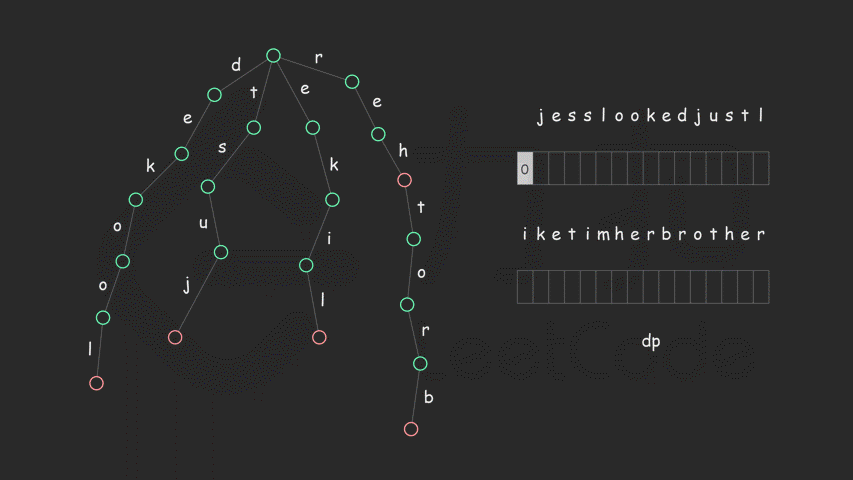

### [恢复空格](https://leetcode.cn/problems/re-space-lcci/solutions/321776/hui-fu-kong-ge-by-leetcode-solution/)

#### 方法一：Trie + 动态规划

**预备知识**

- 字典树 $Trie$

**思路和算法**

定义 $dp[i]$ 表示考虑前 $i$ 个字符最少的未识别的字符数量，从前往后计算 $dp$ 值。

考虑转移方程，每次转移的时候我们考虑第 $j(j\le i)$ 个到第 $i$ 个字符组成的子串 $sentence[j-1\dots i-1] $（注意字符串下标从 $0$ 开始）是否能在词典中找到，如果能找到的话按照定义转移方程即为

$$dp[i]=min(dp[i],dp[j-1])$$

否则没有找到的话我们可以复用 $dp[i-1]$ 的状态再加上当前未被识别的第 $i$ 个字符，因此此时 $dp$ 值为

$$dp[i]=dp[i-1]+1$$

最后问题化简成了转移的时候如何快速判断当前子串是否存在于词典中，与「[139\. 单词拆分](https://leetcode.cn/problems/word-break/)」类似我们可以选择用哈希表来优化，但笔者实测下来速度很慢，因为用哈希表来实现本身有两个问题，一个是哈希表本身的常数很大，还有一个是我们在枚举子串是否在词典中的时候有些其实是没有必要的枚举。简单举例，如果我们有词典：`['aabc', 'babc', 'cbc']`，但是我们在倒序枚举的时候检查 `dc` 这个子串没出现在词典中以后我们就没必要再接着往前枚举是否有合法的子串了，因为 `dc` 本身已经不是词典中「任意一个单词的后缀」，我们再接着枚举 `*dc` 或者 `**dc` 判断其是否在词典中都是无用功。

因此最终笔者选择了用字典树 $Trie$ 来优化查找，$Trie$ 是一种最大程度利用多个字符串前缀信息的数据结构，它可以在 $O(w)$ 的时间复杂度内判断一个字符串是否是一个字符串集合中某个字符串的前缀，其中 $w$ 代表字符串的长度。这里具体实现不再展开，我们只讲怎么使用。上文提到了哈希表实现的时候会出现很多冗余的判断，最关键的一点就是当前枚举的子串已经不再是词典中「任意一个单词的后缀」，这点我们可以利用 $Trie$ 来解决。

我们将词典中所有的单词「反序」插入字典树中，然后每次转移的时候我们从当前的下标 $i$ 出发倒序遍历 $i-1,i-2,\dots ,0$。在 $Trie$ 上从根节点出发开始走，直到走到当前的字符 $sentence[j]$ 在 $Trie$ 上没有相应的位置，说明 $sentence[j\dots i-1]$ 不存在在词典中，且它已经不是「任意一个单词的后缀」，此时我们直接跳出循环即可。否则，我们需要判断当前的子串是否是一个单词，这里我们直接在插入 $Trie$ 的时候在单词末尾的节点打上一个 $isEnd$ 的标记即可，这样我们在走到某个节点的时候就可以判断是否是一个单词的末尾并根据状态转移方程更新我们的 $dp$ 值。

具体实现以及示例的图画解析可以看下面：



```C++
class Trie {
public:
    Trie* next[26] = {nullptr};
    bool isEnd;

    Trie() {
        isEnd = false;
    }

    void insert(string s) {
        Trie* curPos = this;

        for (int i = s.length() - 1; i >= 0; --i) {
            int t = s[i] - 'a';
            if (curPos->next[t] == nullptr) {
                curPos->next[t] = new Trie();
            }
            curPos = curPos->next[t];
        }
        curPos->isEnd = true;
    }
};

class Solution {
public:
    int respace(vector<string>& dictionary, string sentence) {
        int n = sentence.length(), inf = 0x3f3f3f3f;

        Trie* root = new Trie();
        for (auto& word: dictionary) {
            root->insert(word);
        }

        vector<int> dp(n + 1, inf);
        dp[0] = 0;
        for (int i = 1; i <= n; ++i) {
            dp[i] = dp[i - 1] + 1;

            Trie* curPos = root;
            for (int j = i; j >= 1; --j) {
                int t = sentence[j - 1] - 'a';
                if (curPos->next[t] == nullptr) {
                    break;
                } else if (curPos->next[t]->isEnd) {
                    dp[i] = min(dp[i], dp[j - 1]);
                }
                if (dp[i] == 0) {
                    break;
                }
                curPos = curPos->next[t];
            }
        }
        return dp[n];
    }
};
```

```Java
class Solution {
    public int respace(String[] dictionary, String sentence) {
        int n = sentence.length();

        Trie root = new Trie();
        for (String word: dictionary) {
            root.insert(word);
        }

        int[] dp = new int[n + 1];
        Arrays.fill(dp, Integer.MAX_VALUE);
        dp[0] = 0;
        for (int i = 1; i <= n; ++i) {
            dp[i] = dp[i - 1] + 1;

            Trie curPos = root;
            for (int j = i; j >= 1; --j) {
                int t = sentence.charAt(j - 1) - 'a';
                if (curPos.next[t] == null) {
                    break;
                } else if (curPos.next[t].isEnd) {
                    dp[i] = Math.min(dp[i], dp[j - 1]);
                }
                if (dp[i] == 0) {
                    break;
                }
                curPos = curPos.next[t];
            }
        }
        return dp[n];
    }
}

class Trie {
    public Trie[] next;
    public boolean isEnd;

    public Trie() {
        next = new Trie[26];
        isEnd = false;
    }

    public void insert(String s) {
        Trie curPos = this;

        for (int i = s.length() - 1; i >= 0; --i) {
            int t = s.charAt(i) - 'a';
            if (curPos.next[t] == null) {
                curPos.next[t] = new Trie();
            }
            curPos = curPos.next[t];
        }
        curPos.isEnd = true;
    }
}
```

```C
typedef struct Trie {
    struct Trie* next[26];
    bool isEnd;
} Trie;

void init(Trie** p) {
    *p = (Trie*)malloc(sizeof(Trie));
    (*p)->isEnd = false;
    memset((*p)->next, NULL, sizeof((*p)->next));
}

void insert(Trie* curPos, char* s) {
    int len = strlen(s);
    for (int i = len - 1; i >= 0; --i) {
        int t = s[i] - 'a';
        if (curPos->next[t] == NULL) {
            init(&curPos->next[t]);
        }
        curPos = curPos->next[t];
    }
    curPos->isEnd = true;
}

int respace(char** dictionary, int dictionarySize, char* sentence) {
    int n = strlen(sentence), inf = 0x3f3f3f3f;

    Trie* root;
    init(&root);
    for (int i = 0; i < dictionarySize; i++) {
        insert(root, dictionary[i]);
    }
    int dp[n + 1];
    memset(dp, 0x3f, sizeof(dp));
    dp[0] = 0;
    for (int i = 1; i <= n; ++i) {
        dp[i] = dp[i - 1] + 1;

        Trie* curPos = root;
        for (int j = i; j >= 1; --j) {
            int t = sentence[j - 1] - 'a';
            if (curPos->next[t] == NULL) {
                break;
            } else if (curPos->next[t]->isEnd) {
                dp[i] = fmin(dp[i], dp[j - 1]);
            }
            if (dp[i] == 0) {
                break;
            }
            curPos = curPos->next[t];
        }
    }
    return dp[n];
}
```

```Go
func respace(dictionary []string, sentence string) int {
    n, inf := len(sentence), 0x3f3f3f3f
    root := &Trie{next: [26]*Trie{}}
    for _, word := range dictionary {
        root.insert(word)
    }
    dp := make([]int, n + 1)
    for i := 1; i < len(dp); i++ {
        dp[i] = inf
    }
    for i := 1; i <= n; i++ {
        dp[i] = dp[i-1] + 1
        curPos := root
        for j := i; j >= 1; j-- {
            t := int(sentence[j-1] - 'a')
            if curPos.next[t] == nil {
                break
            } else if curPos.next[t].isEnd {
                dp[i] = min(dp[i], dp[j-1])
            }
            if dp[i] == 0 {
                break
            }
            curPos = curPos.next[t]
        }
    }
    return dp[n]
}

type Trie struct {
    next [26]*Trie
    isEnd bool
}

func (this *Trie) insert(s string) {
    curPos := this
    for i := len(s) - 1; i >= 0; i-- {
        t := int(s[i] - 'a')
        if curPos.next[t] == nil {
            curPos.next[t] = &Trie{next: [26]*Trie{}}
        }
        curPos = curPos.next[t]
    }
    curPos.isEnd = true
}

func min(x, y int) int {
    if x < y {
        return x
    }
    return y
}
```

**复杂度分析**

- 时间复杂度：$O(\vert dictionary\vert +n^2)$，其中 $\vert dictionary\vert $ 代表词典中的总字符数，$n=sentence.length$。建字典树的时间复杂度取决于单词的总字符数，即 $\vert dictionary\vert $，因此时间复杂度为 $O(\vert dictionary\vert )$。dp 数组一共有 $n+1$ 个状态，每个状态转移的时候最坏需要 $O(n)$ 的时间复杂度，因此时间复杂度为 $O(n2)$。
- 空间复杂度：$O(\vert dictionary\vert \times S+n)$，其中 $S$ 代表字符集大小，这里为小写字母数，因此 $S=26$。我们可以这样考虑空间复杂度的渐进上界：对于字典树而言，如果节点个数为 $\vert node\vert $，字符集大小为 $S$，那么空间代价为 $O(\vert node\vert \times S)$；因为这里的节点数一定小于词典中的总字符数，故 $O(\vert node\vert \times S)=O(\vert dictionary\vert \times S)$。dp 数组的空间代价为 $O(n)$。

#### 方法二：字符串哈希

**预备知识**

- 字符串哈希：可参考「[1392\. 最长快乐前缀的官方题解](https://leetcode.cn/problems/longest-happy-prefix/solution/zui-chang-kuai-le-qian-zhui-by-leetcode-solution/)」中的「背景知识」。

**思路和算法**

我们使用字典树的目的是查找某一个串 $s$ 是否在一个串的集合 $S$ 当中，并且当我们知道 $s$ 是否在 $S$ 中之后，可以快速的知道在 $s$ 后添加某一个新的字母得到的新串 $s^′$ 是否在 $S$ 中，这个转移的过程是 $O(1)$ 的。这是我们采用字典树而放弃使用哈希表的一个理由，这些容器不能实现 $s$ 到 $s^′$ 的 $O(1)$ 转移，但字典树可以。

其实还有一种字符串哈希的方法也能实现 $O(1)$ 的转移，就是「预备知识」中提到的 $Rabin-Karp$ 方法。我们用这种方法替换字典树，时间复杂度不变，空间复杂度可以优化到 $O(n+q)$，其中 $n$ 为 $sentence$ 中元素的个数，$q$ 为词典中单词的个数。

代码如下。

**代码**

```C++
class Solution {
public:
    using LL = long long;

    static constexpr LL P = (1LL << 31) - 1;
    static constexpr LL BASE = 41;

    LL getHash(const string &s) {
        LL hashValue = 0;
        for (int i = s.size() - 1; i >= 0; --i) {
            hashValue = hashValue * BASE + s[i] - 'a' + 1;
            hashValue = hashValue % P;
        }
        return hashValue;
    }

    int respace(vector<string>& dictionary, string sentence) {
        unordered_set <LL> hashValues;
        for (const auto &word: dictionary) {
            hashValues.insert(getHash(word));
        }

        vector <int> f(sentence.size() + 1, sentence.size());

        f[0] = 0;
        for (int i = 1; i <= sentence.size(); ++i) {
            f[i] = f[i - 1] + 1;
            LL hashValue = 0;
            for (int j = i; j >= 1; --j) {
                int t = sentence[j - 1] - 'a' + 1;
                hashValue = hashValue * BASE + t;
                hashValue = hashValue % P;
                if (hashValues.find(hashValue) != hashValues.end()) {
                    f[i] = min(f[i], f[j - 1]);
                }
            }
        }

        return f[sentence.size()];
    }
};
```

```Java
class Solution {
    static final long P = Integer.MAX_VALUE;
    static final long BASE = 41;

    public int respace(String[] dictionary, String sentence) {
        Set<Long> hashValues = new HashSet<Long>();
        for (String word : dictionary) {
            hashValues.add(getHash(word));
        }

        int[] f = new int[sentence.length() + 1];
        Arrays.fill(f, sentence.length());

        f[0] = 0;
        for (int i = 1; i <= sentence.length(); ++i) {
            f[i] = f[i - 1] + 1;
            long hashValue = 0;
            for (int j = i; j >= 1; --j) {
                int t = sentence.charAt(j - 1) - 'a' + 1;
                hashValue = (hashValue * BASE + t) % P;
                if (hashValues.contains(hashValue)) {
                    f[i] = Math.min(f[i], f[j - 1]);
                }
            }
        }

        return f[sentence.length()];
    }

    public long getHash(String s) {
        long hashValue = 0;
        for (int i = s.length() - 1; i >= 0; --i) {
            hashValue = (hashValue * BASE + s.charAt(i) - 'a' + 1) % P;
        }
        return hashValue;
    }
}
```

```Go
const (
    P = math.MaxInt32
    BASE = 41
)

func respace(dictionary []string, sentence string) int {
    hashValues := map[int]bool{}
    for _, word := range dictionary {
        hashValues[getHash(word)] = true
    }
    f := make([]int, len(sentence) + 1)
    for i := 1; i < len(f); i++ {
        f[i] = len(sentence)
    }
    for i := 1; i <= len(sentence); i++ {
        f[i] = f[i-1] + 1
        hashValue := 0
        for j := i; j >= 1; j-- {
            t := int(sentence[j-1] - 'a') + 1
            hashValue = (hashValue * BASE + t) % P
            if hashValues[hashValue] {
                f[i] = min(f[i], f[j-1])
            }
        }
    }
    return f[len(sentence)]
}

func getHash(s string) int {
    hashValue := 0
    for i := len(s) - 1; i >= 0; i-- {
        hashValue = (hashValue * BASE + int(s[i] - 'a') + 1) % P
    }
    return hashValue
}

func min(x, y int) int {
    if x < y {
        return x
    }
    return y
}
```

**复杂度分析**

- 时间复杂度：$O(\vert dictionary\vert +n^2)$，同方法一。
- 空间复杂度：$O(n+q)$，其中 $n$ 为 $sentence$ 中元素的个数，$q$ 为词典中单词的个数。
