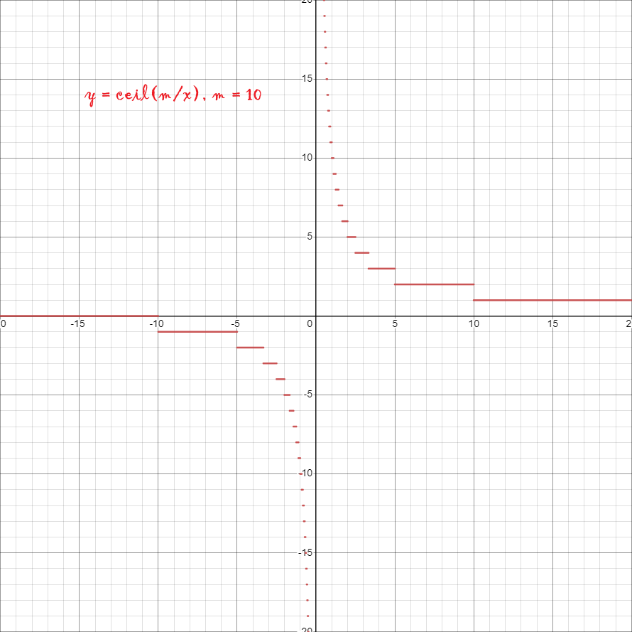

#### 数学

首先，需要明确以下几点：

- **结论1**
如果目标大于$0$，但是桶为$0$，那么必须先升级一次桶；
- **结论2**
升级桶的动作在打水之前即可；
假设如果有一次打水在升级桶之前，那么把这两次操作反过来，会发现操作次数没变，但是多大了一个单位的水；
- **结论3**
假设$bucket = [b_1,~b_2,~\dots~b_n]$，$vat = [v_1,~v_2,~\dots~v_n]$，令$cnt = [\lceil \dfrac{v_1}{b_1} \rceil,~\lceil \dfrac{v_2}{b_2} \rceil,~\dots~\lceil \dfrac{v_n}{b_n} \rceil] = [c_1,~c_2,~\dots~c_n]$
  - 如果$cnt$中的值不相等（下称**非均衡**），如果选择升级，那么一定先升级$cnt$中值最大的那个位置的桶，否则这个位置的打水次数不减少，减少其它位置的打水次数是没有任何意义的；
  - 如果$cnt$中全部的值都相等（下称**均衡**），如果选择升级，那么一定要升级到所有的桶打水次数都至少减少一次才可以，否则只要有任何一个位置的打水次数没有减少，那么其它位置的打水次数减少多少都没有意义；
- **结论4**
假设一个水缸需要打$n$个单位的水，而水桶每次可以打$x$个单位的水，那么打水的次数$y$是$y = \lceil \dfrac{n}{x} \rceil$，从下图可以看出随着$x$的变大，每次使$y$减少$1$的成本也越来越大，只有在$y$的变化量大于$x$的变化量时，增加$x$才是有意义的；

#### 策略

- 遍历所有水缸，如果水缸需要的水量大于$0$，而水桶的打水量为$0$，那么升级一次水桶
- 如果**非均衡**，升级次数最高的桶（有可能是并列多个），每次升级下面二者至少保证其一，每次升级都记录操作次数，直到达到**均衡**的状态
  - $y$减少$1$
  - $x$增加$1$，$x$可能增加$0.1$，$y$就会减少$1$
- 如果**均衡**，升级所有桶，使其每个桶的升级都下面二者至少保证其一，记录此次升级的操作次数
  - $y$减少$1$
  - $x$增加$1$，$x$可能增加$0.1$，$y$就会减少$1$
- 直到**均衡**，且一次打水就达标
- **注意剪枝**，如果一次调整，升级水桶的次数已经大于了已知的最小操作数，就补需要继续调整了

#### 代码

1. 声明`result = 0`
2. 遍历所有水缸，如果水缸需要的水量大于$0$，而水桶的打水量为$0$，那么升级一次水桶，`result++`
3. 遍历所有水缸，记录所有水缸中需要的最大次数$maxcnt$，`result += maxcnt`
4. 使用优先级队列记录所有位置的水缸，水桶数据，优先级是此位置需要打水的次数（降序）
5. 队列顶出队列
    - 如果次数为$1$，则不需要继续调整了
    - 如果次数大于$1$，记录下次数$cnt$，调整使次数减少$y'$（$y'$最少是$1$，可能减少的更多，例如$y=100/x$，$x$由$1$变为$2$，$y$会一下减少$50$），记录升级桶$x'$次，将调整后的信息入队列
    - 再次将队列顶出队列，次数是$cnt'$
        - 如果$cnt' = cnt$，则继续，回到5.1；
        - 如果$cnt' \lt cnt$，结束此轮调整
            - 如果$cnt - cnt' - x' \gt 0$，更新`result -= (cnt - cnt' - x')`
6. 如果一次调整的操作数超过了当前结果，结束调整（没有找到更合适结束标志）
