### [删除链表的倒数第 n 个结点](https://leetcode.cn/problems/SLwz0R/solutions/1417848/shan-chu-lian-biao-de-dao-shu-di-n-ge-ji-ydte/?envType=problem-list-v2&envId=ySsxoJfz)

#### 前言

在对链表进行操作时，一种常用的技巧是添加一个哑节点（$dummy node$），它的 $next$ 指针指向链表的头节点。这样一来，我们就不需要对头节点进行特殊的判断了。

例如，在本题中，如果我们要删除节点 $y$，我们需要知道节点 $y$ 的前驱节点 $x$，并将 $x$ 的指针指向 $y$ 的后继节点。但由于头节点不存在前驱节点，因此我们需要在删除头节点时进行特殊判断。但如果我们添加了哑节点，那么头节点的前驱节点就是哑节点本身，此时我们就只需要考虑通用的情况即可。

特别地，在某些语言中，由于需要自行对内存进行管理。因此在实际的面试中，对于「是否需要释放被删除节点对应的空间」这一问题，我们需要和面试官进行积极的沟通以达成一致。下面的代码中默认不释放空间。

#### 方法一：计算链表长度

**思路与算法**

一种容易想到的方法是，我们首先从头节点开始对链表进行一次遍历，得到链表的长度 $L$。随后我们再从头节点开始对链表进行一次遍历，当遍历到第 $L-n+1$ 个节点时，它就是我们需要删除的节点。

> 为了与题目中的 $n$ 保持一致，节点的编号从 $1$ 开始，头节点为编号 $1$ 的节点。

为了方便删除操作，我们可以从哑节点开始遍历 $L-n+1$ 个节点。当遍历到第 $L-n+1$ 个节点时，**它的下一个节点**就是我们需要删除的节点，这样我们只需要修改一次指针，就能完成删除操作。

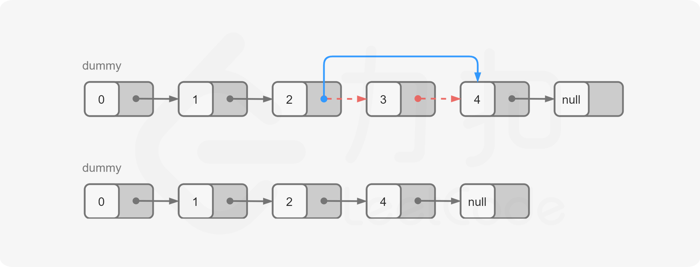

**代码**

```C++
class Solution {
public:
    int getLength(ListNode* head) {
        int length = 0;
        while (head) {
            ++length;
            head = head->next;
        }
        return length;
    }

    ListNode* removeNthFromEnd(ListNode* head, int n) {
        ListNode* dummy = new ListNode(0, head);
        int length = getLength(head);
        ListNode* cur = dummy;
        for (int i = 1; i < length - n + 1; ++i) {
            cur = cur->next;
        }
        cur->next = cur->next->next;
        ListNode* ans = dummy->next;
        delete dummy;
        return ans;
    }
};
```

```Java
class Solution {
    public ListNode removeNthFromEnd(ListNode head, int n) {
        ListNode dummy = new ListNode(0, head);
        int length = getLength(head);
        ListNode cur = dummy;
        for (int i = 1; i < length - n + 1; ++i) {
            cur = cur.next;
        }
        cur.next = cur.next.next;
        ListNode ans = dummy.next;
        return ans;
    }

    public int getLength(ListNode head) {
        int length = 0;
        while (head != null) {
            ++length;
            head = head.next;
        }
        return length;
    }
}
```

```Python
class Solution:
    def removeNthFromEnd(self, head: ListNode, n: int) -> ListNode:
        def getLength(head: ListNode) -> int:
            length = 0
            while head:
                length += 1
                head = head.next
            return length

        dummy = ListNode(0, head)
        length = getLength(head)
        cur = dummy
        for i in range(1, length - n + 1):
            cur = cur.next
        cur.next = cur.next.next
        return dummy.next
```

```Go
func getLength(head *ListNode) (length int) {
    for ; head != nil; head = head.Next {
        length++
    }
    return
}

func removeNthFromEnd(head *ListNode, n int) *ListNode {
    length := getLength(head)
    dummy := &ListNode{0, head}
    cur := dummy
    for i := 0; i < length-n; i++ {
        cur = cur.Next
    }
    cur.Next = cur.Next.Next
    return dummy.Next
}
```

```C
int getLength(struct ListNode* head) {
    int length = 0;
    while (head) {
        ++length;
        head = head->next;
    }
    return length;
}

struct ListNode* removeNthFromEnd(struct ListNode* head, int n) {
    struct ListNode* dummy = malloc(sizeof(struct ListNode));
    dummy->val = 0, dummy->next = head;
    int length = getLength(head);
    struct ListNode* cur = dummy;
    for (int i = 1; i < length - n + 1; ++i) {
        cur = cur->next;
    }
    cur->next = cur->next->next;
    struct ListNode* ans = dummy->next;
    free(dummy);
    return ans;
}
```

**复杂度分析**

- 时间复杂度：$O(L)$，其中 $L$ 是链表的长度。
- 空间复杂度：$O(1)$。

#### 方法二：栈

**思路与算法**

我们也可以在遍历链表的同时将所有节点依次入栈。根据栈「先进后出」的原则，我们弹出栈的第 $n$ 个节点就是需要删除的节点，并且目前栈顶的节点就是待删除节点的前驱节点。这样一来，删除操作就变得十分方便了。

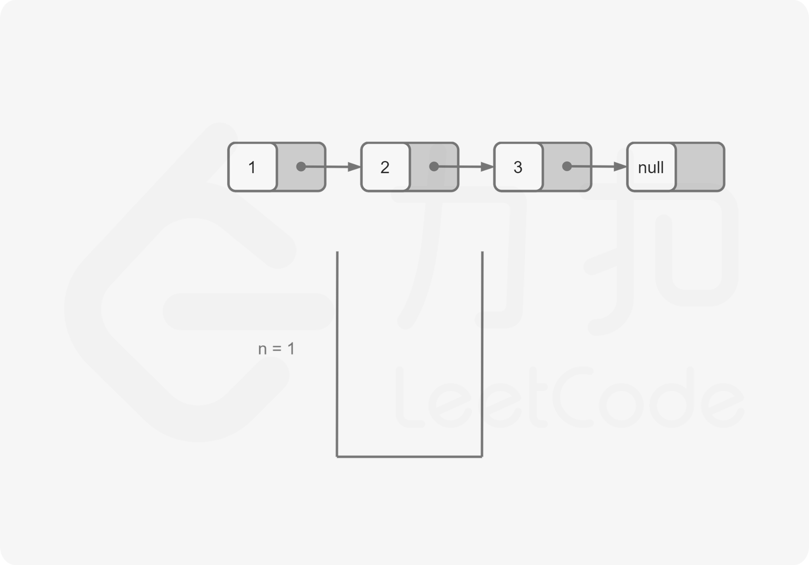
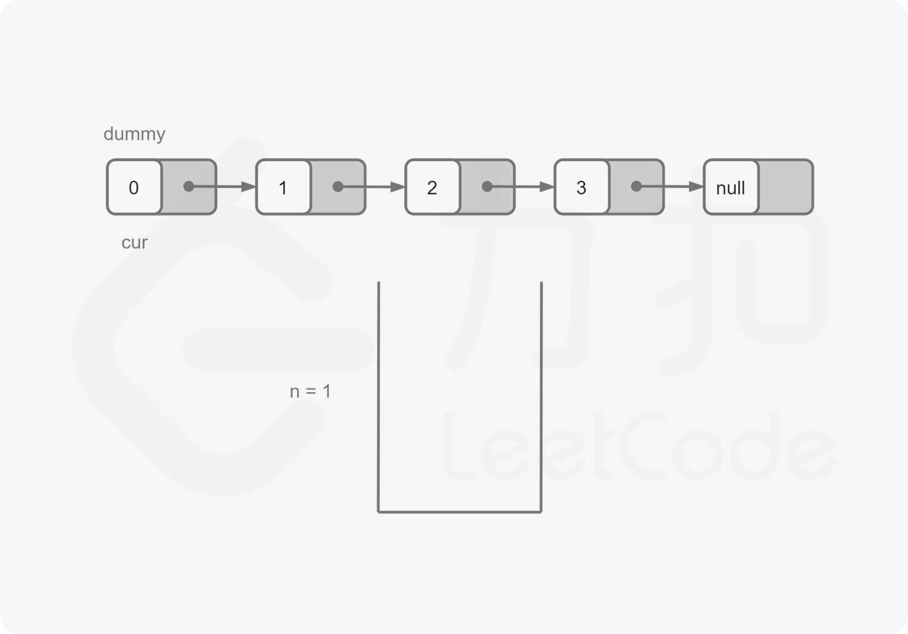
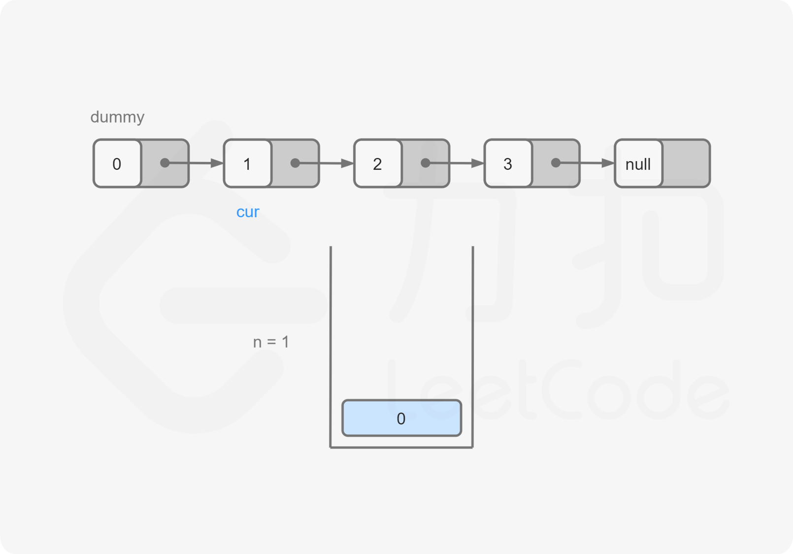
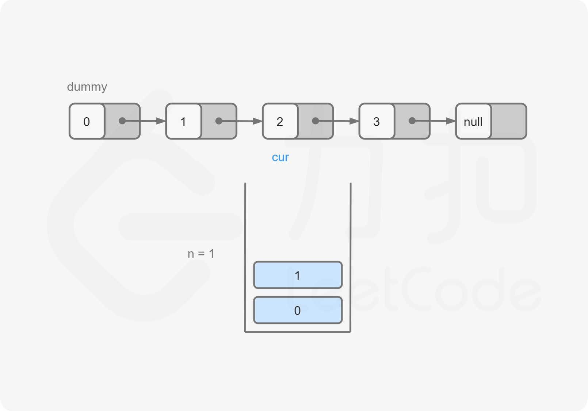
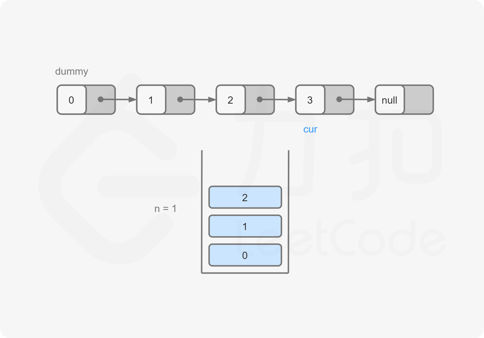
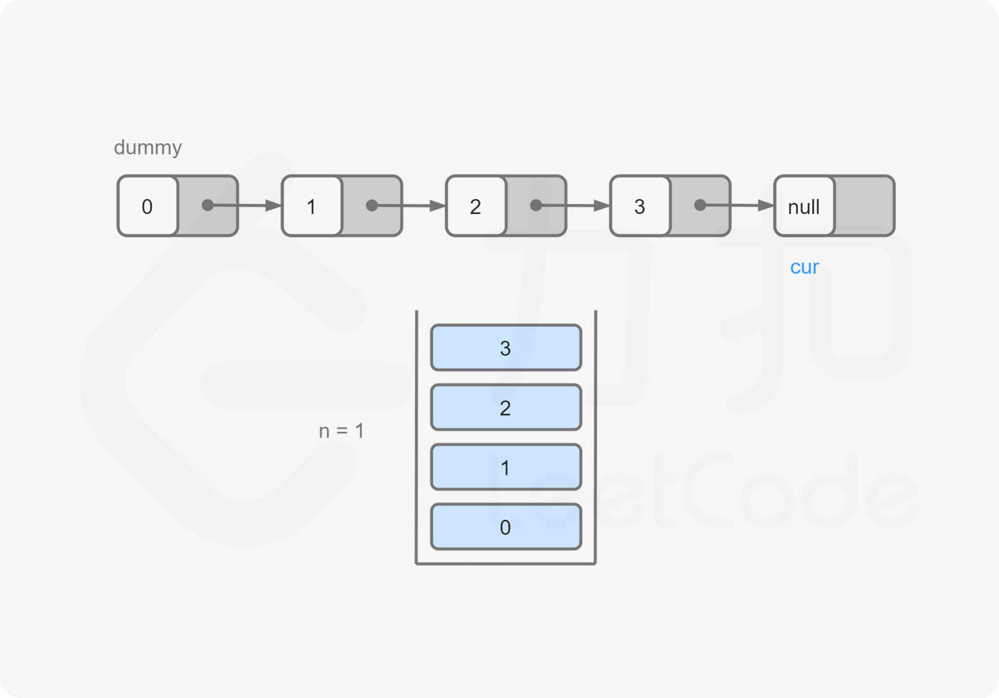
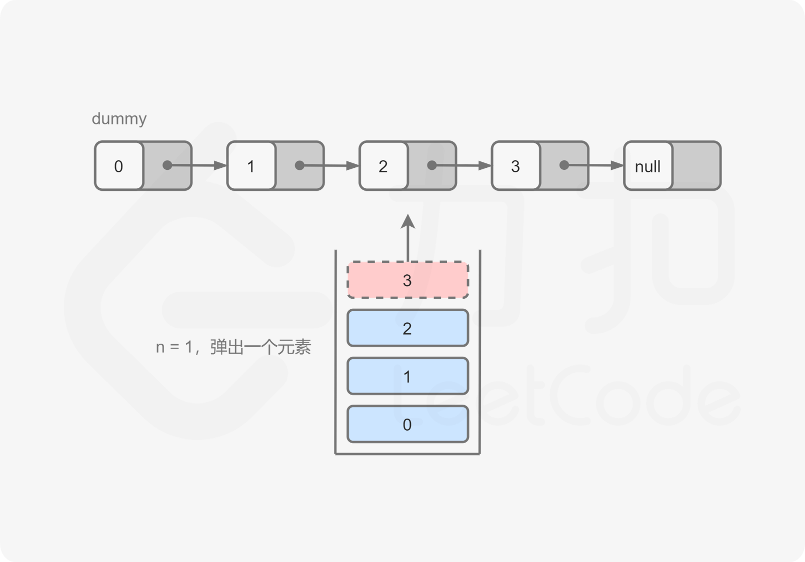
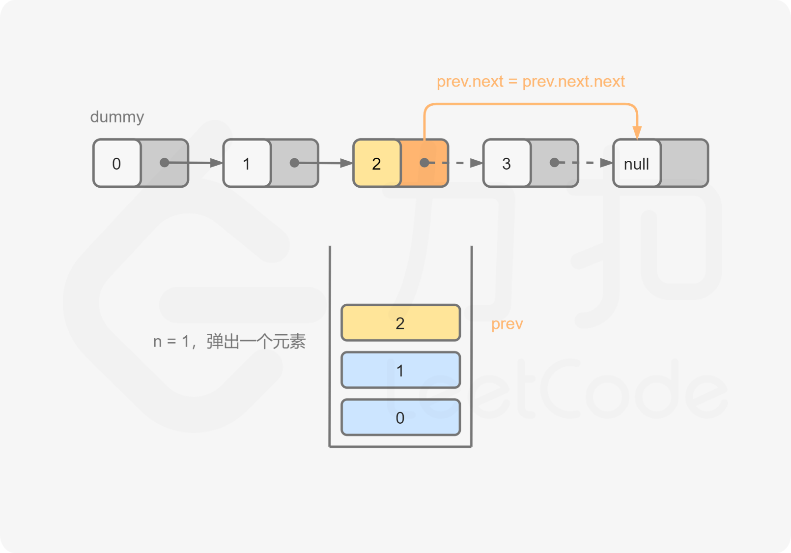
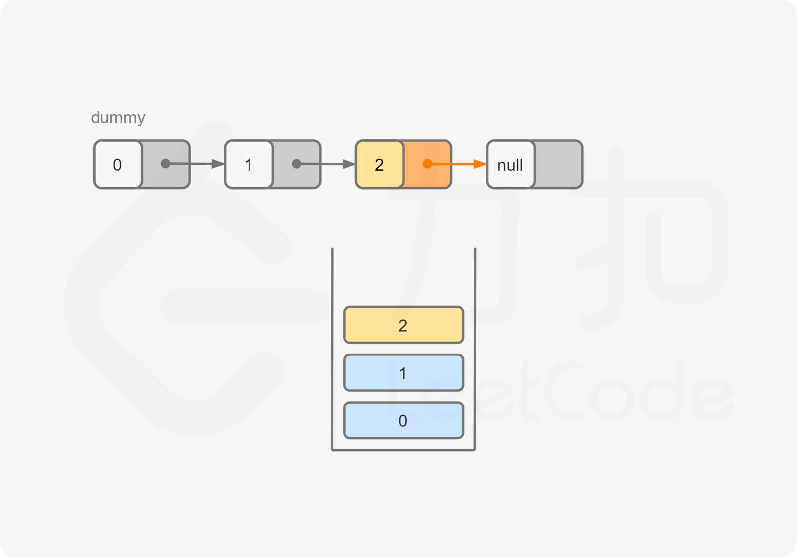
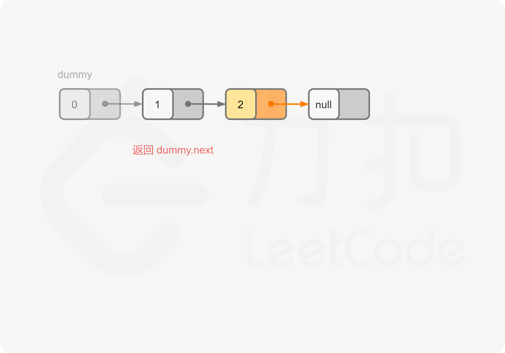

**代码**

```C++
class Solution {
public:
    ListNode* removeNthFromEnd(ListNode* head, int n) {
        ListNode* dummy = new ListNode(0, head);
        stack<ListNode*> stk;
        ListNode* cur = dummy;
        while (cur) {
            stk.push(cur);
            cur = cur->next;
        }
        for (int i = 0; i < n; ++i) {
            stk.pop();
        }
        ListNode* prev = stk.top();
        prev->next = prev->next->next;
        ListNode* ans = dummy->next;
        delete dummy;
        return ans;
    }
};
```

```Java
class Solution {
    public ListNode removeNthFromEnd(ListNode head, int n) {
        ListNode dummy = new ListNode(0, head);
        Deque<ListNode> stack = new LinkedList<ListNode>();
        ListNode cur = dummy;
        while (cur != null) {
            stack.push(cur);
            cur = cur.next;
        }
        for (int i = 0; i < n; ++i) {
            stack.pop();
        }
        ListNode prev = stack.peek();
        prev.next = prev.next.next;
        ListNode ans = dummy.next;
        return ans;
    }
}
```

```Python
class Solution:
    def removeNthFromEnd(self, head: ListNode, n: int) -> ListNode:
        dummy = ListNode(0, head)
        stack = list()
        cur = dummy
        while cur:
            stack.append(cur)
            cur = cur.next

        for i in range(n):
            stack.pop()

        prev = stack[-1]
        prev.next = prev.next.next
        return dummy.next
```

```Go
func removeNthFromEnd(head *ListNode, n int) *ListNode {
    nodes := []*ListNode{}
    dummy := &ListNode{0, head}
    for node := dummy; node != nil; node = node.Next {
        nodes = append(nodes, node)
    }
    prev := nodes[len(nodes)-1-n]
    prev.Next = prev.Next.Next
    return dummy.Next
}
```

```C
struct Stack {
    struct ListNode* val;
    struct Stack* next;
};

struct ListNode* removeNthFromEnd(struct ListNode* head, int n) {
    struct ListNode* dummy = malloc(sizeof(struct ListNode));
    dummy->val = 0, dummy->next = head;
    struct Stack* stk = NULL;
    struct ListNode* cur = dummy;
    while (cur) {
        struct Stack* tmp = malloc(sizeof(struct Stack));
        tmp->val = cur, tmp->next = stk;
        stk = tmp;
        cur = cur->next;
    }
    for (int i = 0; i < n; ++i) {
        struct Stack* tmp = stk->next;
        free(stk);
        stk = tmp;
    }
    struct ListNode* prev = stk->val;
    prev->next = prev->next->next;
    struct ListNode* ans = dummy->next;
    free(dummy);
    return ans;
}
```

**复杂度分析**

- 时间复杂度：$O(L)$，其中 $L$ 是链表的长度。
- 空间复杂度：$O(L)$，其中 $L$ 是链表的长度。主要为栈的开销。

#### 方法三：双指针

**思路与算法**

我们也可以在不预处理出链表的长度，以及使用常数空间的前提下解决本题。

由于我们需要找到倒数第 $n$ 个节点，因此我们可以使用两个指针 $first$ 和 $second$ 同时对链表进行遍历，并且 $first$ 比 $second$ 超前 $n$ 个节点。当 $first$ 遍历到链表的末尾时，$second$ 就恰好处于倒数第 $n$ 个节点。

具体地，初始时 $first$ 和 $second$ 均指向头节点。我们首先使用 $first$ 对链表进行遍历，遍历的次数为 $n$。此时，$first$ 和 $second$ 之间间隔了 $n-1$ 个节点，即 $first$ 比 $second$ 超前了 $n$ 个节点。

在这之后，我们同时使用 $first$ 和 $second$ 对链表进行遍历。当 $first$ 遍历到链表的末尾（即 $first$ 为空指针）时，$second$ 恰好指向倒数第 $n$ 个节点。

根据方法一和方法二，如果我们能够得到的是倒数第 $n$ 个节点的前驱节点而不是倒数第 $n$ 个节点的话，删除操作会更加方便。因此我们可以考虑在初始时将 $second$ 指向哑节点，其余的操作步骤不变。这样一来，当 $first$ 遍历到链表的末尾时，$second$ 的**下一个节点**就是我们需要删除的节点。

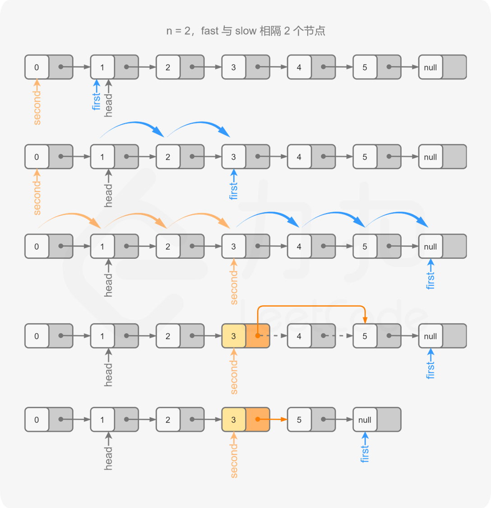

**代码**

```C++
class Solution {
public:
    ListNode* removeNthFromEnd(ListNode* head, int n) {
        ListNode* dummy = new ListNode(0, head);
        ListNode* first = head;
        ListNode* second = dummy;
        for (int i = 0; i < n; ++i) {
            first = first->next;
        }
        while (first) {
            first = first->next;
            second = second->next;
        }
        second->next = second->next->next;
        ListNode* ans = dummy->next;
        delete dummy;
        return ans;
    }
};
```

```Java
class Solution {
    public ListNode removeNthFromEnd(ListNode head, int n) {
        ListNode dummy = new ListNode(0, head);
        ListNode first = head;
        ListNode second = dummy;
        for (int i = 0; i < n; ++i) {
            first = first.next;
        }
        while (first != null) {
            first = first.next;
            second = second.next;
        }
        second.next = second.next.next;
        ListNode ans = dummy.next;
        return ans;
    }
}
```

```Python
class Solution:
    def removeNthFromEnd(self, head: ListNode, n: int) -> ListNode:
        dummy = ListNode(0, head)
        first = head
        second = dummy
        for i in range(n):
            first = first.next

        while first:
            first = first.next
            second = second.next

        second.next = second.next.next
        return dummy.next
```

```Go
func removeNthFromEnd(head *ListNode, n int) *ListNode {
    dummy := &ListNode{0, head}
    first, second := head, dummy
    for i := 0; i < n; i++ {
        first = first.Next
    }
    for ; first != nil; first = first.Next {
        second = second.Next
    }
    second.Next = second.Next.Next
    return dummy.Next
}
```

```C
struct ListNode* removeNthFromEnd(struct ListNode* head, int n) {
    struct ListNode* dummy = malloc(sizeof(struct ListNode));
    dummy->val = 0, dummy->next = head;
    struct ListNode* first = head;
    struct ListNode* second = dummy;
    for (int i = 0; i < n; ++i) {
        first = first->next;
    }
    while (first) {
        first = first->next;
        second = second->next;
    }
    second->next = second->next->next;
    struct ListNode* ans = dummy->next;
    free(dummy);
    return ans;
}
```

**复杂度分析**

- 时间复杂度：$O(L)$，其中 $L$ 是链表的长度。
- 空间复杂度：$O(1)$。
