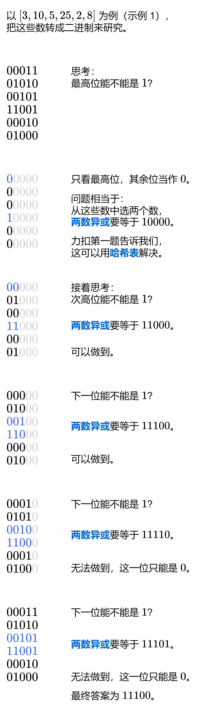

### [【图解】简洁高效，一图秒懂！（Python/Java/C++/Go/JS/Rust）](https://leetcode.cn/problems/ms70jA/solutions/2689742/tu-jie-jian-ji-gao-xiao-yi-tu-miao-dong-q6y1a/)



#### 算法

1. 初始化答案 $ans=0$。
2. 从最高位开始枚举 $i$，也就是 $max(nums)$ 的二进制长度减一。
3. 设 $newAns=ans+2^i$，看能否从 $nums$ 中选两个数（低于 $i$ 的比特位当作 $0$），满足这两个数的异或和等于 $newAns$。如果可以，则更新 $ans$ 为 $newAns$，否则 $ans$ 保持不变。
4. 判断【两数异或】的做法和力扣第一题【两数之和】是一样的，请看 [我的题解](https://leetcode.cn/problems/two-sum/solution/dong-hua-cong-liang-shu-zhi-he-zhong-wo-0yvmj/)。用 $\oplus $ 表示异或，如果 $a\oplus b=newAns$，那么两边同时异或 $b$，由于 $b\oplus b=0$，所以得到 $a=newAns\oplus b$（相当于把两数之和代码中的减法改成异或）。这样就可以一边枚举 $b$，一边在哈希表中查找 $newAns\oplus b$ 了。

请注意，$ans$ **继承**了上一位算出的内容，后面比特位的计算不是只看当前位，之前算过的高位也得满足。

#### 答疑

**问**：如何理解代码中这些位运算的含义？
**答**：关于位运算的技巧整理，请看 [从集合论到位运算，常见位运算技巧分类总结！](https://leetcode.cn/circle/discuss/CaOJ45/)

**问**：为什么不能从二进制的最低位开始思考？
**答**：如果从最低位开始枚举，可能高位的异或就只能是 $0$ 了，无法满足题目「最大」的要求。

```Python
class Solution:
    def findMaximumXOR(self, nums: List[int]) -> int:
        ans = mask = 0
        high_bit = max(nums).bit_length() - 1
        for i in range(high_bit, -1, -1):  # 从最高位开始枚举
            mask |= 1 << i
            new_ans = ans | (1 << i)  # 这个比特位可以是 1 吗？
            seen = set()
            for x in nums:
                x &= mask  # 低于 i 的比特位置为 0
                if new_ans ^ x in seen:
                    ans = new_ans  # 这个比特位可以是 1
                    break
                seen.add(x)
        return ans
```

```Java
class Solution {
    public int findMaximumXOR(int[] nums) {
        int max = 0;
        for (int x : nums) {
            max = Math.max(max, x);
        }
        int highBit = 31 - Integer.numberOfLeadingZeros(max);

        int ans = 0, mask = 0;
        Set<Integer> seen = new HashSet<>();
        for (int i = highBit; i >= 0; i--) { // 从最高位开始枚举
            seen.clear();
            mask |= 1 << i;
            int newAns = ans | (1 << i); // 这个比特位可以是 1 吗？
            for (int x : nums) {
                x &= mask; // 低于 i 的比特位置为 0
                if (seen.contains(newAns ^ x)) {
                    ans = newAns; // 这个比特位可以是 1
                    break;
                }
                seen.add(x);
            }
        }
        return ans;
    }
}
```

```C++
class Solution {
public:
    int findMaximumXOR(vector<int>& nums) {
        int high_bit = __lg(ranges::max(nums));
        int ans = 0, mask = 0;
        unordered_set<int> seen;
        for (int i = high_bit; i >= 0; i--) { // 从最高位开始枚举
            seen.clear();
            mask |= 1 << i;
            int new_ans = ans | (1 << i); // 这个比特位可以是 1 吗？
            for (int x : nums) {
                x &= mask; // 低于 i 的比特位置为 0
                if (seen.contains(new_ans ^ x)) {
                    ans = new_ans; // 这个比特位可以是 1
                    break;
                }
                seen.insert(x);
            }
        }
        return ans;
    }
};
```

```Go
func findMaximumXOR(nums []int) (ans int) {
    highBit := bits.Len(uint(slices.Max(nums))) - 1
    seen := map[int]bool{}
    mask := 0
    for i := highBit; i >= 0; i-- { // 从最高位开始枚举
        clear(seen)
        mask |= 1 << i
        newAns := ans | 1<<i // 这个比特位可以是 1 吗？
        for _, x := range nums {
            x &= mask // 低于 i 的比特位置为 0
            if seen[newAns^x] {
                ans = newAns // 这个比特位可以是 1
                break
            }
            seen[x] = true
        }
    }
    return
}
```

```JavaScript
var findMaximumXOR = function (nums) {
    const highBit = 31 - Math.clz32(Math.max(...nums));
    const seen = new Set();
    let ans = 0, mask = 0;
    for (let i = highBit; i >= 0; i--) { // 从最高位开始枚举
        seen.clear();
        mask |= 1 << i;
        const newAns = ans | (1 << i); // 这个比特位可以是 1 吗？
        for (let x of nums) {
            x &= mask; // 低于 i 的比特位置为 0
            if (seen.has(newAns ^ x)) {
                ans = newAns; // 这个比特位可以是 1
                break;
            }
            seen.add(x);
        }
    }
    return ans;
};
```

```Rust
use std::collections::HashSet;

impl Solution {
    pub fn find_maximum_xor(nums: Vec<i32>) -> i32 {
        let mx = nums.iter().max().unwrap();
        let high_bit = 31 - mx.leading_zeros() as i32;

        let mut ans = 0;
        let mut mask = 0;
        let mut seen = HashSet::new();
        for i in (0..=high_bit).rev() { // 从最高位开始枚举
            seen.clear();
            mask |= 1 << i;
            let new_ans = ans | (1 << i); // 这个比特位可以是 1 吗？
            for &x in &nums {
                let x = x & mask; // 低于 i 的比特位置为 0
                if seen.contains(&(new_ans ^ x)) {
                    ans = new_ans; // 这个比特位可以是 1
                    break;
                }
                seen.insert(x);
            }
        }
        ans
    }
}
```

#### 复杂度分析

- 时间复杂度：$O(n\log U)$，其中 $n$ 为 $nums$ 的长度，$U=max(nums)$。外层循环需要循环 $O(\log U)$ 次。
- 空间复杂度：$O(n)$。哈希表中至多有 $n$ 个数。

#### 分类题单

[如何科学刷题？](https://leetcode.cn/circle/discuss/RvFUtj/)

1. [滑动窗口（定长/不定长/多指针）](https://leetcode.cn/circle/discuss/0viNMK/)
2. [二分算法（二分答案/最小化最大值/最大化最小值/第K小）](https://leetcode.cn/circle/discuss/SqopEo/)
3. [单调栈（基础/矩形面积/贡献法/最小字典序）](https://leetcode.cn/circle/discuss/9oZFK9/)
4. [网格图（DFS/BFS/综合应用）](https://leetcode.cn/circle/discuss/YiXPXW/)
5. [位运算（基础/性质/拆位/试填/恒等式/思维）](https://leetcode.cn/circle/discuss/dHn9Vk/)
6. [图论算法（DFS/BFS/拓扑排序/最短路/最小生成树/二分图/基环树/欧拉路径）](https://leetcode.cn/circle/discuss/01LUak/)
7. [动态规划（入门/背包/状态机/划分/区间/状压/数位/数据结构优化/树形/博弈/概率期望）](https://leetcode.cn/circle/discuss/tXLS3i/)
8. [常用数据结构（前缀和/差分/栈/队列/堆/字典树/并查集/树状数组/线段树）](https://leetcode.cn/circle/discuss/mOr1u6/)
9. [数学算法（数论/组合/概率期望/博弈/计算几何/随机算法）](https://leetcode.cn/circle/discuss/IYT3ss/)
10. [贪心算法（基本贪心策略/反悔/区间/字典序/数学/思维/脑筋急转弯/构造）](https://leetcode.cn/circle/discuss/g6KTKL/)
11. [链表、二叉树与一般树（前后指针/快慢指针/DFS/BFS/直径/LCA）](https://leetcode.cn/circle/discuss/K0n2gO/)
