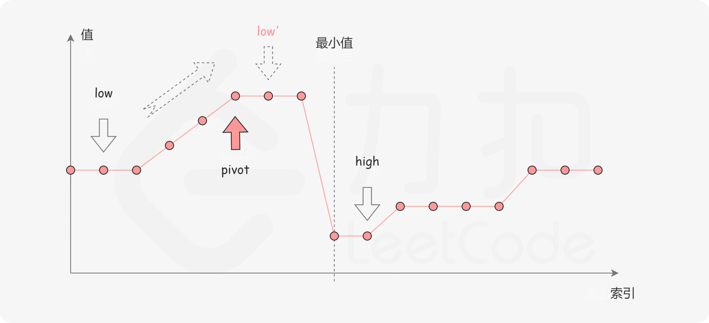

### [库存管理 I](https://leetcode.cn/problems/xuan-zhuan-shu-zu-de-zui-xiao-shu-zi-lcof/solutions/340801/xuan-zhuan-shu-zu-de-zui-xiao-shu-zi-by-leetcode-s/)

#### 前言

本题和「[154. 寻找旋转排序数组中的最小值 II](https://leetcode-cn.com/problems/find-minimum-in-rotated-sorted-array-ii/)」完全相同，是「[153. 寻找旋转排序数组中的最小值](https://leetcode-cn.com/problems/find-minimum-in-rotated-sorted-array/)」的延伸。读者可以先尝试第 153 题，体会在旋转数组中进行二分查找的思路，再来尝试解决本题。

#### 方法一：二分查找

##### 思路与算法

一个包含重复元素的升序数组在经过旋转之后，可以得到下面可视化的折线图：


其中横轴表示数组元素的下标，纵轴表示数组元素的值。图中标出了最小值的位置，是我们需要查找的目标。

我们考虑**数组中的最后一个元素 $x$：** 在最小值右侧的元素，它们的值一定都小于等于 $x$；而在最小值左侧的元素，它们的值一定都大于等于 $x$。因此，我们可以根据这一条性质，通过二分查找的方法找出最小值。

在二分查找的每一步中，左边界为 $\it low$，右边界为 $\it high$，区间的中点为 $\it pivot$，最小值就在该区间内。我们将中轴元素 $\textit{stock}[\textit{pivot}]$ 与右边界元素 $\textit{stock}[\textit{high}]$ 进行比较，可能会有以下的三种情况：

第一种情况是 $\textit{stock}[\textit{pivot}] < \textit{stock}[\textit{high}]$。如下图所示，这说明 $\textit{stock}[\textit{pivot}]$ 是最小值右侧的元素，因此我们可以忽略二分查找区间的右半部分。


第二种情况是 $\textit{stock}[\textit{pivot}] > \textit{stock}[\textit{high}]$。如下图所示，这说明 $\textit{stock}[\textit{pivot}]$ 是最小值左侧的元素，因此我们可以忽略二分查找区间的左半部分。



第三种情况是 $\textit{stock}[\textit{pivot}] == \textit{stock}[\textit{high}]$。如下图所示，由于重复元素的存在，我们并不能确定 $\textit{stock}[\textit{pivot}]$ 究竟在最小值的左侧还是右侧，因此我们不能莽撞地忽略某一部分的元素。我们唯一可以知道的是，由于它们的值相同，所以无论 $\textit{stock}[\textit{high}]$ 是不是最小值，都有一个它的「替代品」$\textit{stock}[\textit{pivot}]$，因此我们可以忽略二分查找区间的右端点。


当二分查找结束时，我们就得到了最小值所在的位置。

##### 代码

```c++
class Solution {
public:
    int minArray(vector<int>& stock) {
        int low = 0;
        int high = stock.size() - 1;
        while (low < high) {
            int pivot = low + (high - low) / 2;
            if (stock[pivot] < stock[high]) {
                high = pivot;
            }
            else if (stock[pivot] > stock[high]) {
                low = pivot + 1;
            }
            else {
                high -= 1;
            }
        }
        return stock[low];
    }
};
```

```java
class Solution {
    public int minArray(int[] stock) {
        int low = 0;
        int high = stock.length - 1;
        while (low < high) {
            int pivot = low + (high - low) / 2;
            if (stock[pivot] < stock[high]) {
                high = pivot;
            } else if (stock[pivot] > stock[high]) {
                low = pivot + 1;
            } else {
                high -= 1;
            }
        }
        return stock[low];
    }
}
```

```python
class Solution:
    def minArray(self, stock: List[int]) -> int:
        low, high = 0, len(stock) - 1
        while low < high:
            pivot = low + (high - low) // 2
            if stock[pivot] < stock[high]:
                high = pivot 
            elif stock[pivot] > stock[high]:
                low = pivot + 1
            else:
                high -= 1
        return stock[low]
```

```c
int minArray(int* stock, int stockSize) {
    int low = 0;
    int high = stockSize - 1;
    while (low < high) {
        int pivot = low + (high - low) / 2;
        if (stock[pivot] < stock[high]) {
            high = pivot;
        } else if (stock[pivot] > stock[high]) {
            low = pivot + 1;
        } else {
            high -= 1;
        }
    }
    return stock[low];
}
```

```go
func minArray(stock []int) int {
    low := 0
    high := len(stock) - 1
    for low < high {
        pivot := low + (high - low) / 2
        if stock[pivot] < stock[high] {
            high = pivot
        } else if stock[pivot] > stock[high] {
            low = pivot + 1
        } else {
            high--
        }
    }
    return stock[low]
}
```

```javascript
var minArray = function(stock) {
    let low = 0;
    let high = stock.length - 1;
    while (low < high) {
        const pivot = low + Math.floor((high - low) / 2);
        if (stock[pivot] < stock[high]) {
            high = pivot;
        } else if (stock[pivot] > stock[high]) {
            low = pivot + 1;
        } else {
            high -= 1;
        }
    }
    return stock[low];
};
```

##### 复杂度分析

- 时间复杂度：平均时间复杂度为 $O(\log n)$，其中 $n$ 是数组 $\it stock$ 的长度。如果数组是随机生成的，那么数组中包含相同元素的概率很低，在二分查找的过程中，大部分情况都会忽略一半的区间。而在最坏情况下，如果数组中的元素完全相同，那么 $\texttt{while}$ 循环就需要执行 $n$ 次，每次忽略区间的右端点，时间复杂度为 $O(n)$。
- 空间复杂度：$O(1)$。
