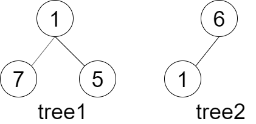
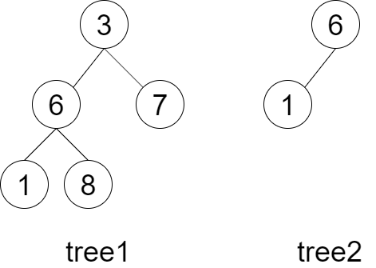

### [LCR 143. 子结构判断](https://leetcode.cn/problems/shu-de-zi-jie-gou-lcof/)

难度：中等

给定两棵二叉树 `tree1` 和 `tree2`，判断 `tree2` 是否以 `tree1` 的某个节点为根的子树具有 **相同的结构和节点值**。
注意，**空树** 不会是以 `tree1` 的某个节点为根的子树具有 **相同的结构和节点值**。

**示例 1：**

> 
> **输入：** tree1 = [1,7,5], tree2 = [6,1]
> **输出：** false
> **解释：** tree2 与 tree1 的一个子树没有相同的结构和节点值。

**示例 2：**

> 
> **输入：** tree1 = [3,6,7,1,8], tree2 = [6,1]
> **输出：** true
> **解释：** tree2 与 tree1 的一个子树拥有相同的结构和节点值。即 6 - > 1。

**提示：**

`0 <= 节点个数 <= 10000`
