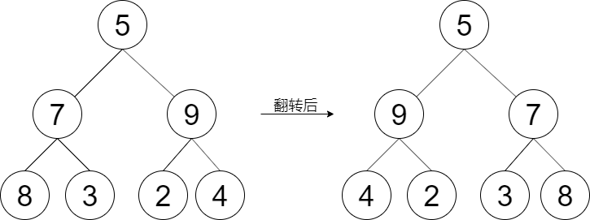

### [LCR 144. 翻转二叉树](https://leetcode.cn/problems/er-cha-shu-de-jing-xiang-lcof/)

难度：简单

给定一棵二叉树的根节点 `root`，请左右翻转这棵二叉树，并返回其根节点。

**示例 1：**

> **输入：** root = [5,7,9,8,3,2,4]
> **输出：** [5,9,7,4,2,3,8]

**提示：**

- 树中节点数目范围在 `[0, 100]` 内
- `-100 <= Node.val <= 100`

注意：本题与主站 226 题相同：[https://leetcode-cn.com/problems/invert-binary-tree/](https://leetcode-cn.com/problems/invert-binary-tree/)
