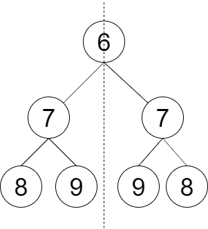
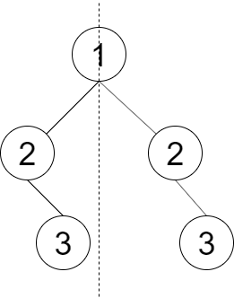

### [LCR 145. 判断对称二叉树](https://leetcode.cn/problems/dui-cheng-de-er-cha-shu-lcof/)

难度：简单

请设计一个函数判断一棵二叉树是否 **轴对称** 。

**示例 1：**

> **输入：** root = [6,7,7,8,9,9,8]
> **输出：** true
> **解释：** 从图中可看出树是轴对称的。

**示例 2：**

> **输入：** root = [1,2,2,null,3,null,3]
> **输出：** false
> **解释：** 从图中可看出最后一层的节点不对称。

**提示：**

`0 <= 节点个数 <= 1000`

注意：本题与主站 101 题相同：[https://leetcode-cn.com/problems/symmetric-tree/](https://leetcode-cn.com/problems/symmetric-tree/)
