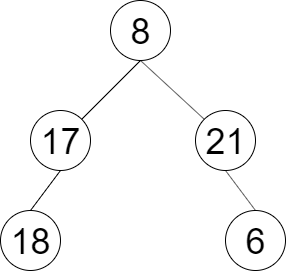

### [LCR 150. 彩灯装饰记录 II](https://leetcode.cn/problems/cong-shang-dao-xia-da-yin-er-cha-shu-ii-lcof/)

难度：简单

一棵圣诞树记作根节点为 `root` 的二叉树，节点值为该位置装饰彩灯的颜色编号。请按照从左到右的顺序返回每一层彩灯编号，每一层的结果记录于一行。

**示例 1：**

> **输入：** root = [8,17,21,18,null,null,6]
> **输出：** \[[8],[17,21],[18,6]]

**提示：**

1. `节点总数 <= 1000`

注意：本题与主站 102 题相同：[https://leetcode-cn.com/problems/binary-tree-level-order-traversal/](https://leetcode-cn.com/problems/binary-tree-level-order-traversal/)
