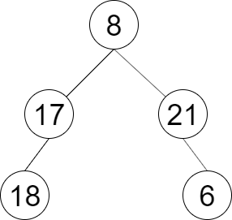

### [LCR 151. 彩灯装饰记录 III](https://leetcode.cn/problems/cong-shang-dao-xia-da-yin-er-cha-shu-iii-lcof/)

难度：中等

一棵圣诞树记作根节点为 `root` 的二叉树，节点值为该位置装饰彩灯的颜色编号。请按照如下规则记录彩灯装饰结果：

- 第一层按照从左到右的顺序记录
- 除第一层外每一层的记录顺序均与上一层相反。即第一层为从左到右，第二层为从右到左。

**示例 1：**

> **输入：** root = [8,17,21,18,null,null,6]
> **输出：** \[[8],[21,17],[18,6]]

**提示：**

- `节点总数 <= 1000`
