### [LCR 160. 数据流中的中位数（堆、优先队列，清晰图解）](https://leetcode.cn/problems/shu-ju-liu-zhong-de-zhong-wei-shu-lcof/solutions/227309/mian-shi-ti-41-shu-ju-liu-zhong-de-zhong-wei-shu-y/?envType=problem-list-v2&envId=ySsxoJfz)

#### 解题思路：

> 给定一长度为 $N$ 的无序数组，其中位数的计算方法：首先对数组执行排序（使用 $O(N\log N)$ 时间），然后返回中间元素即可（使用 $O(1)$ 时间）。

针对本题，根据以上思路，可以将数据流保存在一个列表中，并在添加元素时 **保持数组有序**。此方法的时间复杂度为 $O(N)$，其中包括：查找元素插入位置 $O(\log N) $（二分查找）、向数组某位置插入元素 $O(N) $（插入位置之后的元素都需要向后移动一位）。

> 借助 **堆** 可进一步优化时间复杂度。

建立一个 **小顶堆** $A$ 和 **大顶堆** $B$，各保存列表的一半元素，且规定：

- $A$ 保存 **较大** 的一半，长度为 $\dfrac{N}{2}$（ $N$ 为偶数）或 $\dfrac{N+1}{2}$（ $N$ 为奇数）；
- $B$ 保存 **较小** 的一半，长度为 $\dfrac{N}{2}$（ $N$ 为偶数）或 $\dfrac{N-1}{2}$（ $N$ 为奇数）；

随后，中位数可仅根据 $A,B$ 的堆顶元素计算得到。

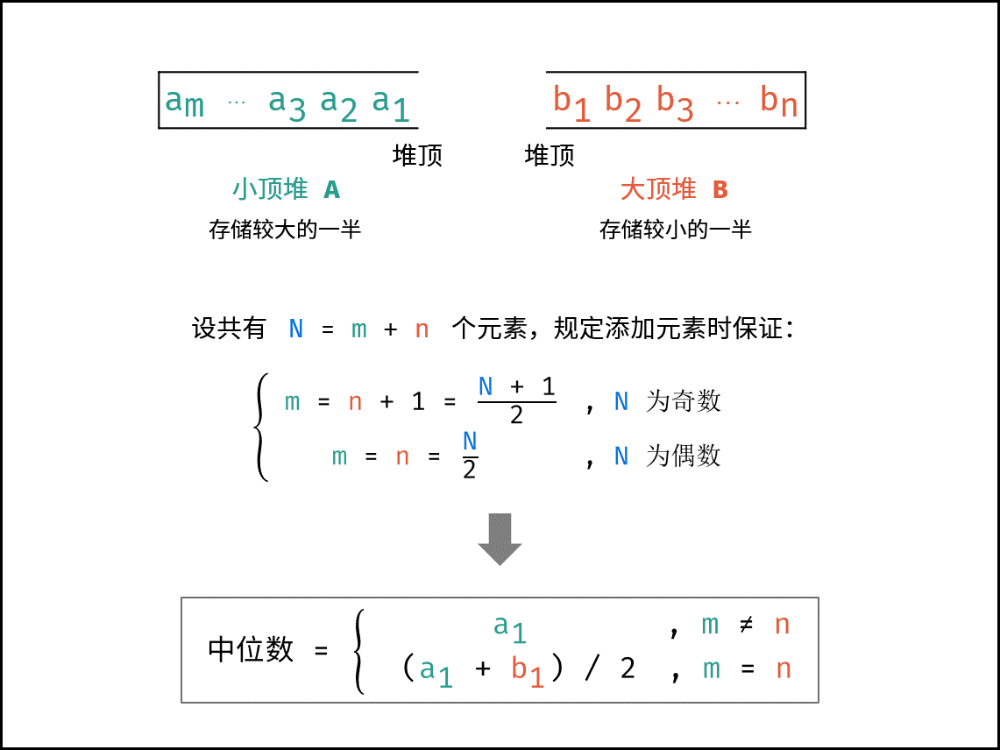

#### 算法流程：

> 设元素总数为 $N=m+n$，其中 $m$ 和 $n$ 分别为 $A$ 和 $B$ 中的元素个数。

**`addNum(num)` 函数：**

1. 当 $m=n$（即 $N$ 为 **偶数**）：需向 $A$ 添加一个元素。实现方法：将新元素 $num$ 插入至 $B$，再将 $B$ 堆顶元素插入至 $A$；
2. 当 $m\ne n$（即 $N$ 为 **奇数**）：需向 $B$ 添加一个元素。实现方法：将新元素 $num$ 插入至 $A$，再将 $A$ 堆顶元素插入至 $B$；

> 假设插入数字 $num$ 遇到情况 `1.`。由于 $num$ 可能属于 “较小的一半” （即属于 $B $），因此不能将 $nums$ 直接插入至 $A$。而应先将 $num$ 插入至 $B$，再将 $B$ 堆顶元素插入至 $A$。这样就可以始终保持 $A$ 保存较大一半、 $B$ 保存较小一半。

**`findMedian()` 函数：**

1. 当 $m=n$（ $N$ 为 **偶数**）：则中位数为 $( A$ 的堆顶元素 $+ B$ 的堆顶元素 $)/2$。
2. 当 $m\ne n$（ $N$ 为 **奇数**）：则中位数为 $A$ 的堆顶元素。

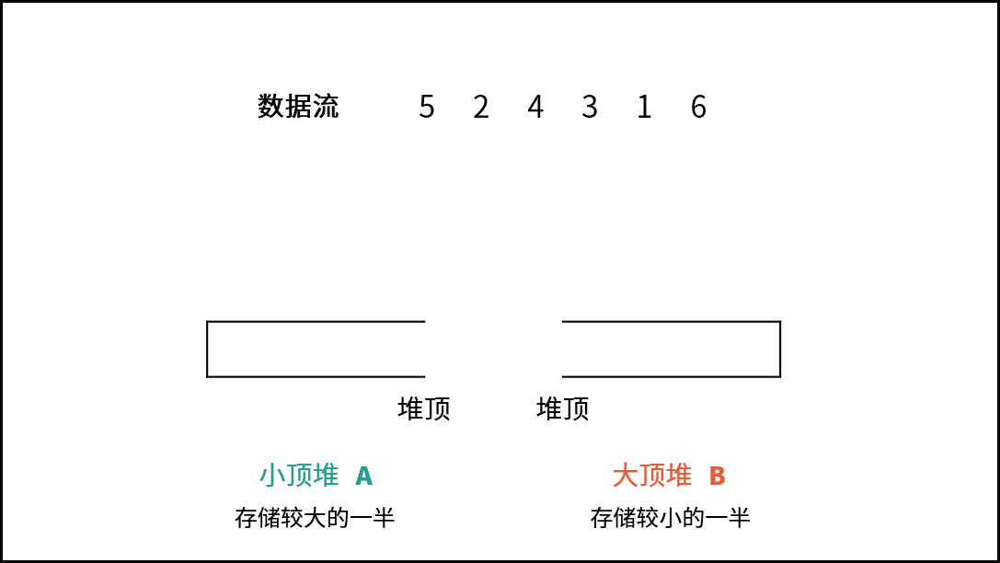
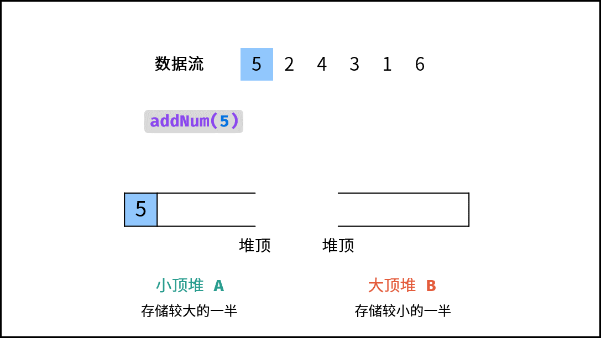
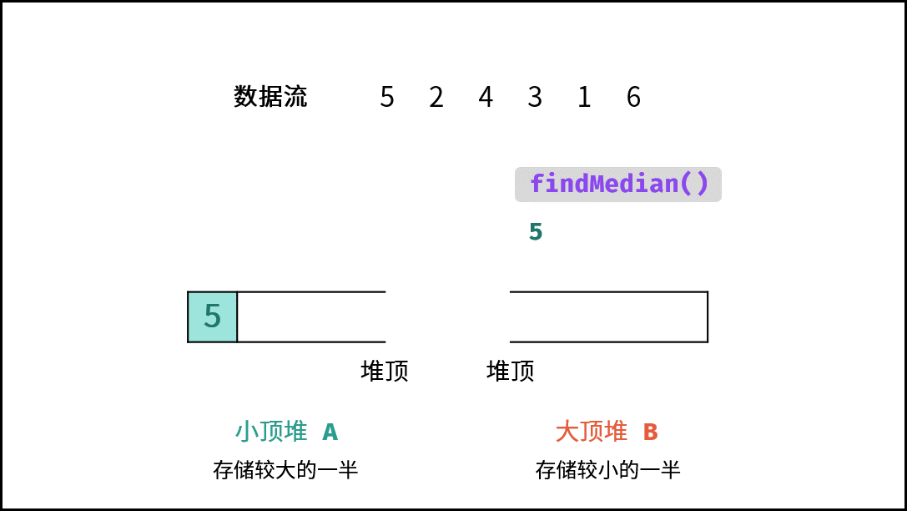
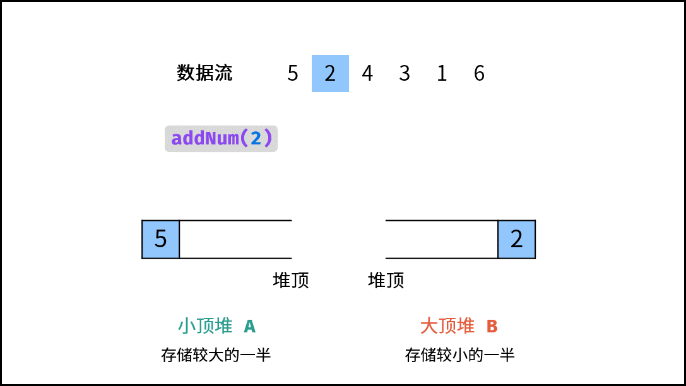
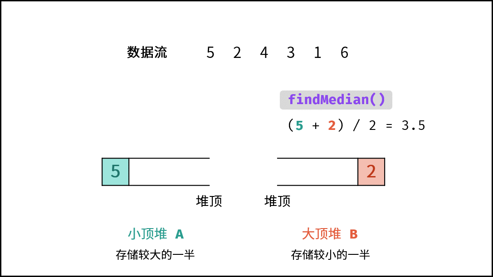
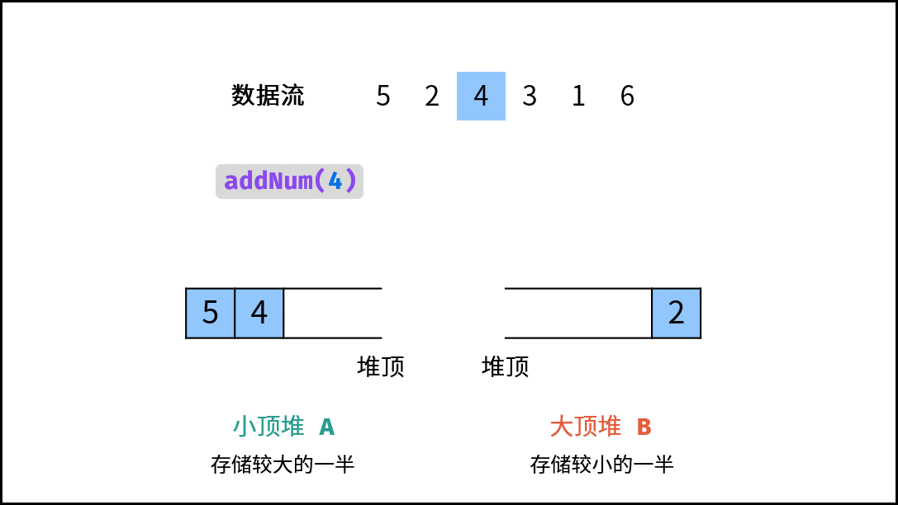
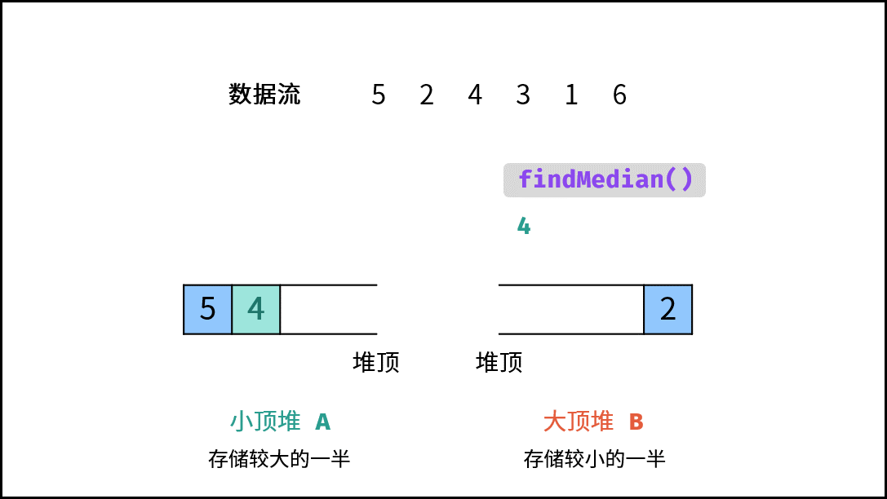
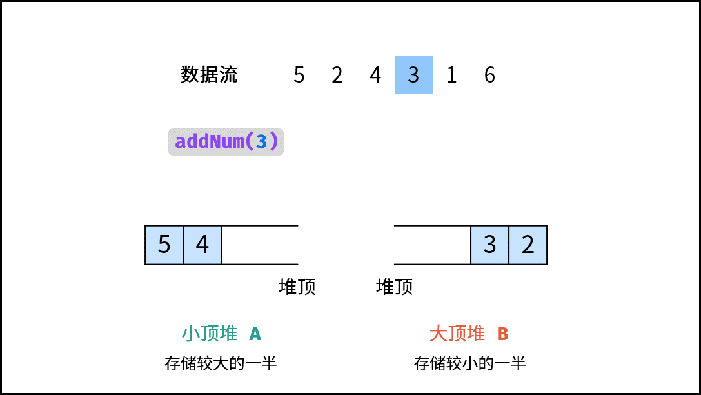
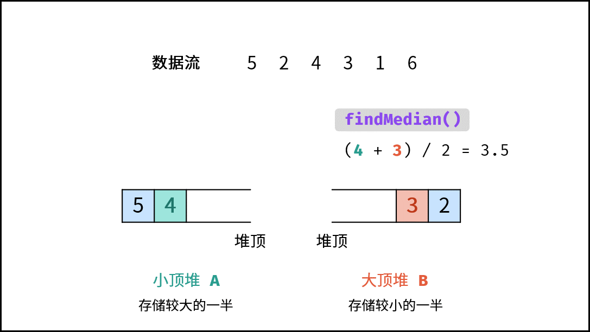
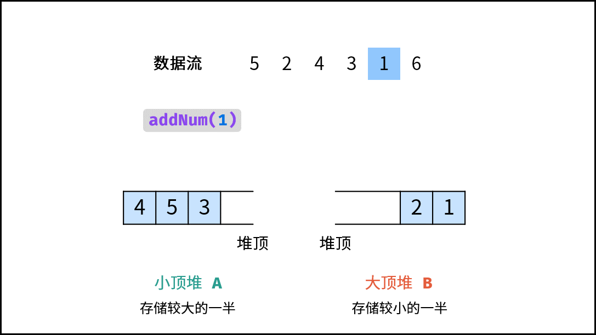
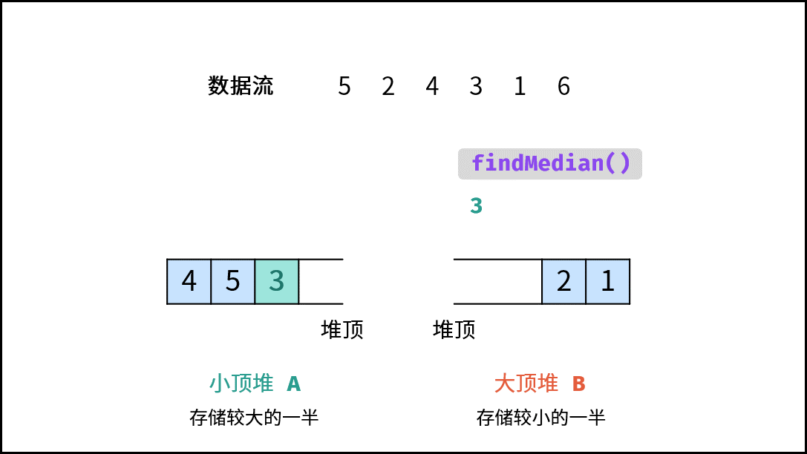
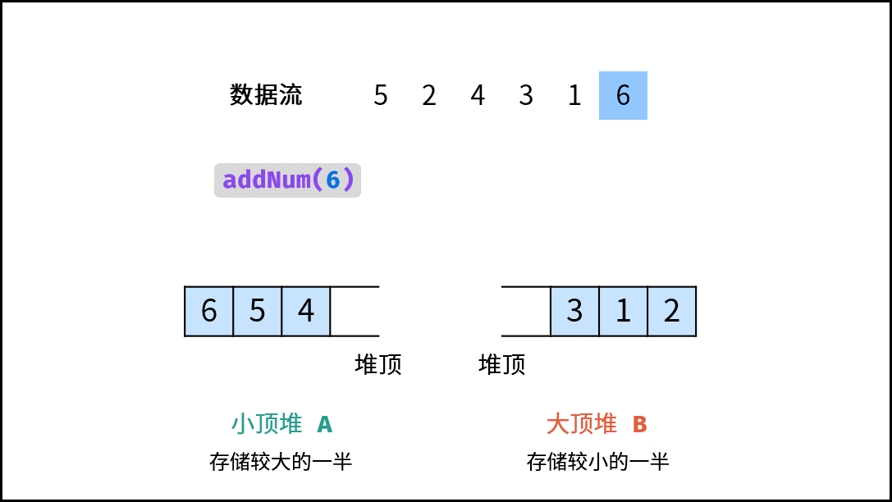
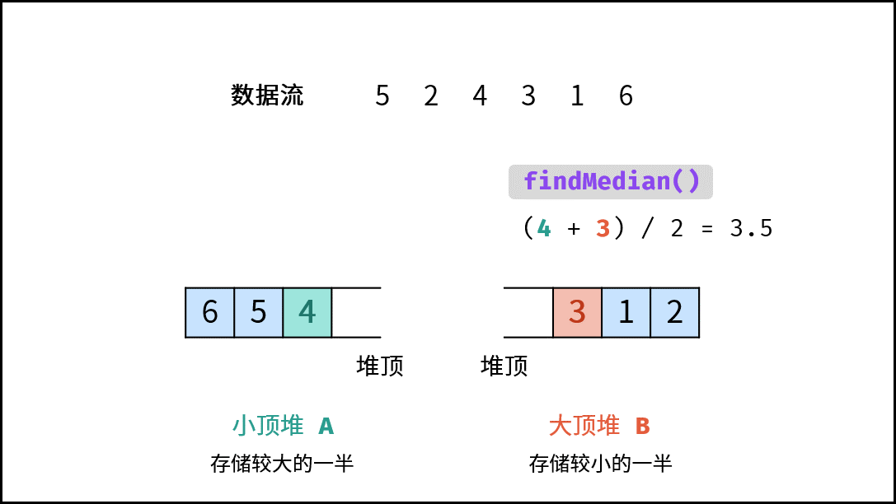

#### 代码：

Python 中 $heapq$ 模块是小顶堆。实现 **大顶堆** 方法：小顶堆的插入和弹出操作均将元素 **取反** 即可。
Java 使用 `PriorityQueue<>((x, y) -> (y - x))` 可方便实现大顶堆。
C++ 中 `greater` 为小顶堆，`less` 为大顶堆。

```Python
from heapq import *

class MedianFinder:
    def __init__(self):
        self.A = [] # 小顶堆，保存较大的一半
        self.B = [] # 大顶堆，保存较小的一半

    def addNum(self, num: int) -> None:
        if len(self.A) != len(self.B):
            heappush(self.A, num)
            heappush(self.B, -heappop(self.A))
        else:
            heappush(self.B, -num)
            heappush(self.A, -heappop(self.B))

    def findMedian(self) -> float:
        return self.A[0] if len(self.A) != len(self.B) else (self.A[0] - self.B[0]) / 2.0
```

```Java
class MedianFinder {
    Queue<Integer> A, B;
    public MedianFinder() {
        A = new PriorityQueue<>(); // 小顶堆，保存较大的一半
        B = new PriorityQueue<>((x, y) -> (y - x)); // 大顶堆，保存较小的一半
    }
    public void addNum(int num) {
        if(A.size() != B.size()) {
            A.add(num);
            B.add(A.poll());
        } else {
            B.add(num);
            A.add(B.poll());
        }
    }
    public double findMedian() {
        return A.size() != B.size() ? A.peek() : (A.peek() + B.peek()) / 2.0;
    }
}
```

```C++
class MedianFinder {
public:
    priority_queue<int, vector<int>, greater<int>> A; // 小顶堆，保存较大的一半
    priority_queue<int, vector<int>, less<int>> B; // 大顶堆，保存较小的一半
    MedianFinder() { }
    void addNum(int num) {
        if(A.size() != B.size()) {
            A.push(num);
            B.push(A.top());
            A.pop();
        } else {
            B.push(num);
            A.push(B.top());
            B.pop();
        }
    }
    double findMedian() {
        return A.size() != B.size() ? A.top() : (A.top() + B.top()) / 2.0;
    }
};
```

> $Push item on the heap, then pop and return the smallest item from the heap. The combined action runs more efficiently than heappush() followed by a separate call to heappop().$

根据以上文档说明，可将 $Python$ 代码优化为：

```Python
from heapq import *

class MedianFinder:
    def __init__(self):
        self.A = [] # 小顶堆，保存较大的一半
        self.B = [] # 大顶堆，保存较小的一半

    def addNum(self, num: int) -> None:
        if len(self.A) != len(self.B):
            heappush(self.B, -heappushpop(self.A, num))
        else:
            heappush(self.A, -heappushpop(self.B, -num))

    def findMedian(self) -> float:
        return self.A[0] if len(self.A) != len(self.B) else (self.A[0] - self.B[0]) / 2.0
```

### 复杂度分析：

- **时间复杂度：**
  - **查找中位数 $O(1)$：** 获取堆顶元素使用 $O(1)$ 时间；
  - **添加数字 $O(\log N)$：** 堆的插入和弹出操作使用 $O(\log N)$ 时间。
- **空间复杂度 $O(N)$：** 其中 $N$ 为数据流中的元素数量，小顶堆 $A$ 和大顶堆 $B$ 最多同时保存 $N$ 个元素。
