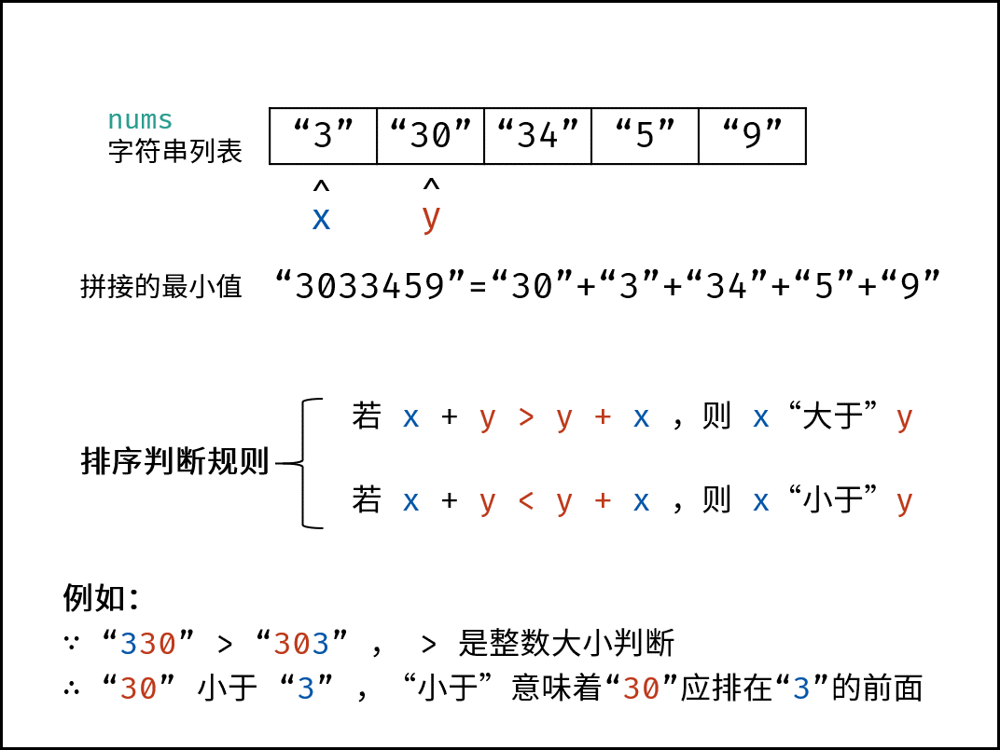
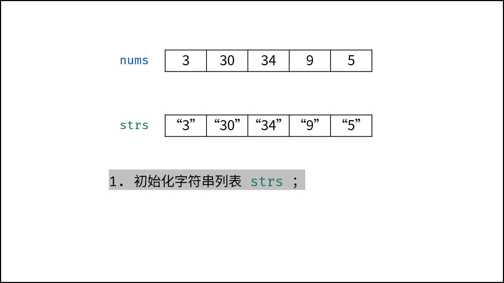
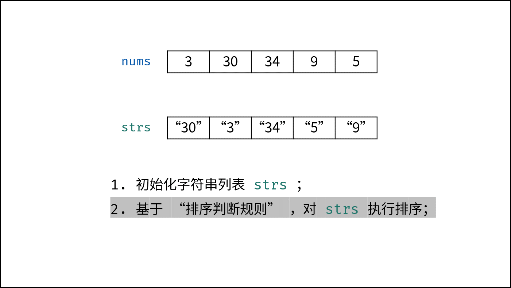
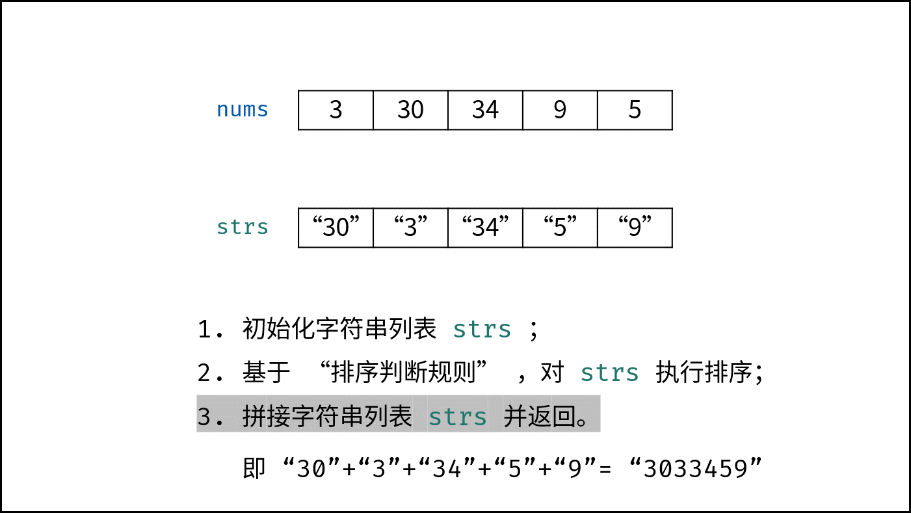

### [LCR 164. 破解闯关密码（贪心，清晰图解）](https://leetcode.cn/problems/ba-shu-zu-pai-cheng-zui-xiao-de-shu-lcof/solutions/190476/mian-shi-ti-45-ba-shu-zu-pai-cheng-zui-xiao-de-s-4/?envType=problem-list-v2&envId=ySsxoJfz)

#### 解题思路

此题求拼接起来的最小数字，本质上是一个排序问题。设数组 `password` 中任意两数字的字符串为 $x$ 和 $y$，则规定 **排序判断规则** 为：

- 若拼接字符串 $x+y>y+x$，则 $x$ “大于” $y$；
- 反之，若 $x+y<y+x$，则 $x$ “小于” $y$；

> $x$ “小于” $y$ 代表：排序完成后，数组中 $x$ 应在 $y$ 左边；“大于” 则反之。

根据以上规则，套用任何排序方法对 `password` 执行排序即可。



##### 算法流程

1. **初始化：** 字符串列表 `strs`，保存各数字的字符串格式；
2. **列表排序：** 应用以上 “排序判断规则”，对 `strs` 执行排序；
3. **返回值：** 拼接 `strs` 中的所有字符串，并返回。

> 下图中 `nums` 对应本题的 `password`。





#### 代码

本文列举 **快速排序** 和 **内置函数** 两种排序方法，其他排序方法也可实现。

##### 快速排序

需修改快速排序函数中的排序判断规则。字符串大小（字典序）对比的实现方法：

- 在 Python 和 C++ 中可直接用 `<` , `>`；
- 在 Java 中使用函数 `A.compareTo(B)`；

```Python
class Solution:
    def crackPassword(self, password: List[int]) -> str:
        def quick_sort(l , r):
            if l >= r: return
            i, j = l, r
            while i < j:
                while strs[j] + strs[l] >= strs[l] + strs[j] and i < j: j -= 1
                while strs[i] + strs[l] <= strs[l] + strs[i] and i < j: i += 1
                strs[i], strs[j] = strs[j], strs[i]
            strs[i], strs[l] = strs[l], strs[i]
            quick_sort(l, i - 1)
            quick_sort(i + 1, r)

        strs = [str(num) for num in password]
        quick_sort(0, len(strs) - 1)
        return ''.join(strs)
```

```Java
class Solution {
    public String crackPassword(int[] password) {
        String[] strs = new String[password.length];
        for(int i = 0; i < password.length; i++)
            strs[i] = String.valueOf(password[i]);
        quickSort(strs, 0, strs.length - 1);
        StringBuilder res = new StringBuilder();
        for(String s : strs)
            res.append(s);
        return res.toString();
    }
    void quickSort(String[] strs, int l, int r) {
        if(l >= r) return;
        int i = l, j = r;
        String tmp = strs[i];
        while(i < j) {
            while((strs[j] + strs[l]).compareTo(strs[l] + strs[j]) >= 0 && i < j) j--;
            while((strs[i] + strs[l]).compareTo(strs[l] + strs[i]) <= 0 && i < j) i++;
            tmp = strs[i];
            strs[i] = strs[j];
            strs[j] = tmp;
        }
        strs[i] = strs[l];
        strs[l] = tmp;
        quickSort(strs, l, i - 1);
        quickSort(strs, i + 1, r);
    }
}
```

```C++
class Solution {
public:
    string crackPassword(vector<int>& password) {
        vector<string> strs;
        for(int i = 0; i < password.size(); i++)
            strs.push_back(to_string(password[i]));
        quickSort(strs, 0, strs.size() - 1);
        string res;
        for(string s : strs)
            res.append(s);
        return res;
    }
private:
    void quickSort(vector<string>& strs, int l, int r) {
        if(l >= r) return;
        int i = l, j = r;
        while(i < j) {
            while(strs[j] + strs[l] >= strs[l] + strs[j] && i < j) j--;
            while(strs[i] + strs[l] <= strs[l] + strs[i] && i < j) i++;
            swap(strs[i], strs[j]);
        }
        swap(strs[i], strs[l]);
        quickSort(strs, l, i - 1);
        quickSort(strs, i + 1, r);
    }
};
```

##### 内置函数

需定义排序规则：

- Python 定义在函数 `sort_rule(x, y)` 中；
- Java 定义为 `(x, y) -> (x + y).compareTo(y + x)`；
- C++ 定义为 `(string& x, string& y){ return x + y < y + x; }`；

```Python
class Solution:
    def crackPassword(self, password: List[int]) -> str:
        def sort_rule(x, y):
            a, b = x + y, y + x
            if a > b: return 1
            elif a < b: return -1
            else: return 0

        strs = [str(num) for num in password]
        strs.sort(key = functools.cmp_to_key(sort_rule))
        return ''.join(strs)
```

```Java
class Solution {
    public String crackPassword(int[] password) {
        String[] strs = new String[password.length];
        for(int i = 0; i < password.length; i++)
            strs[i] = String.valueOf(password[i]);
        Arrays.sort(strs, (x, y) -> (x + y).compareTo(y + x));
        StringBuilder res = new StringBuilder();
        for(String s : strs)
            res.append(s);
        return res.toString();
    }
}
```

```C++
class Solution {
public:
    string crackPassword(vector<int>& password) {
        vector<string> strs;
        string res;
        for(int i = 0; i < password.size(); i++)
            strs.push_back(to_string(password[i]));
        sort(strs.begin(), strs.end(), [](string& x, string& y){ return x + y < y + x; });
        for(int i = 0; i < strs.size(); i++)
            res.append(strs[i]);
        return res;
    }
};
```

##### 复杂度分析

- **时间复杂度 $O(N\log N)$：** $N$ 为最终返回值的字符数量（`strs` 列表的长度 $\le N$）；使用快排或内置函数的平均时间复杂度为 $O(N\log N)$，最差为 $O(N^2)$。
- **空间复杂度 $O(N)$：** 字符串列表 `strs` 占用线性大小的额外空间。
