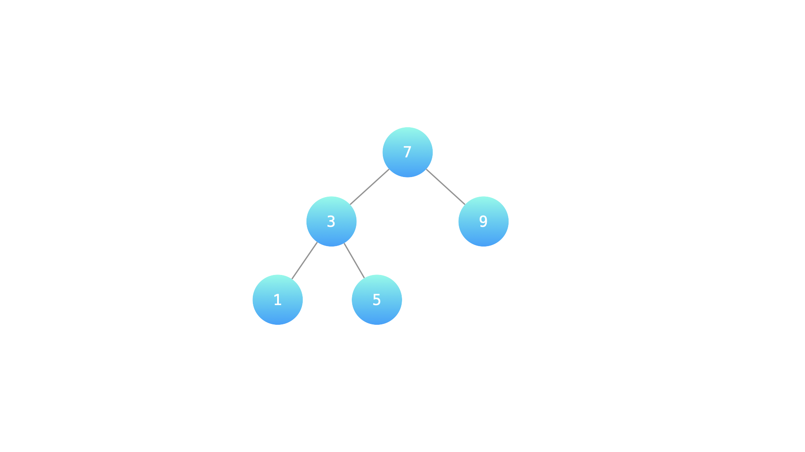
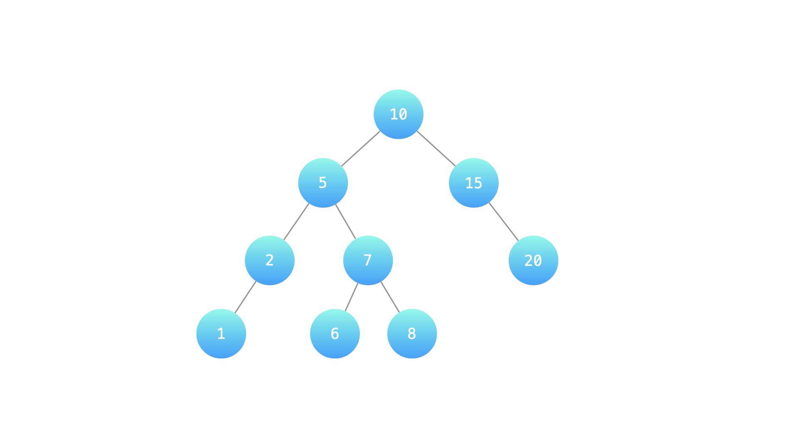

### [LCR 174. 寻找二叉搜索树中的目标节点](https://leetcode.cn/problems/er-cha-sou-suo-shu-de-di-kda-jie-dian-lcof/)

难度：简单

某公司组织架构以二叉搜索树形式记录，节点值为处于该职位的员工编号。请返回第 `cnt` 大的员工编号。

**示例 1：**



> **输入：** root = [7, 3, 9, 1, 5], cnt = 2
> ```
>        7
>       / \
>      3   9
>     / \
>    1   5
> ```
> **输出：** 7

**示例 2：**



> **输入:**  root = [10, 5, 15, 2, 7, null, 20, 1, null, 6, 8], cnt = 4
> ```
>        10
>       / \
>      5   15
>     / \    \
>    2   7    20
>   /   / \ 
>  1   6   8
> ```
> **输出:**  8

**提示：**

- 1 ≤ cnt ≤ 二叉搜索树元素个数
