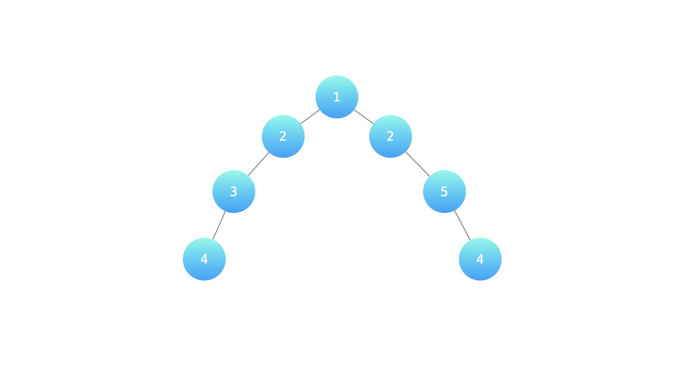

### [LCR 175. 计算二叉树的深度](https://leetcode.cn/problems/er-cha-shu-de-shen-du-lcof/)

难度：简单

某公司架构以二叉树形式记录，请返回该公司的层级数。

**示例 1：**

> **输入：** root = [1, 2, 2, 3, null, null, 5, 4, null, null, 4]
> **输出：** 4
> **解释：** 上面示例中的二叉树的最大深度是 4，沿着路径 1 -> 2 -> 3 -> 4 或 1 -> 2 -> 5 -> 4 到达叶节点的最长路径上有 4 个节点。

**提示：**

- `节点总数 <= 10000`

注意：本题与主站 104 题相同：[https://leetcode-cn.com/problems/maximum-depth-of-binary-tree/](https://leetcode-cn.com/problems/maximum-depth-of-binary-tree/)
