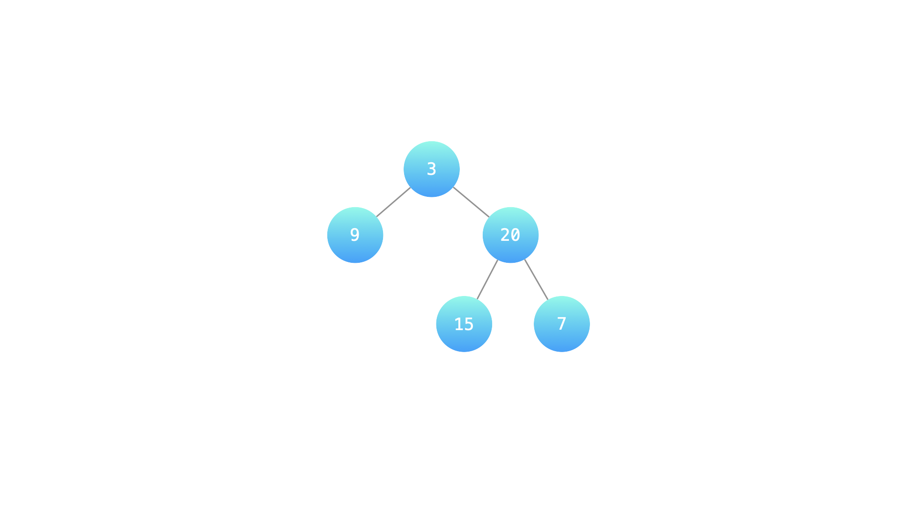
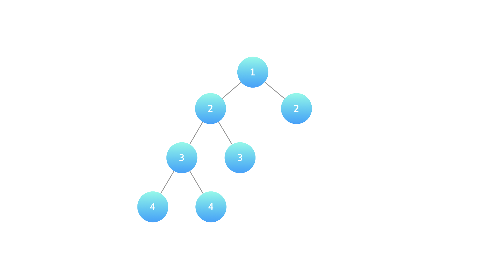

### [LCR 176. 判断是否为平衡二叉树](https://leetcode.cn/problems/ping-heng-er-cha-shu-lcof/)

难度：简单

输入一棵二叉树的根节点，判断该树是不是平衡二叉树。如果某二叉树中任意节点的左右子树的深度相差不超过1，那么它就是一棵平衡二叉树。

**示例 1:**

**输入：** root = [3,9,20,null,null,15,7]
**输出：** true
**解释：** 如下图

  

**示例 2:**

**输入：** root = [1,2,2,3,3,null,null,4,4]
**输出：** false
**解释：** 如下图

**提示：**

- `0 <= 树的结点个数 <= 10000`

注意：本题与主站 110 题相同：[https://leetcode-cn.com/problems/balanced-binary-tree/](https://leetcode-cn.com/problems/balanced-binary-tree/)
