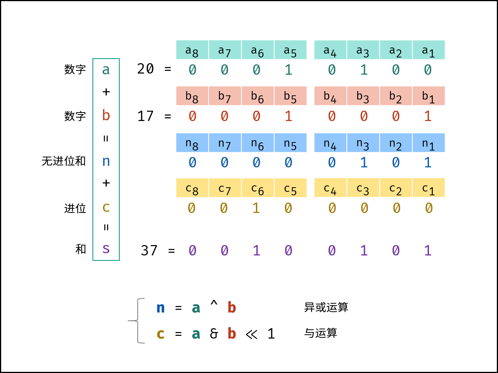
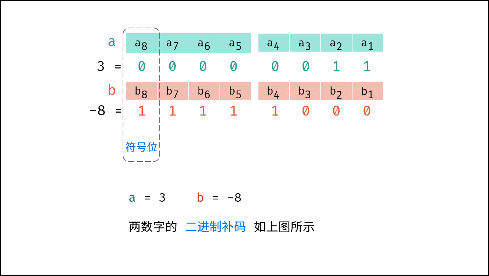
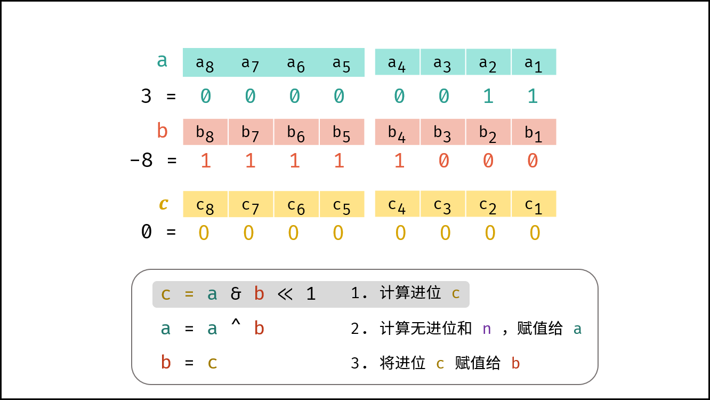
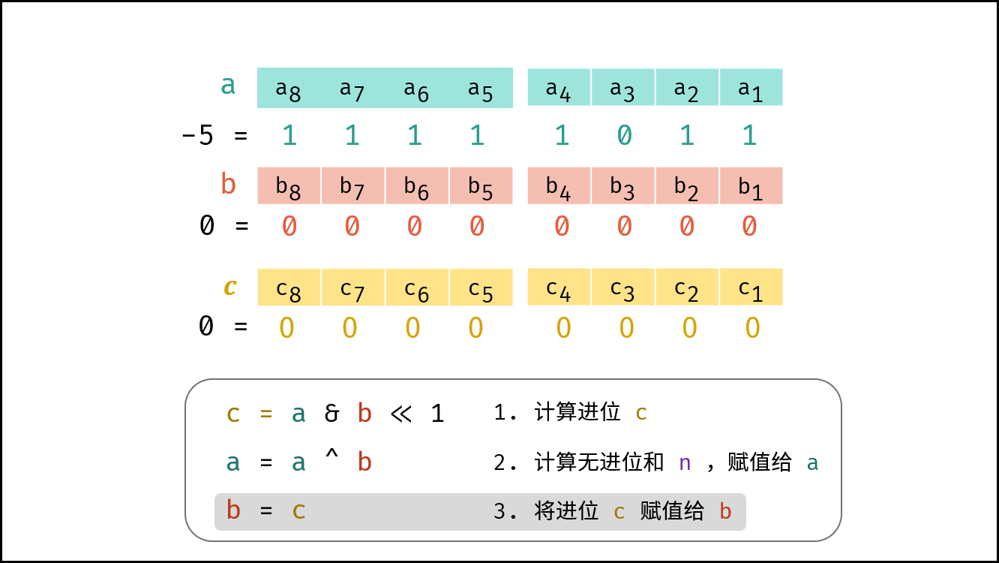
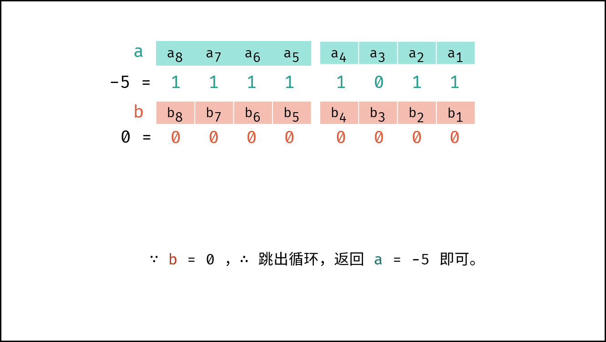

### [LCR 190. 加密运算（位运算，清晰图解）](https://leetcode.cn/problems/bu-yong-jia-jian-cheng-chu-zuo-jia-fa-lcof/solutions/210882/mian-shi-ti-65-bu-yong-jia-jian-cheng-chu-zuo-ji-7/)

#### 解题思路

本题考察对位运算的灵活使用，即使用位运算实现加法。

设两数字的二进制形式 $dataA, dataB$，其求和 $s = dataA + dataB$，$dataA(i)$ 代表 $dataA$ 的二进制第 $i$ 位，则分为以下四种情况：

| $dataA(i)$ | $dataB(i)$ | 无进位和 $n(i)$ | 进位 $c(i+1)$ |
| -- | -- | -- | -- |
| $0$ | $0$ | $0$ | $0$ |
| $0$ | $1$ | $1$ | $0$ |
| $1$ | $0$ | $1$ | $0$ |
| $1$ | $1$ | $0$ | $1$ |

观察发现，**无进位和** 与 **异或运算** 规律相同，**进位** 和 **与运算** 规律相同（并需左移一位）。因此，无进位和 $n$ 与进位 $c$ 的计算公式如下；

$$\begin{cases} n = dataA \oplus dataB & 非进位和：异或运算 \\ c = dataA \space \& \space dataB << 1 & 进位：与运算 + 左移一位 \end{cases}$$

（和 $s$ ）$=$（非进位和 $n$ ）$+$（进位 $c$ ）。即可将 $s = dataA + dataB$转化为：

$$s = dataA + dataB \Rightarrow s = n + c$$

循环求 $n$ 和 $c$ ，直至进位 $c = 0$；此时 $s = n$，返回 $n$ 即可。

> 下图中的 a 和 b 对应本题的 dataA 和 dataB 。



> Q ： 若数字 $dataA$ 和 dataBdataBdataB 中有负数，则变成了减法，如何处理？
> A ： 在计算机系统中，数值一律用 **补码** 来表示和存储。**补码的优势：** 加法、减法可以统一处理（CPU只有加法器）。因此，以上方法 **同时适用于正数和负数的加法** 。







##### 代码

```java
class Solution {
    public int encryptionCalculate(int dataA, int dataB) {
        while(dataB != 0) { // 当进位为 0 时跳出
            int c = (dataA & dataB) << 1;  // c = 进位
            dataA ^= dataB; // dataA = 非进位和
            dataB = c; // dataB = 进位
        }
        return dataA;
    }
}
```

```c++
class Solution {
public:
    int encryptionCalculate(int dataA, int dataB) {
        while(dataB != 0)
        {
            int c = (unsigned int)(dataA & dataB) << 1;
            dataA ^= dataB;
            dataB = c;
        }
        return dataA;
    }
};
```

```python
class Solution:
    def encryptionCalculate(self, dataA: int, dataB: int) -> int:
        x = 0xffffffff
        dataA, dataB = dataA & x, dataB & x
        while dataB != 0:
            dataA, dataB = (dataA ^ dataB), (dataA & dataB) << 1 & x
        return dataA if dataA <= 0x7fffffff else ~(dataA ^ x)
```

##### 复杂度分析

- 时间复杂度 $O(1)$ ： 最差情况下（例如 $dataA = \text{0x7fffffff}$, $dataB = 1$ 时），需循环 32 次，使用 $O(1)$ 时间；每轮中的常数次位操作使用 $O(1)$ 时间。
- 空间复杂度 $O(1)$ ： 使用常数大小的额外空间。

#### Python 负数的存储

Python，Java, C++ 等语言中的数字都是以 **补码** 形式存储的。但 Python 没有 `int` , `long` 等不同长度变量，即在编程时无变量位数的概念。

**获取负数的补码：** 需要将数字与十六进制数 `0xffffffff` 相与。可理解为舍去此数字 32 位以上的数字（将 32 位以上都变为 $0$ ），从无限长度变为一个 32 位整数。

**返回前数字还原：** 若补码 $dataA$ 为负数（ `0x7fffffff` 是最大的正数的补码 ），需执行 `~(dataA ^ x)` 操作，将补码还原至 Python 的存储格式。`dataA ^ x` 运算将 1 至 32 位按位取反；`~` 运算是将整个数字取反；因此，`~(dataA ^ x)` 是将 32 位以上的位取反，1 至 32 位不变。

```python
print(hex(1)) # = 0x1 补码
print(hex(-1)) # = -0x1 负号 + 原码 （ Python 特色，Java 会直接输出补码）

print(hex(1 & 0xffffffff)) # = 0x1 正数补码
print(hex(-1 & 0xffffffff)) # = 0xffffffff 负数补码

print(-1 & 0xffffffff) # = 4294967295 （ Python 将其认为正数）
```
