### [LCR 191. 按规则计算统计结果（清晰图解）](https://leetcode.cn/problems/gou-jian-cheng-ji-shu-zu-lcof/solutions/208840/mian-shi-ti-66-gou-jian-cheng-ji-shu-zu-biao-ge-fe/?envType=problem-list-v2&envId=ySsxoJfz)

#### 解题思路：

> 本文将 `arrayA`, `arrayB` 简写为 `A`, `B`。

本题的难点在于 **不能使用除法**，即需要 **只用乘法** 生成数组 $B$。根据题目对 $B[i]$ 的定义，可列如下图所示的表格。

根据表格的主对角线（全为 $1 $），可将表格分为 **上三角** 和 **下三角** 两部分。分别迭代计算下三角和上三角两部分的乘积，即可 **不使用除法** 就获得结果。

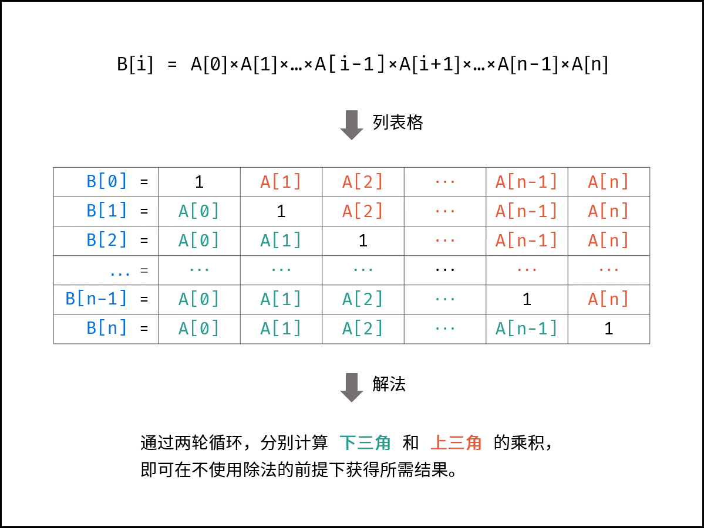

#### 算法流程：

1. 初始化：数组 $B$，其中 $B[0]=1$；辅助变量 $tmp=1$；
2. 计算 $B[i]$ 的 **下三角** 各元素的乘积，直接乘入 $B[i]$；
3. 计算 $B[i]$ 的 **上三角** 各元素的乘积，记为 $tmp$，并乘入 $B[i]$；
4. 返回 $B$。

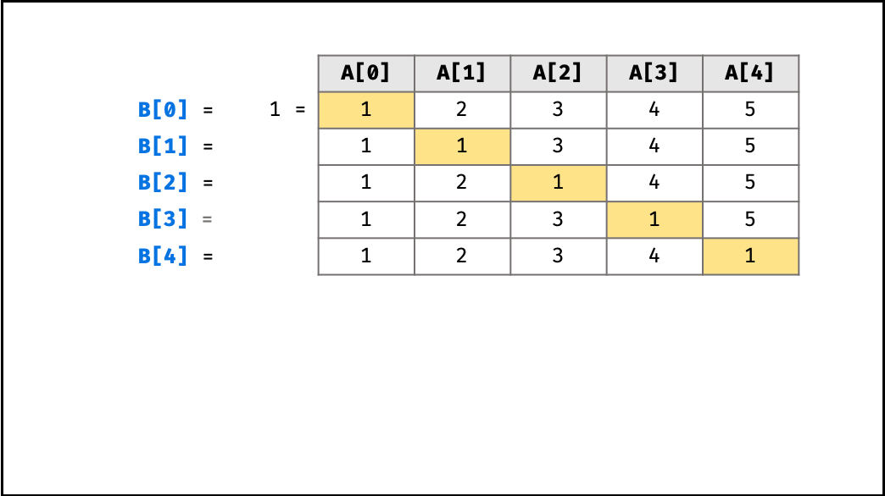
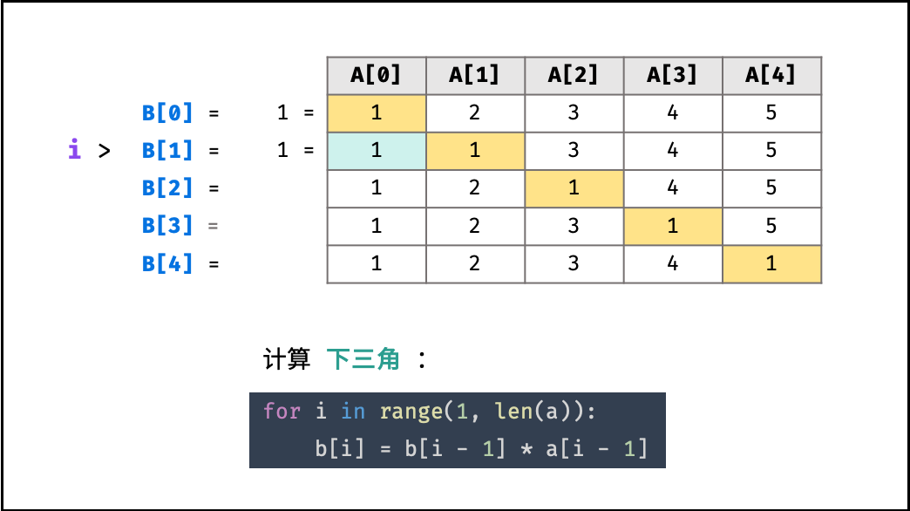
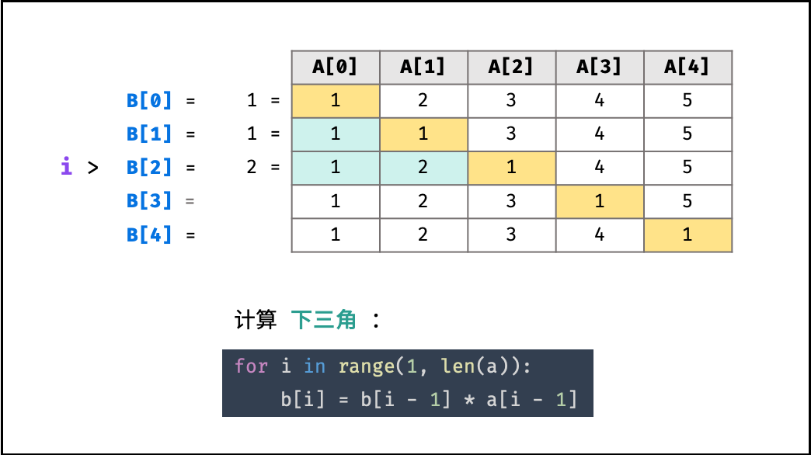
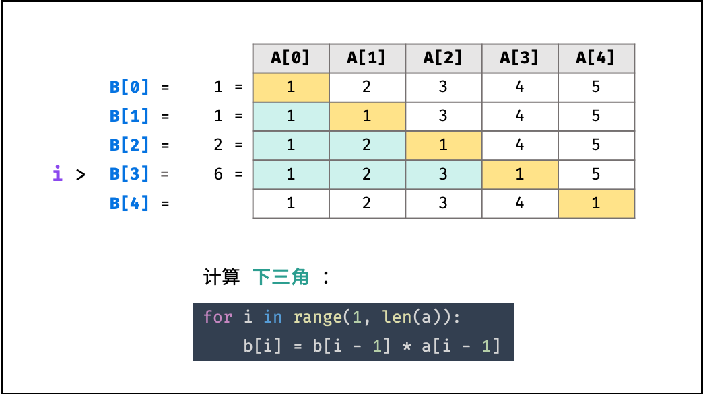
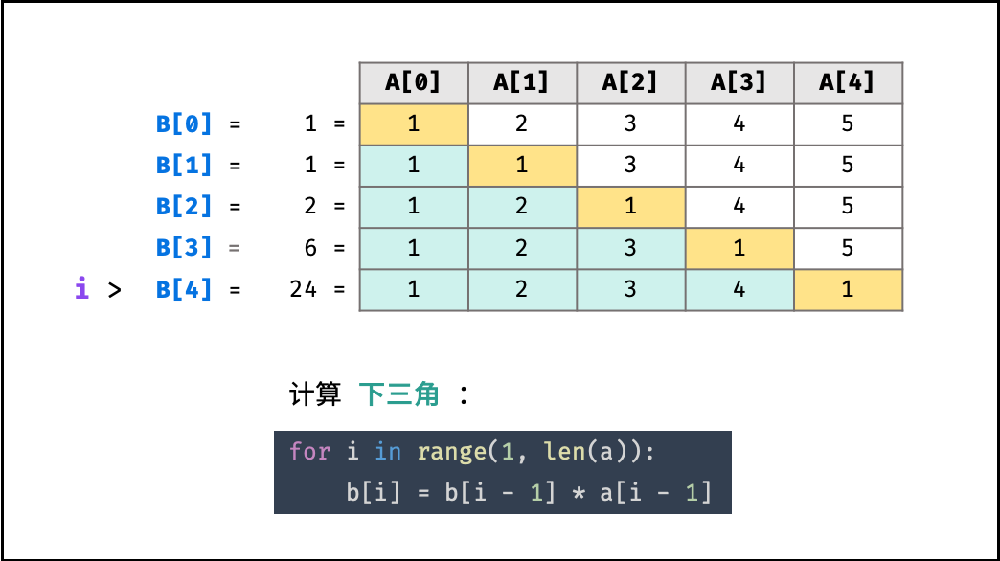
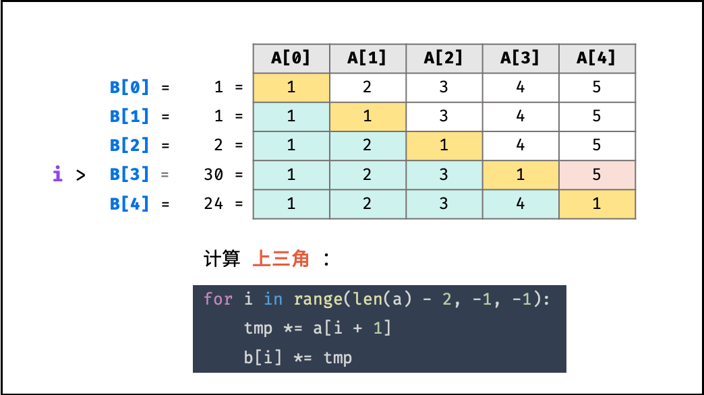
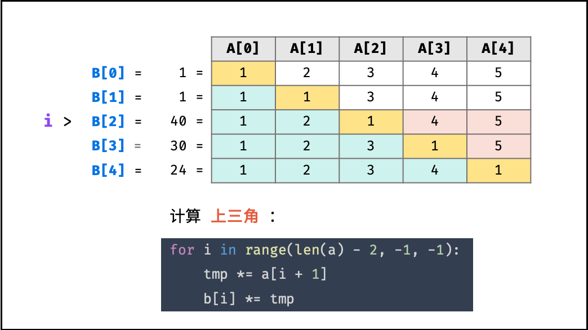
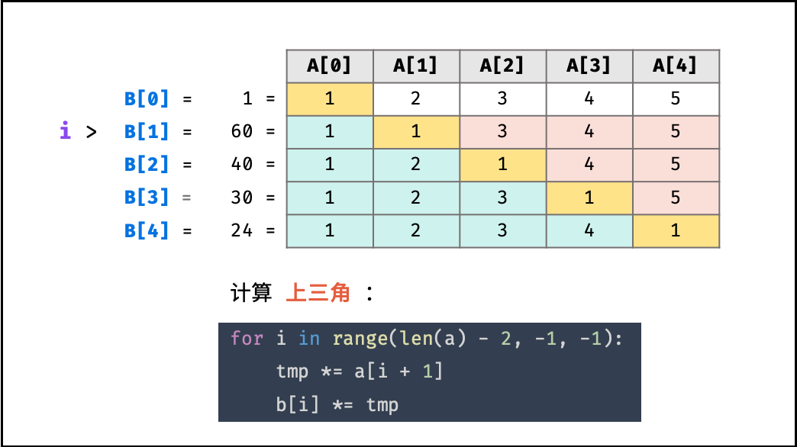
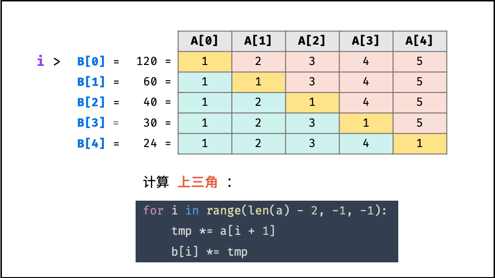
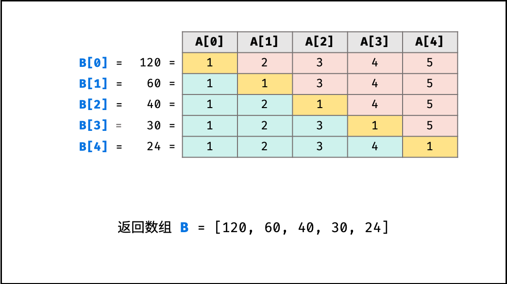

#### 代码：

```Python
class Solution:
    def statisticalResult(self, arrayA: List[int]) -> List[int]:
        arrayB, tmp = [1] * len(arrayA), 1
        for i in range(1, len(arrayA)):
            arrayB[i] = arrayB[i - 1] * arrayA[i - 1]
        for i in range(len(arrayA) - 2, -1, -1):
            tmp *= arrayA[i + 1]
            arrayB[i] *= tmp
        return arrayB
```

```Java
class Solution {
    public int[] statisticalResult(int[] arrayA) {
        int len = arrayA.length;
        if(len == 0) return new int[0];
        int[] arrayB = new int[len];
        arrayB[0] = 1;
        int tmp = 1;
        for(int i = 1; i < len; i++) {
            arrayB[i] = arrayB[i - 1] * arrayA[i - 1];
        }
        for(int i = len - 2; i >= 0; i--) {
            tmp *= arrayA[i + 1];
            arrayB[i] *= tmp;
        }
        return arrayB;
    }
}
```

```C++
class Solution {
public:
    vector<int> statisticalResult(vector<int>& arrayA) {
        int len = arrayA.size();
        if(len == 0) return {};
        vector<int> arrayB(len, 1);
        arrayB[0] = 1;
        int tmp = 1;
        for(int i = 1; i < len; i++) {
            arrayB[i] = arrayB[i - 1] * arrayA[i - 1];
        }
        for(int i = len - 2; i >= 0; i--) {
            tmp *= arrayA[i + 1];
            arrayB[i] *= tmp;
        }
        return arrayB;
    }
};
```

### 复杂度分析：

- **时间复杂度 $O(N)$：** 其中 $N$ 为数组长度，两轮遍历数组 $A$，使用 $O(N)$ 时间。
- **空间复杂度 $O(1)$：** 变量 $tmp$ 使用常数大小额外空间（数组 $B$ 作为返回值，不计入复杂度考虑）。
