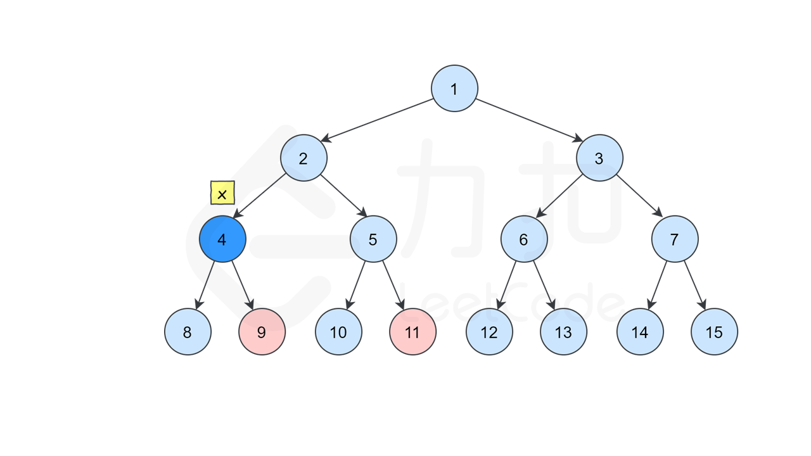

### [寻找二叉树的最近公共祖先](https://leetcode.cn/problems/er-cha-shu-de-zui-jin-gong-gong-zu-xian-lcof/solutions/531784/er-cha-shu-de-zui-jin-gong-gong-zu-xian-6fdt7/?envType=problem-list-v2&envId=0CgnHGeN)

#### 方法一：递归

**思路和算法**

我们递归遍历整棵二叉树，定义 $f_x$ 表示 $x$ 节点的子树中是否包含 $p$ 节点或 $q$ 节点，如果包含为 `true`，否则为 `false`。那么符合条件的最近公共祖先 $x$ 一定满足如下条件：

$$(f_{lson} \&\& f_{rson}) \vert \vert ((x = p \vert \vert  x = q) \&\& (f_{lson} \vert \vert f_{rson}))$$

其中 $lson$ 和 $rson$ 分别代表 $x$ 节点的左孩子和右孩子。初看可能会感觉条件判断有点复杂，我们来一条条看，$f_{lson} \&\& f_{rson}$ 说明左子树和右子树均包含 $p$ 节点或 $q$ 节点，如果左子树包含的是 $p$ 节点，那么右子树只能包含 $q$ 节点，反之亦然，因为 $p$ 节点和 $q$ 节点都是不同且唯一的节点，因此如果满足这个判断条件即可说明 $x$ 就是我们要找的最近公共祖先。再来看第二条判断条件，这个判断条件即是考虑了 $x$ 恰好是 $p$ 节点或 $q$ 节点且它的左子树或右子树有一个包含了另一个节点的情况，因此如果满足这个判断条件亦可说明 $x$ 就是我们要找的最近公共祖先。

你可能会疑惑这样找出来的公共祖先深度是否是最大的。其实是最大的，因为我们是自底向上从叶子节点开始更新的，所以在所有满足条件的公共祖先中一定是深度最大的祖先先被访问到，且由于 $f_x$ 本身的定义很巧妙，在找到最近公共祖先 $x$ 以后，$f_x$ 按定义被设置为 `true`，即假定了这个子树中只有一个 $p$ 节点或 $q$ 节点，因此其他公共祖先不会再被判断为符合条件。

下图展示了一个示例，搜索树中两个节点 `9` 和 `11` 的最近公共祖先。





```C++
class Solution {
public:
    TreeNode* ans;
    bool dfs(TreeNode* root, TreeNode* p, TreeNode* q) {
        if (root == nullptr) return false;
        bool lson = dfs(root->left, p, q);
        bool rson = dfs(root->right, p, q);
        if ((lson && rson) || ((root->val == p->val || root->val == q->val) && (lson || rson))) {
            ans = root;
        } 
        return lson || rson || (root->val == p->val || root->val == q->val);
    }
    TreeNode* lowestCommonAncestor(TreeNode* root, TreeNode* p, TreeNode* q) {
        dfs(root, p, q);
        return ans;
    }
};
```

```JavaScript
var lowestCommonAncestor = function(root, p, q) {
    let ans;
    const dfs = (root, p, q) => {
        if (root === null) return false;
        const lson = dfs(root.left, p, q);
        const rson = dfs(root.right, p, q);
        if ((lson && rson) || ((root.val === p.val || root.val === q.val) && (lson || rson))) {
            ans = root;
        } 
        return lson || rson || (root.val === p.val || root.val === q.val);
    }
    dfs(root, p, q);
    return ans;
};
```

```Java
class Solution {

    private TreeNode ans;

    public Solution() {
        this.ans = null;
    }

    private boolean dfs(TreeNode root, TreeNode p, TreeNode q) {
        if (root == null) return false;
        boolean lson = dfs(root.left, p, q);
        boolean rson = dfs(root.right, p, q);
        if ((lson && rson) || ((root.val == p.val || root.val == q.val) && (lson || rson))) {
            ans = root;
        } 
        return lson || rson || (root.val == p.val || root.val == q.val);
    }

    public TreeNode lowestCommonAncestor(TreeNode root, TreeNode p, TreeNode q) {
        this.dfs(root, p, q);
        return this.ans;
    }
}
```

```Go
func lowestCommonAncestor(root, p, q *TreeNode) *TreeNode {
    if root == nil {
        return nil
    }
    if root.Val == p.Val || root.Val == q.Val {
        return root
    }
    left := lowestCommonAncestor(root.Left, p, q)
    right := lowestCommonAncestor(root.Right, p, q)
    if left != nil && right != nil {
        return root
    }
    if left == nil {
        return right
    }
    return left
}
```

**复杂度分析**

- 时间复杂度：$O(N)$，其中 $N$ 是二叉树的节点数。二叉树的所有节点有且只会被访问一次，因此时间复杂度为 $O(N)$。
- 空间复杂度：$O(N)$，其中 $N$ 是二叉树的节点数。递归调用的栈深度取决于二叉树的高度，二叉树最坏情况下为一条链，此时高度为 $N$，因此空间复杂度为 $O(N)$。

#### 方法二：存储父节点

**思路**

我们可以用哈希表存储所有节点的父节点，然后我们就可以利用节点的父节点信息从 `p` 结点开始不断往上跳，并记录已经访问过的节点，再从 `q` 节点开始不断往上跳，如果碰到已经访问过的节点，那么这个节点就是我们要找的最近公共祖先。

**算法**

1. 从根节点开始遍历整棵二叉树，用哈希表记录每个节点的父节点指针。
2. 从 `p` 节点开始不断往它的祖先移动，并用数据结构记录已经访问过的祖先节点。
3. 同样，我们再从 `q` 节点开始不断往它的祖先移动，如果有祖先已经被访问过，即意味着这是 `p` 和 `q` 的深度最深的公共祖先，即 $LCA$ 节点。

```C++
class Solution {
public:
    unordered_map<int, TreeNode*> fa;
    unordered_map<int, bool> vis;
    void dfs(TreeNode* root){
        if (root->left != nullptr) {
            fa[root->left->val] = root;
            dfs(root->left);
        }
        if (root->right != nullptr) {
            fa[root->right->val] = root;
            dfs(root->right);
        }
    }
    TreeNode* lowestCommonAncestor(TreeNode* root, TreeNode* p, TreeNode* q) {
        fa[root->val] = nullptr;
        dfs(root);
        while (p != nullptr) {
            vis[p->val] = true;
            p = fa[p->val];
        }
        while (q != nullptr) {
            if (vis[q->val]) return q;
            q = fa[q->val];
        }
        return nullptr;
    }
};
```

```Java
class Solution {
    Map<Integer, TreeNode> parent = new HashMap<Integer, TreeNode>();
    Set<Integer> visited = new HashSet<Integer>();

    public void dfs(TreeNode root) {
        if (root.left != null) {
            parent.put(root.left.val, root);
            dfs(root.left);
        }
        if (root.right != null) {
            parent.put(root.right.val, root);
            dfs(root.right);
        }
    }

    public TreeNode lowestCommonAncestor(TreeNode root, TreeNode p, TreeNode q) {
        dfs(root);
        while (p != null) {
            visited.add(p.val);
            p = parent.get(p.val);
        }
        while (q != null) {
            if (visited.contains(q.val)) {
                return q;
            }
            q = parent.get(q.val);
        }
        return null;
    }
}
```

```Go
func lowestCommonAncestor(root, p, q *TreeNode) *TreeNode {
    parent := map[int]*TreeNode{}
    visited := map[int]bool{}

    var dfs func(*TreeNode)
    dfs = func(r *TreeNode) {
        if r == nil {
            return
        }
        if r.Left != nil {
            parent[r.Left.Val] = r
            dfs(r.Left)
        }
        if r.Right != nil {
            parent[r.Right.Val] = r
            dfs(r.Right)
        }
    }
    dfs(root)

    for p != nil {
        visited[p.Val] = true
        p = parent[p.Val]
    }
    for q != nil {
        if visited[q.Val] {
            return q
        }
        q = parent[q.Val]
    }

    return nil
}
```

**复杂度分析**

- 时间复杂度：$O(N)$，其中 $N$ 是二叉树的节点数。二叉树的所有节点有且只会被访问一次，从 `p` 和 `q` 节点往上跳经过的祖先节点个数不会超过 $N$，因此总的时间复杂度为 $O(N)$。
- 空间复杂度：$O(N)$，其中 $N$ 是二叉树的节点数。递归调用的栈深度取决于二叉树的高度，二叉树最坏情况下为一条链，此时高度为 $N$，因此空间复杂度为 $O(N)$，哈希表存储每个节点的父节点也需要 $O(N)$ 的空间复杂度，因此最后总的空间复杂度为 $O(N)$。
