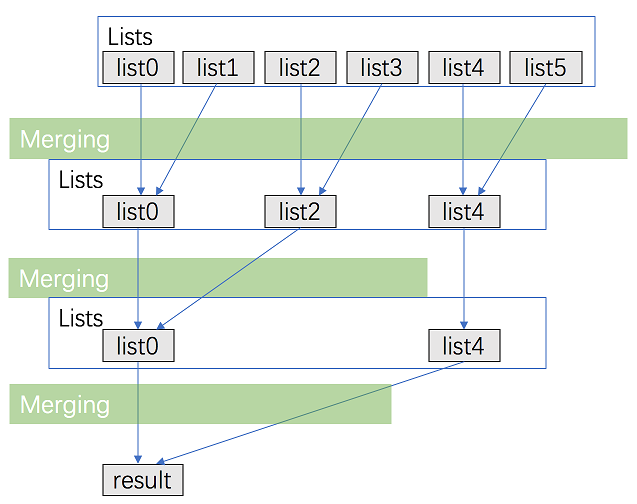

### [合并K个排序链表](https://leetcode.cn/problems/merge-k-sorted-lists/solutions/219756/he-bing-kge-pai-xu-lian-biao-by-leetcode-solutio-2/)

#### 前置知识：合并两个有序链表

**思路** 在解决「合并K个排序链表」这个问题之前，我们先来看一个更简单的问题：如何合并两个有序链表？假设链表 $a$ 和 $b$ 的长度都是 $n$，**如何在 $O(n)$ 的时间代价以及 $O(1)$ 的空间代价完成合并？** 这个问题在面试中常常出现，为了达到空间代价是 $O(1)$，我们的宗旨是「原地调整链表元素的 $next$ 指针完成合并」。**以下是合并的步骤和注意事项，对这个问题比较熟悉的读者可以跳过这一部分。此部分建议结合代码阅读。**

- 首先我们需要一个变量 $head$ 来保存合并之后链表的头部，你可以把 $head$ 设置为一个虚拟的头（也就是 $head$ 的 $val$ 属性不保存任何值），这是为了方便代码的书写，在整个链表合并完之后，返回它的下一位置即可。
- 我们需要一个指针 $tail$ 来记录下一个插入位置的前一个位置，以及两个指针 $aPtr$ 和 $bPtr$ 来记录 $a$ 和 $b$ 未合并部分的第一位。**注意这里的描述，$tail$ 不是下一个插入的位置，$aPtr$ 和 $bPtr$ 所指向的元素处于「待合并」的状态，也就是说它们还没有合并入最终的链表。** 当然你也可以给他们赋予其他的定义，但是定义不同实现就会不同。
- 当 $aPtr$ 和 $bPtr$ 都不为空的时候，取 $val$ 熟悉较小的合并；如果 $aPtr$ 为空，则把整个 $bPtr$ 以及后面的元素全部合并；$bPtr$ 为空时同理。
- 在合并的时候，应该先调整 $tail$ 的 $next$ 属性，再后移 $tail$ 和 $*Ptr$（$aPtr$ 或者 $bPtr$）。那么这里 $tail$ 和 $*Ptr$ 是否存在先后顺序呢？它们谁先动谁后动都是一样的，不会改变任何元素的 $next$ 指针。

**代码**

```cpp
ListNode* mergeTwoLists(ListNode *a, ListNode *b) {
    if ((!a) || (!b)) return a ? a : b;
    ListNode head, *tail = &head, *aPtr = a, *bPtr = b;
    while (aPtr && bPtr) {
        if (aPtr->val < bPtr->val) {
            tail->next = aPtr; aPtr = aPtr->next;
        } else {
            tail->next = bPtr; bPtr = bPtr->next;
        }
        tail = tail->next;
    }
    tail->next = (aPtr ? aPtr : bPtr);
    return head.next;
}
```

```java
public ListNode mergeTwoLists(ListNode a, ListNode b) {
    if (a == null || b == null) {
        return a != null ? a : b;
    }
    ListNode head = new ListNode(0);
    ListNode tail = head, aPtr = a, bPtr = b;
    while (aPtr != null && bPtr != null) {
        if (aPtr.val < bPtr.val) {
            tail.next = aPtr;
            aPtr = aPtr.next;
        } else {
            tail.next = bPtr;
            bPtr = bPtr.next;
        }
        tail = tail.next;
    }
    tail.next = (aPtr != null ? aPtr : bPtr);
    return head.next;
}
```

**复杂度分析**

- 时间复杂度：$O(n)$。
- 空间复杂度：$O(1)$。

#### 方法一：顺序合并

**思路**

我们可以想到一种最朴素的方法：用一个变量 $ans$ 来维护以及合并的链表，第 $i$ 次循环把第 $i$ 个链表和 $ans$ 合并，答案保存到 $ans$ 中。

**代码**

```cpp
class Solution {
public:
    ListNode* mergeTwoLists(ListNode *a, ListNode *b) {
        if ((!a) || (!b)) return a ? a : b;
        ListNode head, *tail = &head, *aPtr = a, *bPtr = b;
        while (aPtr && bPtr) {
            if (aPtr->val < bPtr->val) {
                tail->next = aPtr; aPtr = aPtr->next;
            } else {
                tail->next = bPtr; bPtr = bPtr->next;
            }
            tail = tail->next;
        }
        tail->next = (aPtr ? aPtr : bPtr);
        return head.next;
    }

    ListNode* mergeKLists(vector<ListNode*>& lists) {
        ListNode *ans = nullptr;
        for (size_t i = 0; i < lists.size(); ++i) {
            ans = mergeTwoLists(ans, lists[i]);
        }
        return ans;
    }
};
```

```java
class Solution {
    public ListNode mergeKLists(ListNode[] lists) {
        ListNode ans = null;
        for (int i = 0; i < lists.length; ++i) {
            ans = mergeTwoLists(ans, lists[i]);
        }
        return ans;
    }

    public ListNode mergeTwoLists(ListNode a, ListNode b) {
        if (a == null || b == null) {
            return a != null ? a : b;
        }
        ListNode head = new ListNode(0);
        ListNode tail = head, aPtr = a, bPtr = b;
        while (aPtr != null && bPtr != null) {
            if (aPtr.val < bPtr.val) {
                tail.next = aPtr;
                aPtr = aPtr.next;
            } else {
                tail.next = bPtr;
                bPtr = bPtr.next;
            }
            tail = tail.next;
        }
        tail.next = (aPtr != null ? aPtr : bPtr);
        return head.next;
    }
}
```

**复杂度分析**

- 时间复杂度：假设每个链表的最长长度是 $n$。在第一次合并后，$ans$ 的长度为 $n$；第二次合并后，$ans$ 的长度为 $2 \times n$，第 $i$ 次合并后，$ans$ 的长度为 $i \times n$。第 $i$ 次合并的时间代价是 $O(n + (i - 1)  \times n) = O(i  \times n)$，那么总的时间代价为 $O(\sum_{i = 1}^{k} (i \times n)) = O(\frac{(1 + k)\cdot k}{2} \times n) = O(k^2 n)$，故渐进时间复杂度为 $O(k^2 n)$。
- 空间复杂度：没有用到与 $k$ 和 $n$ 规模相关的辅助空间，故渐进空间复杂度为 $O(1)$。

#### 方法二：分治合并

**思路**

考虑优化方法一，用分治的方法进行合并。

- 将 $k$ 个链表配对并将同一对中的链表合并；
- 第一轮合并以后， $k$ 个链表被合并成了 $\frac{k}{2}$ 个链表，平均长度为 $\frac{2n}{k}$，然后是 $\frac{k}{4}$ 个链表， $\frac{k}{8}$ 个链表等等；
- 重复这一过程，直到我们得到了最终的有序链表。



**代码**

```cpp
class Solution {
public:
    ListNode* mergeTwoLists(ListNode *a, ListNode *b) {
        if ((!a) || (!b)) return a ? a : b;
        ListNode head, *tail = &head, *aPtr = a, *bPtr = b;
        while (aPtr && bPtr) {
            if (aPtr->val < bPtr->val) {
                tail->next = aPtr; aPtr = aPtr->next;
            } else {
                tail->next = bPtr; bPtr = bPtr->next;
            }
            tail = tail->next;
        }
        tail->next = (aPtr ? aPtr : bPtr);
        return head.next;
    }

    ListNode* merge(vector <ListNode*> &lists, int l, int r) {
        if (l == r) return lists[l];
        if (l > r) return nullptr;
        int mid = (l + r) >> 1;
        return mergeTwoLists(merge(lists, l, mid), merge(lists, mid + 1, r));
    }

    ListNode* mergeKLists(vector<ListNode*>& lists) {
        return merge(lists, 0, lists.size() - 1);
    }
};
```

```java
class Solution {
    public ListNode mergeKLists(ListNode[] lists) {
        return merge(lists, 0, lists.length - 1);
    }

    public ListNode merge(ListNode[] lists, int l, int r) {
        if (l == r) {
            return lists[l];
        }
        if (l > r) {
            return null;
        }
        int mid = (l + r) >> 1;
        return mergeTwoLists(merge(lists, l, mid), merge(lists, mid + 1, r));
    }

    public ListNode mergeTwoLists(ListNode a, ListNode b) {
        if (a == null || b == null) {
            return a != null ? a : b;
        }
        ListNode head = new ListNode(0);
        ListNode tail = head, aPtr = a, bPtr = b;
        while (aPtr != null && bPtr != null) {
            if (aPtr.val < bPtr.val) {
                tail.next = aPtr;
                aPtr = aPtr.next;
            } else {
                tail.next = bPtr;
                bPtr = bPtr.next;
            }
            tail = tail.next;
        }
        tail.next = (aPtr != null ? aPtr : bPtr);
        return head.next;
    }
}
```

**复杂度分析**

- 时间复杂度：考虑递归「向上回升」的过程——第一轮合并 $\frac{k}{2}$ 组链表，每一组的时间代价是 $O(2n)$；第二轮合并 $\frac{k}{4}$ 组链表，每一组的时间代价是 $O(4n)\dots$所以总的时间代价是 $O(\sum_{i = 1}^{\infty} \frac{k}{2^i} \times 2^i n) = O(kn \times \log k)$，故渐进时间复杂度为 $O(kn  \times \log k)$。
- 空间复杂度：递归会使用到 $O(\log k)$ 空间代价的栈空间。

#### 方法三：使用优先队列合并

**思路**

这个方法和前两种方法的思路有所不同，我们需要维护当前每个链表没有被合并的元素的最前面一个，$k$ 个链表就最多有 $k$ 个满足这样条件的元素，每次在这些元素里面选取 $val$ 属性最小的元素合并到答案中。在选取最小元素的时候，我们可以用优先队列来优化这个过程。

**代码**

```cpp
class Solution {
public:
    struct Status {
        int val;
        ListNode *ptr;
        bool operator < (const Status &rhs) const {
            return val > rhs.val;
        }
    };

    priority_queue <Status> q;

    ListNode* mergeKLists(vector<ListNode*>& lists) {
        for (auto node: lists) {
            if (node) q.push({node->val, node});
        }
        ListNode head, *tail = &head;
        while (!q.empty()) {
            auto f = q.top(); q.pop();
            tail->next = f.ptr; 
            tail = tail->next;
            if (f.ptr->next) q.push({f.ptr->next->val, f.ptr->next});
        }
        return head.next;
    }
};
```

```java
class Solution {
    class Status implements Comparable<Status> {
        int val;
        ListNode ptr;

        Status(int val, ListNode ptr) {
            this.val = val;
            this.ptr = ptr;
        }

        public int compareTo(Status status2) {
            return this.val - status2.val;
        }
    }

    PriorityQueue<Status> queue = new PriorityQueue<Status>();

    public ListNode mergeKLists(ListNode[] lists) {
        for (ListNode node: lists) {
            if (node != null) {
                queue.offer(new Status(node.val, node));
            }
        }
        ListNode head = new ListNode(0);
        ListNode tail = head;
        while (!queue.isEmpty()) {
            Status f = queue.poll();
            tail.next = f.ptr;
            tail = tail.next;
            if (f.ptr.next != null) {
                queue.offer(new Status(f.ptr.next.val, f.ptr.next));
            }
        }
        return head.next;
    }
}
```

**复杂度分析**

- 时间复杂度：考虑优先队列中的元素不超过 $k$ 个，那么插入和删除的时间代价为 $O(\log k)$，这里最多有 $kn$ 个点，对于每个点都被插入删除各一次，故总的时间代价即渐进时间复杂度为 $O(kn  \times \log k)$。
- 空间复杂度：这里用了优先队列，优先队列中的元素不超过 $k$ 个，故渐进空间复杂度为 $O(k)$。
