### [字符串相乘](https://leetcode.cn/problems/multiply-strings/solutions/372098/zi-fu-chuan-xiang-cheng-by-leetcode-solution/)

#### 方法一：做加法

如果 $num_1$ 和 $num_2$ 之一是 $0$，则直接将 $0$ 作为结果返回即可。

如果 $num_1$ 和 $num_2$ 都不是 $0$，则可以通过模拟「竖式乘法」的方法计算乘积。从右往左遍历乘数，将乘数的每一位与被乘数相乘得到对应的结果，再将每次得到的结果累加。这道题中，被乘数是 $num_1$，乘数是 $num_2$。

需要注意的是，$num_2$ 除了最低位以外，其余的每一位的运算结果都需要补 $0$。

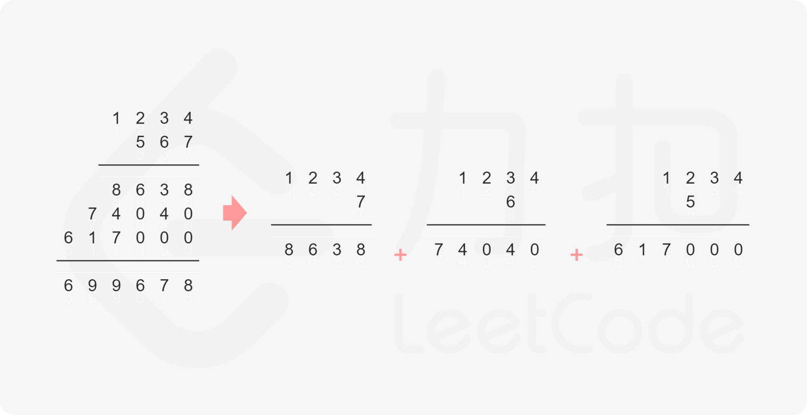

对每次得到的结果进行累加，可以使用「[415\. 字符串相加](https://leetcode-cn.com/problems/add-strings/)」的做法。

```Java
class Solution {
    public String multiply(String num_1, String num_2) {
        if (num_1.equals("0") || num_2.equals("0")) {
            return "0";
        }
        String ans = "0";
        int m = num_1.length(), n = num_2.length();
        for (int i = n - 1; i >= 0; i--) {
            StringBuffer curr = new StringBuffer();
            int add = 0;
            for (int j = n - 1; j > i; j--) {
                curr.append(0);
            }
            int y = num_2.charAt(i) - '0';
            for (int j = m - 1; j >= 0; j--) {
                int x = num_1.charAt(j) - '0';
                int product = x * y + add;
                curr.append(product % 10);
                add = product / 10;
            }
            if (add != 0) {
                curr.append(add % 10);
            }
            ans = addStrings(ans, curr.reverse().toString());
        }
        return ans;
    }

    public String addStrings(String num_1, String num_2) {
        int i = num_1.length() - 1, j = num_2.length() - 1, add = 0;
        StringBuffer ans = new StringBuffer();
        while (i >= 0 || j >= 0 || add != 0) {
            int x = i >= 0 ? num_1.charAt(i) - '0' : 0;
            int y = j >= 0 ? num_2.charAt(j) - '0' : 0;
            int result = x + y + add;
            ans.append(result % 10);
            add = result / 10;
            i--;
            j--;
        }
        ans.reverse();
        return ans.toString();
    }
}
```

```C++
class Solution {
public:
    string multiply(string num_1, string num_2) {
        if (num_1 == "0" || num_2 == "0") {
            return "0";
        }
        string ans = "0";
        int m = num_1.size(), n = num_2.size();
        for (int i = n - 1; i >= 0; i--) {
            string curr;
            int add = 0;
            for (int j = n - 1; j > i; j--) {
                curr.push_back(0);
            }
            int y = num_2.at(i) - '0';
            for (int j = m - 1; j >= 0; j--) {
                int x = num_1.at(j) - '0';
                int product = x * y + add;
                curr.push_back(product % 10);
                add = product / 10;
            }
            while (add != 0) {
                curr.push_back(add % 10);
                add /= 10;
            }
            reverse(curr.begin(), curr.end());
            for (auto &c : curr) {
                c += '0';
            }
            ans = addStrings(ans, curr);
        }
        return ans;
    }

    string addStrings(string &num_1, string &num_2) {
        int i = num_1.size() - 1, j = num_2.size() - 1, add = 0;
        string ans;
        while (i >= 0 || j >= 0 || add != 0) {
            int x = i >= 0 ? num_1.at(i) - '0' : 0;
            int y = j >= 0 ? num_2.at(j) - '0' : 0;
            int result = x + y + add;
            ans.push_back(result % 10);
            add = result / 10;
            i--;
            j--;
        }
        reverse(ans.begin(), ans.end());
        for (auto &c: ans) {
            c += '0';
        }
        return ans;
    }
};
```

```Python
class Solution:
    def multiply(self, num_1: str, num_2: str) -> str:
        if num_1 == "0" or num_2 == "0":
            return "0"
        
        ans = "0"
        m, n = len(num_1), len(num_2)
        for i in range(n - 1, -1, -1):
            add = 0
            y = int(num_2[i])
            curr = ["0"] * (n - i - 1)
            for j in range(m - 1, -1, -1):
                product = int(num_1[j]) * y + add
                curr.append(str(product % 10))
                add = product // 10
            if add > 0:
                curr.append(str(add))
            curr = "".join(curr[::-1])
            ans = self.addStrings(ans, curr)
        
        return ans
    
    def addStrings(self, num_1: str, num_2: str) -> str:
        i, j = len(num_1) - 1, len(num_2) - 1
        add = 0
        ans = list()
        while i >= 0 or j >= 0 or add != 0:
            x = int(num_1[i]) if i >= 0 else 0
            y = int(num_2[j]) if j >= 0 else 0
            result = x + y + add
            ans.append(str(result % 10))
            add = result // 10
            i -= 1
            j -= 1
        return "".join(ans[::-1])
```

```Go
func multiply(num_1 string, num_2 string) string {
    if num_1 == "0" || num_2 == "0" {
        return "0"
    }
    ans := "0"
    m, n := len(num_1), len(num_2)
    for i := n - 1; i >= 0; i-- {
        curr := ""
        add := 0
        for j := n - 1; j > i; j-- {
            curr += "0"
        }
        y := int(num_2[i] - '0')
        for j := m - 1; j >= 0; j-- {
            x := int(num_1[j] - '0')
            product := x * y + add
            curr = strconv.Itoa(product % 10) + curr
            add = product / 10
        }
        for ; add != 0; add /= 10 {
            curr = strconv.Itoa(add % 10) + curr
        }
        ans = addStrings(ans, curr)
    }
    return ans
}

func addStrings(num_1, num_2 string) string {
    i, j := len(num_1) - 1, len(num_2) - 1
    add := 0
    ans := ""
    for ; i >= 0 || j >= 0 || add != 0; i, j = i - 1, j - 1 {
        x, y := 0, 0
        if i >= 0 {
            x = int(num_1[i] - '0')
        }
        if j >= 0 {
            y = int(num_2[j] - '0')
        }
        result := x + y + add
        ans = strconv.Itoa(result % 10) + ans
        add = result / 10
    }
    return ans
}
```

```C
char* addStrings(char* num_1, char* num_2) {
    int i = strlen(num_1) - 1, j = strlen(num_2) - 1, add = 0;
    char* ans = malloc(sizeof(char) * (i + j + 5));
    int ansLen = 0;
    while (i >= 0 || j >= 0 || add != 0) {
        int x = i >= 0 ? num_1[i] - '0' : 0;
        int y = j >= 0 ? num_2[j] - '0' : 0;
        int result = x + y + add;
        ans[ansLen++] = result % 10;
        add = result / 10;
        i--;
        j--;
    }
    for (int i = 0; i < ansLen / 2; i++) {
        char t = ans[i];
        ans[i] = ans[ansLen - 1 - i];
        ans[ansLen - 1 - i] = t;
    }
    for (int i = 0; i < ansLen; i++) {
        ans[i] += '0';
    }
    ans[ansLen++] = 0;
    return ans;
}

char* multiply(char* num_1, char* num_2) {
    int m = strlen(num_1), n = strlen(num_2);
    char* ans = malloc(sizeof(char) * 2);
    ans[0] = '0', ans[1] = 0;
    if ((m == 1 && num_1[0] == '0') || (n == 1 && num_2[0] == '0')) {
        return ans;
    }
    for (int i = n - 1; i >= 0; i--) {
        char* curr = malloc(sizeof(char) * (n + m + 5));
        int currLen = 0;
        int add = 0;
        for (int j = n - 1; j > i; j--) {
            curr[currLen++] = 0;
        }
        int y = num_2[i] - '0';
        for (int j = m - 1; j >= 0; j--) {
            int x = num_1[j] - '0';
            int product = x * y + add;
            curr[currLen++] = product % 10;
            add = product / 10;
        }
        while (add != 0) {
            curr[currLen++] = add % 10;
            add /= 10;
        }
        for (int i = 0; i < currLen / 2; i++) {
            char t = curr[i];
            curr[i] = curr[currLen - 1 - i];
            curr[currLen - 1 - i] = t;
        }
        for (int i = 0; i < currLen; i++) {
            curr[i] += '0';
        }
        curr[currLen++] = 0;
        char* tmp = addStrings(ans, curr);
        free(ans), free(curr);
        ans = tmp;
    }
    return ans;
}
```

**复杂度分析**

- 时间复杂度：$O(mn+n^2)$，其中 $m$ 和 $n$ 分别是 $num_1$ 和 $num_2$ 的长度。需要从右往左遍历 $num_2$，对于 $num_2$ 的每一位，都需要和 $num_1$ 的每一位计算乘积，因此计算乘积的总次数是 $mn$。字符串相加操作共有 $n$ 次，相加的字符串长度最长为 $m+n$，因此字符串相加的时间复杂度是 $O(mn+n^2)$。总时间复杂度是 $O(mn+n$2)$。
- 空间复杂度：$O(m+n)$，其中 $m$ 和 $n$ 分别是 $num_1$ 和 $num_2$ 的长度。空间复杂度取决于存储中间状态的字符串，由于乘积的最大长度为 $m+n$，因此存储中间状态的字符串的长度不会超过 $m+n$。

#### 方法二：做乘法

方法一的做法是从右往左遍历乘数，将乘数的每一位与被乘数相乘得到对应的结果，再将每次得到的结果累加，整个过程中涉及到较多字符串相加的操作。如果使用数组代替字符串存储结果，则可以减少对字符串的操作。

令 $m$ 和 $n$ 分别表示 $num_1$ 和 $num_2$ 的长度，并且它们均不为 $0$，则 $num_1$ 和 $num_2$ 的乘积的长度为 $m+n-1$ 或 $m+n$。简单证明如下：

- 如果 $num_1$ 和 $num_2$ 都取最小值，则 $num_1=10^{m-1}$，$num_2=10^{n-1}$，$num_1 \times num_2=10^{m+n-2}$，乘积的长度为 $m+n-1$；
- 如果 $num_1$ 和 $num_2$ 都取最大值，则 $num_1=10^{m-1}$，$num_2=10^{n-1}$，$num_1 \times num_2=10^{m+n}-10^m-10^n+1$，乘积显然小于 $10^{m+n}$ 且大于 $10^{m+n-1}$，因此乘积的长度为 $m+n$。

由于 $num_1$ 和 $num_2$ 的乘积的最大长度为 $m+n$，因此创建长度为 $m+n$ 的数组 $ansArr$ 用于存储乘积。对于任意 $0 \le i < m$ 和 $0 \le j < n$，$num_1[i] \times num_2[j]$ 的结果位于 $ansArr[i+j+1]$，如果 $ansArr[i+j+1] \ge 10$，则将进位部分加到 $ansArr[i+j]$。

最后，将数组 $ansArr$ 转成字符串，如果最高位是 $0$ 则舍弃最高位。


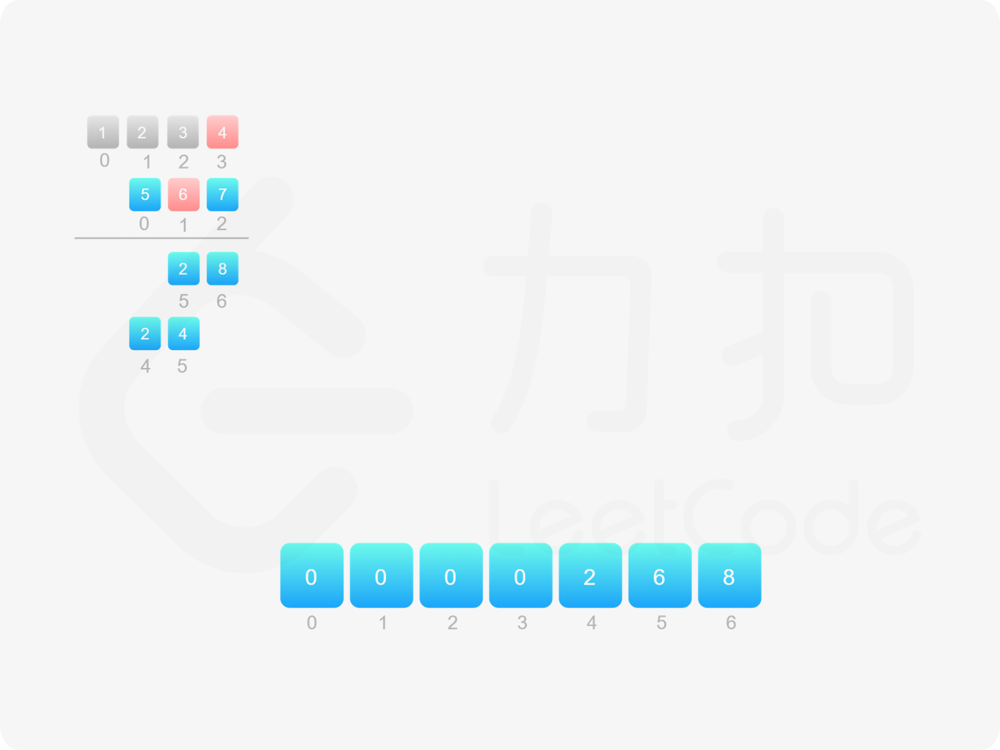
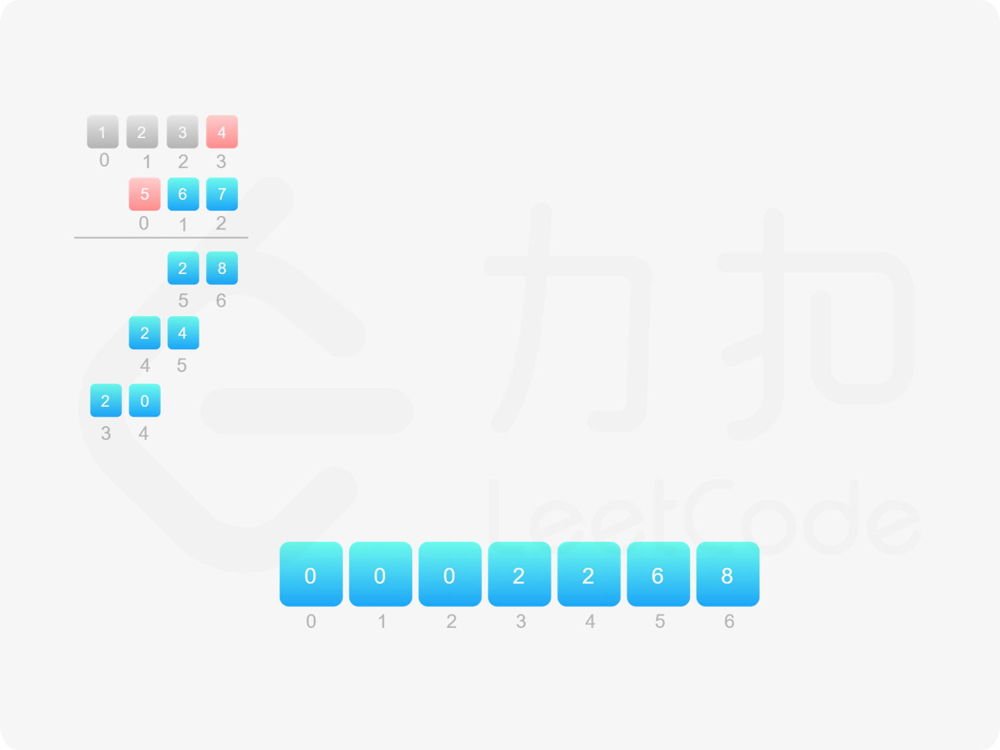
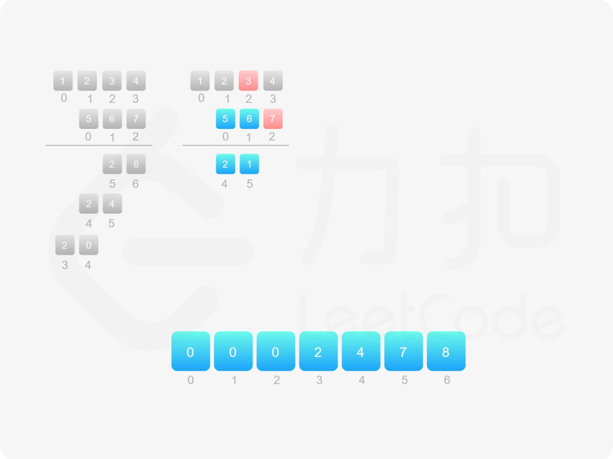
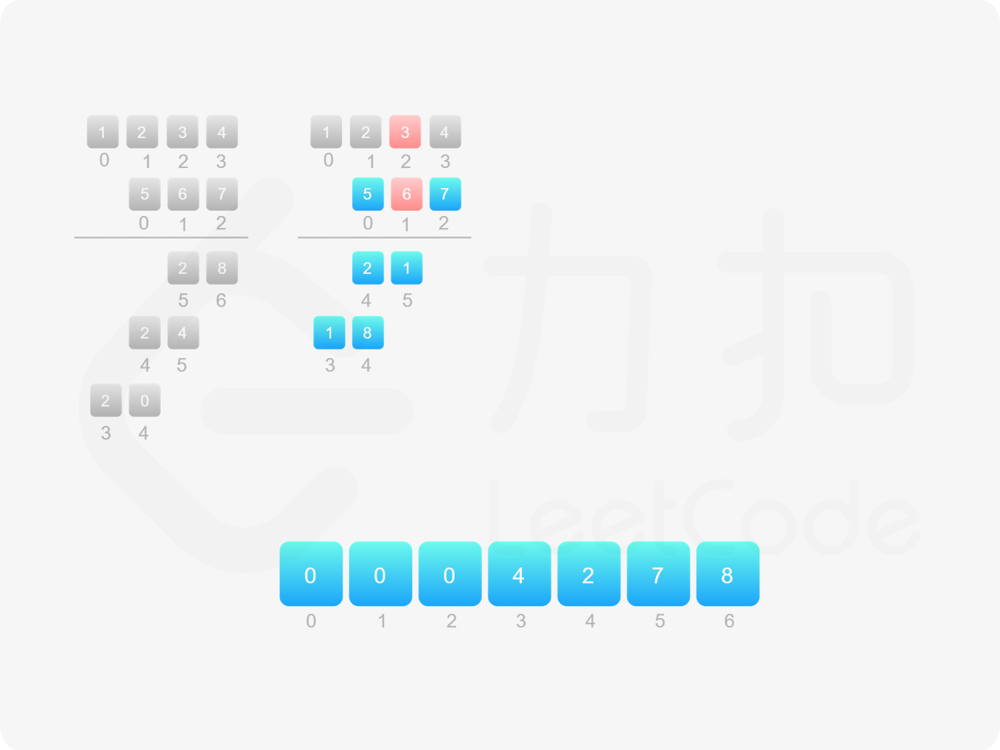
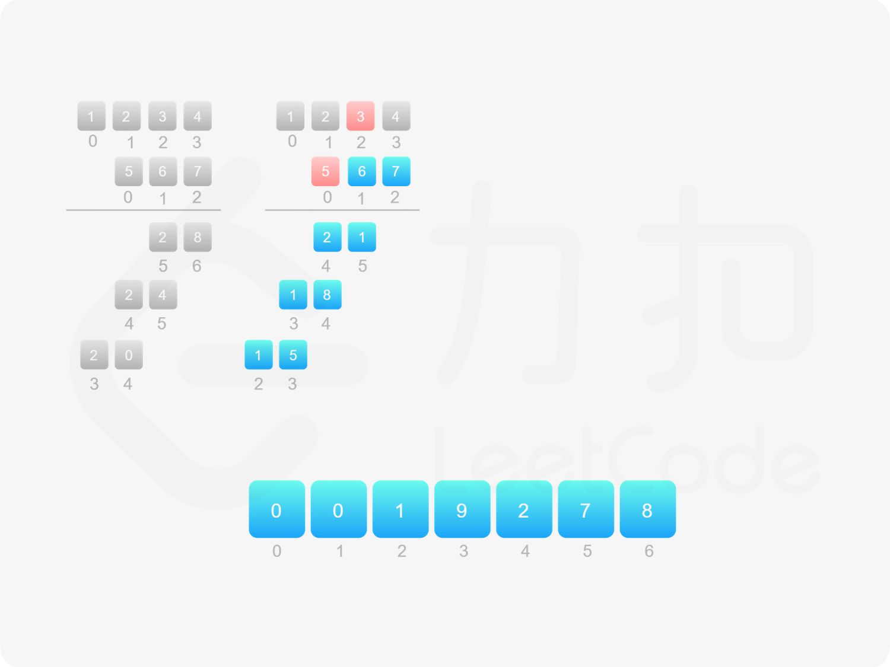
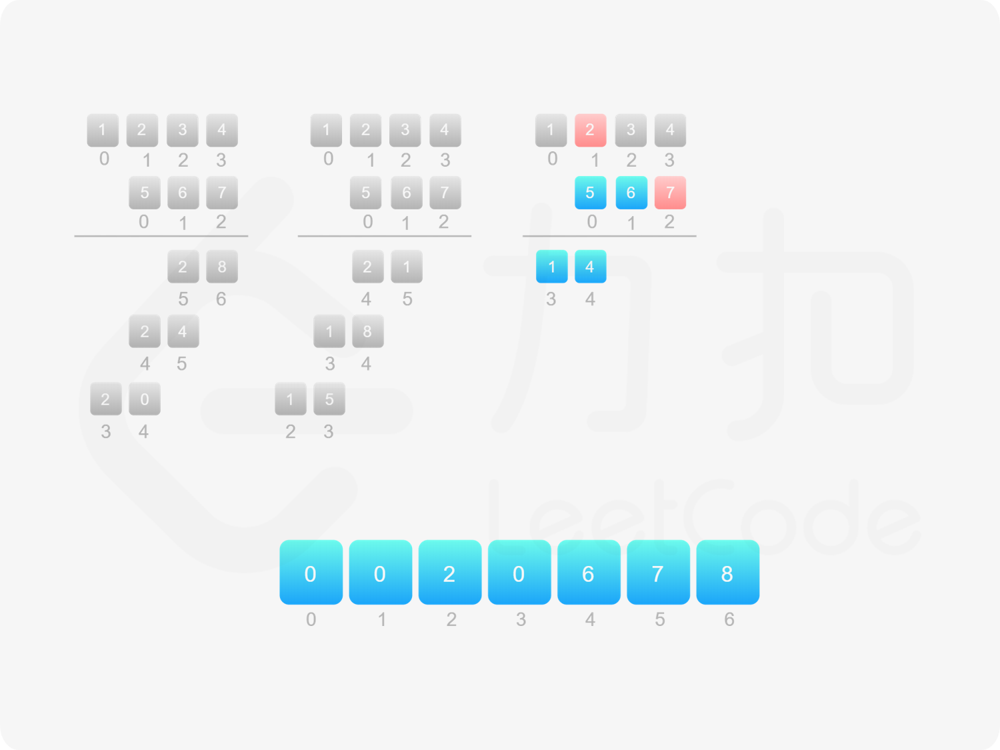
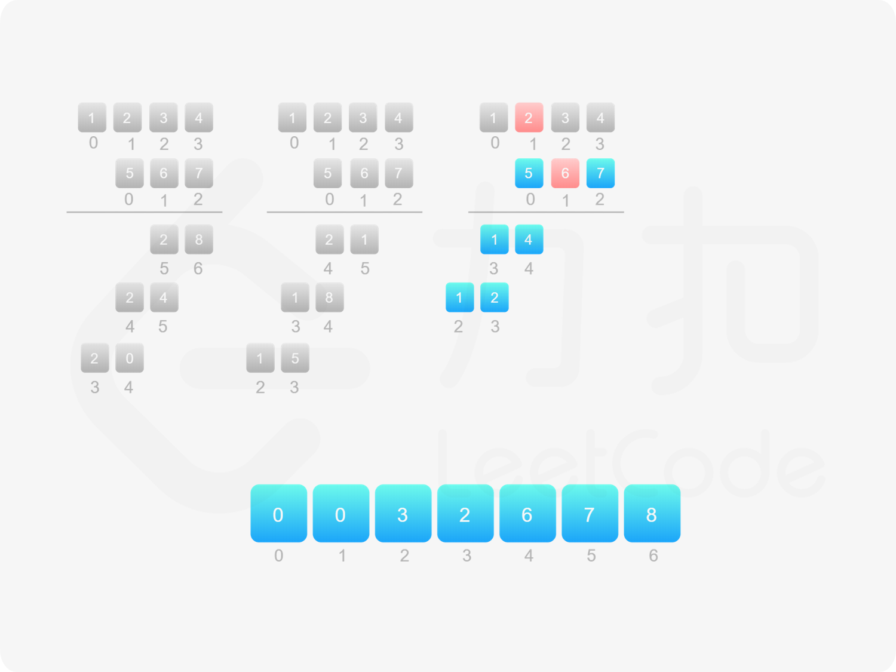

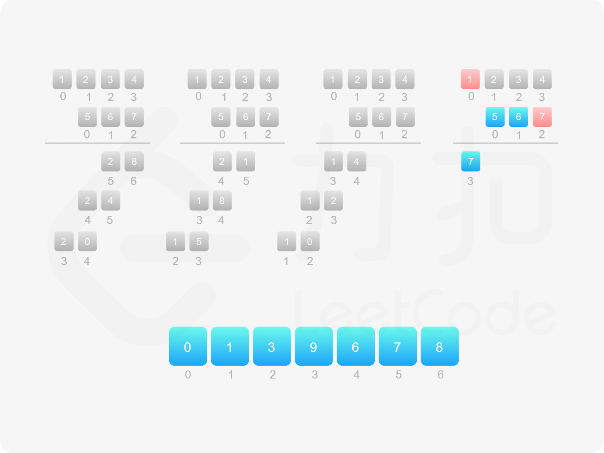
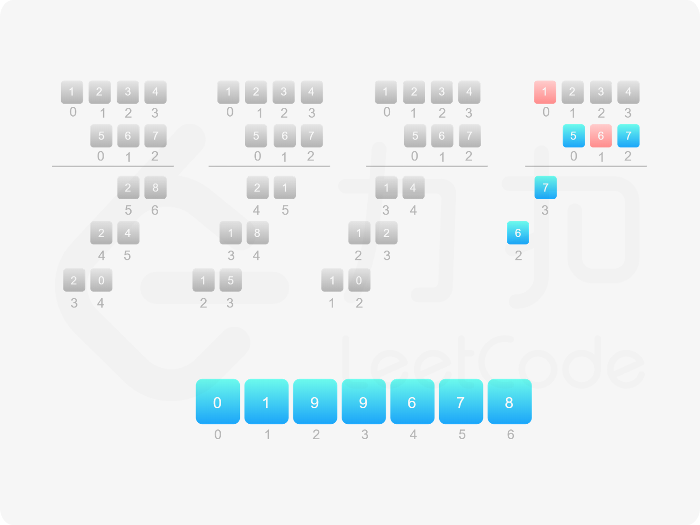
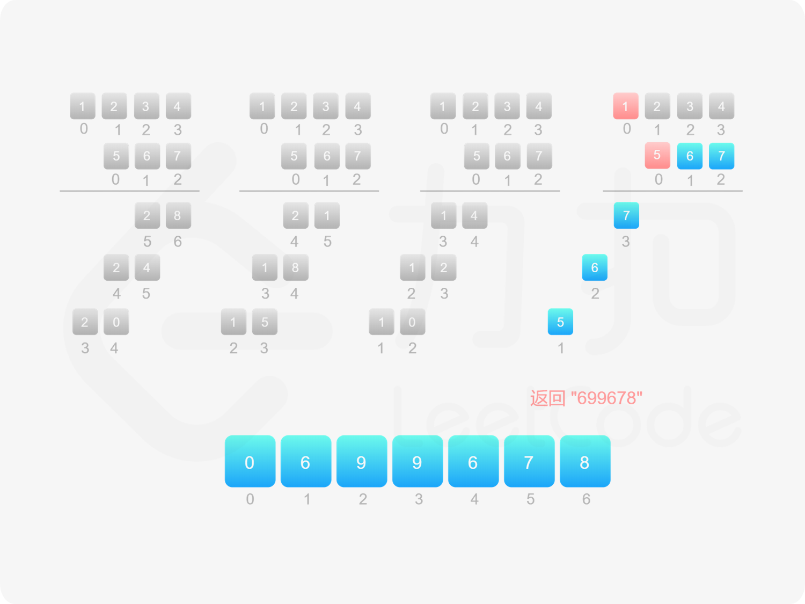

```Java
class Solution {
    public String multiply(String num_1, String num_2) {
        if (num_1.equals("0") || num_2.equals("0")) {
            return "0";
        }
        int m = num_1.length(), n = num_2.length();
        int[] ansArr = new int[m + n];
        for (int i = m - 1; i >= 0; i--) {
            int x = num_1.charAt(i) - '0';
            for (int j = n - 1; j >= 0; j--) {
                int y = num_2.charAt(j) - '0';
                ansArr[i + j + 1] += x * y;
            }
        }
        for (int i = m + n - 1; i > 0; i--) {
            ansArr[i - 1] += ansArr[i] / 10;
            ansArr[i] %= 10;
        }
        int index = ansArr[0] == 0 ? 1 : 0;
        StringBuffer ans = new StringBuffer();
        while (index < m + n) {
            ans.append(ansArr[index]);
            index++;
        }
        return ans.toString();
    }
}
```

```C++
class Solution {
public:
    string multiply(string num_1, string num_2) {
        if (num_1 == "0" || num_2 == "0") {
            return "0";
        }
        int m = num_1.size(), n = num_2.size();
        auto ansArr = vector<int>(m + n);
        for (int i = m - 1; i >= 0; i--) {
            int x = num_1.at(i) - '0';
            for (int j = n - 1; j >= 0; j--) {
                int y = num_2.at(j) - '0';
                ansArr[i + j + 1] += x * y;
            }
        }
        for (int i = m + n - 1; i > 0; i--) {
            ansArr[i - 1] += ansArr[i] / 10;
            ansArr[i] %= 10;
        }
        int index = ansArr[0] == 0 ? 1 : 0;
        string ans;
        while (index < m + n) {
            ans.push_back(ansArr[index]);
            index++;
        }
        for (auto &c: ans) {
            c += '0';
        }
        return ans;
    }
};
```

```Python
class Solution:
    def multiply(self, num_1: str, num_2: str) -> str:
        if num_1 == "0" or num_2 == "0":
            return "0"
        
        m, n = len(num_1), len(num_2)
        ansArr = [0] * (m + n)
        for i in range(m - 1, -1, -1):
            x = int(num_1[i])
            for j in range(n - 1, -1, -1):
                ansArr[i + j + 1] += x * int(num_2[j])
        
        for i in range(m + n - 1, 0, -1):
            ansArr[i - 1] += ansArr[i] // 10
            ansArr[i] %= 10
        
        index = 1 if ansArr[0] == 0 else 0
        ans = "".join(str(x) for x in ansArr[index:])
        return ans
```

```Go
func multiply(num_1 string, num_2 string) string {
    if num_1 == "0" || num_2 == "0" {
        return "0"
    }
    m, n := len(num_1), len(num_2)
    ansArr := make([]int, m + n)
    for i := m - 1; i >= 0; i-- {
        x := int(num_1[i]) - '0'
        for j := n - 1; j >= 0; j-- {
            y := int(num_2[j] - '0')
            ansArr[i + j + 1] += x * y
        }
    }
    for i := m + n - 1; i > 0; i-- {
        ansArr[i - 1] += ansArr[i] / 10
        ansArr[i] %= 10
    }
    ans := ""
    idx := 0
    if ansArr[0] == 0 {
        idx = 1
    }
    for ; idx < m + n; idx++ {
        ans += strconv.Itoa(ansArr[idx])
    }
    return ans
}
```

```C
char* multiply(char* num_1, char* num_2) {
    int m = strlen(num_1), n = strlen(num_2);
    char* ans = malloc(sizeof(char) * (m + n + 3));
    memset(ans, 0, sizeof(char) * (m + n + 3));
    if ((m == 1 && num_1[0] == '0') || (n == 1 && num_2[0] == '0')) {
        ans[0] = '0', ans[1] = 0;
        return ans;
    }
    int* ansArr = malloc(sizeof(int) * (m + n + 3));
    memset(ansArr, 0, sizeof(int) * (m + n + 3));
    for (int i = m - 1; i >= 0; i--) {
        int x = num_1[i] - '0';
        for (int j = n - 1; j >= 0; j--) {
            int y = num_2[j] - '0';
            ansArr[i + j + 1] += x * y;
        }
    }
    for (int i = m + n - 1; i > 0; i--) {
        ansArr[i - 1] += ansArr[i] / 10;
        ansArr[i] %= 10;
    }
    int index = ansArr[0] == 0 ? 1 : 0;
    int ansLen = 0;
    while (index < m + n) {
        ans[ansLen++] = ansArr[index];
        index++;
    }
    for (int i = 0; i < ansLen; i++) ans[i] += '0';
    return ans;
}
```

**复杂度分析**

- 时间复杂度：$O(mn)$，其中 $m$ 和 $n$ 分别是 $num_1$ 和 $num_2$ 的长度。需要计算 $num_1$ 的每一位和 $num_2$ 的每一位的乘积。
- 空间复杂度：$O(m+n)$，其中 $m$ 和 $n$ 分别是 $num_1$ 和 $num_2$ 的长度。需要创建一个长度为 $m+n$ 的数组存储乘积。

#### 结语

方法二还可以用另外一种方法改写。我们把两个数相乘看成是两个多项式相乘，因为任何一个数都可以表示成为

$$\sum\limits_{i=0}^{n-1}a_i \times 10^i$$

的形式，也就相当于对多项式

$$A(x) = \sum\limits_{i=0}^{n-1}a_ix^i$$

在 $x=10$ 处求值。当两个数 $N_a$、$N_b$ 相乘的时候，我们也可以认为这两个数是两个多项式

$$\left\{\begin{array}{l}A(x) = \sum\limits_{i=0}^{n-1}a_ix^i \\ B(x) = \sum\limits_{i=0}^{m-1}b_ix^i \end{array}\right.$$

相乘的结果 $C(x)=A(x) \times B(x)$ 在 $x=10$ 处求值。我们可以这样表示 $C(x)$：

$$C(x) = \sum\limits_{i=0}^{n+m-2}c_ix^i$$

这里

$$c_i = \sum\limits_{k=0}^{i}a_kb_{i-k}$$

于是我们就可以顺序求解 $c_i$，每次 $O(i)$ 地选取下标和为 $i$ 的一组 $(a_k,b_{i-k})$。求到 $c_i$ 序列之后，再处理进位即可得到答案。对比这两种做法：

- 顺序求解 $c_i$ 的过程相当于集中计算 $c_i$
- 而方法二相当于每对 $(a_i,b_j)$ 对 $c_{i+j}$ 算贡献（注意这里的 $a_i$ 并不是题目中的 $num_1[i]$，$a_i$ 下标越小，代表的位权越小，而 $num_1[i]$ 下标越小，代表的位权越大）

它们的本质是一样的，并且时间复杂度都是 $O(max\{n,m\}^2)$。我们再仔细的观察 $c_i$ 的形式：

$$c_i = \sum\limits_{k=0}^{i}a_ib_{i-k}$$

它揭示了多项式乘法的另一面：$c_i$ 序列其实是 $a_i$ 序列和 $b_i$ 序列的卷积，即：

$$c = a \times b$$

至此，我们就可以用一种叫做快速傅立叶变换（Fast Fourier Transform，FFT）的方法来加速卷积的计算，使得时间复杂度降低到 $O(clogc)$，这里 $c$ 是不小于 $n+m$ 的最小的 $2$ 的整数幂。由于这个方法并不在面试的考纲范围内，感兴趣的同学可以自行学习。
