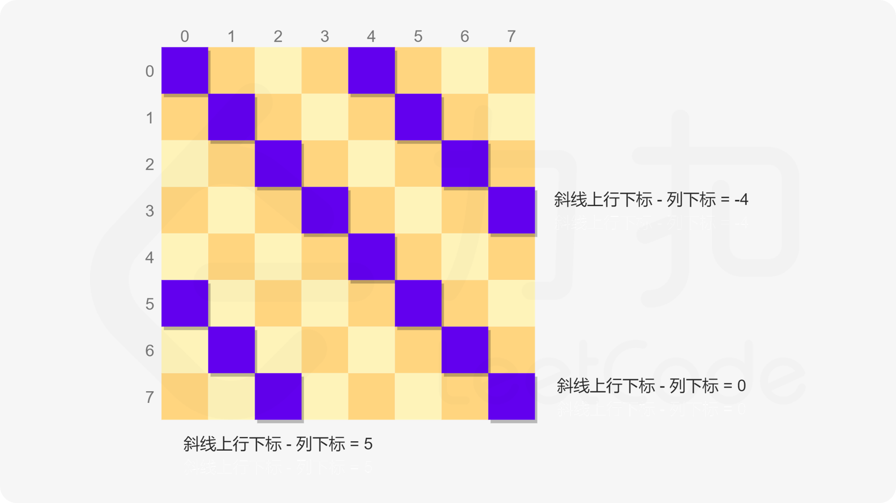
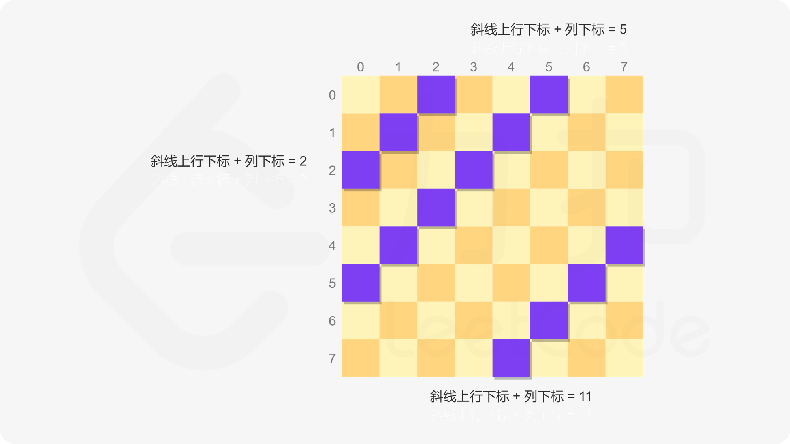
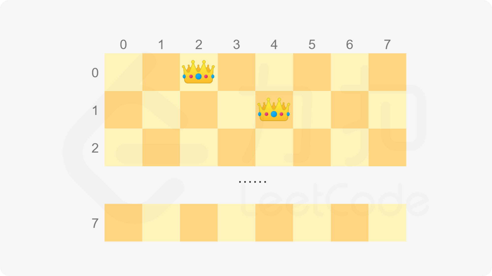
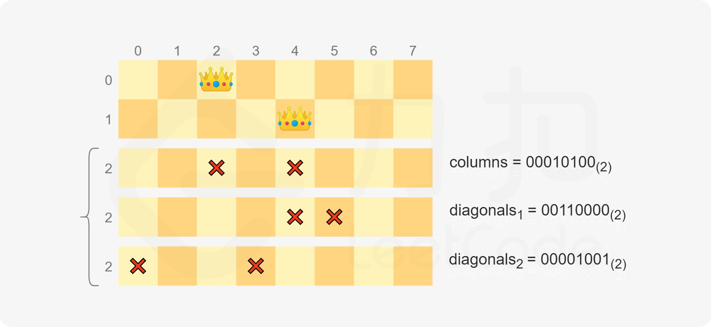
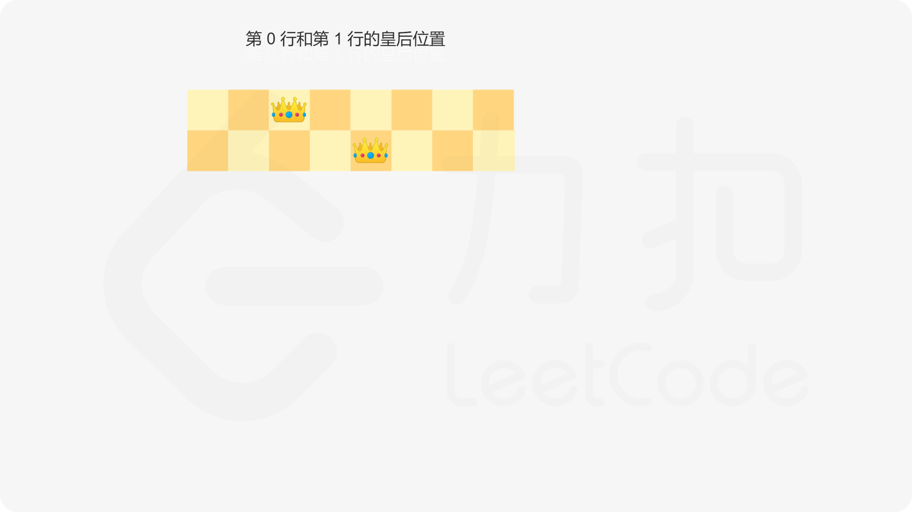
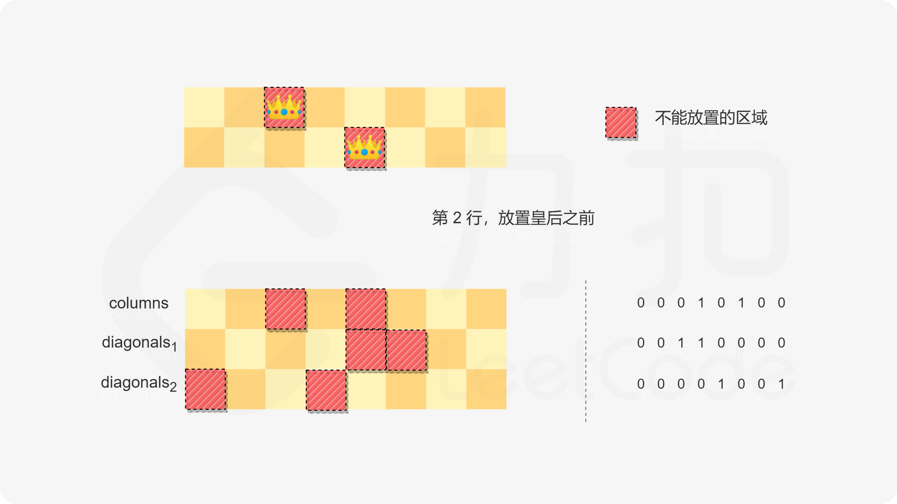
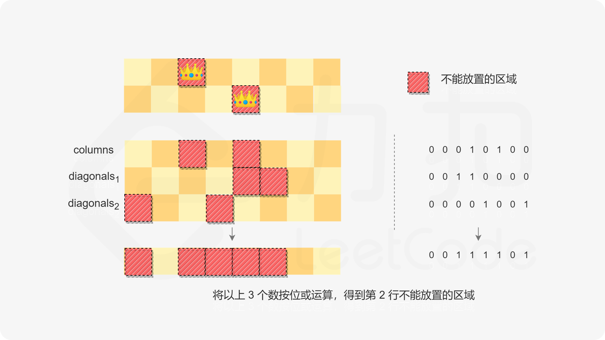
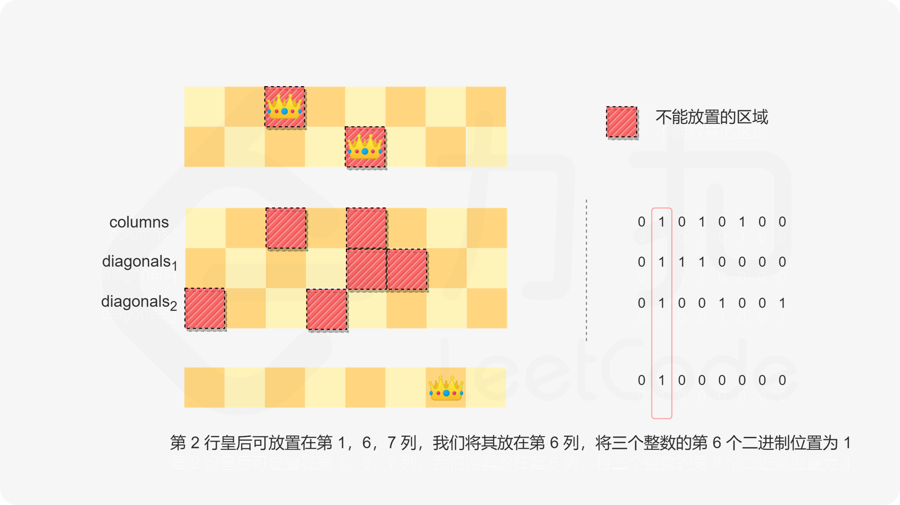
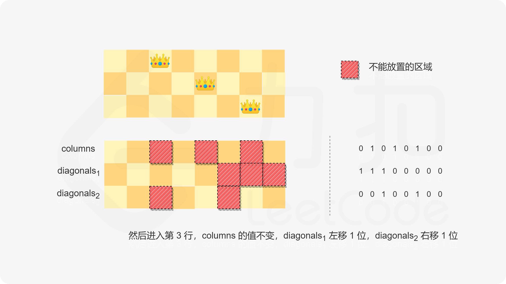

### [N皇后 II](https://leetcode.cn/problems/n-queens-ii/solutions/449388/nhuang-hou-ii-by-leetcode-solution/)

#### 前言

这道题和「[51\. $N$ 皇后](https://leetcode-cn.com/problems/n-queens/)」非常相似，区别在于，第 51 题需要得到所有可能的解，这道题只需要得到可能的解的数量。因此这道题可以使用第 51 题的做法，只需要将得到所有可能的解改成得到可能的解的数量即可。

皇后的走法是：可以横直斜走，格数不限。因此要求皇后彼此之间不能相互攻击，等价于要求任何两个皇后都不能在同一行、同一列以及同一条斜线上。

直观的做法是暴力枚举将 $N$ 个皇后放置在 $N \times N$ 的棋盘上的所有可能的情况，并对每一种情况判断是否满足皇后彼此之间不相互攻击。暴力枚举的时间复杂度是非常高的，因此必须利用限制条件加以优化。

显然，每个皇后必须位于不同行和不同列，因此将 $N$ 个皇后放置在 $N \times N$ 的棋盘上，一定是每一行有且仅有一个皇后，每一列有且仅有一个皇后，且任何两个皇后都不能在同一条斜线上。基于上述发现，可以通过回溯的方式得到可能的解的数量。

回溯的具体做法是：依次在每一行放置一个皇后，每次新放置的皇后都不能和已经放置的皇后之间有攻击，即新放置的皇后不能和任何一个已经放置的皇后在同一列以及同一条斜线上。当 $N$ 个皇后都放置完毕，则找到一个可能的解，将可能的解的数量加 $1$。

由于每个皇后必须位于不同列，因此已经放置的皇后所在的列不能放置别的皇后。第一个皇后有 $N$ 列可以选择，第二个皇后最多有 $N-1$ 列可以选择，第三个皇后最多有 $N-2$ 列可以选择（如果考虑到不能在同一条斜线上，可能的选择数量更少），因此所有可能的情况不会超过 $N!$ 种，遍历这些情况的时间复杂度是 $O(N!)$。

为了降低总时间复杂度，每次放置皇后时需要快速判断每个位置是否可以放置皇后，显然，最理想的情况是在 $O(1)$ 的时间内判断该位置所在的列和两条斜线上是否已经有皇后。

以下两种方法分别使用集合和位运算对皇后的放置位置进行判断，都可以在 $O(1)$ 的时间内判断一个位置是否可以放置皇后，算法的总时间复杂度都是 $O(N!)$。

#### 方法一：基于集合的回溯

为了判断一个位置所在的列和两条斜线上是否已经有皇后，使用三个集合 $columns$、$diagonals_1$ 和 $diagonals_2$ 分别记录每一列以及两个方向的每条斜线上是否有皇后。

列的表示法很直观，一共有 $N$ 列，每一列的下标范围从 $0$ 到 $N-1$，使用列的下标即可明确表示每一列。

如何表示两个方向的斜线呢？对于每个方向的斜线，需要找到斜线上的每个位置的行下标与列下标之间的关系。

方向一的斜线为从左上到右下方向，同一条斜线上的每个位置满足**行下标与列下标之差相等**，例如 $(0,0)$ 和 $(3,3)$ 在同一条方向一的斜线上。因此使用行下标与列下标之差即可明确表示每一条方向一的斜线。



方向二的斜线为从右上到左下方向，同一条斜线上的每个位置满足**行下标与列下标之和相等**，例如 $(3,0)$ 和 $(1,2)$ 在同一条方向二的斜线上。因此使用行下标与列下标之和即可明确表示每一条方向二的斜线。



每次放置皇后时，对于每个位置判断其是否在三个集合中，如果三个集合都不包含当前位置，则当前位置是可以放置皇后的位置。

```Java
class Solution {
    public int totalNQueens(int n) {
        Set<Integer> columns = new HashSet<Integer>();
        Set<Integer> diagonals1 = new HashSet<Integer>();
        Set<Integer> diagonals2 = new HashSet<Integer>();
        return backtrack(n, 0, columns, diagonals1, diagonals2);
    }

    public int backtrack(int n, int row, Set<Integer> columns, Set<Integer> diagonals1, Set<Integer> diagonals2) {
        if (row == n) {
            return 1;
        } else {
            int count = 0;
            for (int i = 0; i < n; i++) {
                if (columns.contains(i)) {
                    continue;
                }
                int diagonal1 = row - i;
                if (diagonals1.contains(diagonal1)) {
                    continue;
                }
                int diagonal2 = row + i;
                if (diagonals2.contains(diagonal2)) {
                    continue;
                }
                columns.add(i);
                diagonals1.add(diagonal1);
                diagonals2.add(diagonal2);
                count += backtrack(n, row + 1, columns, diagonals1, diagonals2);
                columns.remove(i);
                diagonals1.remove(diagonal1);
                diagonals2.remove(diagonal2);
            }
            return count;
        }
    }
}
```

```CSharp
public class Solution {
    public int TotalNQueens(int n) {
        HashSet<int> columns = new HashSet<int>();
        HashSet<int> diagonals1 = new HashSet<int>();
        HashSet<int> diagonals2 = new HashSet<int>();
        return Backtrack(n, 0, columns, diagonals1, diagonals2);
    }

    private int Backtrack(int n, int row, HashSet<int> columns, HashSet<int> diagonals1, HashSet<int> diagonals2) {
        if (row == n) {
            return 1;
        } else {
            int count = 0;
            for (int i = 0; i < n; i++) {
                if (columns.Contains(i)) {
                    continue;
                }
                int diagonal1 = row - i;
                if (diagonals1.Contains(diagonal1)) {
                    continue;
                }
                int diagonal2 = row + i;
                if (diagonals2.Contains(diagonal2)) {
                    continue;
                }
                columns.Add(i);
                diagonals1.Add(diagonal1);
                diagonals2.Add(diagonal2);
                count += Backtrack(n, row + 1, columns, diagonals1, diagonals2);
                columns.Remove(i);
                diagonals1.Remove(diagonal1);
                diagonals2.Remove(diagonal2);
            }
            return count;
        }
    }
}
```

```C++
class Solution {
public:
    int totalNQueens(int n) {
        unordered_set<int> columns, diagonals1, diagonals2;
        return backtrack(n, 0, columns, diagonals1, diagonals2);
    }

    int backtrack(int n, int row, unordered_set<int>& columns, unordered_set<int>& diagonals1, unordered_set<int>& diagonals2) {
        if (row == n) {
            return 1;
        } else {
            int count = 0;
            for (int i = 0; i < n; i++) {
                if (columns.find(i) != columns.end()) {
                    continue;
                }
                int diagonal1 = row - i;
                if (diagonals1.find(diagonal1) != diagonals1.end()) {
                    continue;
                }
                int diagonal2 = row + i;
                if (diagonals2.find(diagonal2) != diagonals2.end()) {
                    continue;
                }
                columns.insert(i);
                diagonals1.insert(diagonal1);
                diagonals2.insert(diagonal2);
                count += backtrack(n, row + 1, columns, diagonals1, diagonals2);
                columns.erase(i);
                diagonals1.erase(diagonal1);
                diagonals2.erase(diagonal2);
            }
            return count;
        }
    }
};
```

```JavaScript
const backtrack = (n, row, columns, diagonals1, diagonals2) => {
    if (row === n) {
        return 1;
    } else {
        let count = 0;
        for (let i = 0; i < n; i++) {
            if (columns.has(i)) {
                continue;
            }
            const diagonal1 = row - i;
            if (diagonals1.has(diagonal1)) {
                continue;
            }
            const diagonal2 = row + i;
            if (diagonals2.has(diagonal2)) {
                continue;
            }
            columns.add(i);
            diagonals1.add(diagonal1);
            diagonals2.add(diagonal2);
            count += backtrack(n, row + 1, columns, diagonals1, diagonals2);
            columns.delete(i);
            diagonals1.delete(diagonal1);
            diagonals2.delete(diagonal2);
        }
        return count;
    }
}
var totalNQueens = function(n) {
    const columns = new Set();
    const diagonals1 = new Set();
    const diagonals2 = new Set();
    return backtrack(n, 0, columns, diagonals1, diagonals2);
};
```

```Python
class Solution:
    def totalNQueens(self, n: int) -> int:
        def backtrack(row: int) -> int:
            if row == n:
                return 1
            else:
                count = 0
                for i in range(n):
                    if i in columns or row - i in diagonal1 or row + i in diagonal2:
                        continue
                    columns.add(i)
                    diagonal1.add(row - i)
                    diagonal2.add(row + i)
                    count += backtrack(row + 1)
                    columns.remove(i)
                    diagonal1.remove(row - i)
                    diagonal2.remove(row + i)
                return count
                    
        columns = set()
        diagonal1 = set()
        diagonal2 = set()
        return backtrack(0)
```

```Go
func totalNQueens(n int) (ans int) {
    columns := make([]bool, n)        // 列上是否有皇后
    diagonals1 := make([]bool, 2*n-1) // 左上到右下是否有皇后
    diagonals2 := make([]bool, 2*n-1) // 右上到左下是否有皇后
    var backtrack func(int)
    backtrack = func(row int) {
        if row == n {
            ans++
            return
        }
        for col, hasQueen := range columns {
            d1, d2 := row+n-1-col, row+col
            if hasQueen || diagonals1[d1] || diagonals2[d2] {
                continue
            }
            columns[col] = true
            diagonals1[d1] = true
            diagonals2[d2] = true
            backtrack(row + 1)
            columns[col] = false
            diagonals1[d1] = false
            diagonals2[d2] = false
        }
    }
    backtrack(0)
    return
}
```

```C
struct hashTable {
    int key;
    UT_hash_handle hh;
};

struct hashTable* find(struct hashTable** hashtable, int ikey) {
    struct hashTable* tmp = NULL;
    HASH_FIND_INT(*hashtable, &ikey, tmp);
    return tmp;
}

void insert(struct hashTable** hashtable, int ikey) {
    struct hashTable* tmp = NULL;
    HASH_FIND_INT(*hashtable, &ikey, tmp);
    if (tmp == NULL) {
        tmp = malloc(sizeof(struct hashTable));
        tmp->key = ikey;
        HASH_ADD_INT(*hashtable, key, tmp);
    }
}

void erase(struct hashTable** hashtable, int ikey) {
    struct hashTable* tmp = NULL;
    HASH_FIND_INT(*hashtable, &ikey, tmp);
    if (tmp != NULL) {
        HASH_DEL(*hashtable, tmp);
        free(tmp);
    }
}

struct hashTable *columns, *diagonals1, *diagonals2;

int backtrack(int n, int row) {
    if (row == n) {
        return 1;
    } else {
        int count = 0;
        for (int i = 0; i < n; i++) {
            if (find(&columns, i) != NULL) {
                continue;
            }
            int diagonal1 = row - i;
            if (find(&diagonals1, diagonal1) != NULL) {
                continue;
            }
            int diagonal2 = row + i;
            if (find(&diagonals2, diagonal2) != NULL) {
                continue;
            }
            insert(&columns, i);
            insert(&diagonals1, diagonal1);
            insert(&diagonals2, diagonal2);
            count += backtrack(n, row + 1);
            erase(&columns, i);
            erase(&diagonals1, diagonal1);
            erase(&diagonals2, diagonal2);
        }
        return count;
    }
}

int totalNQueens(int n) {
    columns = diagonals1 = diagonals2 = NULL;
    return backtrack(n, 0);
}
```

```TypeScript
function totalNQueens(n: number): number {
    const columns: Set<number> = new Set();
    const diagonal1: Set<number> = new Set();
    const diagonal2: Set<number> = new Set();

    function backtrack(row: number): number {
        if (row === n) {
            return 1;
        } else {
            let count = 0;
            for (let i = 0; i < n; i++) {
                if (columns.has(i) || diagonal1.has(row - i) || diagonal2.has(row + i)) {
                    continue;
                }
                columns.add(i);
                diagonal1.add(row - i);
                diagonal2.add(row + i);
                count += backtrack(row + 1);
                columns.delete(i);
                diagonal1.delete(row - i);
                diagonal2.delete(row + i);
            }
            return count;
        }
    }

    return backtrack(0);
};
```

```Rust
impl Solution {
    pub fn total_n_queens(n: i32) -> i32 {
        let mut columns = std::collections::HashSet::new();
        let mut diagonal1 = std::collections::HashSet::new();
        let mut diagonal2 = std::collections::HashSet::new();

        fn backtrack(
            row: usize,
            n: usize,
            columns: &mut std::collections::HashSet<usize>,
            diagonal1: &mut std::collections::HashSet<i32>,
            diagonal2: &mut std::collections::HashSet<i32>,
        ) -> i32 {
            if row == n {
                return 1;
            } else {
                let mut count = 0;
                for i in 0..n {
                    if columns.contains(&i) || diagonal1.contains(&(row as i32 - i as i32)) || diagonal2.contains(&(row as i32 + i as i32)) {
                        continue;
                    }
                    columns.insert(i);
                    diagonal1.insert(row as i32 - i as i32);
                    diagonal2.insert(row as i32 + i as i32);
                    count += backtrack(row + 1, n, columns, diagonal1, diagonal2);
                    columns.remove(&i);
                    diagonal1.remove(&(row as i32 - i as i32));
                    diagonal2.remove(&(row as i32 + i as i32));
                }
                return count;
            }
        }

        backtrack(0, n as usize, &mut columns, &mut diagonal1, &mut diagonal2)
    }
}
```

**复杂度分析**

- 时间复杂度：$O(N!)$，其中 $N$ 是皇后数量。
- 空间复杂度：$O(N)$，其中 $N$ 是皇后数量。空间复杂度主要取决于递归调用层数以及三个集合，递归调用层数不会超过 $N$，每个集合的元素个数都不会超过 $N$。

#### 方法二：基于位运算的回溯

方法一使用三个集合记录分别记录每一列以及两个方向的每条斜线上是否有皇后，每个集合最多包含 $N$ 个元素，因此集合的空间复杂度是 $O(N)$。如果利用位运算记录皇后的信息，就可以将记录皇后信息的空间复杂度从 $O(N)$ 降到 $O(1)$。

具体做法是，使用三个整数 $columns$、$diagonals_1$ 和 $diagonals_2$ 分别记录每一列以及两个方向的每条斜线上是否有皇后，每个整数有 $N$ 个二进制位。棋盘的每一列对应每个整数的二进制表示中的一个数位，其中棋盘的最左列对应每个整数的最低二进制位，最右列对应每个整数的最高二进制位。

那么如何根据每次放置的皇后更新三个整数的值呢？在说具体的计算方法之前，首先说一个例子。

棋盘的边长和皇后的数量 $N=8$。如果棋盘的前两行分别在第 $2$ 列和第 $4$ 列放置了皇后（下标从 $0$ 开始），则棋盘的前两行如下图所示。



如果要在下一行放置皇后，哪些位置不能放置呢？我们用 $0$ 代表可以放置皇后的位置，$1$ 代表不能放置皇后的位置。

新放置的皇后不能和任何一个已经放置的皇后在同一列，因此不能放置在第 $2$ 列和第 $4$ 列，对应 $columns=00010100_{(2)}$。

新放置的皇后不能和任何一个已经放置的皇后在同一条方向一（从左上到右下方向）的斜线上，因此不能放置在第 $4$ 列和第 $5$ 列，对应 $diagonals_1=00110000_{(2)}$。其中，第 $4$ 列为其前两行的第 $2$ 列的皇后往右下移动两步的位置，第 $5$ 列为其前一行的第 $4$ 列的皇后往右下移动一步的位置。

新放置的皇后不能和任何一个已经放置的皇后在同一条方向二（从右上到左下方向）的斜线上，因此不能放置在第 $0$ 列和第 $3$ 列，对应 $diagonals_2=00001001_{(2)}$。其中，第 $0$ 列为其前两行的第 $2$ 列的皇后往左下移动两步的位置，第 $3$ 列为其前一行的第 $4$ 列的皇后往左下移动一步的位置。



由此可以得到三个整数的计算方法：

- 初始时，三个整数的值都等于 $0$，表示没有放置任何皇后；
- 在当前行放置皇后，如果皇后放置在第 $i$ 列，则将三个整数的第 $i$ 个二进制位（指从低到高的第 $i$ 个二进制位）的值设为 $1$；
- 进入下一行时，$columns$ 的值保持不变，$diagonals_1$ 左移一位，$diagonals_2$ 右移一位，由于棋盘的最左列对应每个整数的最低二进制位，即每个整数的最右二进制位，因此对整数的移位操作方向和对棋盘的移位操作方向相反（对棋盘的移位操作方向是 $diagonals_1$ 右移一位，$diagonals_2$ 左移一位）。








每次放置皇后时，三个整数的按位或运算的结果即为不能放置皇后的位置，其余位置即为可以放置皇后的位置。可以通过 $(2^n-1) \& ( \sim (columns \mid diagonals_1 \mid diagonals_2))$ 得到可以放置皇后的位置（该结果的值为 $1$ 的位置表示可以放置皇后的位置），然后遍历这些位置，尝试放置皇后并得到可能的解。

遍历可以放置皇后的位置时，可以利用以下两个按位与运算的性质：

- $x \& (-x)$ 可以获得 $x$ 的二进制表示中的最低位的 $1$ 的位置；
- $x \& (x-1)$ 可以将 $x$ 的二进制表示中的最低位的 $1$ 置成 $0$。

具体做法是，每次获得可以放置皇后的位置中的最低位，并将该位的值置成 $0$，尝试在该位置放置皇后。这样即可遍历每个可以放置皇后的位置。

```Java
class Solution {
    public int totalNQueens(int n) {
        return solve(n, 0, 0, 0, 0);
    }

    public int solve(int n, int row, int columns, int diagonals1, int diagonals2) {
        if (row == n) {
            return 1;
        } else {
            int count = 0;
            int availablePositions = ((1 << n) - 1) & (~(columns | diagonals1 | diagonals2));
            while (availablePositions != 0) {
                int position = availablePositions & (-availablePositions);
                availablePositions = availablePositions & (availablePositions - 1);
                count += solve(n, row + 1, columns | position, (diagonals1 | position) << 1, (diagonals2 | position) >> 1);
            }
            return count;
        }
    }
}
```

```CSharp
public class Solution {
    public int TotalNQueens(int n) {
        return Solve(n, 0, 0, 0, 0);
    }

    private int Solve(int n, int row, int columns, int diagonals1, int diagonals2) {
        if (row == n) {
            return 1;
        } else {
            int count = 0;
            int availablePositions = ((1 << n) - 1) & (~(columns | diagonals1 | diagonals2));
            while (availablePositions != 0) {
                int position = availablePositions & -availablePositions;
                availablePositions &= (availablePositions - 1);
                count += Solve(n, row + 1, columns | position, (diagonals1 | position) << 1, (diagonals2 | position) >> 1);
            }
            return count;
        }
    }
}
```

```C++
class Solution {
public:
    int totalNQueens(int n) {
        return solve(n, 0, 0, 0, 0);
    }

    int solve(int n, int row, int columns, int diagonals1, int diagonals2) {
        if (row == n) {
            return 1;
        } else {
            int count = 0;
            int availablePositions = ((1 << n) - 1) & (~(columns | diagonals1 | diagonals2));
            while (availablePositions != 0) {
                int position = availablePositions & (-availablePositions);
                availablePositions = availablePositions & (availablePositions - 1);
                count += solve(n, row + 1, columns | position, (diagonals1 | position) << 1, (diagonals2 | position) >> 1);
            }
            return count;
        }
    }
};
```

```JavaScript
const __builtin_popcount = (x) => x.toString(2).split('').reduce((prev, v) => prev + (v === '1'), 0);
const solve = (n, row, columns, diagonals1, diagonals2) => {
    if (row === n) {
        return 1;
    } else {
        let count = 0;
        let availablePositions = ((1 << n) - 1) & (~(columns | diagonals1 | diagonals2));
        while (availablePositions != 0) {
            const position = availablePositions & (-availablePositions);
            availablePositions = availablePositions & (availablePositions - 1);
            count += solve(n, row + 1, columns | position, (diagonals1 | position) << 1, (diagonals2 | position) >> 1);
        }
        return count;
    }
}
var totalNQueens = function(n) {
    return solve(n, 0, 0, 0, 0);
};
```

```Python
class Solution:
    def totalNQueens(self, n: int) -> int:
        def solve(row: int, columns: int, diagonals1: int, diagonals2: int) -> int:
            if row == n:
                return 1
            else:
                count = 0
                availablePositions = ((1 << n) - 1) & (~(columns | diagonals1 | diagonals2))
                while availablePositions:
                    position = availablePositions & (-availablePositions)
                    availablePositions = availablePositions & (availablePositions - 1)
                    count += solve(row + 1, columns | position, (diagonals1 | position) << 1, (diagonals2 | position) >> 1)
                return count

        return solve(0, 0, 0, 0)
```

```Go
func totalNQueens(n int) (ans int) {
    var solve func(row, columns, diagonals1, diagonals2 int)
    solve = func(row, columns, diagonals1, diagonals2 int) {
        if row == n {
            ans++
            return
        }
        availablePositions := (1<<n - 1) &^ (columns | diagonals1 | diagonals2)
        for availablePositions > 0 {
            position := availablePositions & -availablePositions
            solve(row+1, columns|position, (diagonals1|position)<<1, (diagonals2|position)>>1)
            availablePositions &^= position // 移除该比特位
        }
    }
    solve(0, 0, 0, 0)
    return
}
```

```C
int solve(int n, int row, int columns, int diagonals1, int diagonals2) {
    if (row == n) {
        return 1;
    } else {
        int count = 0;
        int availablePositions = ((1 << n) - 1) & (~(columns | diagonals1 | diagonals2));
        while (availablePositions != 0) {
            int position = availablePositions & (-availablePositions);
            availablePositions = availablePositions & (availablePositions - 1);
            count += solve(n, row + 1, columns | position, (diagonals1 | position) << 1, (diagonals2 | position) >> 1);
        }
        return count;
    }
}

int totalNQueens(int n) {
    return solve(n, 0, 0, 0, 0);
}
```

```TypeScript
function totalNQueens(n: number): number {
    function solve(row: number, columns: number, diagonals1: number, diagonals2: number): number {
        if (row === n) {
            return 1;
        } else {
            let count = 0;
            let availablePositions = ((1 << n) - 1) & (~(columns | diagonals1 | diagonals2));
            while (availablePositions) {
                const position = availablePositions & -availablePositions;
                availablePositions &= availablePositions - 1;
                count += solve(row + 1, columns | position, (diagonals1 | position) << 1, (diagonals2 | position) >> 1);
            }
            return count;
        }
    }

    return solve(0, 0, 0, 0);
};
```

```Rust
impl Solution {
    pub fn total_n_queens(n: i32) -> i32 {
        fn solve(row: usize, columns: usize, diagonals1: usize, diagonals2: usize, n: usize) -> i32 {
            if row == n {
                return 1;
            } else {
                let mut count = 0;
                let mut available_positions = ((1 << n) - 1) & !(columns | diagonals1 | diagonals2);
                while available_positions != 0 {
                    let position = available_positions & available_positions.wrapping_neg();
                    available_positions &= available_positions - 1;
                    count += solve(
                        row + 1,
                        columns | position,
                        (diagonals1 | position) << 1,
                        (diagonals2 | position) >> 1,
                        n,
                    );
                }
                return count;
            }
        }

        solve(0, 0, 0, 0, n as usize)
    }
}
```

**复杂度分析**

- 时间复杂度：$O(N!)$，其中 $N$ 是皇后数量。
- 空间复杂度：$O(N)$，其中 $N$ 是皇后数量。由于使用位运算表示，因此存储皇后信息的空间复杂度是 $O(1)$，空间复杂度主要取决于递归调用层数，递归调用层数不会超过 $N$。

#### 小结

回顾这道题，拿到这道题的时候，其实我们很容易看出需要使用枚举的方法来求解这个问题，当我们不知道用什么办法来枚举是最优的时候，可以从下面三个方向考虑：

- 子集枚举：可以把问题转化成「从 $n^2$ 个格子中选一个子集，使得子集中恰好有 $n$ 个格子，且任意选出两个都不在同行、同列或者同对角线」，这里枚举的规模是 $2^{n^2}$；
- 组合枚举：可以把问题转化成「从 $n^2$ 个格子中选择 $n$ 个，且任意选出两个都不在同行、同列或者同对角线」，这里的枚举规模是 $\left(\begin{array}{l} n^2 \\ n \end{array}\right)$；
- 排列枚举：因为这里每行只能放置一个皇后，而所有行中皇后的列号正好构成一个 $1$ 到 $n$ 的排列，所以我们可以把问题转化为一个排列枚举，规模是 $n!$。

带入一些 $n$ 进这三种方法验证，就可以知道哪种方法的枚举规模是最小的，这里我们发现第三种方法的枚举规模最小。这道题给出的两个方法其实和排列枚举的本质是类似的。
