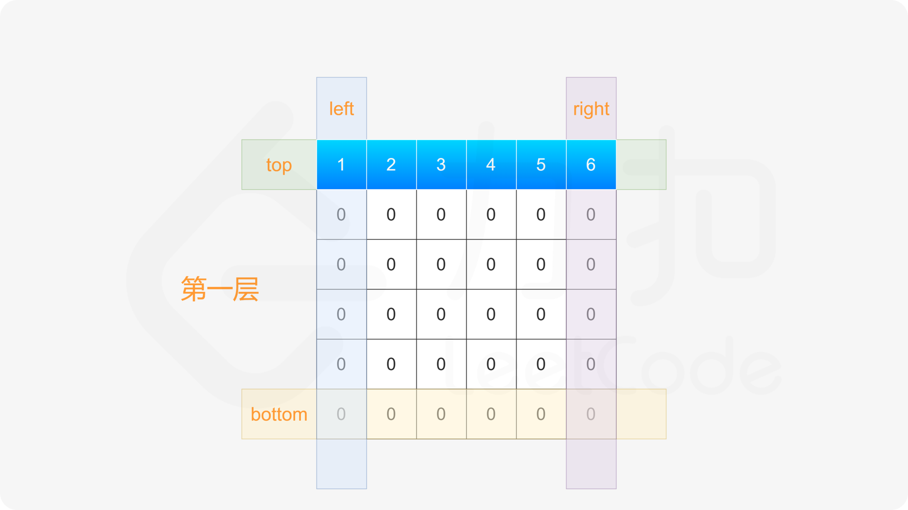
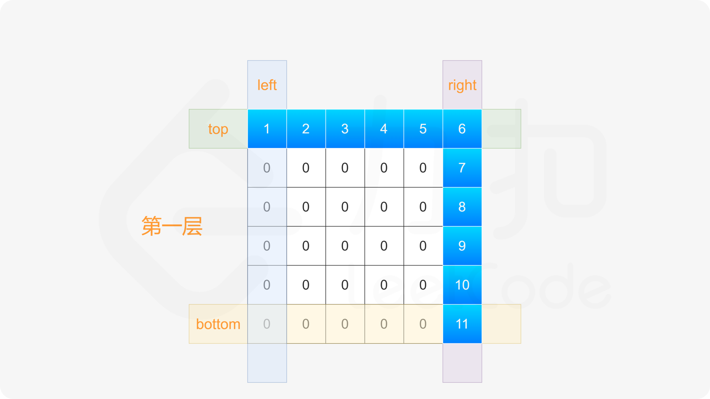
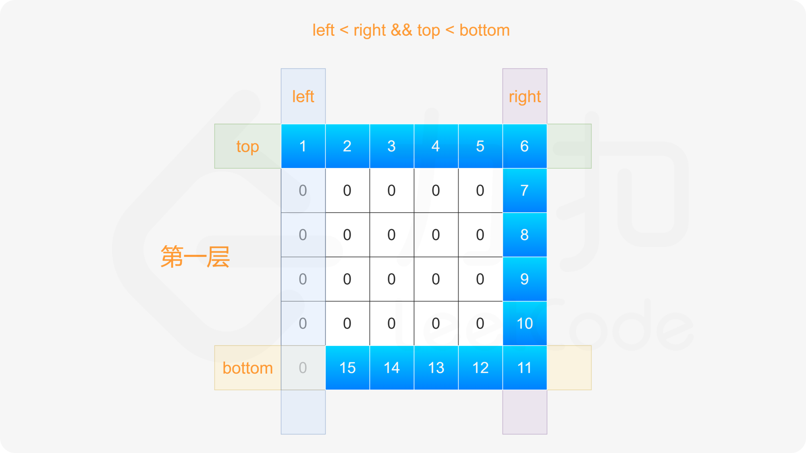
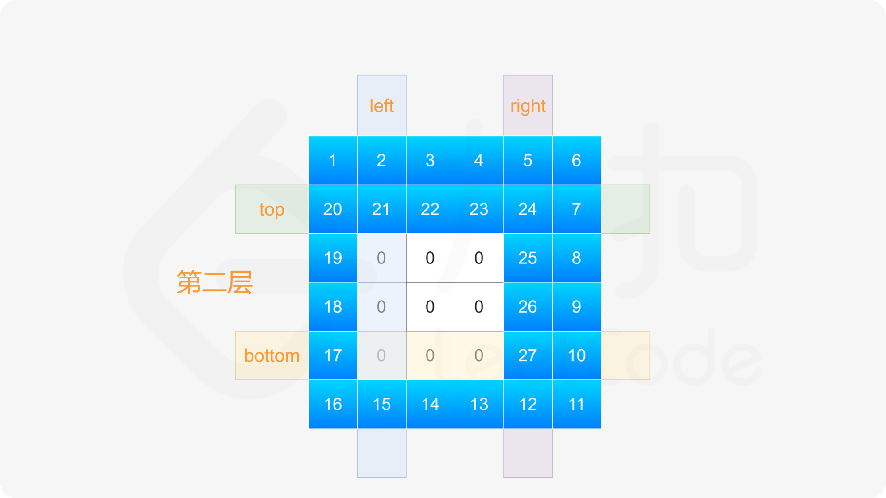
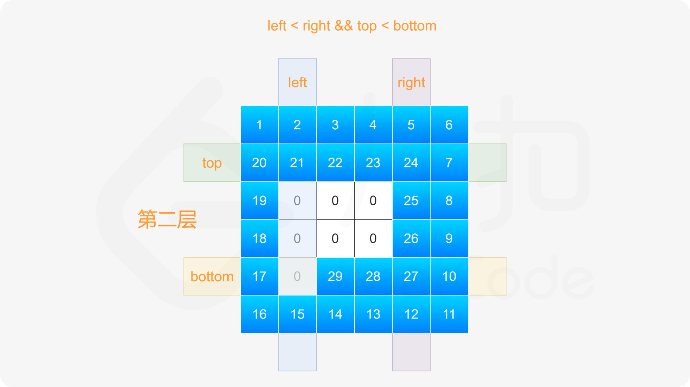
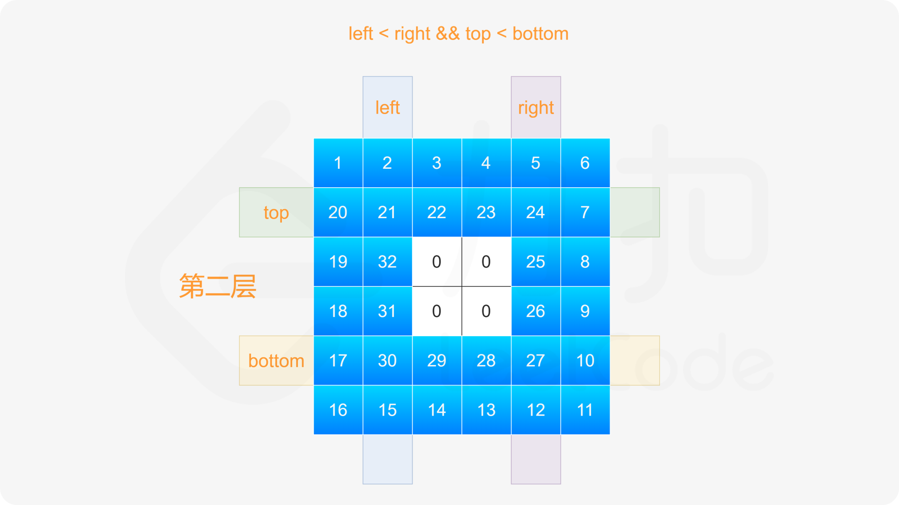
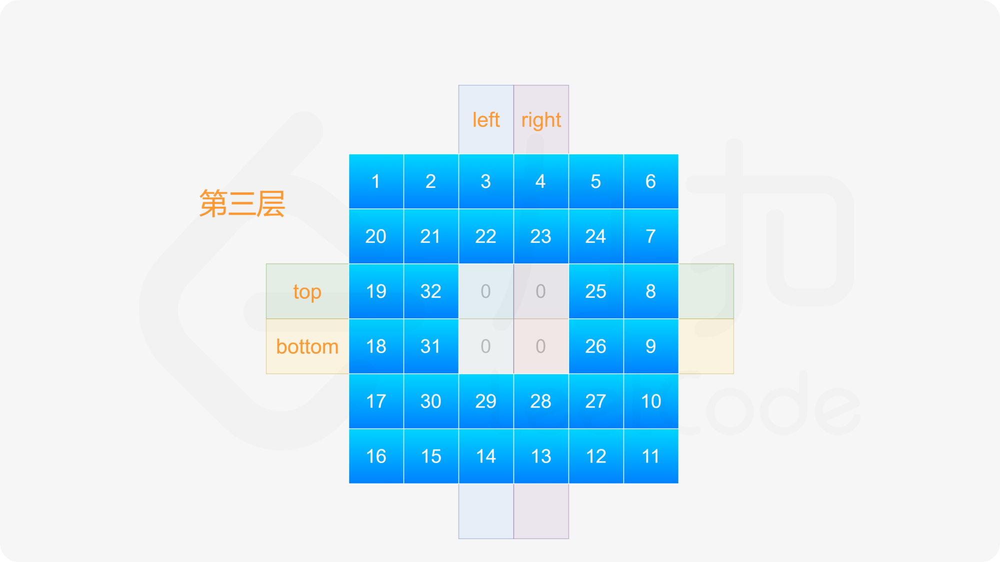
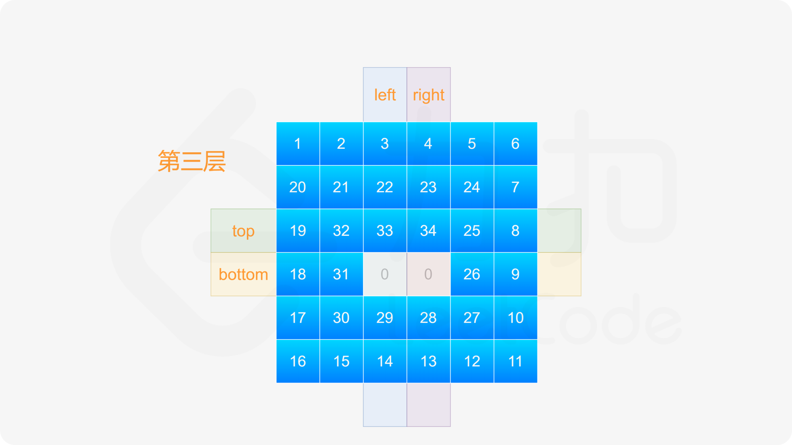
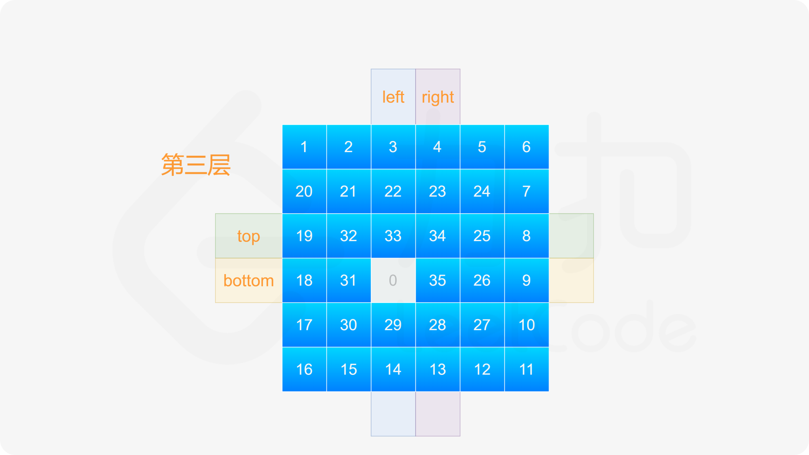
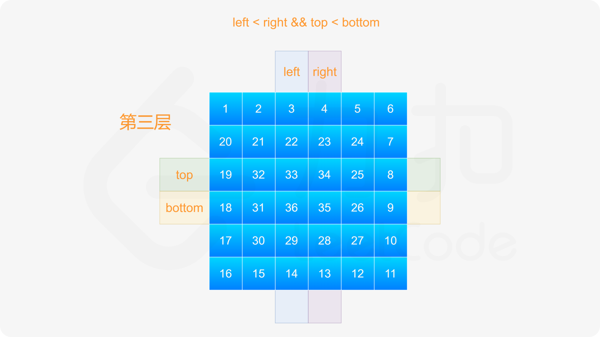

### [螺旋矩阵 II](https://leetcode.cn/problems/spiral-matrix-ii/solutions/658676/luo-xuan-ju-zhen-ii-by-leetcode-solution-f7fp/)

#### 方法一：模拟

模拟矩阵的生成。按照要求，初始位置设为矩阵的左上角，初始方向设为向右。若下一步的位置超出矩阵边界，或者是之前访问过的位置，则顺时针旋转，进入下一个方向。如此反复直至填入 $n^2$ 个元素。

记 $matrix$ 为生成的矩阵，其初始元素设为 $0$。由于填入的元素均为正数，我们可以判断当前位置的元素值，若不为 $0$，则说明已经访问过此位置。

```Java
class Solution {
    public int[][] generateMatrix(int n) {
        int maxNum = n * n;
        int curNum = 1;
        int[][] matrix = new int[n][n];
        int row = 0, column = 0;
        int[][] directions = {{0, 1}, {1, 0}, {0, -1}, {-1, 0}}; // 右下左上
        int directionIndex = 0;
        while (curNum <= maxNum) {
            matrix[row][column] = curNum;
            curNum++;
            int nextRow = row + directions[directionIndex][0], nextColumn = column + directions[directionIndex][1];
            if (nextRow < 0 || nextRow >= n || nextColumn < 0 || nextColumn >= n || matrix[nextRow][nextColumn] != 0) {
                directionIndex = (directionIndex + 1) % 4; // 顺时针旋转至下一个方向
            }
            row = row + directions[directionIndex][0];
            column = column + directions[directionIndex][1];
        }
        return matrix;
    }
}
```

```JavaScript
var generateMatrix = function(n) {
    const maxNum = n * n;
    let curNum = 1;
    const matrix = new Array(n).fill(0).map(() => new Array(n).fill(0));
    let row = 0, column = 0;
    const directions = [[0, 1], [1, 0], [0, -1], [-1, 0]]; // 右下左上
    let directionIndex = 0;
    while (curNum <= maxNum) {
        matrix[row][column] = curNum;
        curNum++;
        const nextRow = row + directions[directionIndex][0], nextColumn = column + directions[directionIndex][1];
        if (nextRow < 0 || nextRow >= n || nextColumn < 0 || nextColumn >= n || matrix[nextRow][nextColumn] !== 0) {
            directionIndex = (directionIndex + 1) % 4; // 顺时针旋转至下一个方向
        }
        row = row + directions[directionIndex][0];
        column = column + directions[directionIndex][1];
    }
    return matrix;
};
```

```Go
type pair struct{ x, y int }
var dirs = []pair{{0, 1}, {1, 0}, {0, -1}, {-1, 0}} // 右下左上

func generateMatrix(n int) [][]int {
    matrix := make([][]int, n)
    for i := range matrix {
        matrix[i] = make([]int, n)
    }
    row, col, dirIdx := 0, 0, 0
    for i := 1; i <= n*n; i++ {
        matrix[row][col] = i
        dir := dirs[dirIdx]
        if r, c := row+dir.x, col+dir.y; r < 0 || r >= n || c < 0 || c >= n || matrix[r][c] > 0 {
            dirIdx = (dirIdx + 1) % 4 // 顺时针旋转至下一个方向
            dir = dirs[dirIdx]
        }
        row += dir.x
        col += dir.y
    }
    return matrix
}
```

```Python
class Solution:
    def generateMatrix(self, n: int) -> List[List[int]]:
        dirs = [(0, 1), (1, 0), (0, -1), (-1, 0)]
        matrix = [[0] * n for _ in range(n)]
        row, col, dirIdx = 0, 0, 0
        for i in range(n * n):
            matrix[row][col] = i + 1
            dx, dy = dirs[dirIdx]
            r, c = row + dx, col + dy
            if r < 0 or r >= n or c < 0 or c >= n or matrix[r][c] > 0:
                dirIdx = (dirIdx + 1) % 4   # 顺时针旋转至下一个方向
                dx, dy = dirs[dirIdx]
            row, col = row + dx, col + dy
        
        return matrix
```

```C++
class Solution {
public:
    vector<vector<int>> generateMatrix(int n) {
        int maxNum = n * n;
        int curNum = 1;
        vector<vector<int>> matrix(n, vector<int>(n));
        int row = 0, column = 0;
        vector<vector<int>> directions = {{0, 1}, {1, 0}, {0, -1}, {-1, 0}};  // 右下左上
        int directionIndex = 0;
        while (curNum <= maxNum) {
            matrix[row][column] = curNum;
            curNum++;
            int nextRow = row + directions[directionIndex][0], nextColumn = column + directions[directionIndex][1];
            if (nextRow < 0 || nextRow >= n || nextColumn < 0 || nextColumn >= n || matrix[nextRow][nextColumn] != 0) {
                directionIndex = (directionIndex + 1) % 4;  // 顺时针旋转至下一个方向
            }
            row = row + directions[directionIndex][0];
            column = column + directions[directionIndex][1];
        }
        return matrix;
    }
};
```

```C
int** generateMatrix(int n, int* returnSize, int** returnColumnSizes) {
    int maxNum = n * n;
    int curNum = 1;
    int** matrix = malloc(sizeof(int*) * n);
    *returnSize = n;
    *returnColumnSizes = malloc(sizeof(int) * n);
    for (int i = 0; i < n; i++) {
        matrix[i] = malloc(sizeof(int) * n);
        memset(matrix[i], 0, sizeof(int) * n);
        (*returnColumnSizes)[i] = n;
    }
    int row = 0, column = 0;
    int directions[4][2] = {{0, 1}, {1, 0}, {0, -1}, {-1, 0}};  // 右下左上
    int directionIndex = 0;
    while (curNum <= maxNum) {
        matrix[row][column] = curNum;
        curNum++;
        int nextRow = row + directions[directionIndex][0], nextColumn = column + directions[directionIndex][1];
        if (nextRow < 0 || nextRow >= n || nextColumn < 0 || nextColumn >= n || matrix[nextRow][nextColumn] != 0) {
            directionIndex = (directionIndex + 1) % 4;  // 顺时针旋转至下一个方向
        }
        row = row + directions[directionIndex][0];
        column = column + directions[directionIndex][1];
    }
    return matrix;
}
```

**复杂度分析**

- 时间复杂度：$O(n^2)$，其中 $n$ 是给定的正整数。矩阵的大小是 $n \times n$，需要填入矩阵中的每个元素。
- 空间复杂度：$O(1)$。除了返回的矩阵以外，空间复杂度是常数。

#### 方法二：按层模拟

可以将矩阵看成若干层，首先填入矩阵最外层的元素，其次填入矩阵次外层的元素，直到填入矩阵最内层的元素。

定义矩阵的第 $k$ 层是到最近边界距离为 $k$ 的所有顶点。例如，下图矩阵最外层元素都是第 $1$ 层，次外层元素都是第 $2$ 层，最内层元素都是第 $3$ 层。

```csharp
[[1, 1, 1, 1, 1, 1],
 [1, 2, 2, 2, 2, 1],
 [1, 2, 3, 3, 2, 1],
 [1, 2, 3, 3, 2, 1],
 [1, 2, 2, 2, 2, 1],
 [1, 1, 1, 1, 1, 1]]
```

对于每层，从左上方开始以顺时针的顺序填入所有元素。假设当前层的左上角位于 $(top,left)$，右下角位于 $(bottom,right)$，按照如下顺序填入当前层的元素。

1. 从左到右填入上侧元素，依次为 $(top,left)$ 到 $(top,right)$。
2. 从上到下填入右侧元素，依次为 $(top+1,right)$ 到 $(bottom,right)$。
3. 如果 $left<right$ 且 $top<bottom$，则从右到左填入下侧元素，依次为 $(bottom,right-1)$ 到 $(bottom,left+1)$，以及从下到上填入左侧元素，依次为 $(bottom,left)$ 到 $(top+1,left)$。

填完当前层的元素之后，将 $left$ 和 $top$ 分别增加 $1$，将 $right$ 和 $bottom$ 分别减少 $1$，进入下一层继续填入元素，直到填完所有元素为止。
















```Java
class Solution {
    public int[][] generateMatrix(int n) {
        int num = 1;
        int[][] matrix = new int[n][n];
        int left = 0, right = n - 1, top = 0, bottom = n - 1;
        while (left <= right && top <= bottom) {
            for (int column = left; column <= right; column++) {
                matrix[top][column] = num;
                num++;
            }
            for (int row = top + 1; row <= bottom; row++) {
                matrix[row][right] = num;
                num++;
            }
            if (left < right && top < bottom) {
                for (int column = right - 1; column > left; column--) {
                    matrix[bottom][column] = num;
                    num++;
                }
                for (int row = bottom; row > top; row--) {
                    matrix[row][left] = num;
                    num++;
                }
            }
            left++;
            right--;
            top++;
            bottom--;
        }
        return matrix;
    }
}
```

```JavaScript
var generateMatrix = function(n) {
    let num = 1;
    const matrix = new Array(n).fill(0).map(() => new Array(n).fill(0));
    let left = 0, right = n - 1, top = 0, bottom = n - 1;
    while (left <= right && top <= bottom) {
        for (let column = left; column <= right; column++) {
            matrix[top][column] = num;
            num++;
        }
        for (let row = top + 1; row <= bottom; row++) {
            matrix[row][right] = num;
            num++;
        }
        if (left < right && top < bottom) {
            for (let column = right - 1; column > left; column--) {
                matrix[bottom][column] = num;
                num++;
            }
            for (let row = bottom; row > top; row--) {
                matrix[row][left] = num;
                num++;
            }
        }
        left++;
        right--;
        top++;
        bottom--;
    }
    return matrix;
};
```

```Go
func generateMatrix(n int) [][]int {
    matrix := make([][]int, n)
    for i := range matrix {
        matrix[i] = make([]int, n)
    }
    num := 1
    left, right, top, bottom := 0, n-1, 0, n-1
    for left <= right && top <= bottom {
        for column := left; column <= right; column++ {
            matrix[top][column] = num
            num++
        }
        for row := top + 1; row <= bottom; row++ {
            matrix[row][right] = num
            num++
        }
        if left < right && top < bottom {
            for column := right - 1; column > left; column-- {
                matrix[bottom][column] = num
                num++
            }
            for row := bottom; row > top; row-- {
                matrix[row][left] = num
                num++
            }
        }
        left++
        right--
        top++
        bottom--
    }
    return matrix
}
```

```Python
class Solution:
    def generateMatrix(self, n: int) -> List[List[int]]:
        matrix = [[0] * n for _ in range(n)]
        num = 1
        left, right, top, bottom = 0, n - 1, 0, n - 1

        while left <= right and top <= bottom:
            for col in range(left, right + 1):
                matrix[top][col] = num
                num += 1
            for row in range(top + 1, bottom + 1):
                matrix[row][right] = num
                num += 1
            if left < right and top < bottom:
                for col in range(right - 1, left, -1):
                    matrix[bottom][col] = num
                    num += 1
                for row in range(bottom, top, -1):
                    matrix[row][left] = num
                    num += 1
            left += 1
            right -= 1
            top += 1
            bottom -= 1

        return matrix
```

```C++
class Solution {
public:
    vector<vector<int>> generateMatrix(int n) {
        int num = 1;
        vector<vector<int>> matrix(n, vector<int>(n));
        int left = 0, right = n - 1, top = 0, bottom = n - 1;
        while (left <= right && top <= bottom) {
            for (int column = left; column <= right; column++) {
                matrix[top][column] = num;
                num++;
            }
            for (int row = top + 1; row <= bottom; row++) {
                matrix[row][right] = num;
                num++;
            }
            if (left < right && top < bottom) {
                for (int column = right - 1; column > left; column--) {
                    matrix[bottom][column] = num;
                    num++;
                }
                for (int row = bottom; row > top; row--) {
                    matrix[row][left] = num;
                    num++;
                }
            }
            left++;
            right--;
            top++;
            bottom--;
        }
        return matrix;
    }
};
```

```C
int** generateMatrix(int n, int* returnSize, int** returnColumnSizes) {
    int num = 1;
    int** matrix = malloc(sizeof(int*) * n);
    *returnSize = n;
    *returnColumnSizes = malloc(sizeof(int) * n);
    for (int i = 0; i < n; i++) {
        matrix[i] = malloc(sizeof(int) * n);
        memset(matrix[i], 0, sizeof(int) * n);
        (*returnColumnSizes)[i] = n;
    }
    int left = 0, right = n - 1, top = 0, bottom = n - 1;
    while (left <= right && top <= bottom) {
        for (int column = left; column <= right; column++) {
            matrix[top][column] = num;
            num++;
        }
        for (int row = top + 1; row <= bottom; row++) {
            matrix[row][right] = num;
            num++;
        }
        if (left < right && top < bottom) {
            for (int column = right - 1; column > left; column--) {
                matrix[bottom][column] = num;
                num++;
            }
            for (int row = bottom; row > top; row--) {
                matrix[row][left] = num;
                num++;
            }
        }
        left++;
        right--;
        top++;
        bottom--;
    }
    return matrix;
}
```

**复杂度分析**

- 时间复杂度：$O(n^2)$，其中 $n$ 是给定的正整数。矩阵的大小是 $n \times n$，需要填入矩阵中的每个元素。
- 空间复杂度：$O(1)$。除了返回的矩阵以外，空间复杂度是常数。
