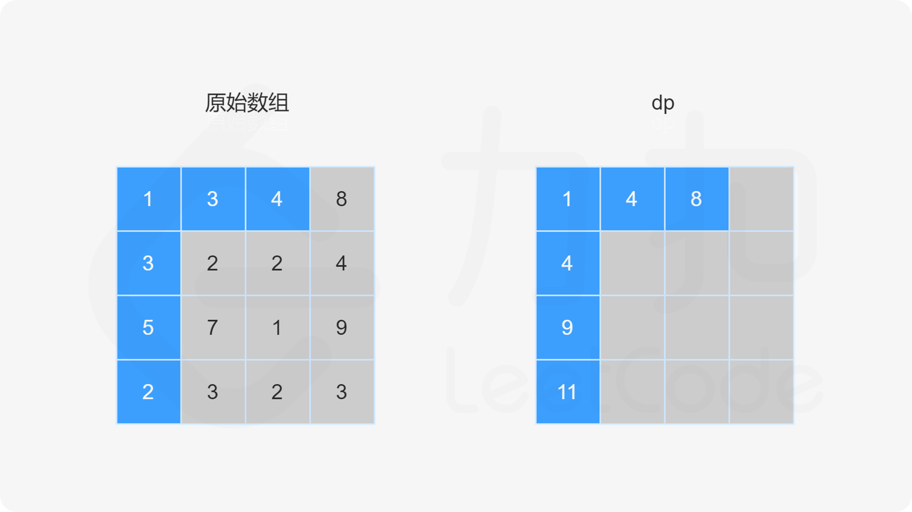

### [最小路径和](https://leetcode.cn/problems/minimum-path-sum/solutions/342122/zui-xiao-lu-jing-he-by-leetcode-solution/)

#### 方法一：动态规划

由于路径的方向只能是向下或向右，因此网格的第一行的每个元素只能从左上角元素开始向右移动到达，网格的第一列的每个元素只能从左上角元素开始向下移动到达，此时的路径是唯一的，因此每个元素对应的最小路径和即为对应的路径上的数字总和。

对于不在第一行和第一列的元素，可以从其上方相邻元素向下移动一步到达，或者从其左方相邻元素向右移动一步到达，元素对应的最小路径和等于其上方相邻元素与其左方相邻元素两者对应的最小路径和中的最小值加上当前元素的值。由于每个元素对应的最小路径和与其相邻元素对应的最小路径和有关，因此可以使用动态规划求解。

创建二维数组 $dp$，与原始网格的大小相同，$dp[i][j]$ 表示从左上角出发到 $(i,j)$ 位置的最小路径和。显然，$dp[0][0]=grid[0][0]$。对于 $dp$ 中的其余元素，通过以下状态转移方程计算元素值。

- 当 $i>0$ 且 $j=0$ 时，$dp[i][0]=dp[i-1][0]+grid[i][0]$。
- 当 $i=0$ 且 $j>0$ 时，$dp[0][j]=dp[0][j-1]+grid[0][j]$。
- 当 $i>0$ 且 $j>0$ 时，$dp[i][j]=min(dp[i-1][j],dp[i][j-1])+grid[i][j]$。

最后得到 $dp[m-1][n-1]$ 的值即为从网格左上角到网格右下角的最小路径和。





```Java
class Solution {
    public int minPathSum(int[][] grid) {
        if (grid == null || grid.length == 0 || grid[0].length == 0) {
            return 0;
        }
        int rows = grid.length, columns = grid[0].length;
        int[][] dp = new int[rows][columns];
        dp[0][0] = grid[0][0];
        for (int i = 1; i < rows; i++) {
            dp[i][0] = dp[i - 1][0] + grid[i][0];
        }
        for (int j = 1; j < columns; j++) {
            dp[0][j] = dp[0][j - 1] + grid[0][j];
        }
        for (int i = 1; i < rows; i++) {
            for (int j = 1; j < columns; j++) {
                dp[i][j] = Math.min(dp[i - 1][j], dp[i][j - 1]) + grid[i][j];
            }
        }
        return dp[rows - 1][columns - 1];
    }
}
```

```C++
class Solution {
public:
    int minPathSum(vector<vector<int>>& grid) {
        if (grid.size() == 0 || grid[0].size() == 0) {
            return 0;
        }
        int rows = grid.size(), columns = grid[0].size();
        auto dp = vector < vector <int> > (rows, vector <int> (columns));
        dp[0][0] = grid[0][0];
        for (int i = 1; i < rows; i++) {
            dp[i][0] = dp[i - 1][0] + grid[i][0];
        }
        for (int j = 1; j < columns; j++) {
            dp[0][j] = dp[0][j - 1] + grid[0][j];
        }
        for (int i = 1; i < rows; i++) {
            for (int j = 1; j < columns; j++) {
                dp[i][j] = min(dp[i - 1][j], dp[i][j - 1]) + grid[i][j];
            }
        }
        return dp[rows - 1][columns - 1];
    }
};
```

```Go
func minPathSum(grid [][]int) int {
    if len(grid) == 0 || len(grid[0]) == 0 {
        return 0
    }
    rows, columns := len(grid), len(grid[0])
    dp := make([][]int, rows)
    for i := 0; i < len(dp); i++ {
        dp[i] = make([]int, columns)
    }
    dp[0][0] = grid[0][0]
    for i := 1; i < rows; i++ {
        dp[i][0] = dp[i - 1][0] + grid[i][0]
    }
    for j := 1; j < columns; j++ {
        dp[0][j] = dp[0][j - 1] + grid[0][j]
    }
    for i := 1; i < rows; i++ {
        for j := 1; j < columns; j++ {
            dp[i][j] = min(dp[i - 1][j], dp[i][j - 1]) + grid[i][j]
        }
    }
    return dp[rows - 1][columns - 1]
}

func min(x, y int) int {
    if x < y {
        return x
    }
    return y
}
```

```Python
class Solution:
    def minPathSum(self, grid: List[List[int]]) -> int:
        if not grid or not grid[0]:
            return 0
        
        rows, columns = len(grid), len(grid[0])
        dp = [[0] * columns for _ in range(rows)]
        dp[0][0] = grid[0][0]
        for i in range(1, rows):
            dp[i][0] = dp[i - 1][0] + grid[i][0]
        for j in range(1, columns):
            dp[0][j] = dp[0][j - 1] + grid[0][j]
        for i in range(1, rows):
            for j in range(1, columns):
                dp[i][j] = min(dp[i - 1][j], dp[i][j - 1]) + grid[i][j]
        
        return dp[rows - 1][columns - 1]
```

```C
int minPathSum(int** grid, int gridSize, int* gridColSize) {
    int rows = gridSize, columns = gridColSize[0];
    if (rows == 0 || columns == 0) {
        return 0;
    }
    int dp[rows][columns];
    dp[0][0] = grid[0][0];
    for (int i = 1; i < rows; i++) {
        dp[i][0] = dp[i - 1][0] + grid[i][0];
    }
    for (int j = 1; j < columns; j++) {
        dp[0][j] = dp[0][j - 1] + grid[0][j];
    }
    for (int i = 1; i < rows; i++) {
        for (int j = 1; j < columns; j++) {
            dp[i][j] = fmin(dp[i - 1][j], dp[i][j - 1]) + grid[i][j];
        }
    }
    return dp[rows - 1][columns - 1];
}
```

**复杂度分析**

- 时间复杂度：$O(mn)$，其中 $m$ 和 $n$ 分别是网格的行数和列数。需要对整个网格遍历一次，计算 $dp$ 的每个元素的值。
- 空间复杂度：$O(mn)$，其中 $m$ 和 $n$ 分别是网格的行数和列数。创建一个二维数组 $dp$，和网格大小相同。
    空间复杂度可以优化，例如每次只存储上一行的 $dp$ 值，则可以将空间复杂度优化到 $O(n)$。
