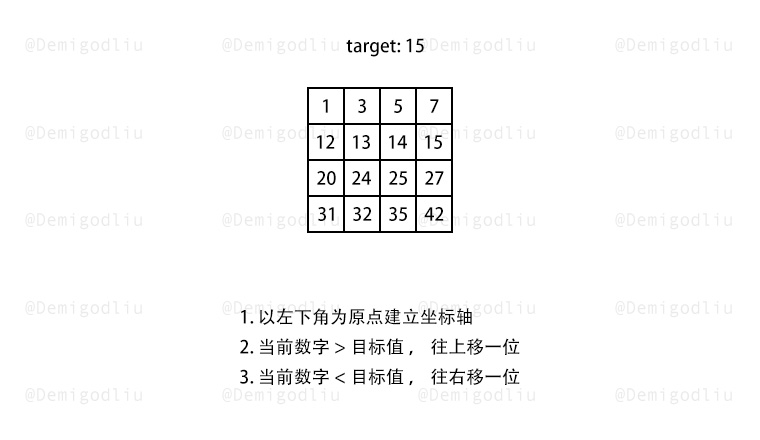
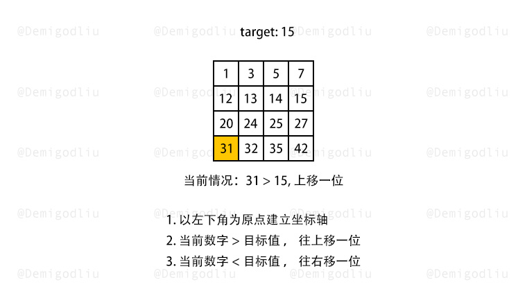
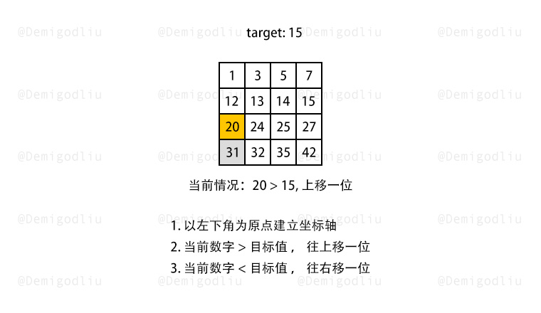
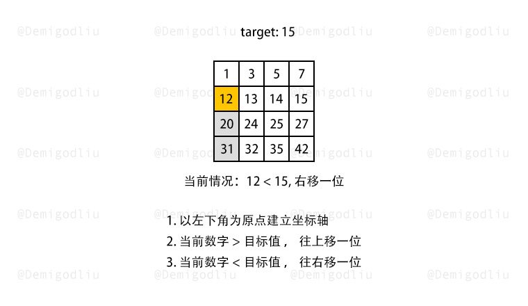
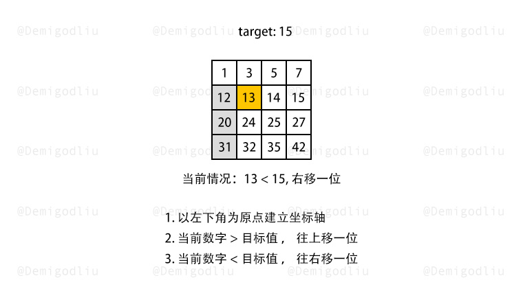
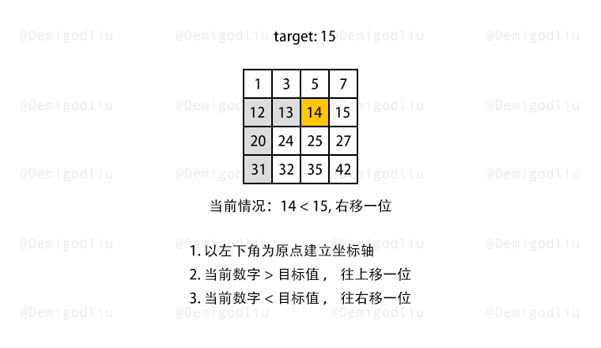
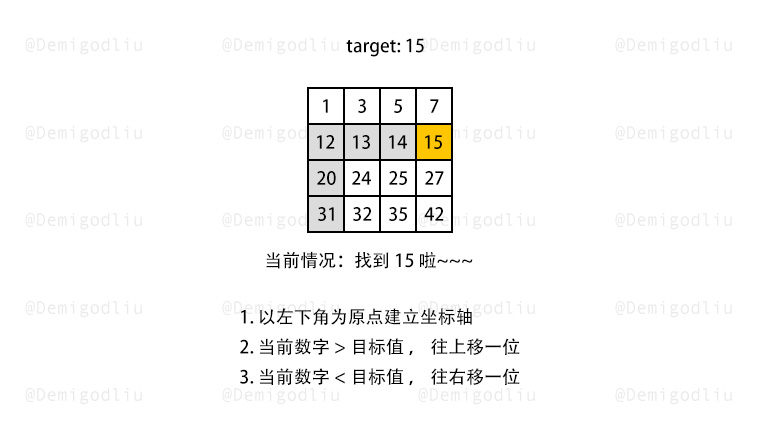

#### [解题思路](https://leetcode.cn/problems/search-a-2d-matrix/solutions/688381/zuo-biao-zhou-fa-er-wei-shu-zu-zhong-de-nxfc8/)

根据题意已知，二维数组从左往右递增，从上往下递增，所以得出以下结论：

1.  某列的某个数字，该数之上的数字，都比其小；
2.  某行的某个数字，该数右侧的数字，都比其大；

所以，解题流程如下所示：

1.  以二维数组左下角为原点，建立直角坐标轴。
2.  若当前数字大于了查找数，查找往上移一位。
3.  若当前数字小于了查找数，查找往右移一位。

#### 图解演示









#### 🍭 示例代码

```javascript
var findNumberIn2DArray = function(matrix, target) {
    if(!matrix.length) return false;
    let x = matrix.length - 1, y = 0;
    while(x >= 0 && y < matrix[0].length){
        if(matrix[x][y] === target){
            return true;
        }else if(matrix[x][y] > target){
            x--;
        }else{
            y++;
        }
    }
    return false;
};
```

```java
class Solution {
    public boolean searchMatrix(int[][] matrix, int target) {
        int rows = matrix.length - 1, columns = 0;
        while (rows >= 0 && columns < matrix[0].length) {
            int num = matrix[rows][columns];
            if (num == target) {
                return true;
            } else if (num > target) {
                rows--;
            } else {
                columns++;
            }
        }
        return false;
    }
}
```
