### [颜色分类](https://leetcode.cn/problems/sort-colors/solutions/437968/yan-se-fen-lei-by-leetcode-solution/)

#### 前言

本题是经典的「荷兰国旗问题」，由计算机科学家 [Edsger W. Dijkstra](https://leetcode.cn/link/?target=https%3A%2F%2Fbaike.baidu.com%2Fitem%2F%E8%89%BE%E5%85%B9%E6%A0%BC%C2%B7%E8%BF%AA%E7%A7%91%E6%96%AF%E5%BD%BB) 首先提出。

根据题目中的提示，我们可以统计出数组中 $0,1,2$ 的个数，再根据它们的数量，重写整个数组。这种方法较为简单，也很容易想到，而本题解中会介绍两种基于指针进行交换的方法。

#### 方法一：单指针

**思路与算法**

我们可以考虑对数组进行两次遍历。在第一次遍历中，我们将数组中所有的 $0$ 交换到数组的头部。在第二次遍历中，我们将数组中所有的 $1$ 交换到头部的 $0$ 之后。此时，所有的 $2$ 都出现在数组的尾部，这样我们就完成了排序。

具体地，我们使用一个指针 $ptr$ 表示「头部」的范围，$ptr$ 中存储了一个整数，表示数组 $nums$ 从位置 $0$ 到位置 $ptr-1$ 都属于「头部」。$ptr$ 的初始值为 $0$，表示还没有数处于「头部」。

在第一次遍历中，我们从左向右遍历整个数组，如果找到了 $0$，那么就需要将 $0$ 与「头部」位置的元素进行交换，并将「头部」向后扩充一个位置。在遍历结束之后，所有的 $0$ 都被交换到「头部」的范围，并且「头部」只包含 $0$。

在第二次遍历中，我们从「头部」开始，从左向右遍历整个数组，如果找到了 $1$，那么就需要将 $1$ 与「头部」位置的元素进行交换，并将「头部」向后扩充一个位置。在遍历结束之后，所有的 $1$ 都被交换到「头部」的范围，并且都在 $0$ 之后，此时 $2$ 只出现在「头部」之外的位置，因此排序完成。

**代码**

```C++
class Solution {
public:
    void sortColors(vector<int>& nums) {
        int n = nums.size();
        int ptr = 0;
        for (int i = 0; i < n; ++i) {
            if (nums[i] == 0) {
                swap(nums[i], nums[ptr]);
                ++ptr;
            }
        }
        for (int i = ptr; i < n; ++i) {
            if (nums[i] == 1) {
                swap(nums[i], nums[ptr]);
                ++ptr;
            }
        }
    }
};
```

```Java
class Solution {
    public void sortColors(int[] nums) {
        int n = nums.length;
        int ptr = 0;
        for (int i = 0; i < n; ++i) {
            if (nums[i] == 0) {
                int temp = nums[i];
                nums[i] = nums[ptr];
                nums[ptr] = temp;
                ++ptr;
            }
        }
        for (int i = ptr; i < n; ++i) {
            if (nums[i] == 1) {
                int temp = nums[i];
                nums[i] = nums[ptr];
                nums[ptr] = temp;
                ++ptr;
            }
        }
    }
}
```

```Python
class Solution:
    def sortColors(self, nums: List[int]) -> None:
        n = len(nums)
        ptr = 0
        for i in range(n):
            if nums[i] == 0:
                nums[i], nums[ptr] = nums[ptr], nums[i]
                ptr += 1
        for i in range(ptr, n):
            if nums[i] == 1:
                nums[i], nums[ptr] = nums[ptr], nums[i]
                ptr += 1
```

```Go
func swapColors(colors []int, target int) (countTarget int) {
    for i, c := range colors {
        if c == target {
            colors[i], colors[countTarget] = colors[countTarget], colors[i]
            countTarget++
        }
    }
    return
}

func sortColors(nums []int) {
    count0 := swapColors(nums, 0) // 把 0 排到前面
    swapColors(nums[count0:], 1)  // nums[:count0] 全部是 0 了，对剩下的 nums[count0:] 把 1 排到前面
}
```

```C
void swap(int *a, int *b) {
    int t = *a;
    *a = *b, *b = t;
}

void sortColors(int *nums, int numsSize) {
    int ptr = 0;
    for (int i = 0; i < numsSize; ++i) {
        if (nums[i] == 0) {
            swap(&nums[i], &nums[ptr]);
            ++ptr;
        }
    }
    for (int i = ptr; i < numsSize; ++i) {
        if (nums[i] == 1) {
            swap(&nums[i], &nums[ptr]);
            ++ptr;
        }
    }
}
```

**复杂度分析**

- 时间复杂度：$O(n)$，其中 $n$ 是数组 $nums$ 的长度。
- 空间复杂度：$O(1)$。

#### 方法二：双指针

**思路与算法**

方法一需要进行两次遍历，那么我们是否可以仅使用一次遍历呢？我们可以额外使用一个指针，即使用两个指针分别用来交换 $0$ 和 $1$。

具体地，我们用指针 $p_0$ 来交换 $0$，$p_1$ 来交换 $1$，初始值都为 $0$。当我们从左向右遍历整个数组时：

- 如果找到了 $1$，那么将其与 $nums[p_1]$ 进行交换，并将 $p_1$ 向后移动一个位置，这与方法一是相同的；
- 如果找到了 $0$，那么将其与 $nums[p_0]$ 进行交换，并将 $p_0$ 向后移动一个位置。这样做是正确的吗？我们可以注意到，因为连续的 $0$ 之后是连续的 $1$，因此如果我们将 $0$ 与 $nums[p_0]$ 进行交换，那么我们可能会把一个 $1$ 交换出去。当 $p_0 < p_1$ 时，我们已经将一些 $1$ 连续地放在头部，此时一定会把一个 $1$ 交换出去，导致答案错误。因此，如果 $p_0 < p_1$，那么我们需要再将 $nums[i]$ 与 $nums[p_1]$ 进行交换，其中 $i$ 是当前遍历到的位置，在进行了第一次交换后，$nums[i]$ 的值为 $1$，我们需要将这个 $1$ 放到「头部」的末端。在最后，无论是否有 $p_0 < p_1$，我们需要将 $p_0$ 和 $p_1$ 均向后移动一个位置，而不是仅将 $p_0$ 向后移动一个位置。

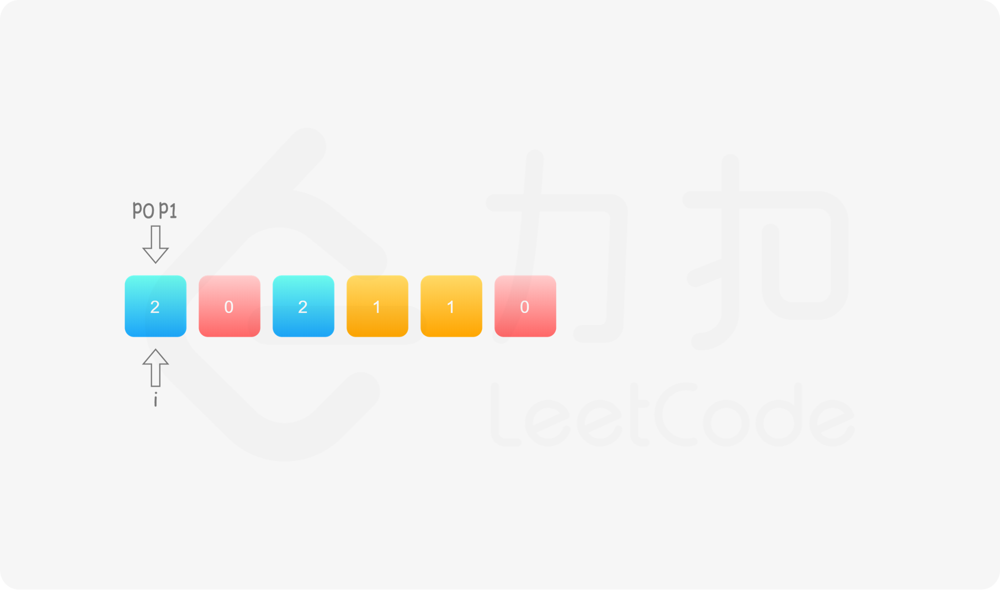
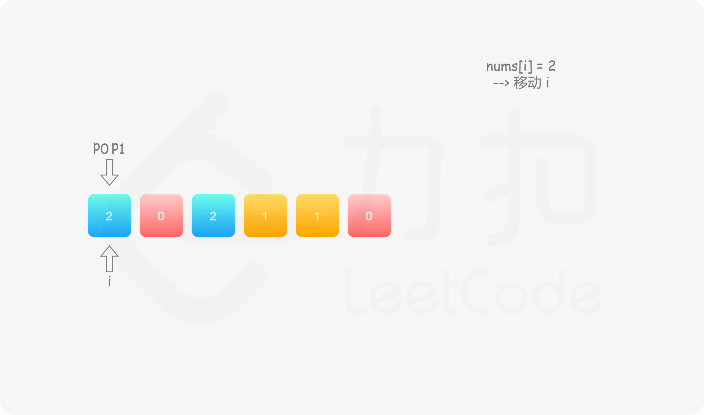
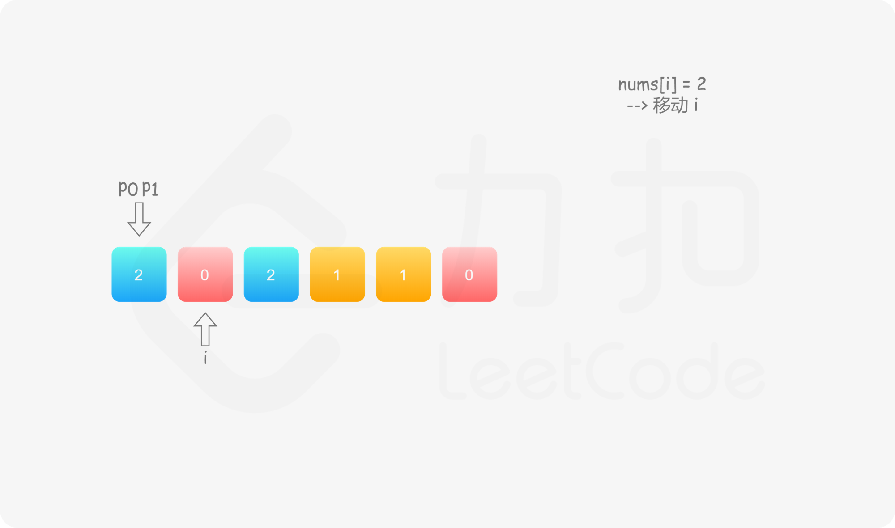
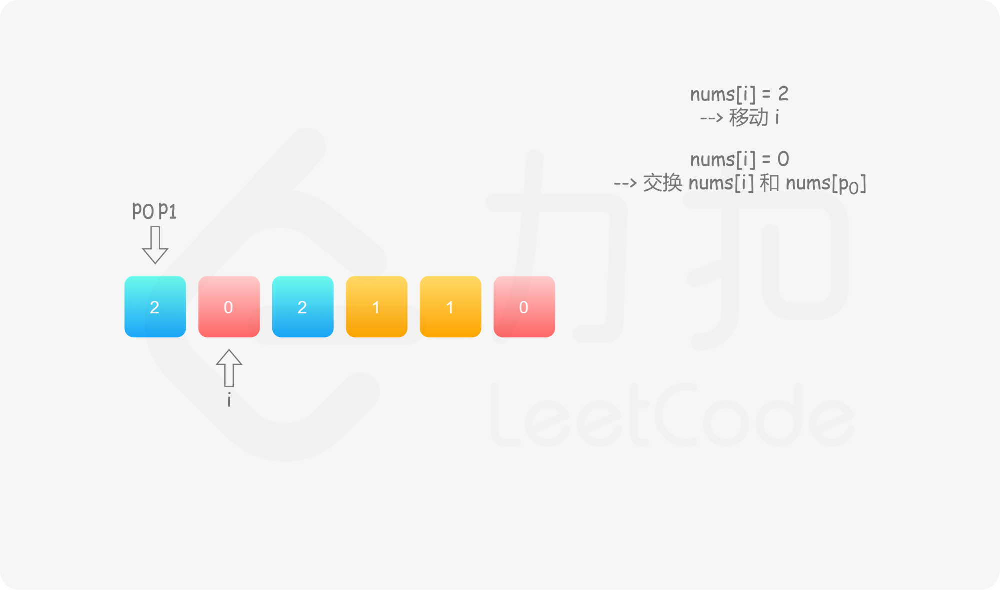
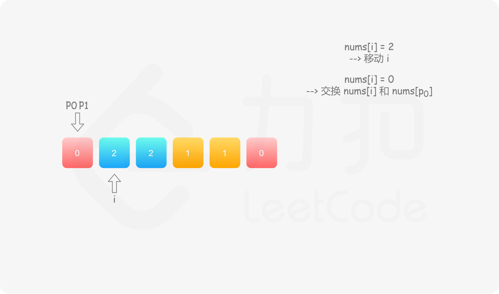
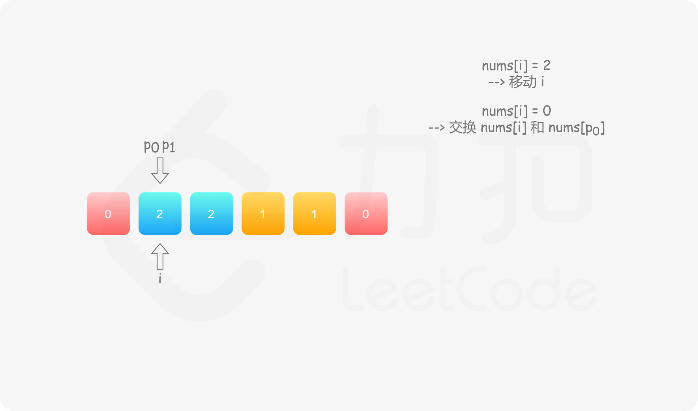
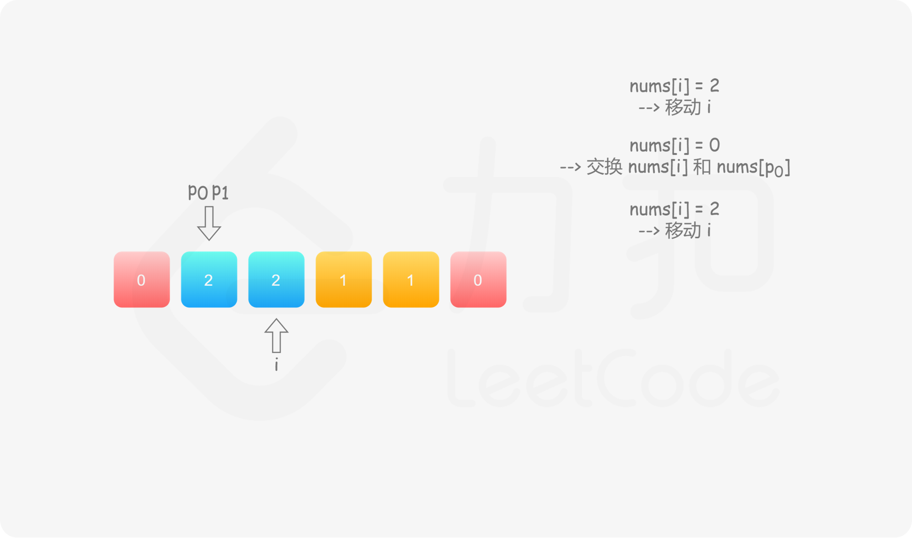
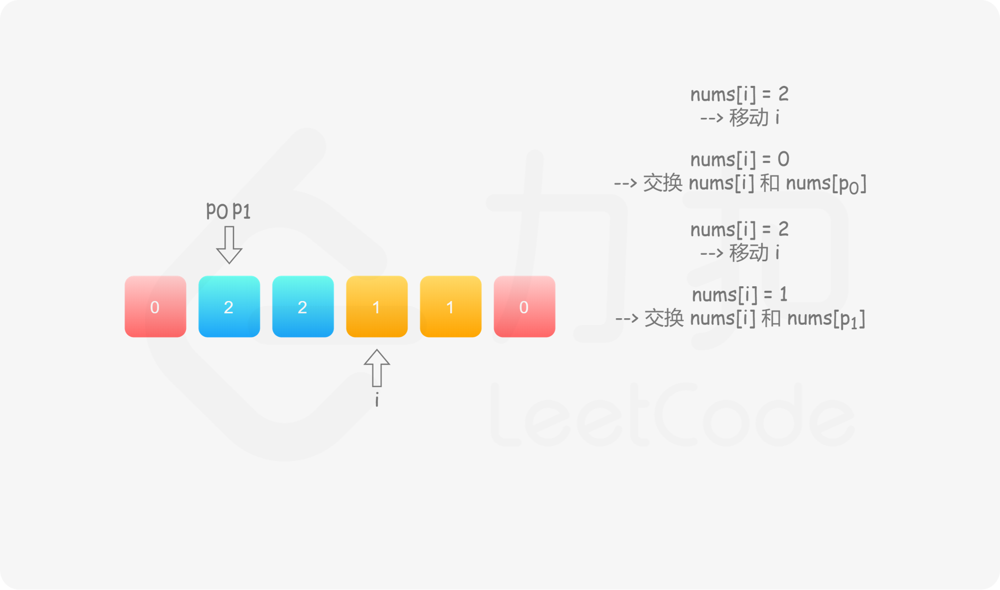
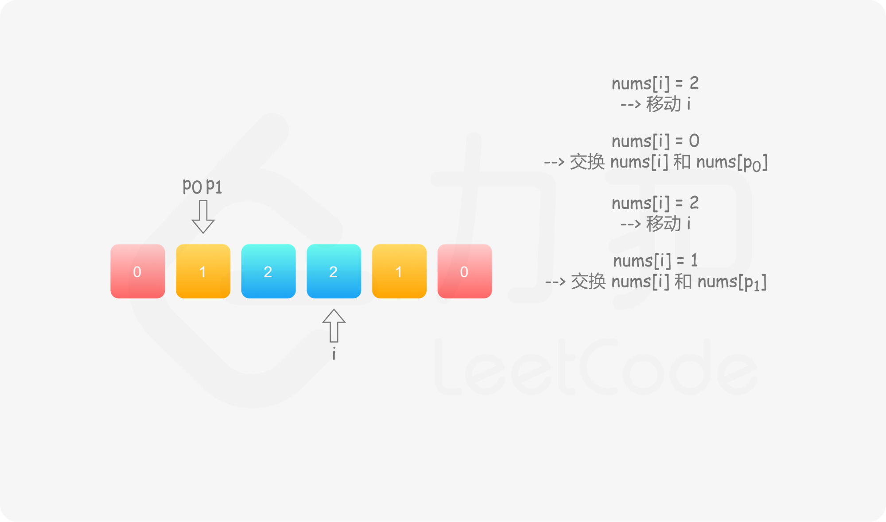
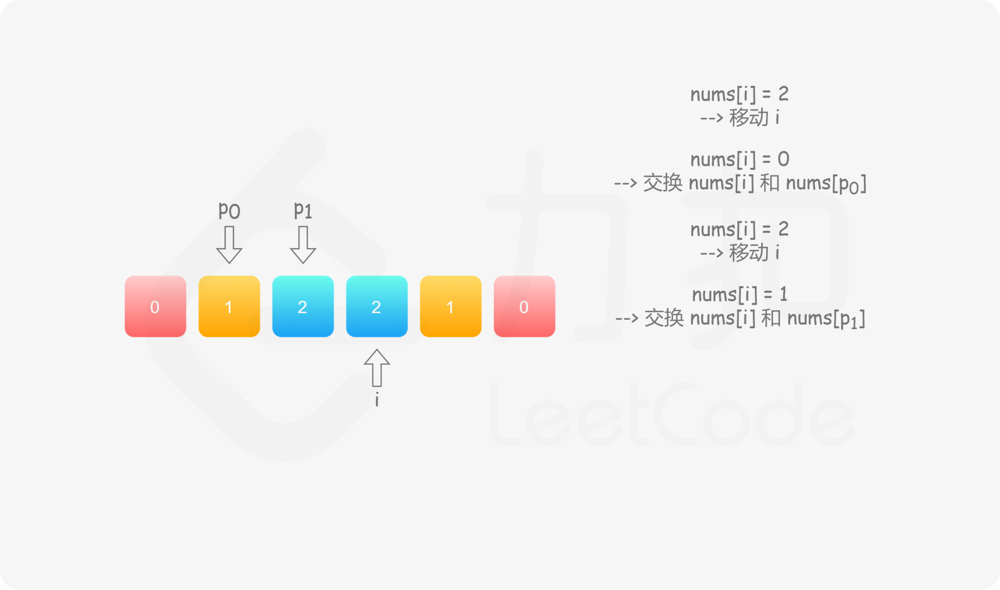
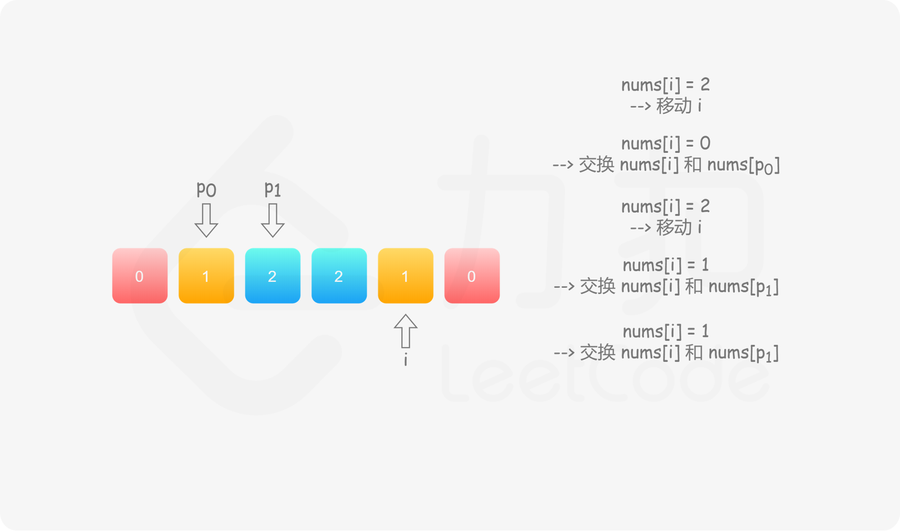
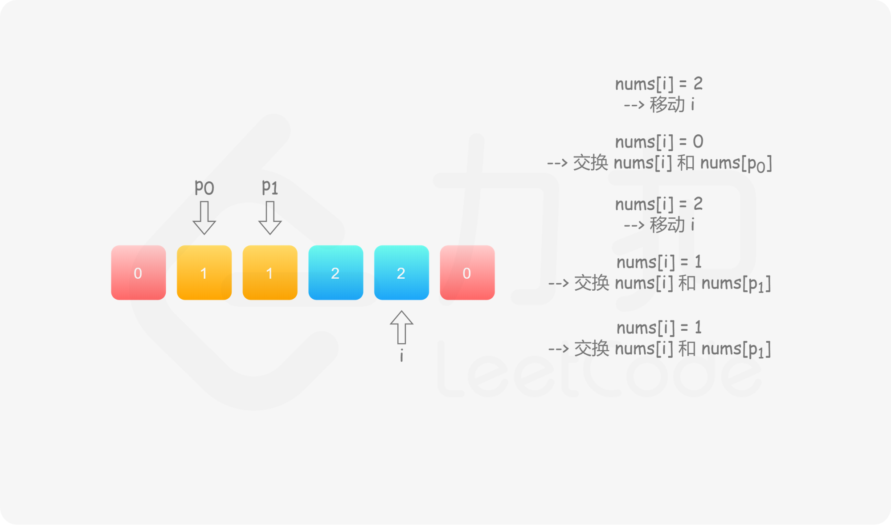

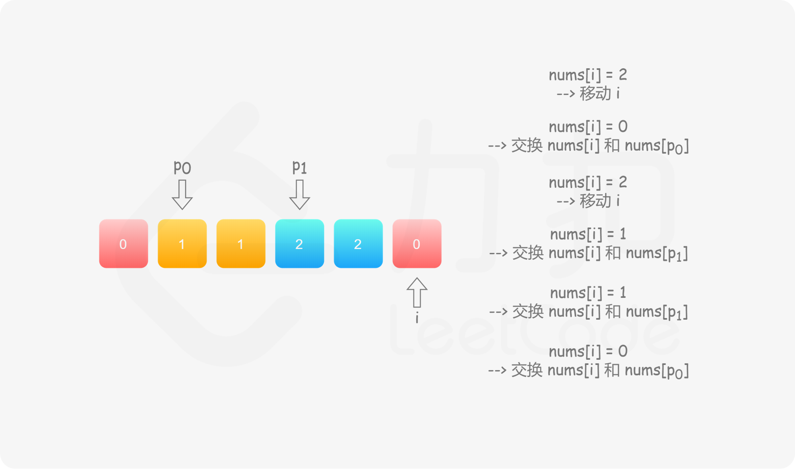
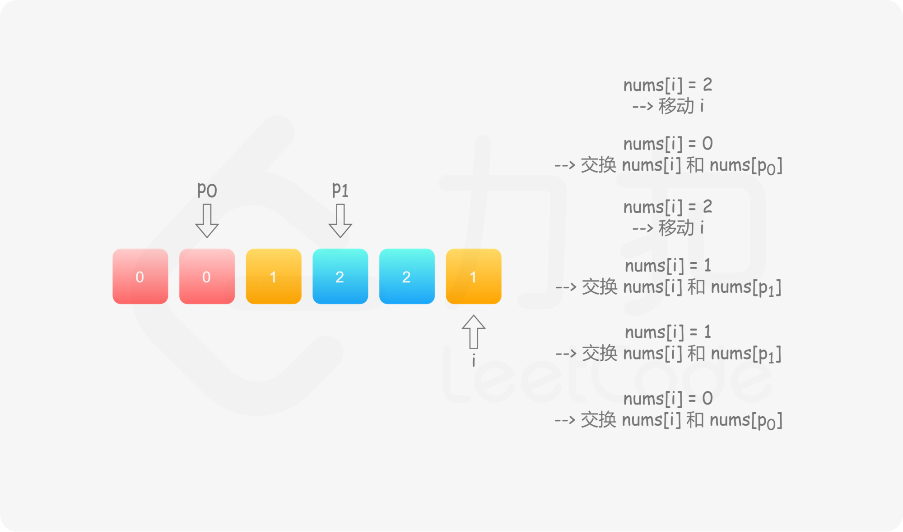
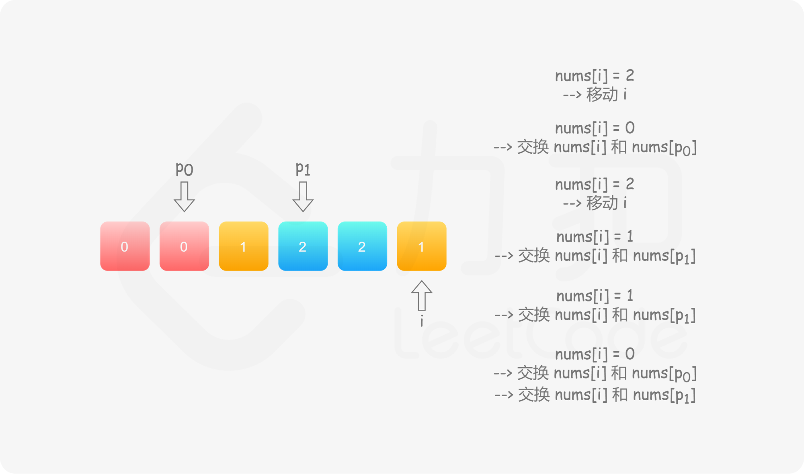
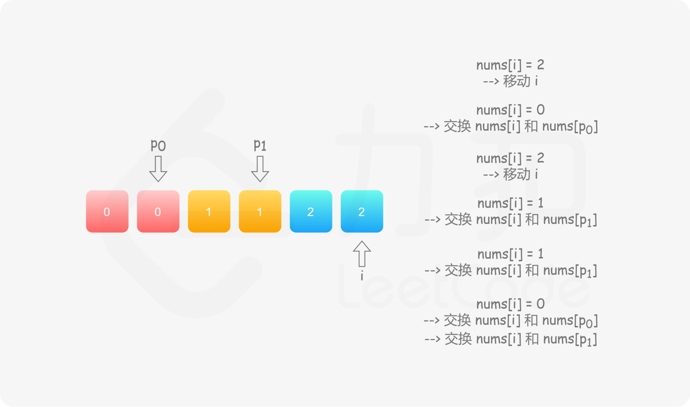
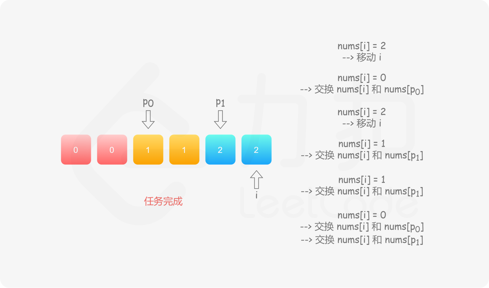

**代码**

```C++
class Solution {
public:
    void sortColors(vector<int>& nums) {
        int n = nums.size();
        int p0 = 0, p1 = 0;
        for (int i = 0; i < n; ++i) {
            if (nums[i] == 1) {
                swap(nums[i], nums[p1]);
                ++p1;
            } else if (nums[i] == 0) {
                swap(nums[i], nums[p0]);
                if (p0 < p1) {
                    swap(nums[i], nums[p1]);
                }
                ++p0;
                ++p1;
            }
        }
    }
};
```

```Java
class Solution {
    public void sortColors(int[] nums) {
        int n = nums.length;
        int p0 = 0, p1 = 0;
        for (int i = 0; i < n; ++i) {
            if (nums[i] == 1) {
                int temp = nums[i];
                nums[i] = nums[p1];
                nums[p1] = temp;
                ++p1;
            } else if (nums[i] == 0) {
                int temp = nums[i];
                nums[i] = nums[p0];
                nums[p0] = temp;
                if (p0 < p1) {
                    temp = nums[i];
                    nums[i] = nums[p1];
                    nums[p1] = temp;
                }
                ++p0;
                ++p1;
            }
        }
    }
}
```

```Python
class Solution:
    def sortColors(self, nums: List[int]) -> None:
        n = len(nums)
        p0 = p1 = 0
        for i in range(n):
            if nums[i] == 1:
                nums[i], nums[p1] = nums[p1], nums[i]
                p1 += 1
            elif nums[i] == 0:
                nums[i], nums[p0] = nums[p0], nums[i]
                if p0 < p1:
                    nums[i], nums[p1] = nums[p1], nums[i]
                p0 += 1
                p1 += 1
```

```Go
func sortColors(nums []int) {
    p0, p1 := 0, 0
    for i, c := range nums {
        if c == 0 {
            nums[i], nums[p0] = nums[p0], nums[i]
            if p0 < p1 {
                nums[i], nums[p1] = nums[p1], nums[i]
            }
            p0++
            p1++
        } else if c == 1 {
            nums[i], nums[p1] = nums[p1], nums[i]
            p1++
        }
    }
}
```

```C
void swap(int *a, int *b) {
    int t = *a;
    *a = *b, *b = t;
}

void sortColors(int *nums, int numsSize) {
    int p0 = 0, p1 = 0;
    for (int i = 0; i < numsSize; ++i) {
        if (nums[i] == 1) {
            swap(&nums[i], &nums[p1]);
            ++p1;
        } else if (nums[i] == 0) {
            swap(&nums[i], &nums[p0]);
            if (p0 < p1) {
                swap(&nums[i], &nums[p1]);
            }
            ++p0;
            ++p1;
        }
    }
}
```

**复杂度分析**

- 时间复杂度：$O(n)$，其中 $n$ 是数组 $nums$ 的长度。
- 空间复杂度：$O(1)$。

#### 方法三：双指针

**思路与算法**

与方法二类似，我们也可以考虑使用指针 $p_0$ 来交换 $0$，$p_2$ 来交换 $2$。此时，$p_0$ 的初始值仍然为 $0$，而 $p_2$ 的初始值为 $n-1$。在遍历的过程中，我们需要找出所有的 $0$ 交换至数组的头部，并且找出所有的 $2$ 交换至数组的尾部。

由于此时其中一个指针 $p_2$ 是**从右向左**移动的，因此当我们在**从左向右**遍历整个数组时，如果遍历到的位置超过了 $p_2$，那么就可以直接停止遍历了。

具体地，我们从左向右遍历整个数组，设当前遍历到的位置为 $i$，对应的元素为 $nums[i]$；

- 如果找到了 $0$，那么与前面两种方法类似，将其与 $nums[p_0]$ 进行交换，并将 $p_0$ 向后移动一个位置；
- 如果找到了 $2$，那么将其与 $nums[p_2]$ 进行交换，并将 $p_2$ 向前移动一个位置。

这样做是正确的吗？可以发现，对于第二种情况，当我们将 $nums[i]$ 与 $nums[p_2]$ 进行交换之后，新的 $nums[i]$ 可能仍然是 $2$，也可能是 $0$。然而此时我们已经结束了交换，开始遍历下一个元素 $nums[i+1]$，不会再考虑 $nums[i]$ 了，这样我们就会得到错误的答案。

因此，当我们找到 $2$ 时，我们需要**不断**地将其与 $nums[p_2]$ 进行交换，直到新的 $nums[i]$ 不为 $2$。此时，如果 $nums[i]$ 为 $0$，那么对应着第一种情况；如果 $nums[i]$ 为 $1$，那么就不需要进行任何后续的操作。

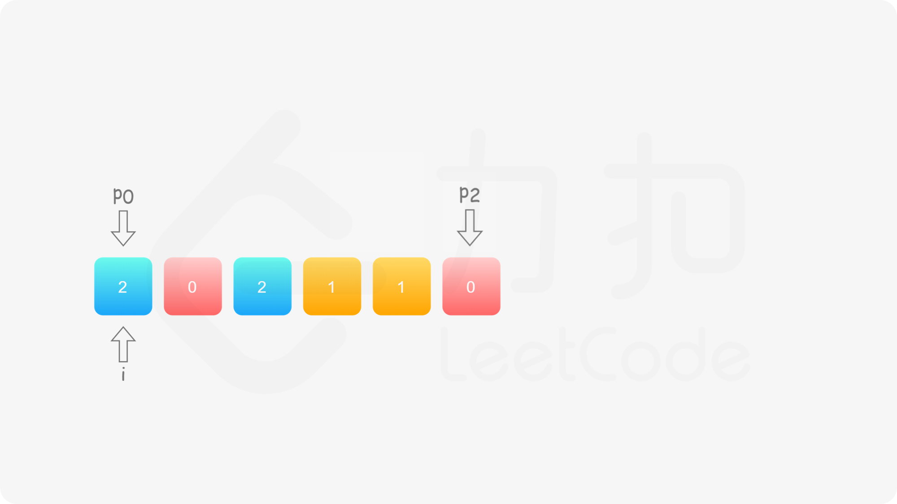
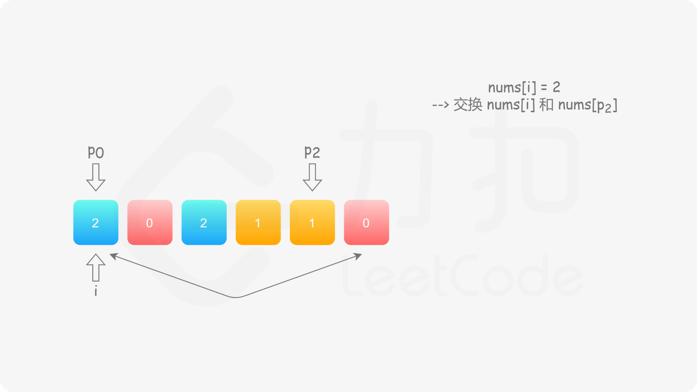
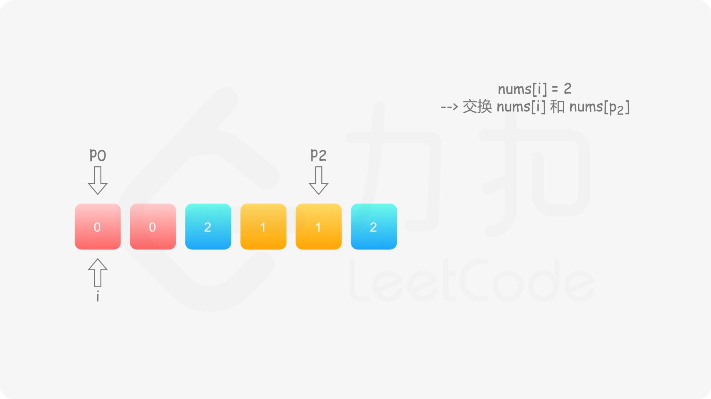
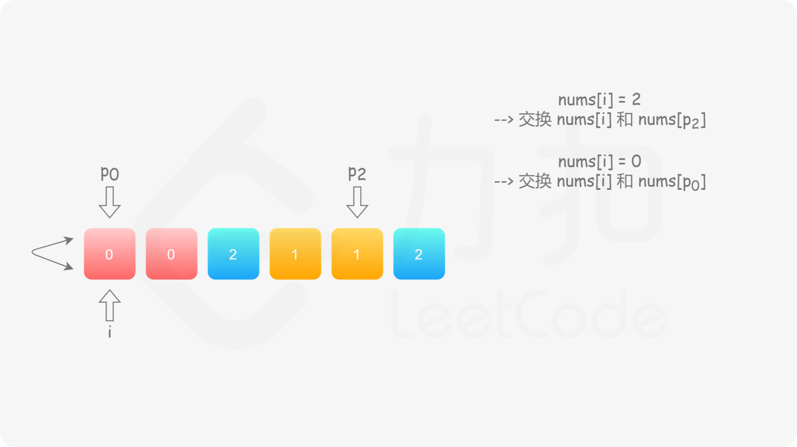
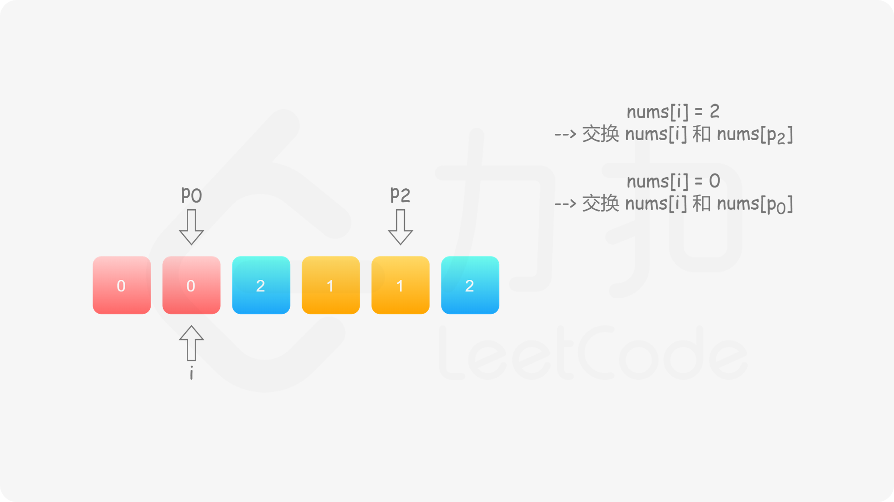
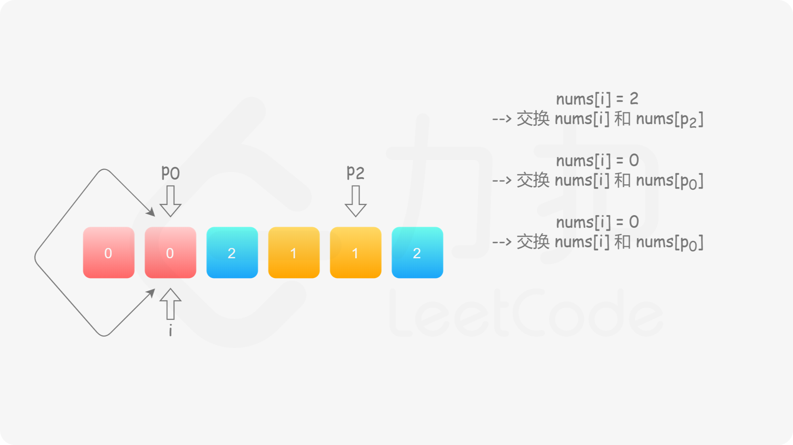
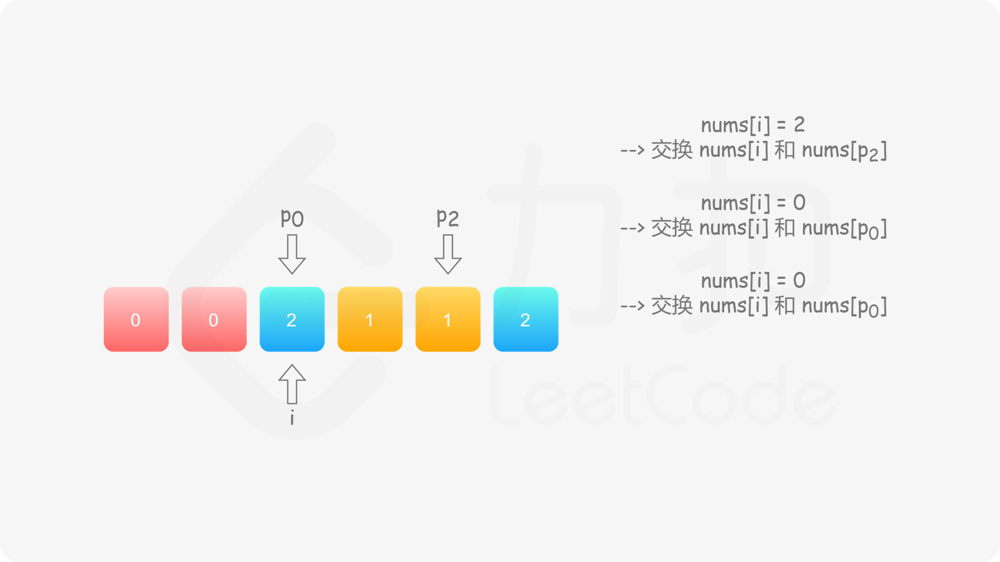
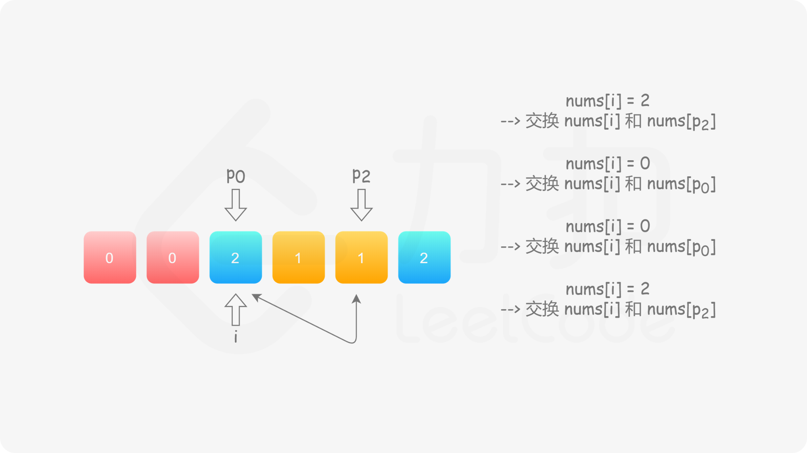
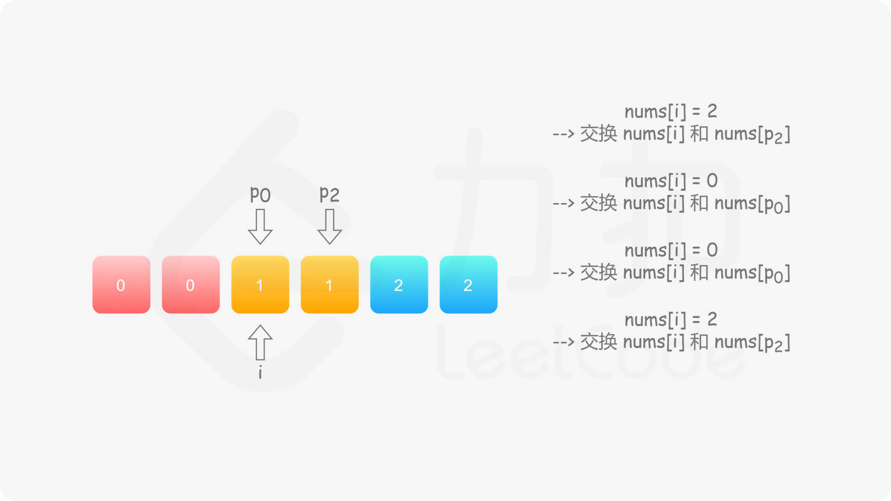
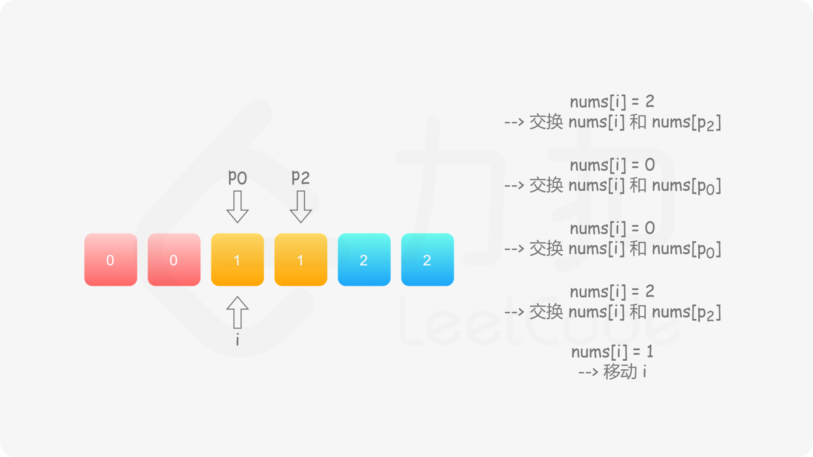
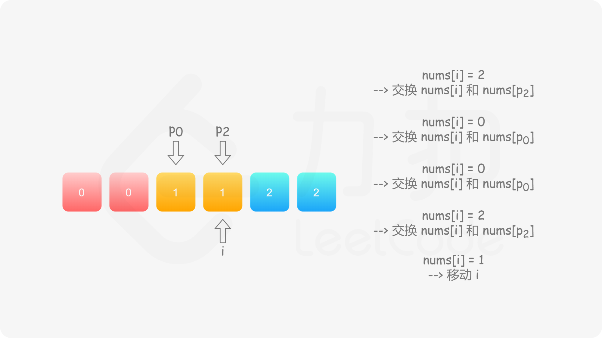
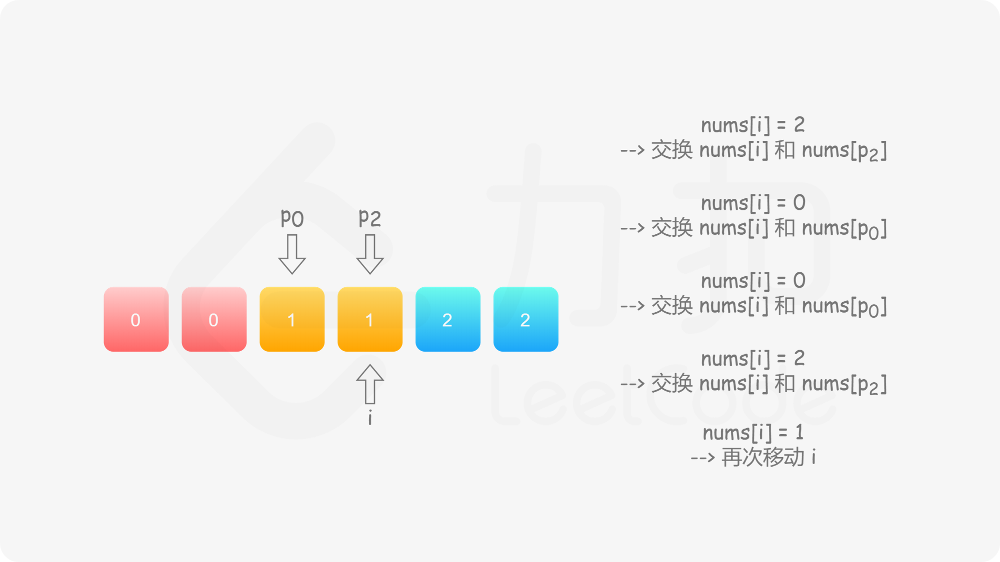
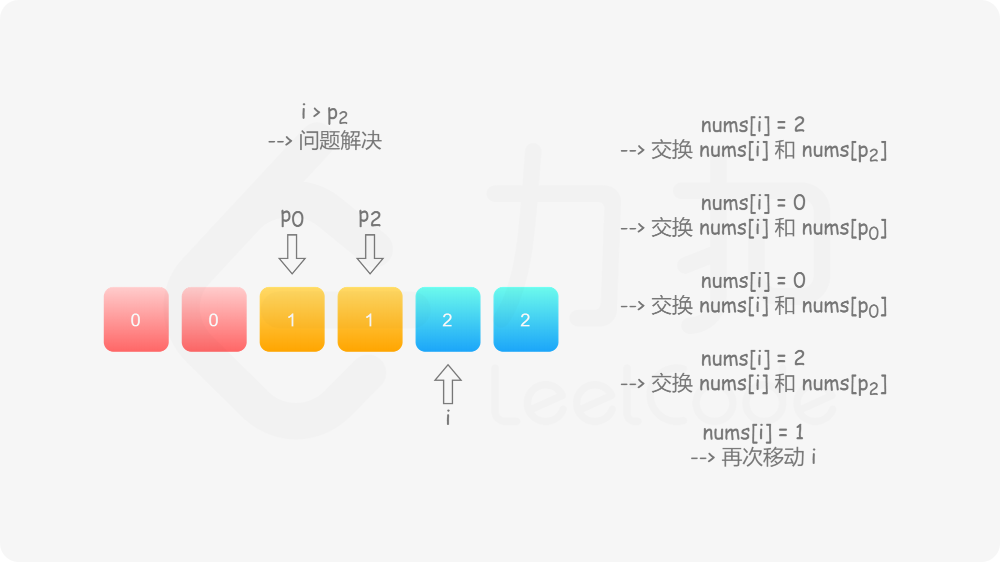

**代码**

```C++
class Solution {
public:
    void sortColors(vector<int>& nums) {
        int n = nums.size();
        int p0 = 0, p2 = n - 1;
        for (int i = 0; i <= p2; ++i) {
            while (i <= p2 && nums[i] == 2) {
                swap(nums[i], nums[p2]);
                --p2;
            }
            if (nums[i] == 0) {
                swap(nums[i], nums[p0]);
                ++p0;
            }
        }
    }
};
```

```Java
class Solution {
    public void sortColors(int[] nums) {
        int n = nums.length;
        int p0 = 0, p2 = n - 1;
        for (int i = 0; i <= p2; ++i) {
            while (i <= p2 && nums[i] == 2) {
                int temp = nums[i];
                nums[i] = nums[p2];
                nums[p2] = temp;
                --p2;
            }
            if (nums[i] == 0) {
                int temp = nums[i];
                nums[i] = nums[p0];
                nums[p0] = temp;
                ++p0;
            }
        }
    }
}
```

```Python
class Solution:
    def sortColors(self, nums: List[int]) -> None:
        n = len(nums)
        p0, p2 = 0, n - 1
        i = 0
        while i <= p2:
            while i <= p2 and nums[i] == 2:
                nums[i], nums[p2] = nums[p2], nums[i]
                p2 -= 1
            if nums[i] == 0:
                nums[i], nums[p0] = nums[p0], nums[i]
                p0 += 1
            i += 1
```

```Go
func sortColors(nums []int) {
    p0, p2 := 0, len(nums)-1
    for i := 0; i <= p2; i++ {
        for ; i <= p2 && nums[i] == 2; p2-- {
            nums[i], nums[p2] = nums[p2], nums[i]
        }
        if nums[i] == 0 {
            nums[i], nums[p0] = nums[p0], nums[i]
            p0++
        }
    }
}
```

```C
void swap(int *a, int *b) {
    int t = *a;
    *a = *b, *b = t;
}

void sortColors(int *nums, int numsSize) {
    int p0 = 0, p2 = numsSize - 1;
    for (int i = 0; i <= p2; ++i) {
        while (i <= p2 && nums[i] == 2) {
            swap(&nums[i], &nums[p2]);
            --p2;
        }
        if (nums[i] == 0) {
            swap(&nums[i], &nums[p0]);
            ++p0;
        }
    }
}
```

**复杂度分析**

- 时间复杂度：$O(n)$，其中 $n$ 是数组 $nums$ 的长度。
- 空间复杂度：$O(1)$。
