#### [](https://leetcode.cn/problems/binary-tree-inorder-traversal/solution/er-cha-shu-de-zhong-xu-bian-li-by-leetcode-solutio//#方法二：迭代)方法二：迭代

**思路与算法**

方法一的递归函数我们也可以用迭代的方式实现，两种方式是等价的，区别在于递归的时候隐式地维护了一个栈，而我们在迭代的时候需要显式地将这个栈模拟出来，其他都相同，具体实现可以看下面的代码。


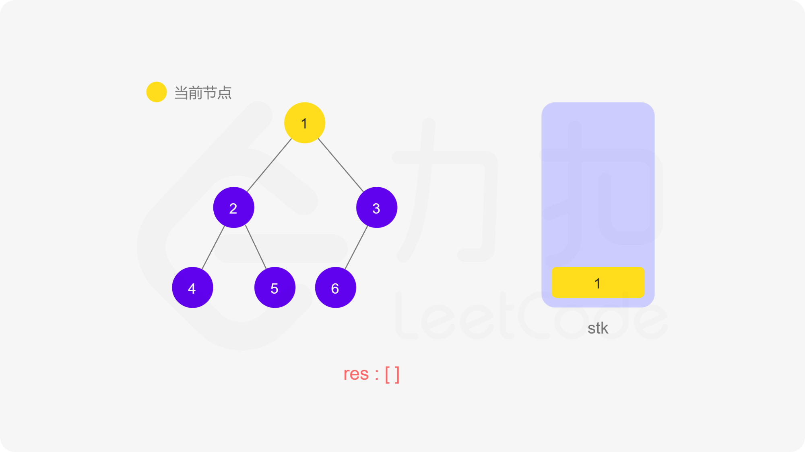
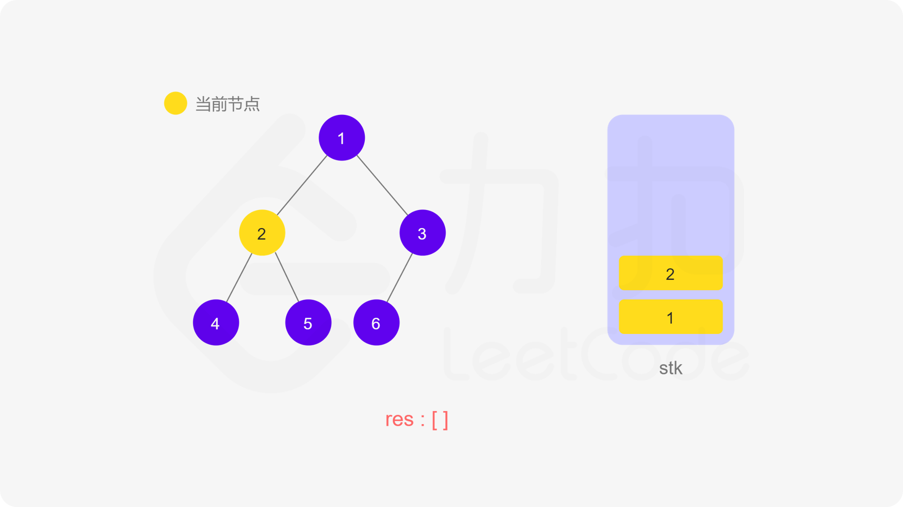

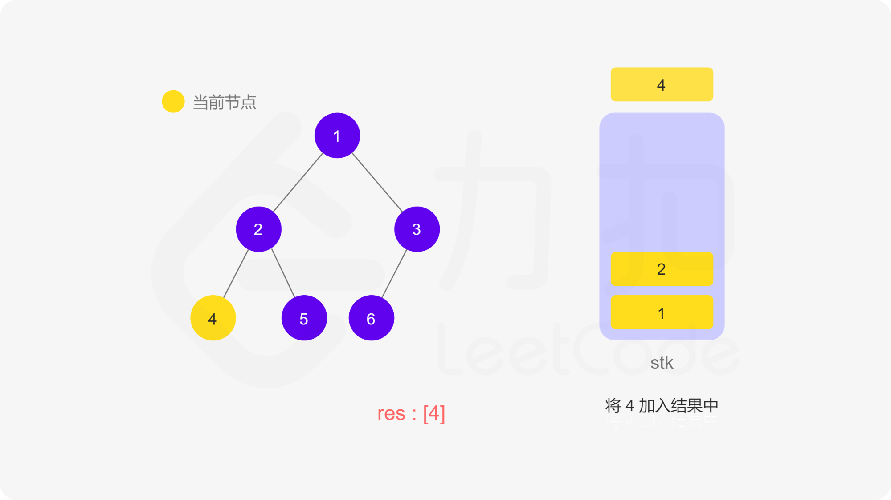
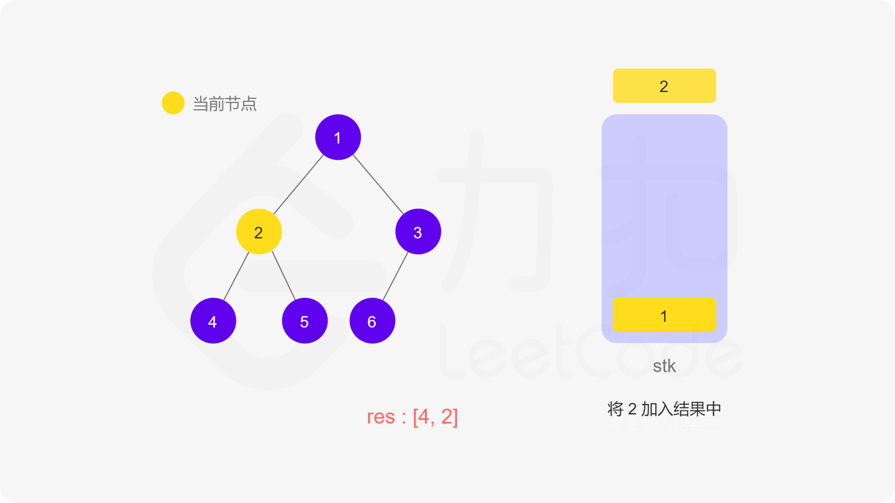
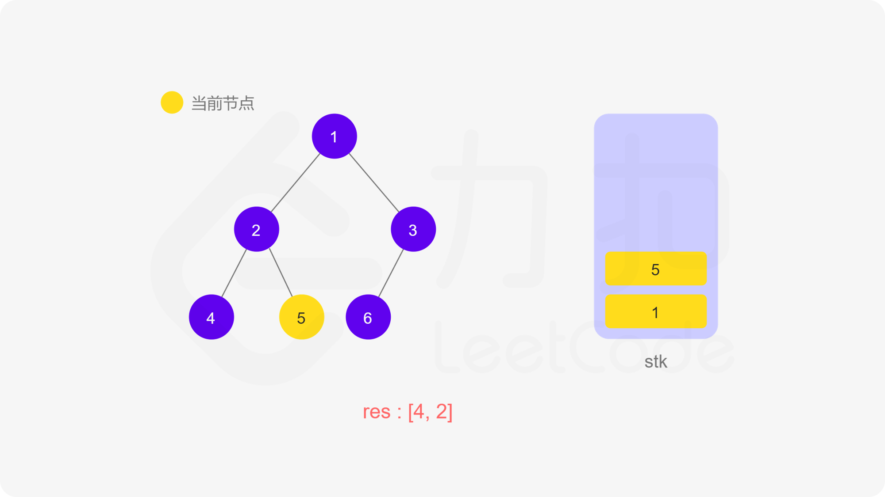

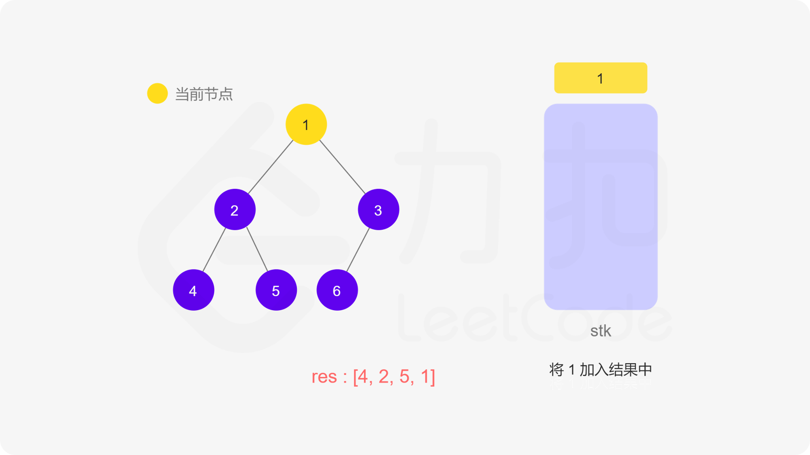
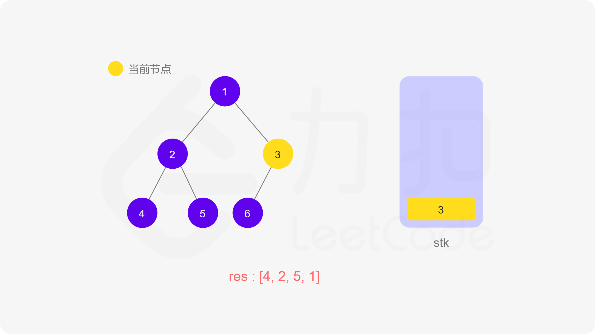
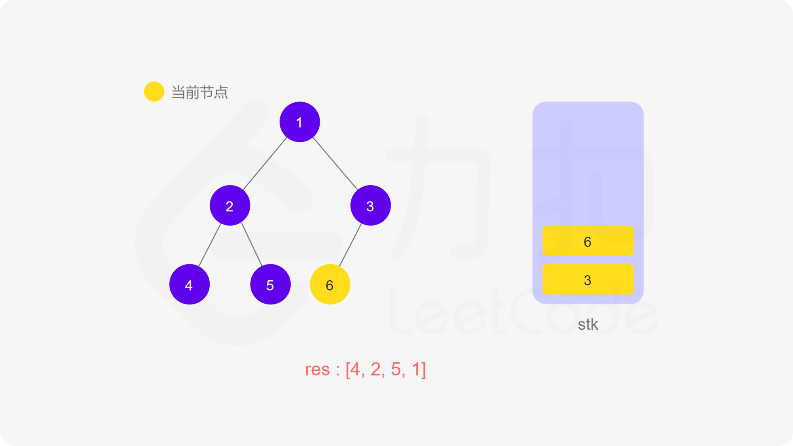
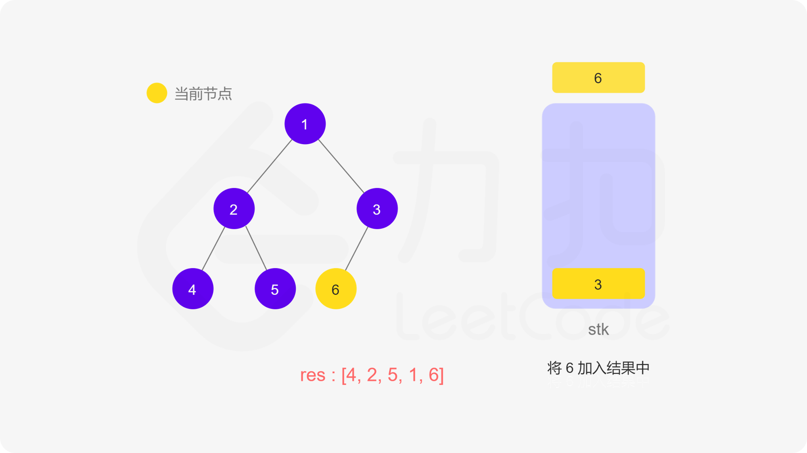
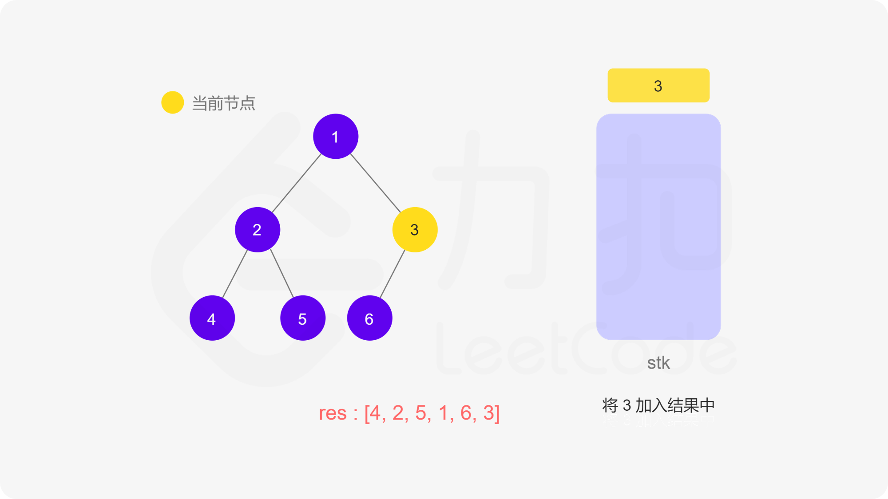
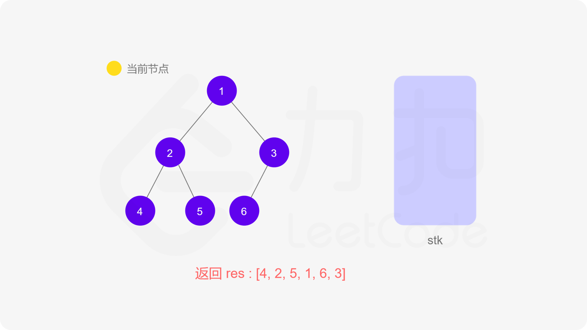

**代码**

```C++
class Solution {
public:
    vector<int> inorderTraversal(TreeNode* root) {
        vector<int> res;
        stack<TreeNode*> stk;
        while (root != nullptr || !stk.empty()) {
            while (root != nullptr) {
                stk.push(root);
                root = root->left;
            }
            root = stk.top();
            stk.pop();
            res.push_back(root->val);
            root = root->right;
        }
        return res;
    }
};
```

```Java
class Solution {
    public List<Integer> inorderTraversal(TreeNode root) {
        List<Integer> res = new ArrayList<Integer>();
        Deque<TreeNode> stk = new LinkedList<TreeNode>();
        while (root != null || !stk.isEmpty()) {
            while (root != null) {
                stk.push(root);
                root = root.left;
            }
            root = stk.pop();
            res.add(root.val);
            root = root.right;
        }
        return res;
    }
}
```

```JavaScript
var inorderTraversal = function(root) {
    const res = [];
    const stk = [];
    while (root || stk.length) {
        while (root) {
            stk.push(root);
            root = root.left;
        }
        root = stk.pop();
        res.push(root.val);
        root = root.right;
    }
    return res;
};
```

```Go
func inorderTraversal(root *TreeNode) (res []int) {
    stack := []*TreeNode{}
    for root != nil || len(stack) > 0 {
        for root != nil {
            stack = append(stack, root)
            root = root.Left
        }
        root = stack[len(stack)-1]
        stack = stack[:len(stack)-1]
        res = append(res, root.Val)
        root = root.Right
    }
    return
}
```

```C
int* inorderTraversal(struct TreeNode* root, int* returnSize) {
    *returnSize = 0;
    int* res = malloc(sizeof(int) * 501);
    struct TreeNode** stk = malloc(sizeof(struct TreeNode*) * 501);
    int top = 0;
    while (root != NULL || top > 0) {
        while (root != NULL) {
            stk[top++] = root;
            root = root->left;
        }
        root = stk[--top];
        res[(*returnSize)++] = root->val;
        root = root->right;
    }
    return res;
}
```

**复杂度分析**

-   时间复杂度：O(n)，其中 n 为二叉树节点的个数。二叉树的遍历中每个节点会被访问一次且只会被访问一次。
-   空间复杂度：O(n)。空间复杂度取决于栈深度，而栈深度在二叉树为一条链的情况下会达到 O(n) 的级别。
