#### [](https://leetcode.cn/problems/binary-tree-inorder-traversal/solution/er-cha-shu-de-zhong-xu-bian-li-by-leetcode-solutio//#方法三：morris-中序遍历)方法三：Morris 中序遍历

**思路与算法**

**Morris 遍历算法**是另一种遍历二叉树的方法，它能将非递归的中序遍历空间复杂度降为 O(1)。

**Morris 遍历算法**整体步骤如下（假设当前遍历到的节点为 x）：

1.  如果 x 无左孩子，先将 x 的值加入答案数组，再访问 x 的右孩子，即 x\=x.right。
2.  如果 x 有左孩子，则找到 x 左子树上最右的节点（**即左子树中序遍历的最后一个节点，xxx 在中序遍历中的前驱节点**），我们记为 predecessor。根据 predecessor 的右孩子是否为空，进行如下操作。
    -   如果 predecessor 的右孩子为空，则将其右孩子指向 x，然后访问 x 的左孩子，即 x\=x.left。
    -   如果 predecessor 的右孩子不为空，则此时其右孩子指向 x，说明我们已经遍历完 x 的左子树，我们将 predecessor 的右孩子置空，将 x 的值加入答案数组，然后访问 x 的右孩子，即 x\=x.right。
3.  重复上述操作，直至访问完整棵树。

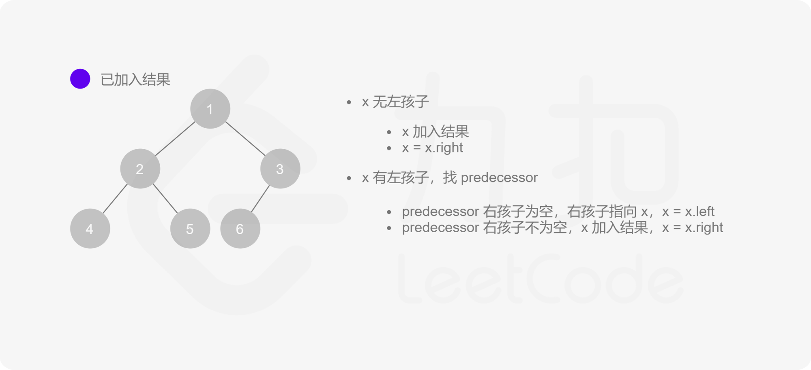
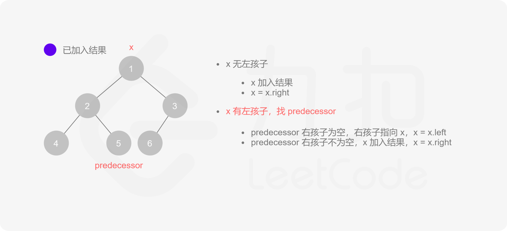

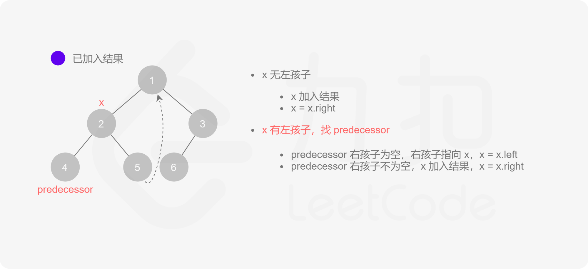
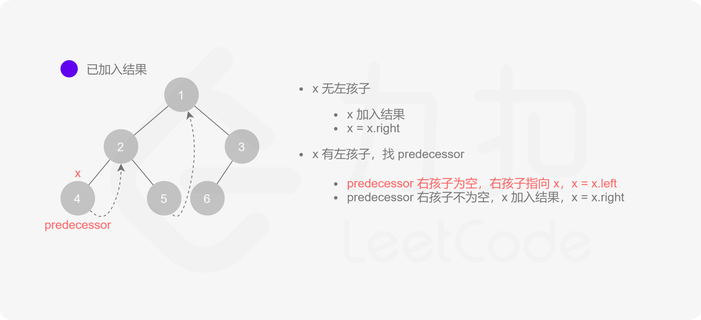
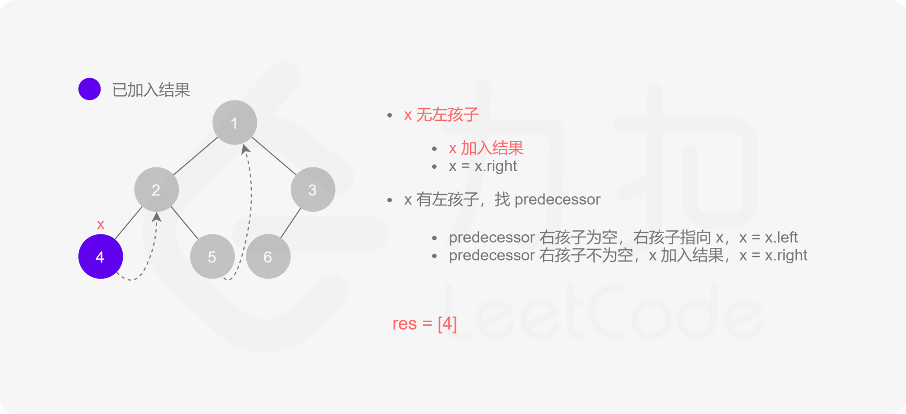
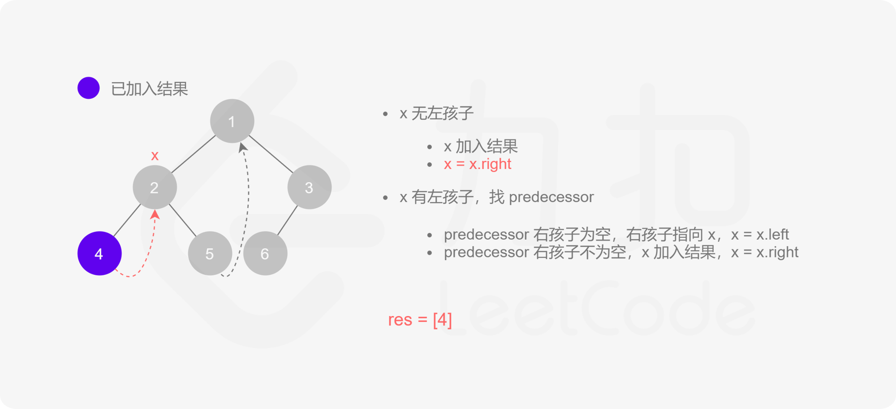
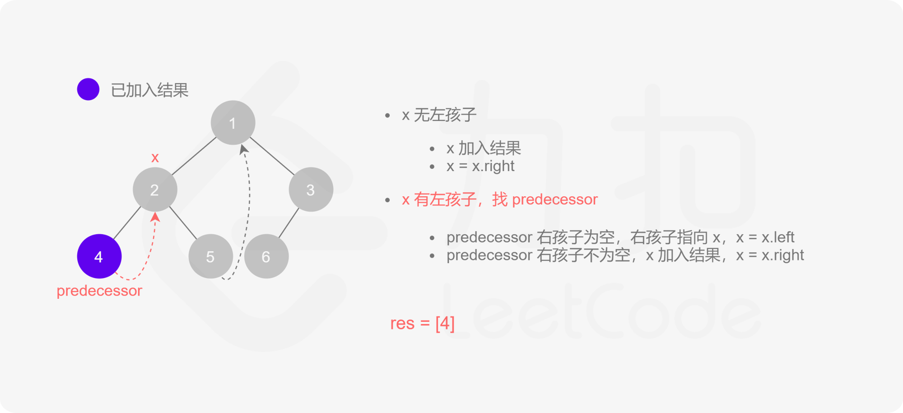


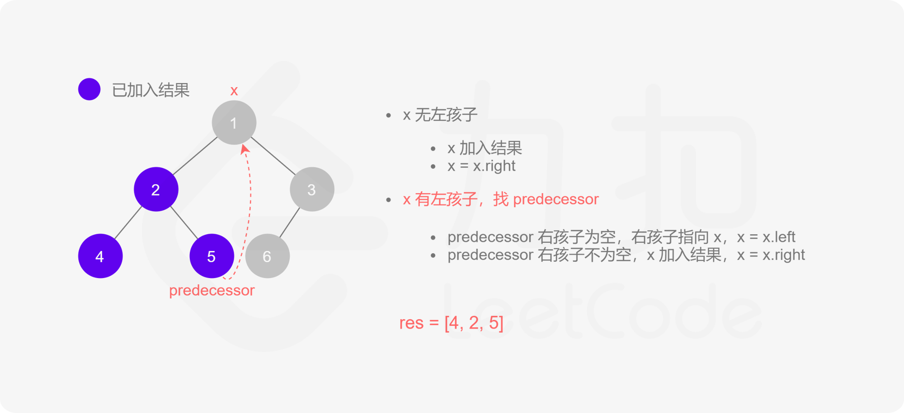


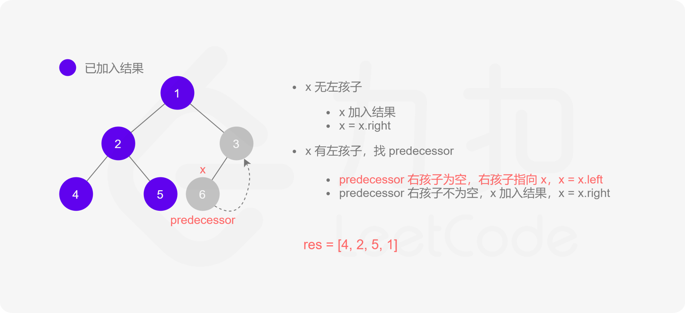
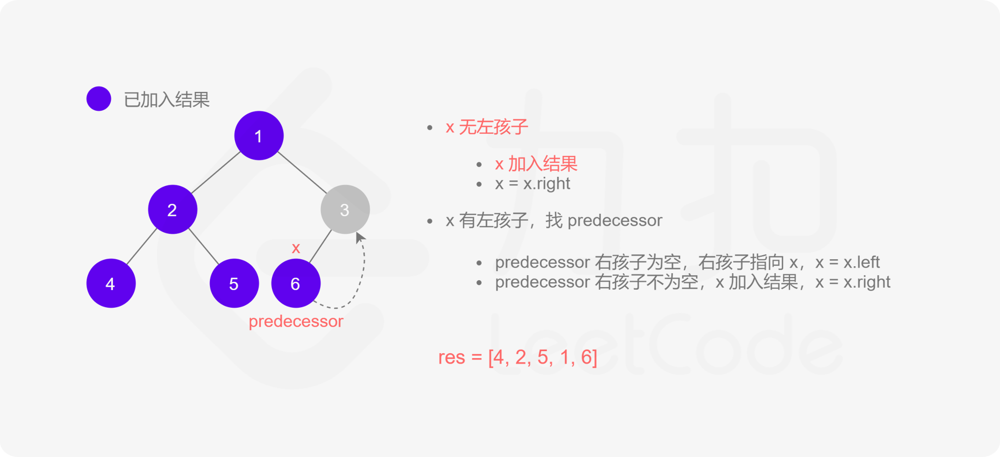

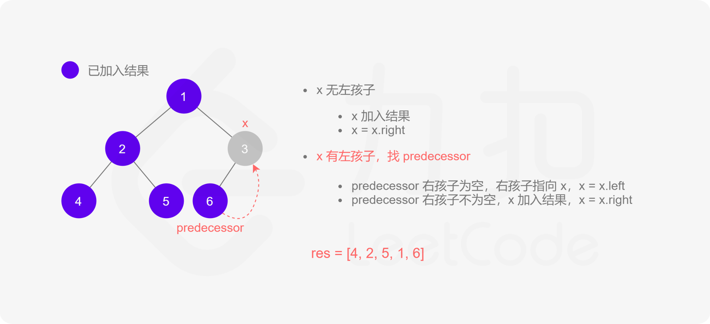
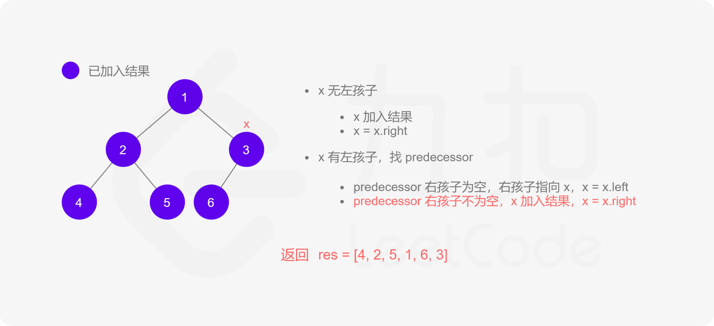

其实整个过程我们就多做一步：假设当前遍历到的节点为 x，将 x 的左子树中最右边的节点的右孩子指向 x，这样在左子树遍历完成后我们通过这个指向走回了 x，且能通过这个指向知晓我们已经遍历完成了左子树，而不用再通过栈来维护，省去了栈的空间复杂度。

**代码**

```C++
class Solution {
public:
    vector<int> inorderTraversal(TreeNode* root) {
        vector<int> res;
        TreeNode *predecessor = nullptr;

        while (root != nullptr) {
            if (root->left != nullptr) {
                // predecessor 节点就是当前 root 节点向左走一步，然后一直向右走至无法走为止
                predecessor = root->left;
                while (predecessor->right != nullptr && predecessor->right != root) {
                    predecessor = predecessor->right;
                }
                
                // 让 predecessor 的右指针指向 root，继续遍历左子树
                if (predecessor->right == nullptr) {
                    predecessor->right = root;
                    root = root->left;
                }
                // 说明左子树已经访问完了，我们需要断开链接
                else {
                    res.push_back(root->val);
                    predecessor->right = nullptr;
                    root = root->right;
                }
            }
            // 如果没有左孩子，则直接访问右孩子
            else {
                res.push_back(root->val);
                root = root->right;
            }
        }
        return res;
    }
};
```

```Java
class Solution {
    public List<Integer> inorderTraversal(TreeNode root) {
        List<Integer> res = new ArrayList<Integer>();
        TreeNode predecessor = null;

        while (root != null) {
            if (root.left != null) {
                // predecessor 节点就是当前 root 节点向左走一步，然后一直向右走至无法走为止
                predecessor = root.left;
                while (predecessor.right != null && predecessor.right != root) {
                    predecessor = predecessor.right;
                }
                
                // 让 predecessor 的右指针指向 root，继续遍历左子树
                if (predecessor.right == null) {
                    predecessor.right = root;
                    root = root.left;
                }
                // 说明左子树已经访问完了，我们需要断开链接
                else {
                    res.add(root.val);
                    predecessor.right = null;
                    root = root.right;
                }
            }
            // 如果没有左孩子，则直接访问右孩子
            else {
                res.add(root.val);
                root = root.right;
            }
        }
        return res;
    }
}
```

```JavaScript
var inorderTraversal = function(root) {
    const res = [];
    let predecessor = null;

    while (root) {
        if (root.left) {
            // predecessor 节点就是当前 root 节点向左走一步，然后一直向右走至无法走为止
            predecessor = root.left;
            while (predecessor.right && predecessor.right !== root) {
                predecessor = predecessor.right;
            }

            // 让 predecessor 的右指针指向 root，继续遍历左子树
            if (!predecessor.right) {
                predecessor.right = root;
                root = root.left;
            }
            // 说明左子树已经访问完了，我们需要断开链接
            else {
                res.push(root.val);
                predecessor.right = null;
                root = root.right;
            }
        }
        // 如果没有左孩子，则直接访问右孩子
        else {
            res.push(root.val);
            root = root.right;
        }
    }

    return res;
};
```

```Go
func inorderTraversal(root *TreeNode) (res []int) {
    for root != nil {
        if root.Left != nil {
            // predecessor 节点表示当前 root 节点向左走一步，然后一直向右走至无法走为止的节点
            predecessor := root.Left
            for predecessor.Right != nil && predecessor.Right != root {
                // 有右子树且没有设置过指向 root，则继续向右走
                predecessor = predecessor.Right
            }
            if predecessor.Right == nil {
                // 将 predecessor 的右指针指向 root，这样后面遍历完左子树 root.Left 后，就能通过这个指向回到 root
                predecessor.Right = root
                // 遍历左子树
                root = root.Left
            } else { // predecessor 的右指针已经指向了 root，则表示左子树 root.Left 已经访问完了
                res = append(res, root.Val)
                // 恢复原样
                predecessor.Right = nil
                // 遍历右子树
                root = root.Right
            }
        } else { // 没有左子树
            res = append(res, root.Val)
            // 若有右子树，则遍历右子树
            // 若没有右子树，则整颗左子树已遍历完，root 会通过之前设置的指向回到这颗子树的父节点
            root = root.Right
        }
    }
    return
}
```

```C
int* inorderTraversal(struct TreeNode* root, int* returnSize) {
    int* res = malloc(sizeof(int) * 501);
    *returnSize = 0;
    struct TreeNode* predecessor = NULL;

    while (root != NULL) {
        if (root->left != NULL) {
            // predecessor 节点就是当前 root 节点向左走一步，然后一直向右走至无法走为止
            predecessor = root->left;
            while (predecessor->right != NULL && predecessor->right != root) {
                predecessor = predecessor->right;
            }

            // 让 predecessor 的右指针指向 root，继续遍历左子树
            if (predecessor->right == NULL) {
                predecessor->right = root;
                root = root->left;
            }
            // 说明左子树已经访问完了，我们需要断开链接
            else {
                res[(*returnSize)++] = root->val;
                predecessor->right = NULL;
                root = root->right;
            }
        }
        // 如果没有左孩子，则直接访问右孩子
        else {
            res[(*returnSize)++] = root->val;
            root = root->right;
        }
    }
    return res;
}
```

**复杂度分析**

-   时间复杂度：O(n)，其中 n 为二叉搜索树的节点个数。Morris 遍历中每个节点会被访问两次，因此总时间复杂度为 O(2n)\=O(n)。
-   空间复杂度：O(1)。
