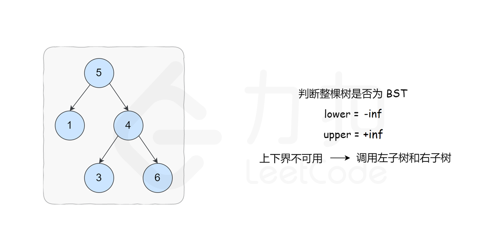
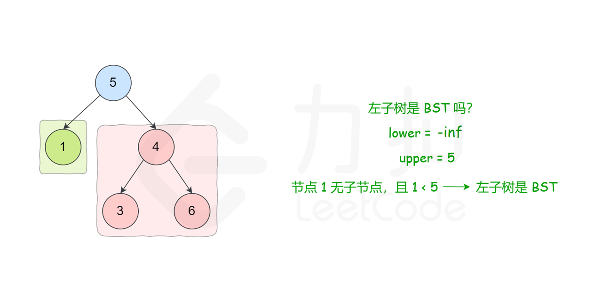
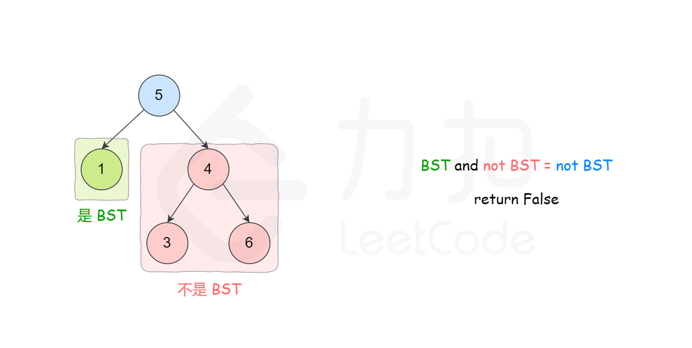

### [验证二叉搜索树](https://leetcode.cn/problems/validate-binary-search-tree/solutions/230256/yan-zheng-er-cha-sou-suo-shu-by-leetcode-solution/?envType=problem-list-v2&envId=tBJHVASZ)

#### 方法一: 递归

**思路和算法**

要解决这道题首先我们要了解二叉搜索树有什么性质可以给我们利用，由题目给出的信息我们可以知道：**如果该二叉树的左子树不为空，则左子树上所有节点的值均小于它的根节点的值； 若它的右子树不空，则右子树上所有节点的值均大于它的根节点的值；它的左右子树也为二叉搜索树。**

这启示我们设计一个递归函数 `helper(root, lower, upper)` 来递归判断，函数表示考虑以 `root` 为根的子树，判断子树中所有节点的值是否都在 $(l,r)$ 的范围内（**注意是开区间**）。如果 `root` 节点的值 `val` 不在 $(l,r)$ 的范围内说明不满足条件直接返回，否则我们要继续递归调用检查它的左右子树是否满足，如果都满足才说明这是一棵二叉搜索树。

那么根据二叉搜索树的性质，在递归调用左子树时，我们需要把上界 `upper` 改为 `root.val`，即调用 `helper(root.left, lower, root.val)`，因为左子树里所有节点的值均小于它的根节点的值。同理递归调用右子树时，我们需要把下界 `lower` 改为 `root.val`，即调用 `helper(root.right, root.val, upper)`。

函数递归调用的入口为 `helper(root, -inf, +inf)`， `inf` 表示一个无穷大的值。

下图展示了算法如何应用在示例 $2$ 上：






```C++
class Solution {
public:
    bool helper(TreeNode* root, long long lower, long long upper) {
        if (root == nullptr) {
            return true;
        }
        if (root -> val <= lower || root -> val >= upper) {
            return false;
        }
        return helper(root -> left, lower, root -> val) && helper(root -> right, root -> val, upper);
    }
    bool isValidBST(TreeNode* root) {
        return helper(root, LONG_MIN, LONG_MAX);
    }
};
```

```JavaScript
const helper = (root, lower, upper) => {
    if (root === null) {
        return true;
    }
    if (root.val <= lower || root.val >= upper) {
        return false;
    }
    return helper(root.left, lower, root.val) && helper(root.right, root.val, upper);
}
var isValidBST = function(root) {
    return helper(root, -Infinity, Infinity);
};
```

```Java
class Solution {
    public boolean isValidBST(TreeNode root) {
        return isValidBST(root, Long.MIN_VALUE, Long.MAX_VALUE);
    }

    public boolean isValidBST(TreeNode node, long lower, long upper) {
        if (node == null) {
            return true;
        }
        if (node.val <= lower || node.val >= upper) {
            return false;
        }
        return isValidBST(node.left, lower, node.val) && isValidBST(node.right, node.val, upper);
    }
}
```

```Python
class Solution:
    def isValidBST(self, root: TreeNode) -> bool:
        def helper(node, lower = float('-inf'), upper = float('inf')) -> bool:
            if not node:
                return True
            
            val = node.val
            if val <= lower or val >= upper:
                return False

            if not helper(node.right, val, upper):
                return False
            if not helper(node.left, lower, val):
                return False
            return True

        return helper(root)
```

```Go
func isValidBST(root *TreeNode) bool {
    return helper(root, math.MinInt64, math.MaxInt64)
}

func helper(root *TreeNode, lower, upper int) bool {
    if root == nil {
        return true
    }
    if root.Val <= lower || root.Val >= upper {
        return false
    }
    return helper(root.Left, lower, root.Val) && helper(root.Right, root.Val, upper)
}
```

**复杂度分析**

- 时间复杂度：$O(n)$，其中 $n$ 为二叉树的节点个数。在递归调用的时候二叉树的每个节点最多被访问一次，因此时间复杂度为 $O(n)$。
- 空间复杂度：$O(n)$，其中 $n$ 为二叉树的节点个数。递归函数在递归过程中需要为每一层递归函数分配栈空间，所以这里需要额外的空间且该空间取决于递归的深度，即二叉树的高度。最坏情况下二叉树为一条链，树的高度为 $n$，递归最深达到 $n$ 层，故最坏情况下空间复杂度为 $O(n)$。

#### 方法二：中序遍历

**思路和算法**

基于方法一中提及的性质，我们可以进一步知道二叉搜索树「中序遍历」得到的值构成的序列一定是升序的，这启示我们在中序遍历的时候实时检查当前节点的值是否大于前一个中序遍历到的节点的值即可。如果均大于说明这个序列是升序的，整棵树是二叉搜索树，否则不是，下面的代码我们使用栈来模拟中序遍历的过程。

可能有读者不知道中序遍历是什么，我们这里简单提及。中序遍历是二叉树的一种遍历方式，它先遍历左子树，再遍历根节点，最后遍历右子树。而我们二叉搜索树保证了左子树的节点的值均小于根节点的值，根节点的值均小于右子树的值，因此中序遍历以后得到的序列一定是升序序列。


```C++
class Solution {
public:
    bool isValidBST(TreeNode* root) {
        stack<TreeNode*> stack;
        long long inorder = (long long)INT_MIN - 1;

        while (!stack.empty() || root != nullptr) {
            while (root != nullptr) {
                stack.push(root);
                root = root -> left;
            }
            root = stack.top();
            stack.pop();
            // 如果中序遍历得到的节点的值小于等于前一个 inorder，说明不是二叉搜索树
            if (root -> val <= inorder) {
                return false;
            }
            inorder = root -> val;
            root = root -> right;
        }
        return true;
    }
};
```

```JavaScript
var isValidBST = function(root) {
    let stack = [];
    let inorder = -Infinity;

    while (stack.length || root !== null) {
        while (root !== null) {
            stack.push(root);
            root = root.left;
        }
        root = stack.pop();
        // 如果中序遍历得到的节点的值小于等于前一个 inorder，说明不是二叉搜索树
        if (root.val <= inorder) {
            return false;
        }
        inorder = root.val;
        root = root.right;
    }
    return true;
};
```

```Java
class Solution {
    public boolean isValidBST(TreeNode root) {
        Deque<TreeNode> stack = new LinkedList<TreeNode>();
        double inorder = -Double.MAX_VALUE;

        while (!stack.isEmpty() || root != null) {
            while (root != null) {
                stack.push(root);
                root = root.left;
            }
            root = stack.pop();
              // 如果中序遍历得到的节点的值小于等于前一个 inorder，说明不是二叉搜索树
            if (root.val <= inorder) {
                return false;
            }
            inorder = root.val;
            root = root.right;
        }
        return true;
    }
}
```

```Python
class Solution:
    def isValidBST(self, root: TreeNode) -> bool:
        stack, inorder = [], float('-inf')
        
        while stack or root:
            while root:
                stack.append(root)
                root = root.left
            root = stack.pop()
            # 如果中序遍历得到的节点的值小于等于前一个 inorder，说明不是二叉搜索树
            if root.val <= inorder:
                return False
            inorder = root.val
            root = root.right

        return True
```

```Go
func isValidBST(root *TreeNode) bool {
    stack := []*TreeNode{}
    inorder := math.MinInt64
    for len(stack) > 0 || root != nil {
        for root != nil {
            stack = append(stack, root)
            root = root.Left
        }
        root = stack[len(stack)-1]
        stack = stack[:len(stack)-1]
        if root.Val <= inorder {
            return false
        }
        inorder = root.Val
        root = root.Right
    }
    return true
}
```

**复杂度分析**

- 时间复杂度：$O(n)$，其中 $n$ 为二叉树的节点个数。二叉树的每个节点最多被访问一次，因此时间复杂度为 $O(n)$。
- 空间复杂度：$O(n)$，其中 $n$ 为二叉树的节点个数。栈最多存储 $n$ 个节点，因此需要额外的 $O(n)$ 的空间。
