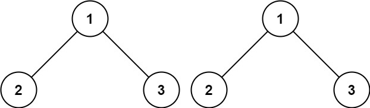

#### [100. 相同的树](https://leetcode.cn/problems/same-tree/)

难度：简单

给你两棵二叉树的根节点 `p` 和 `q` ，编写一个函数来检验这两棵树是否相同。

如果两个树在结构上相同，并且节点具有相同的值，则认为它们是相同的。

**示例 1：**



```
输入：p = [1,2,3], q = [1,2,3]
输出：true
```

**示例 2：**


```
输入：p = [1,2], q = [1,null,2]
输出：false
```

**示例 3：**


```
输入：p = [1,2,1], q = [1,1,2]
输出：false
```

**提示：**

-   两棵树上的节点数目都在范围 `[0, 100]` 内
-   `-10^4 <= Node.val <= 10^4`
