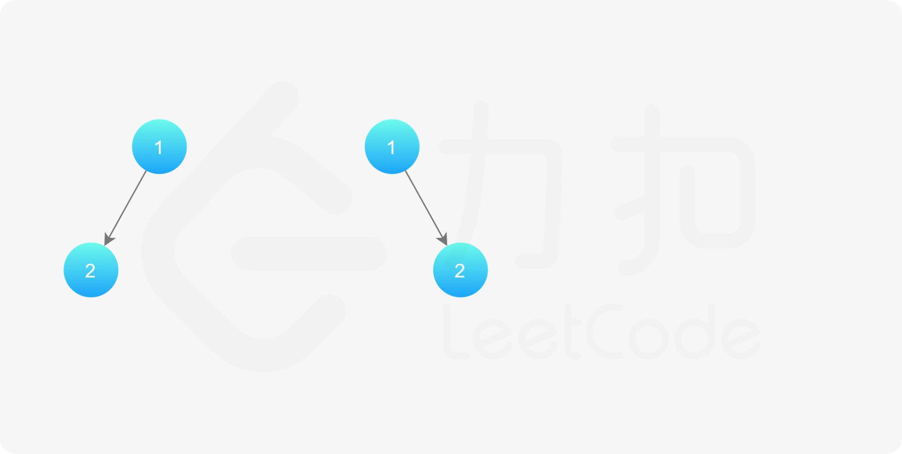
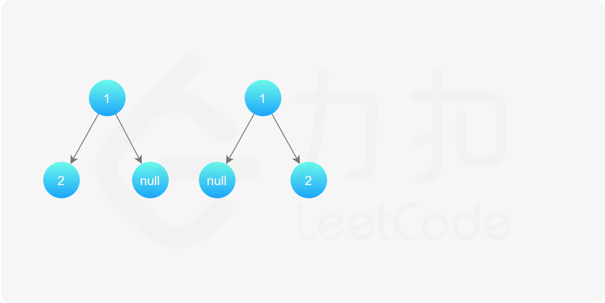
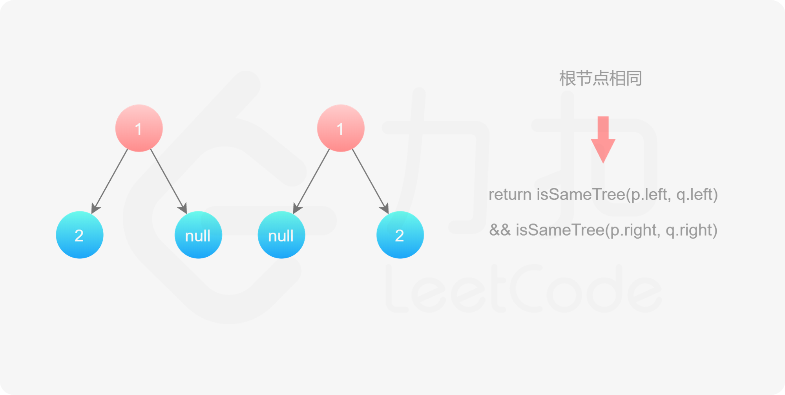
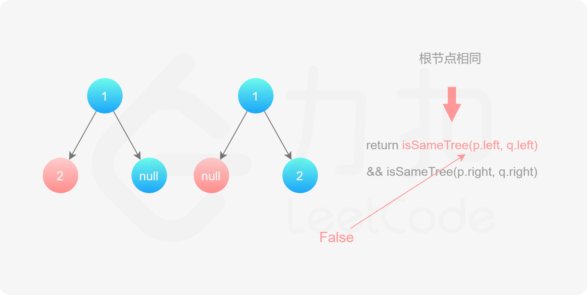
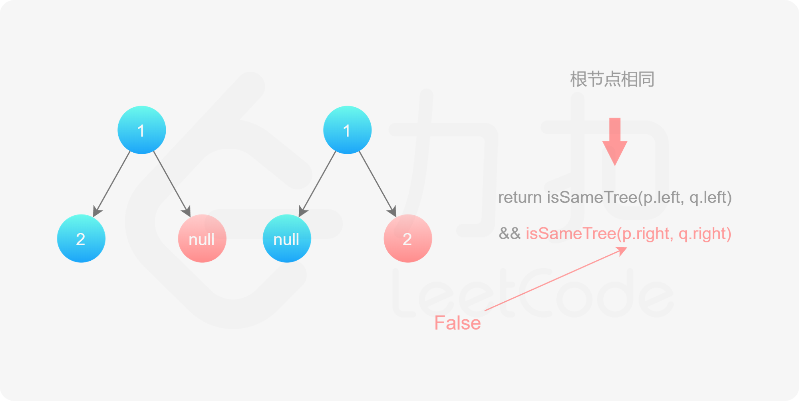
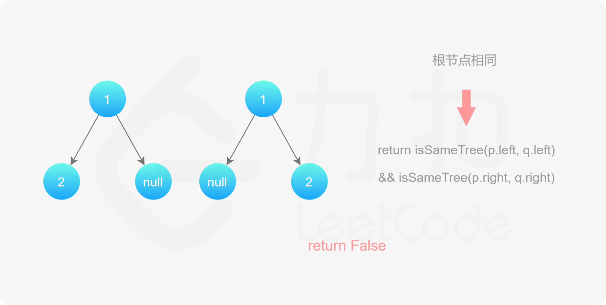

#### 前言

两个二叉树相同，当且仅当两个二叉树的结构完全相同，且所有对应节点的值相同。因此，可以通过搜索的方式判断两个二叉树是否相同。

#### [方法一：深度优先搜索](https://leetcode.cn/problems/same-tree/solutions/363636/xiang-tong-de-shu-by-leetcode-solution/)

如果两个二叉树都为空，则两个二叉树相同。如果两个二叉树中有且只有一个为空，则两个二叉树一定不相同。

如果两个二叉树都不为空，那么首先判断它们的根节点的值是否相同，若不相同则两个二叉树一定不同，若相同，再分别判断两个二叉树的左子树是否相同以及右子树是否相同。这是一个递归的过程，因此可以使用深度优先搜索，递归地判断两个二叉树是否相同。








```java
class Solution {
    public boolean isSameTree(TreeNode p, TreeNode q) {
        if (p == null && q == null) {
            return true;
        } else if (p == null || q == null) {
            return false;
        } else if (p.val != q.val) {
            return false;
        } else {
            return isSameTree(p.left, q.left) && isSameTree(p.right, q.right);
        }
    }
}
```

```python
class Solution:
    def isSameTree(self, p: TreeNode, q: TreeNode) -> bool:
        if not p and not q:
            return True
        elif not p or not q:
            return False
        elif p.val != q.val:
            return False
        else:
            return self.isSameTree(p.left, q.left) and self.isSameTree(p.right, q.right)
```

```cpp
class Solution {
public:
    bool isSameTree(TreeNode* p, TreeNode* q) {
        if (p == nullptr && q == nullptr) {
            return true;
        } else if (p == nullptr || q == nullptr) {
            return false;
        } else if (p->val != q->val) {
            return false;
        } else {
            return isSameTree(p->left, q->left) && isSameTree(p->right, q->right);
        }
    }
};
```

```c
bool isSameTree(struct TreeNode* p, struct TreeNode* q) {
    if (p == NULL && q == NULL) {
        return true;
    } else if (p == NULL || q == NULL) {
        return false;
    } else if (p->val != q->val) {
        return false;
    } else {
        return isSameTree(p->left, q->left) && isSameTree(p->right, q->right);
    }
}
```

```go
func isSameTree(p *TreeNode, q *TreeNode) bool {
    if p == nil && q == nil {
        return true
    }
    if p == nil || q == nil {
        return false
    }
    if p.Val != q.Val {
        return false
    }
    return isSameTree(p.Left, q.Left) && isSameTree(p.Right, q.Right)
}
```

**复杂度分析**

-   时间复杂度：$O(\min(m,n))$，其中 $m$ 和 $n$ 分别是两个二叉树的节点数。对两个二叉树同时进行深度优先搜索，只有当两个二叉树中的对应节点都不为空时才会访问到该节点，因此被访问到的节点数不会超过较小的二叉树的节点数。
-   空间复杂度：$O(\min(m,n))$，其中 $m$ 和 $n$ 分别是两个二叉树的节点数。空间复杂度取决于递归调用的层数，递归调用的层数不会超过较小的二叉树的最大高度，最坏情况下，二叉树的高度等于节点数。
