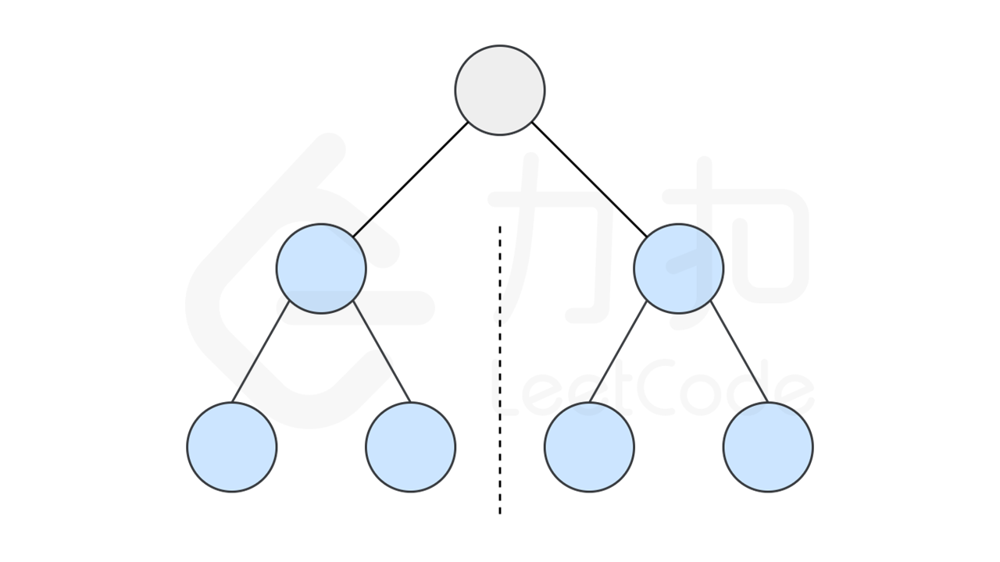
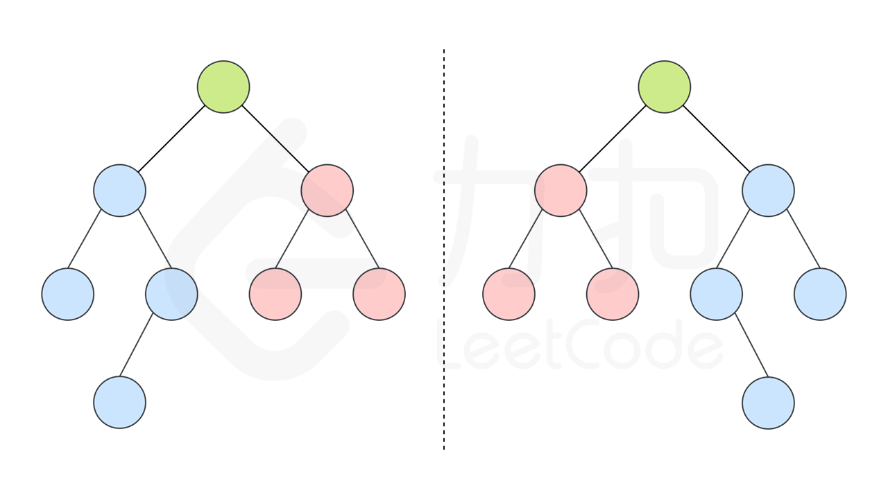

#### [方法一：递归](https://leetcode.cn/problems/symmetric-tree/solutions/268109/dui-cheng-er-cha-shu-by-leetcode-solution/)

**思路和算法**

如果一个树的左子树与右子树镜像对称，那么这个树是对称的。



因此，该问题可以转化为：两个树在什么情况下互为镜像？

如果同时满足下面的条件，两个树互为镜像：
-   它们的两个根结点具有相同的值
-   每个树的右子树都与另一个树的左子树镜像对称



我们可以实现这样一个递归函数，通过「同步移动」两个指针的方法来遍历这棵树，$p$ 指针和 $q$ 指针一开始都指向这棵树的根，随后 $p$ 右移时，$q$ 左移，$p$ 左移时，$q$ 右移。每次检查当前 $p$ 和 $q$ 节点的值是否相等，如果相等再判断左右子树是否对称。

代码如下。

```cpp
class Solution {
public:
    bool check(TreeNode *p, TreeNode *q) {
        if (!p && !q) return true;
        if (!p || !q) return false;
        return p->val == q->val && check(p->left, q->right) && check(p->right, q->left);
    }

    bool isSymmetric(TreeNode* root) {
        return check(root, root);
    }
};
```

```java
class Solution {
    public boolean isSymmetric(TreeNode root) {
        return check(root, root);
    }

    public boolean check(TreeNode p, TreeNode q) {
        if (p == null && q == null) {
            return true;
        }
        if (p == null || q == null) {
            return false;
        }
        return p.val == q.val && check(p.left, q.right) && check(p.right, q.left);
    }
}
```

```go
func isSymmetric(root *TreeNode) bool {
    return check(root, root)
}

func check(p, q *TreeNode) bool {
    if p == nil && q == nil {
        return true
    }
    if p == nil || q == nil {
        return false
    }
    return p.Val == q.Val && check(p.Left, q.Right) && check(p.Right, q.Left) 
}
```

```typescript
const check = (p: TreeNode | null, q: TreeNode | null): boolean => {
    if (!p && !q) return true;
    if (!p || !q) return false;
    return p.val === q.val && check(p.left, q.right) && check(p.right, q.left);
}
var isSymmetric = function(root: TreeNode | null): boolean {
    return check(root, root);
};
```

**复杂度分析**

假设树上一共 $n$ 个节点。
-   时间复杂度：这里遍历了这棵树，渐进时间复杂度为 $O(n)$。
-   空间复杂度：这里的空间复杂度和递归使用的栈空间有关，这里递归层数不超过 $n$，故渐进空间复杂度为 $O(n)$。
