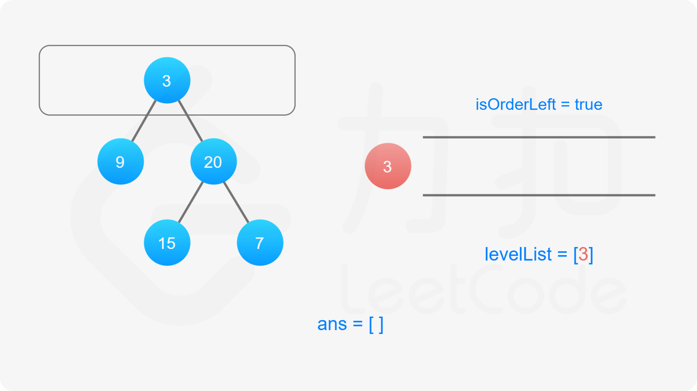

### [二叉树的锯齿形层序遍历](https://leetcode.cn/problems/binary-tree-zigzag-level-order-traversal/solutions/530400/er-cha-shu-de-ju-chi-xing-ceng-xu-bian-l-qsun/)

#### 方法一：广度优先遍历

此题是「[102. 二叉树的层序遍历](https://leetcode-cn.com/problems/binary-tree-level-order-traversal/)」的变种，最后输出的要求有所变化，要求我们按层数的奇偶来决定每一层的输出顺序。规定二叉树的根节点为第 $0$ 层，如果当前层数是偶数，**从左至右**输出当前层的节点值，否则，**从右至左**输出当前层的节点值。

我们依然可以沿用第 102 题的思想，修改广度优先搜索，对树进行逐层遍历，用队列维护当前层的所有元素，当队列不为空的时候，求得当前队列的长度 $\textit{size}$，每次从队列中取出 $\textit{size}$ 个元素进行拓展，然后进行下一次迭代。

为了满足题目要求的**返回值**为「先从左往右，再从右往左」交替输出的锯齿形，我们可以利用「双端队列」的数据结构来维护当前层节点值输出的顺序。

双端队列是一个可以在队列任意一端插入元素的队列。在广度优先搜索遍历当前层节点拓展下一层节点的时候我们仍然从左往右按顺序拓展，但是对当前层节点的存储我们维护一个变量 $\textit{isOrderLeft}$ 记录是从左至右还是从右至左的：

- 如果从左至右，我们每次将被遍历到的元素插入至双端队列的末尾。
- 如果从右至左，我们每次将被遍历到的元素插入至双端队列的头部。

当遍历结束的时候我们就得到了答案数组。





```c++
class Solution {
public:
    vector<vector<int>> zigzagLevelOrder(TreeNode* root) {
        vector<vector<int>> ans;
        if (!root) {
            return ans;
        }

        queue<TreeNode*> nodeQueue;
        nodeQueue.push(root);
        bool isOrderLeft = true;

        while (!nodeQueue.empty()) {
            deque<int> levelList;
            int size = nodeQueue.size();
            for (int i = 0; i < size; ++i) {
                auto node = nodeQueue.front();
                nodeQueue.pop();
                if (isOrderLeft) {
                    levelList.push_back(node->val);
                } else {
                    levelList.push_front(node->val);
                }
                if (node->left) {
                    nodeQueue.push(node->left);
                }
                if (node->right) {
                    nodeQueue.push(node->right);
                }
            }
            ans.emplace_back(vector<int>{levelList.begin(), levelList.end()});
            isOrderLeft = !isOrderLeft;
        }

        return ans;
    }
};
```

```java
class Solution {
    public List<List<Integer>> zigzagLevelOrder(TreeNode root) {
        List<List<Integer>> ans = new LinkedList<List<Integer>>();
        if (root == null) {
            return ans;
        }

        Queue<TreeNode> nodeQueue = new ArrayDeque<TreeNode>();
        nodeQueue.offer(root);
        boolean isOrderLeft = true;

        while (!nodeQueue.isEmpty()) {
            Deque<Integer> levelList = new LinkedList<Integer>();
            int size = nodeQueue.size();
            for (int i = 0; i < size; ++i) {
                TreeNode curNode = nodeQueue.poll();
                if (isOrderLeft) {
                    levelList.offerLast(curNode.val);
                } else {
                    levelList.offerFirst(curNode.val);
                }
                if (curNode.left != null) {
                    nodeQueue.offer(curNode.left);
                }
                if (curNode.right != null) {
                    nodeQueue.offer(curNode.right);
                }
            }
            ans.add(new LinkedList<Integer>(levelList));
            isOrderLeft = !isOrderLeft;
        }

        return ans;
    }
}
```

```javascript
var zigzagLevelOrder = function(root) {
    if (!root) {
        return [];
    }

    const ans = [];
    const nodeQueue = [root];

    let isOrderLeft = true;

    while (nodeQueue.length) {
        let levelList = [];
        const size = nodeQueue.length;
        for (let i = 0; i < size; ++i) {
            const node = nodeQueue.shift();
            if (isOrderLeft) {
                levelList.push(node.val);
            } else {
                levelList.unshift(node.val);
            }
            if (node.left !== null) {
                nodeQueue.push(node.left);
            }
            if (node.right !== null) {
                nodeQueue.push(node.right);
            }
        }            
        ans.push(levelList);
        isOrderLeft = !isOrderLeft;
    }

    return ans;
};
```

```go
func zigzagLevelOrder(root *TreeNode) (ans [][]int) {
    if root == nil {
        return
    }
    queue := []*TreeNode{root}
    for level := 0; len(queue) > 0; level++ {
        vals := []int{}
        q := queue
        queue = nil
        for _, node := range q {
            vals = append(vals, node.Val)
            if node.Left != nil {
                queue = append(queue, node.Left)
            }
            if node.Right != nil {
                queue = append(queue, node.Right)
            }
        }
        // 本质上和层序遍历一样，我们只需要把奇数层的元素翻转即可
        if level%2 == 1 {
            for i, n := 0, len(vals); i < n/2; i++ {
                vals[i], vals[n-1-i] = vals[n-1-i], vals[i]
            }
        }
        ans = append(ans, vals)
    }
    return
}
```

```c
#define N 2000

int** zigzagLevelOrder(struct TreeNode* root, int* returnSize, int** returnColumnSizes) {
    *returnSize = 0;
    if (root == NULL) {
        return NULL;
    }
    int** ans = malloc(sizeof(int*) * N);
    *returnColumnSizes = malloc(sizeof(int) * N);
    struct TreeNode* nodeQueue[N];
    int left = 0, right = 0;
    nodeQueue[right++] = root;
    bool isOrderLeft = true;

    while (left < right) {
        int levelList[N * 2];
        int front = N, rear = N;
        int size = right - left;
        for (int i = 0; i < size; ++i) {
            struct TreeNode* node = nodeQueue[left++];
            if (isOrderLeft) {
                levelList[rear++] = node->val;
            } else {
                levelList[--front] = node->val;
            }
            if (node->left) {
                nodeQueue[right++] = node->left;
            }
            if (node->right) {
                nodeQueue[right++] = node->right;
            }
        }
        int* tmp = malloc(sizeof(int) * (rear - front));
        for (int i = 0; i < rear - front; i++) {
            tmp[i] = levelList[i + front];
        }
        ans[*returnSize] = tmp;
        (*returnColumnSizes)[*returnSize] = rear - front;
        (*returnSize)++;
        isOrderLeft = !isOrderLeft;
    }
    return ans;
}
```

#### 复杂度分析

- 时间复杂度：$O(N)$，其中 $N$ 为二叉树的节点数。每个节点会且仅会被遍历一次。
- 空间复杂度：$O(N)$。我们需要维护存储节点的队列和存储节点值的双端队列，空间复杂度为 $O(N)$。
