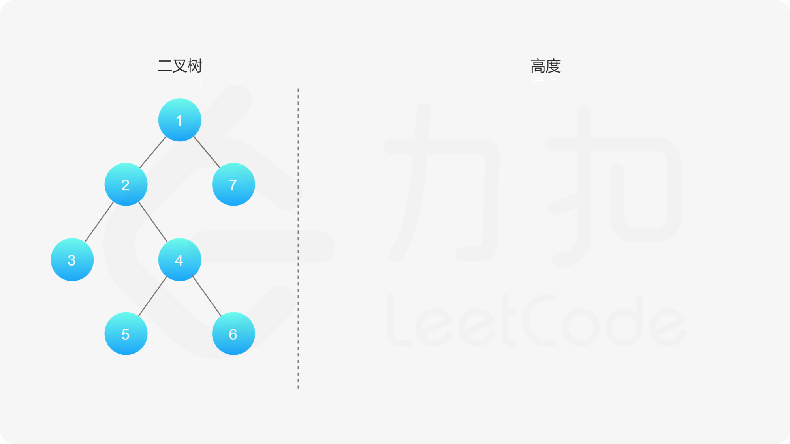
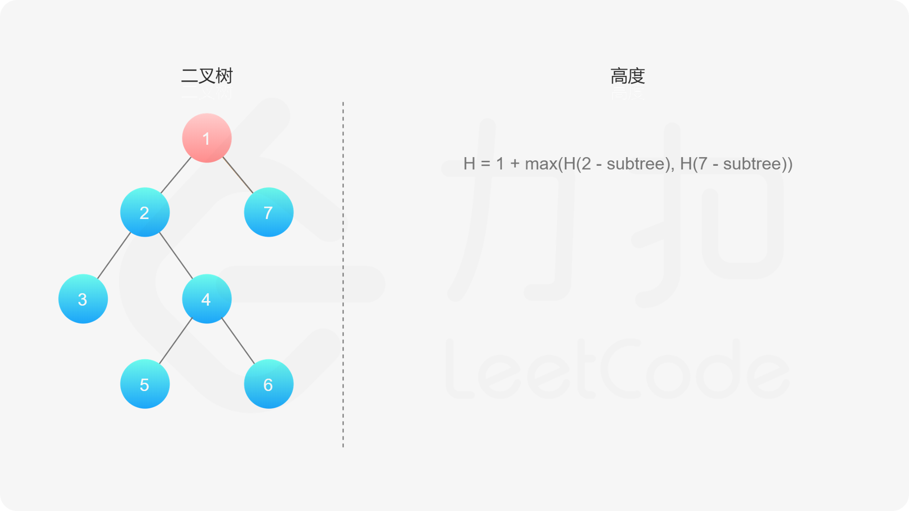
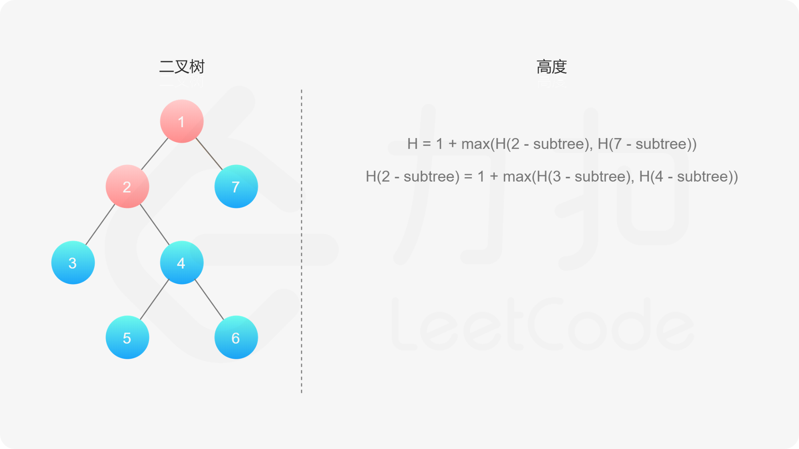
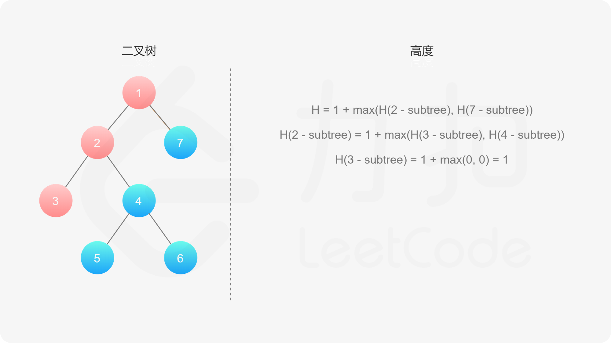
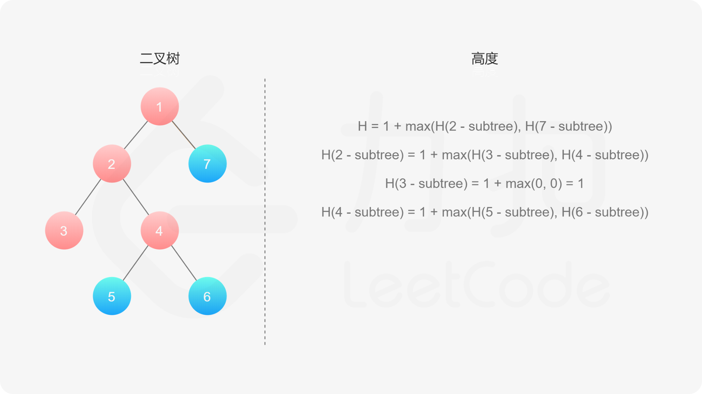
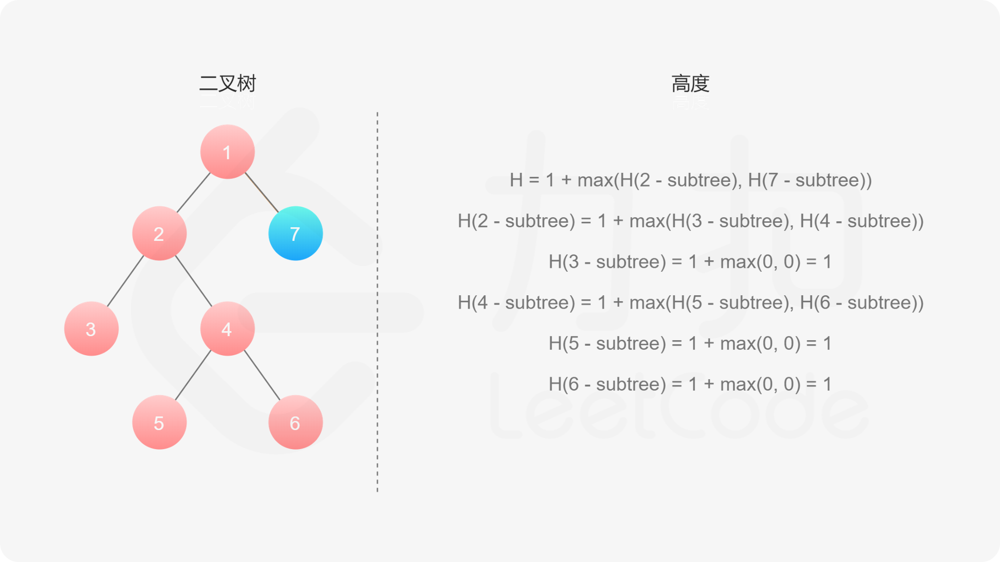
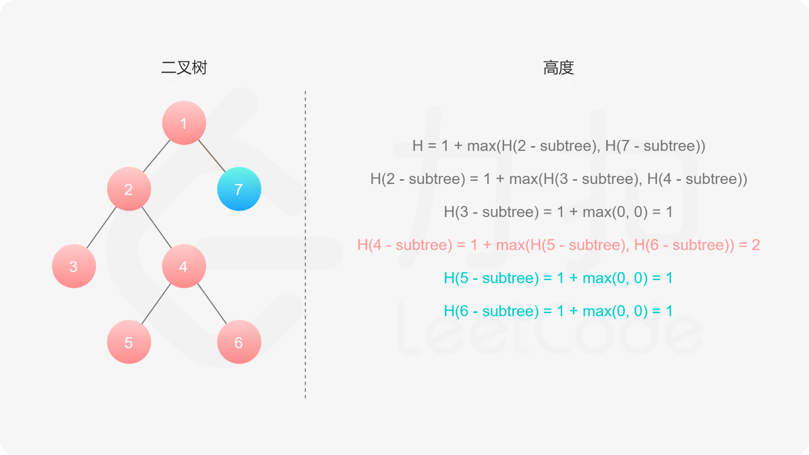
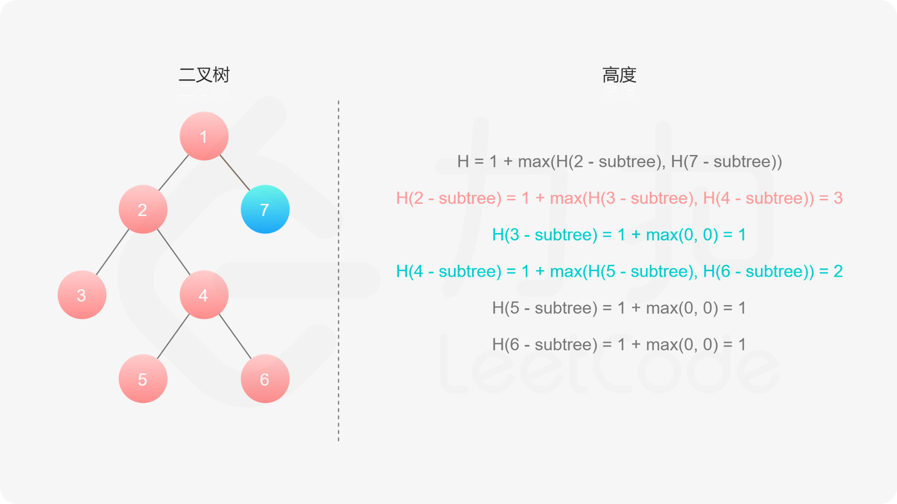
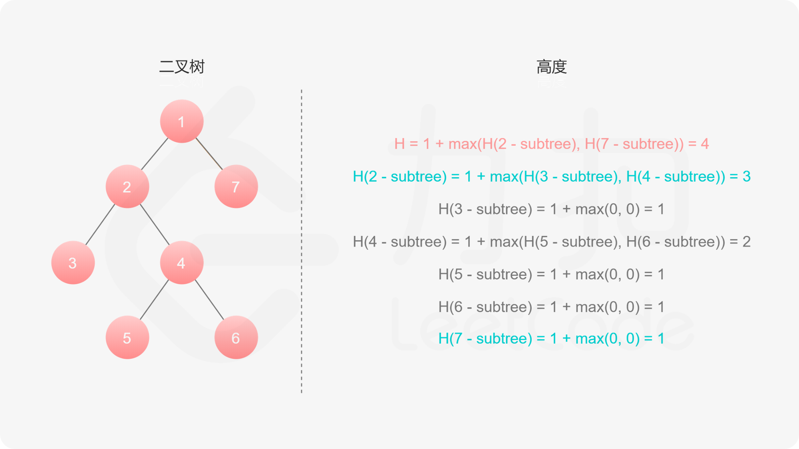

#### [方法一：深度优先搜索](https://leetcode.cn/problems/maximum-depth-of-binary-tree/solutions/349250/er-cha-shu-de-zui-da-shen-du-by-leetcode-solution/)

**思路与算法**

如果我们知道了左子树和右子树的最大深度 $l$ 和 $r$，那么该二叉树的最大深度即为
$\max(l,r) + 1$

而左子树和右子树的最大深度又可以以同样的方式进行计算。因此我们可以用「深度优先搜索」的方法来计算二叉树的最大深度。具体而言，在计算当前二叉树的最大深度时，可以先递归计算出其左子树和右子树的最大深度，然后在 $O(1)$ 时间内计算出当前二叉树的最大深度。递归在访问到空节点时退出。












```cpp
class Solution {
public:
    int maxDepth(TreeNode* root) {
        if (root == nullptr) return 0;
        return max(maxDepth(root->left), maxDepth(root->right)) + 1;
    }
};
```

```java
class Solution {
    public int maxDepth(TreeNode root) {
        if (root == null) {
            return 0;
        } else {
            int leftHeight = maxDepth(root.left);
            int rightHeight = maxDepth(root.right);
            return Math.max(leftHeight, rightHeight) + 1;
        }
    }
}
```

```python
class Solution:
    def maxDepth(self, root):
        if root is None: 
            return 0 
        else: 
            left_height = self.maxDepth(root.left) 
            right_height = self.maxDepth(root.right) 
            return max(left_height, right_height) + 1 
```

```go
func maxDepth(root *TreeNode) int {
    if root == nil {
        return 0
    }
    return max(maxDepth(root.Left), maxDepth(root.Right)) + 1
}

func max(a, b int) int {
    if a > b {
        return a
    }
    return b
}
```

```c
int maxDepth(struct TreeNode *root) {
    if (root == NULL) return 0;
    return fmax(maxDepth(root->left), maxDepth(root->right)) + 1;
}
```

**复杂度分析**

-   时间复杂度：$O(n)$，其中 $n$ 为二叉树节点的个数。每个节点在递归中只被遍历一次。
-   空间复杂度：$O(height)$，其中 $height$ 表示二叉树的高度。递归函数需要栈空间，而栈空间取决于递归的深度，因此空间复杂度等价于二叉树的高度。
