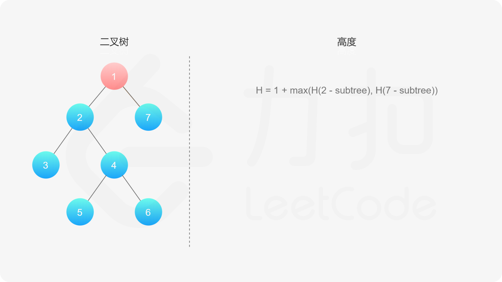

### [二叉树的最大深度](https://leetcode.cn/problems/maximum-depth-of-binary-tree/solutions/349250/er-cha-shu-de-zui-da-shen-du-by-leetcode-solution/)

#### 方法一：深度优先搜索

**思路与算法**

如果我们知道了左子树和右子树的最大深度 $l$ 和 $r$，那么该二叉树的最大深度即为

$$\max(l,r) + 1$$

而左子树和右子树的最大深度又可以以同样的方式进行计算。因此我们可以用「深度优先搜索」的方法来计算二叉树的最大深度。具体而言，在计算当前二叉树的最大深度时，可以先递归计算出其左子树和右子树的最大深度，然后在 $O(1)$ 时间内计算出当前二叉树的最大深度。递归在访问到空节点时退出。





```cpp
class Solution {
public:
    int maxDepth(TreeNode* root) {
        if (root == nullptr) return 0;
        return max(maxDepth(root->left), maxDepth(root->right)) + 1;
    }
};
```

```java
class Solution {
    public int maxDepth(TreeNode root) {
        if (root == null) {
            return 0;
        } else {
            int leftHeight = maxDepth(root.left);
            int rightHeight = maxDepth(root.right);
            return Math.max(leftHeight, rightHeight) + 1;
        }
    }
}
```

```python
class Solution:
    def maxDepth(self, root):
        if root is None: 
            return 0 
        else: 
            left_height = self.maxDepth(root.left) 
            right_height = self.maxDepth(root.right) 
            return max(left_height, right_height) + 1 
```

```go
func maxDepth(root *TreeNode) int {
    if root == nil {
        return 0
    }
    return max(maxDepth(root.Left), maxDepth(root.Right)) + 1
}

func max(a, b int) int {
    if a > b {
        return a
    }
    return b
}
```

```c
int maxDepth(struct TreeNode *root) {
    if (root == NULL) return 0;
    return fmax(maxDepth(root->left), maxDepth(root->right)) + 1;
}
```

**复杂度分析**

- 时间复杂度：$O(n)$，其中 $n$ 为二叉树节点的个数。每个节点在递归中只被遍历一次。
- 空间复杂度：$O(height)$，其中 $height$ 表示二叉树的高度。递归函数需要栈空间，而栈空间取决于递归的深度，因此空间复杂度等价于二叉树的高度。

#### 方法二：广度优先搜索

**思路与算法**

我们也可以用「广度优先搜索」的方法来解决这道题目，但我们需要对其进行一些修改，此时我们广度优先搜索的队列里存放的是「当前层的所有节点」。每次拓展下一层的时候，不同于广度优先搜索的每次只从队列里拿出一个节点，我们需要将队列里的所有节点都拿出来进行拓展，这样能保证每次拓展完的时候队列里存放的是当前层的所有节点，即我们是一层一层地进行拓展，最后我们用一个变量 $ans$ 来维护拓展的次数，该二叉树的最大深度即为 $ans$。

```cpp
class Solution {
public:
    int maxDepth(TreeNode* root) {
        if (root == nullptr) return 0;
        queue<TreeNode*> Q;
        Q.push(root);
        int ans = 0;
        while (!Q.empty()) {
            int sz = Q.size();
            while (sz > 0) {
                TreeNode* node = Q.front();Q.pop();
                if (node->left) Q.push(node->left);
                if (node->right) Q.push(node->right);
                sz -= 1;
            }
            ans += 1;
        } 
        return ans;
    }
};
```

```java
class Solution {
    public int maxDepth(TreeNode root) {
        if (root == null) {
            return 0;
        }
        Queue<TreeNode> queue = new LinkedList<TreeNode>();
        queue.offer(root);
        int ans = 0;
        while (!queue.isEmpty()) {
            int size = queue.size();
            while (size > 0) {
                TreeNode node = queue.poll();
                if (node.left != null) {
                    queue.offer(node.left);
                }
                if (node.right != null) {
                    queue.offer(node.right);
                }
                size--;
            }
            ans++;
        }
        return ans;
    }
}
```

```go
func maxDepth(root *TreeNode) int {
    if root == nil {
        return 0
    }
    queue := []*TreeNode{}
    queue = append(queue, root)
    ans := 0
    for len(queue) > 0 {
        sz := len(queue)
        for sz > 0 {
            node := queue[0]
            queue = queue[1:]
            if node.Left != nil {
                queue = append(queue, node.Left)
            }
            if node.Right != nil {
                queue = append(queue, node.Right)
            }
            sz--
        }
        ans++
    }
    return ans
}
```

```c
struct QueNode {
    struct TreeNode *p;
    struct QueNode *next;
};

void init(struct QueNode **p, struct TreeNode *t) {
    (*p) = (struct QueNode *)malloc(sizeof(struct QueNode));
    (*p)->p = t;
    (*p)->next = NULL;
}

int maxDepth(struct TreeNode *root) {
    if (root == NULL) return 0;
    struct QueNode *left, *right;
    init(&left, root);
    right = left;
    int ans = 0, sz = 1, tmp = 0;
    while (left != NULL) {
        tmp = 0;
        while (sz > 0) {
            if (left->p->left != NULL) {
                init(&right->next, left->p->left);
                right = right->next;
                tmp++;
            }
            if (left->p->right != NULL) {
                init(&right->next, left->p->right);
                right = right->next;
                tmp++;
            }
            left = left->next;
            sz--;
        }
        sz += tmp;
        ans++;
    }
    return ans;
}
```

**复杂度分析**

- 时间复杂度：$O(n)$，其中 $n$ 为二叉树的节点个数。与方法一同样的分析，每个节点只会被访问一次。
- 空间复杂度：此方法空间的消耗取决于队列存储的元素数量，其在最坏情况下会达到 $O(n)$。
