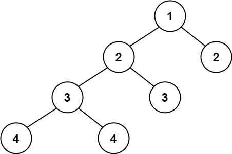

### [110\. 平衡二叉树](https://leetcode.cn/problems/balanced-binary-tree/)

难度：简单

给定一个二叉树，判断它是否是**平衡二叉树[^1]**。

**示例 1：**

> 
>
> **输入：** root = [3,9,20,null,null,15,7]
> **输出：** true

**示例 2：**

> 
>
> **输入：** root = [1,2,2,3,3,null,null,4,4]
> **输出：** false

**示例 3：**

> **输入：** root = []
> **输出：** true

**提示：**

- 树中的节点数在范围 `[0, 5000]` 内
- <code>-104 <= Node.val <= 104</code>

[^1]: **平衡二叉树** 是指该树所有节点的左右子树的高度相差不超过 1。
