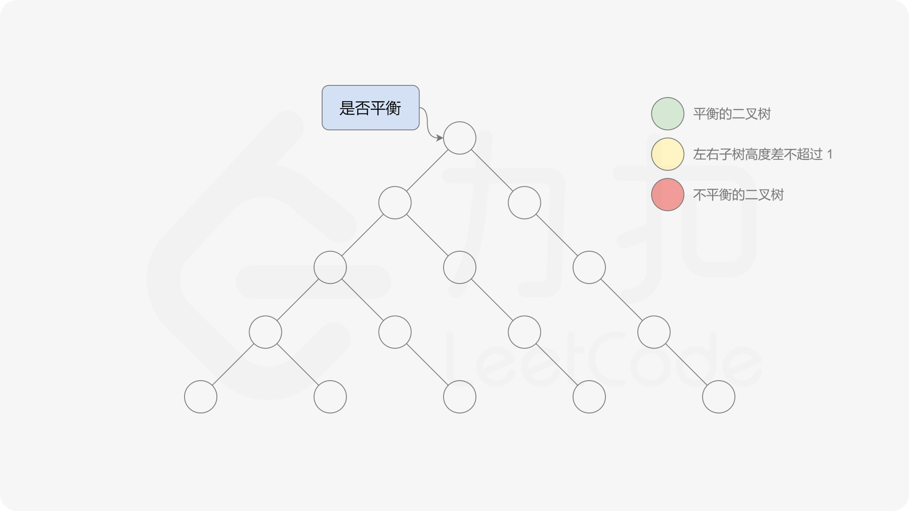
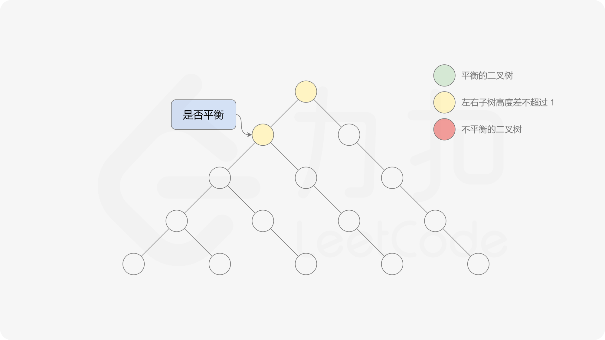
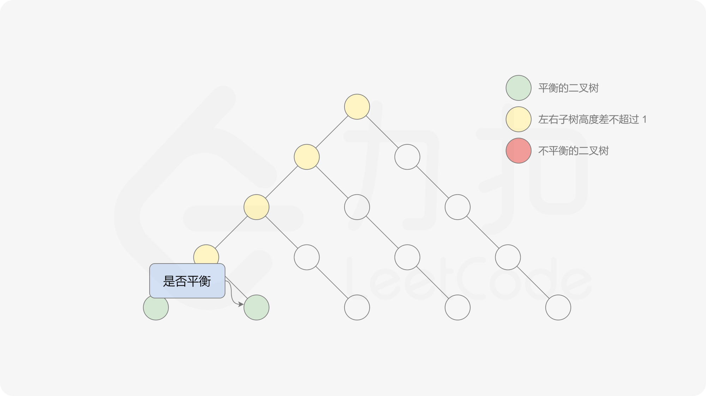
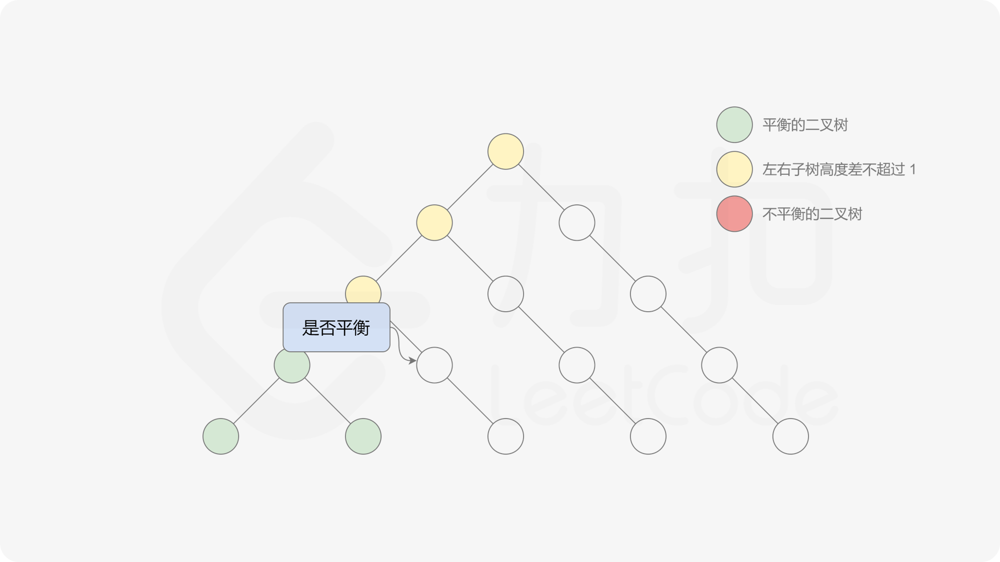
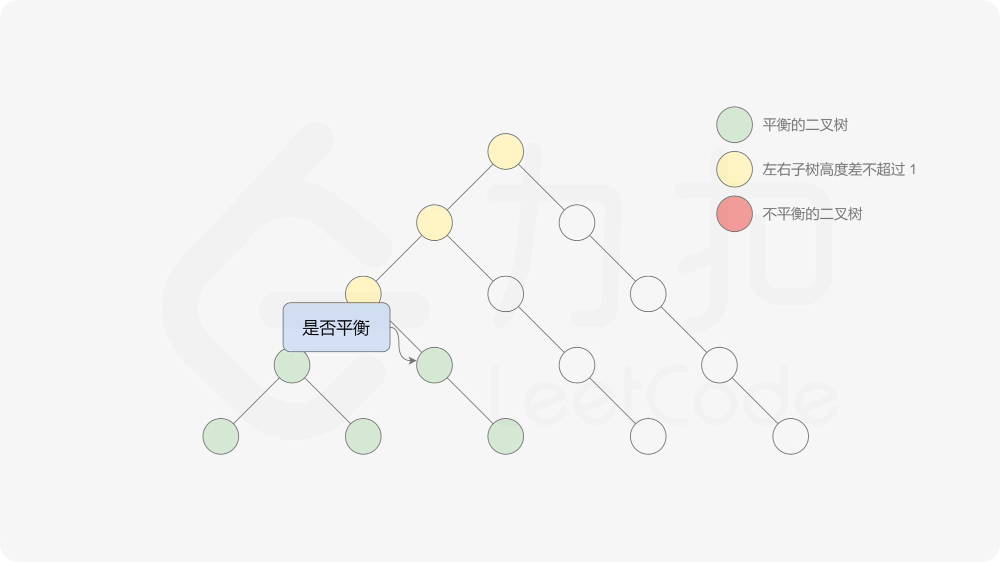

#### 前言

这道题中的平衡二叉树的定义是：二叉树的每个节点的左右子树的高度差的绝对值不超过 $1$，则二叉树是平衡二叉树。根据定义，一棵二叉树是平衡二叉树，当且仅当其所有子树也都是平衡二叉树，因此可以使用递归的方式判断二叉树是不是平衡二叉树，递归的顺序可以是自顶向下或者自底向上。

#### [方法一：自顶向下的递归](https://leetcode.cn/problems/balanced-binary-tree/solutions/377216/ping-heng-er-cha-shu-by-leetcode-solution/)

定义函数 $height$，用于计算二叉树中的任意一个节点 $p$ 的高度：

$height(p) = \begin{cases} 0 & p \text{ 是空节点}\\ \max(height(p.left), height(p.right))+1 & p \text{ 是非空节点} \end{cases}$

有了计算节点高度的函数，即可判断二叉树是否平衡。具体做法类似于二叉树的前序遍历，即对于当前遍历到的节点，首先计算左右子树的高度，如果左右子树的高度差是否不超过 $1$，再分别递归地遍历左右子节点，并判断左子树和右子树是否平衡。这是一个自顶向下的递归的过程。
















```java
class Solution {
    public boolean isBalanced(TreeNode root) {
        if (root == null) {
            return true;
        } else {
            return Math.abs(height(root.left) - height(root.right)) <= 1 && isBalanced(root.left) && isBalanced(root.right);
        }
    }

    public int height(TreeNode root) {
        if (root == null) {
            return 0;
        } else {
            return Math.max(height(root.left), height(root.right)) + 1;
        }
    }
}
```

```cpp
class Solution {
public:
    int height(TreeNode* root) {
        if (root == NULL) {
            return 0;
        } else {
            return max(height(root->left), height(root->right)) + 1;
        }
    }

    bool isBalanced(TreeNode* root) {
        if (root == NULL) {
            return true;
        } else {
            return abs(height(root->left) - height(root->right)) <= 1 && isBalanced(root->left) && isBalanced(root->right);
        }
    }
};
```

```python
class Solution:
    def isBalanced(self, root: TreeNode) -> bool:
        def height(root: TreeNode) -> int:
            if not root:
                return 0
            return max(height(root.left), height(root.right)) + 1

        if not root:
            return True
        return abs(height(root.left) - height(root.right)) <= 1 and self.isBalanced(root.left) and self.isBalanced(root.right)
```

```c
int height(struct TreeNode* root) {
    if (root == NULL) {
        return 0;
    } else {
        return fmax(height(root->left), height(root->right)) + 1;
    }
}

bool isBalanced(struct TreeNode* root) {
    if (root == NULL) {
        return true;
    } else {
        return fabs(height(root->left) - height(root->right)) <= 1 && isBalanced(root->left) && isBalanced(root->right);
    }
}
```

```go
func isBalanced(root *TreeNode) bool {
    if root == nil {
        return true
    }
    return abs(height(root.Left) - height(root.Right)) <= 1 && isBalanced(root.Left) && isBalanced(root.Right)
}

func height(root *TreeNode) int {
    if root == nil {
        return 0
    }
    return max(height(root.Left), height(root.Right)) + 1
}

func max(x, y int) int {
    if x > y {
        return x
    }
    return y
}

func abs(x int) int {
    if x < 0 {
        return -1 * x
    }
    return x
}
```

**复杂度分析**

-   时间复杂度：$O(n^2)$，其中 $n$ 是二叉树中的节点个数。 最坏情况下，二叉树是满二叉树，需要遍历二叉树中的所有节点，时间复杂度是 $O(n)$。 对于节点 $p$，如果它的高度是 $d$，则 $height(p)$ 最多会被调用 $d$ 次（即遍历到它的每一个祖先节点时）。对于平均的情况，一棵树的高度 $h$ 满足 $O(h)=O(\log n)$，因为 $d \leq h$，所以总时间复杂度为 $O(n \log n)$。对于最坏的情况，二叉树形成链式结构，高度为 $O(n)$，此时总时间复杂度为 $O(n^2)$。
-   空间复杂度：$O(n)$，其中 $n$ 是二叉树中的节点个数。空间复杂度主要取决于递归调用的层数，递归调用的层数不会超过 $n$。
