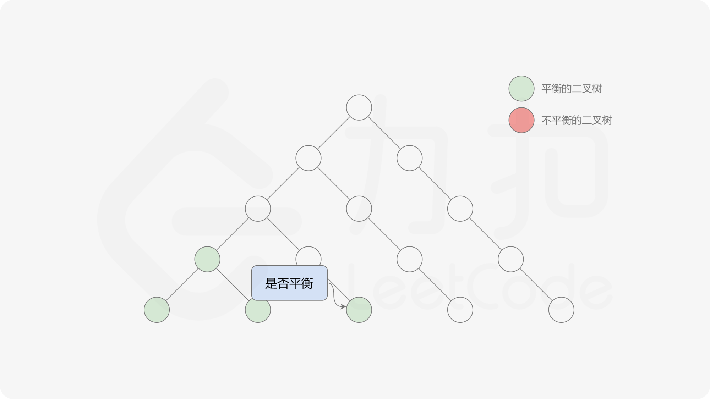
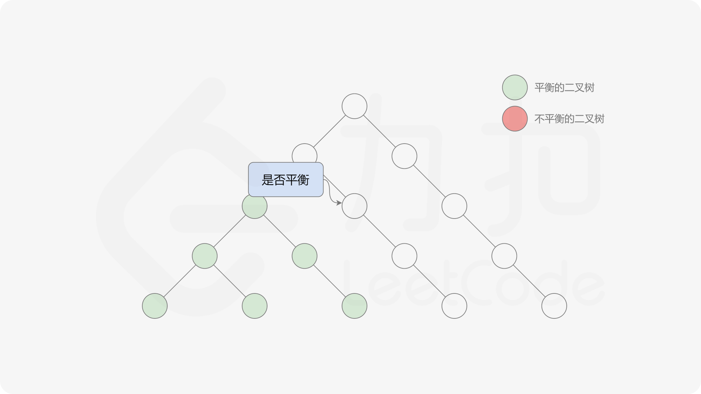
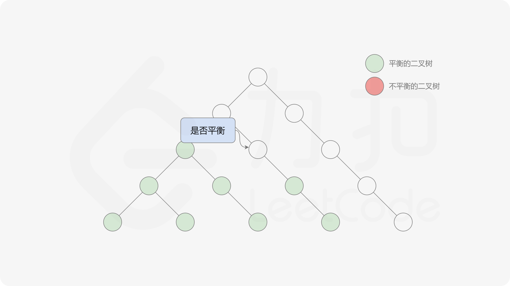

#### [方法二：自底向上的递归](https://leetcode.cn/problems/balanced-binary-tree/solutions/377216/ping-heng-er-cha-shu-by-leetcode-solution/)

方法一由于是自顶向下递归，因此对于同一个节点，函数 $height$ 会被重复调用，导致时间复杂度较高。如果使用自底向上的做法，则对于每个节点，函数 $height$ 只会被调用一次。

自底向上递归的做法类似于后序遍历，对于当前遍历到的节点，先递归地判断其左右子树是否平衡，再判断以当前节点为根的子树是否平衡。如果一棵子树是平衡的，则返回其高度（高度一定是非负整数），否则返回 $−1$。如果存在一棵子树不平衡，则整个二叉树一定不平衡。











```java
class Solution {
    public boolean isBalanced(TreeNode root) {
        return height(root) >= 0;
    }

    public int height(TreeNode root) {
        if (root == null) {
            return 0;
        }
        int leftHeight = height(root.left);
        int rightHeight = height(root.right);
        if (leftHeight == -1 || rightHeight == -1 || Math.abs(leftHeight - rightHeight) > 1) {
            return -1;
        } else {
            return Math.max(leftHeight, rightHeight) + 1;
        }
    }
}
```

```cpp
class Solution {
public:
    int height(TreeNode* root) {
        if (root == NULL) {
            return 0;
        }
        int leftHeight = height(root->left);
        int rightHeight = height(root->right);
        if (leftHeight == -1 || rightHeight == -1 || abs(leftHeight - rightHeight) > 1) {
            return -1;
        } else {
            return max(leftHeight, rightHeight) + 1;
        }
    }

    bool isBalanced(TreeNode* root) {
        return height(root) >= 0;
    }
};
```

```python
class Solution:
    def isBalanced(self, root: TreeNode) -> bool:
        def height(root: TreeNode) -> int:
            if not root:
                return 0
            leftHeight = height(root.left)
            rightHeight = height(root.right)
            if leftHeight == -1 or rightHeight == -1 or abs(leftHeight - rightHeight) > 1:
                return -1
            else:
                return max(leftHeight, rightHeight) + 1

        return height(root) >= 0
```

```c
int height(struct TreeNode* root) {
    if (root == NULL) {
        return 0;
    }
    int leftHeight = height(root->left);
    int rightHeight = height(root->right);
    if (leftHeight == -1 || rightHeight == -1 || fabs(leftHeight - rightHeight) > 1) {
        return -1;
    } else {
        return fmax(leftHeight, rightHeight) + 1;
    }
}

bool isBalanced(struct TreeNode* root) {
    return height(root) >= 0;
}
```

```go
func isBalanced(root *TreeNode) bool {
    return height(root) >= 0
}

func height(root *TreeNode) int {
    if root == nil {
        return 0
    }
    leftHeight := height(root.Left)
    rightHeight := height(root.Right)
    if leftHeight == -1 || rightHeight == -1 || abs(leftHeight - rightHeight) > 1 {
        return -1
    }
    return max(leftHeight, rightHeight) + 1
}

func max(x, y int) int {
    if x > y {
        return x
    }
    return y
}

func abs(x int) int {
    if x < 0 {
        return -1 * x
    }
    return x
}
```

**复杂度分析**

-   时间复杂度：$O(n)$，其中 $n$ 是二叉树中的节点个数。使用自底向上的递归，每个节点的计算高度和判断是否平衡都只需要处理一次，最坏情况下需要遍历二叉树中的所有节点，因此时间复杂度是 $O(n)$。
-   空间复杂度：$O(n)$，其中 $n$ 是二叉树中的节点个数。空间复杂度主要取决于递归调用的层数，递归调用的层数不会超过 $n$。
