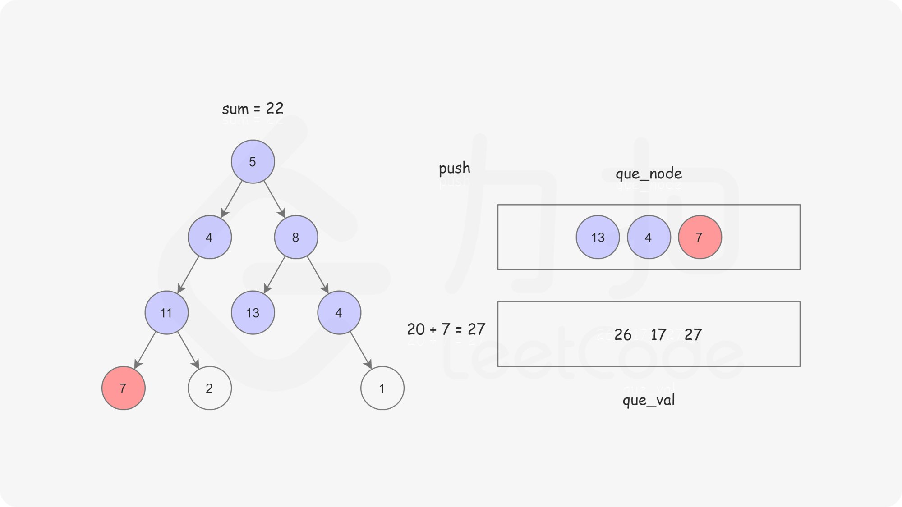

#### 写在前面

注意到本题的要求是，询问是否有从「根节点」到某个「叶子节点」经过的路径上的节点之和等于目标和。核心思想是对树进行一次遍历，在遍历时记录从根节点到当前节点的路径和，以防止重复计算。

> 需要特别注意的是，给定的 `root` 可能为空。

#### [方法一：广度优先搜索](https://leetcode.cn/problems/path-sum/solutions/318487/lu-jing-zong-he-by-leetcode-solution/)

**思路及算法**

首先我们可以想到使用广度优先搜索的方式，记录从根节点到当前节点的路径和，以防止重复计算。

这样我们使用两个队列，分别存储将要遍历的节点，以及根节点到这些节点的路径和即可。





```cpp
class Solution {
public:
    bool hasPathSum(TreeNode *root, int sum) {
        if (root == nullptr) {
            return false;
        }
        queue<TreeNode *> que_node;
        queue<int> que_val;
        que_node.push(root);
        que_val.push(root->val);
        while (!que_node.empty()) {
            TreeNode *now = que_node.front();
            int temp = que_val.front();
            que_node.pop();
            que_val.pop();
            if (now->left == nullptr && now->right == nullptr) {
                if (temp == sum) {
                    return true;
                }
                continue;
            }
            if (now->left != nullptr) {
                que_node.push(now->left);
                que_val.push(now->left->val + temp);
            }
            if (now->right != nullptr) {
                que_node.push(now->right);
                que_val.push(now->right->val + temp);
            }
        }
        return false;
    }
};
```

```java
class Solution {
    public boolean hasPathSum(TreeNode root, int sum) {
        if (root == null) {
            return false;
        }
        Queue<TreeNode> queNode = new LinkedList<TreeNode>();
        Queue<Integer> queVal = new LinkedList<Integer>();
        queNode.offer(root);
        queVal.offer(root.val);
        while (!queNode.isEmpty()) {
            TreeNode now = queNode.poll();
            int temp = queVal.poll();
            if (now.left == null && now.right == null) {
                if (temp == sum) {
                    return true;
                }
                continue;
            }
            if (now.left != null) {
                queNode.offer(now.left);
                queVal.offer(now.left.val + temp);
            }
            if (now.right != null) {
                queNode.offer(now.right);
                queVal.offer(now.right.val + temp);
            }
        }
        return false;
    }
}
```

```go
func hasPathSum(root *TreeNode, sum int) bool {
    if root == nil {
        return false
    }
    queNode := []*TreeNode{}
    queVal := []int{}
    queNode = append(queNode, root)
    queVal = append(queVal, root.Val)
    for len(queNode) != 0 {
        now := queNode[0]
        queNode = queNode[1:]
        temp := queVal[0]
        queVal = queVal[1:]
        if now.Left == nil && now.Right == nil {
            if temp == sum {
                return true
            }
            continue
        }
        if now.Left != nil {
            queNode = append(queNode, now.Left)
            queVal = append(queVal, now.Left.Val + temp)
        }
        if now.Right != nil {
            queNode = append(queNode, now.Right)
            queVal = append(queVal, now.Right.Val + temp)
        }
    }
    return false
}
```

```python
class Solution:
    def hasPathSum(self, root: TreeNode, sum: int) -> bool:
        if not root:
            return False
        que_node = collections.deque([root])
        que_val = collections.deque([root.val])
        while que_node:
            now = que_node.popleft()
            temp = que_val.popleft()
            if not now.left and not now.right:
                if temp == sum:
                    return True
                continue
            if now.left:
                que_node.append(now.left)
                que_val.append(now.left.val + temp)
            if now.right:
                que_node.append(now.right)
                que_val.append(now.right.val + temp)
        return False
```

```c
typedef struct queNode {
    int val;
    struct TreeNode *node;
    struct queNode *next;
} queNode;

void init(struct queNode **p, int val, struct TreeNode *node) {
    (*p) = (struct queNode *)malloc(sizeof(struct queNode));
    (*p)->val = val;
    (*p)->node = node;
    (*p)->next = NULL;
}

bool hasPathSum(struct TreeNode *root, int sum) {
    if (root == NULL) {
        return false;
    }
    struct queNode *queLeft, *queRight;
    init(&queLeft, root->val, root);
    queRight = queLeft;
    while (queLeft != NULL) {
        struct TreeNode *now = queLeft->node;
        int temp = queLeft->val;
        if (now->left == NULL && now->right == NULL) {
            if (temp == sum) return true;
        }
        if (now->left != NULL) {
            init(&queRight->next, now->left->val + temp, now->left);
            queRight = queRight->next;
        }
        if (now->right != NULL) {
            init(&queRight->next, now->right->val + temp, now->right);
            queRight = queRight->next;
        }
        queLeft = queLeft->next;
    }
    return false;
}
```

**复杂度分析**

-   时间复杂度：$O(N)$，其中 $N$ 是树的节点数。对每个节点访问一次。
-   空间复杂度：$O(N)$，其中 $N$ 是树的节点数。空间复杂度主要取决于队列的开销，队列中的元素个数不会超过树的节点数。
