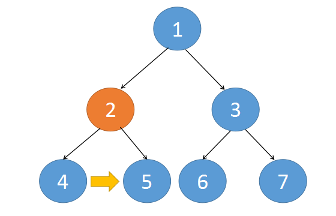
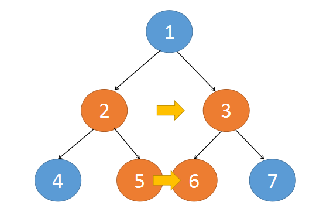
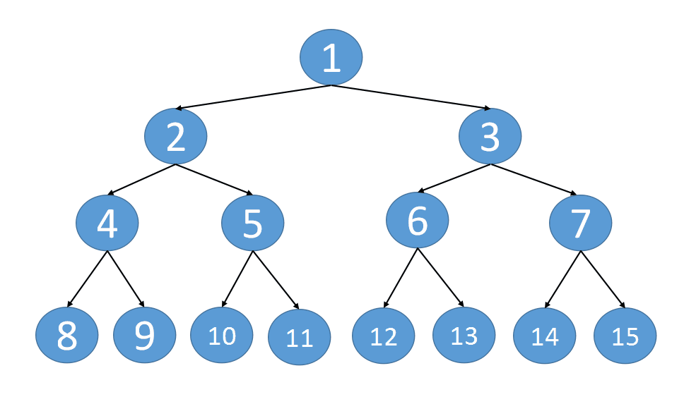

### [动画演示+三种实现 116. 填充每个节点的下一个右侧节点指针](https://leetcode.cn/problems/populating-next-right-pointers-in-each-node/solutions/100099/dong-hua-yan-shi-san-chong-shi-xian-116-tian-chong/)

### 迭代解法一

回想一下二叉树的层次遍历，用广度优先实现的时候，就是层层遍历，每层临时遍历的节点都会放到一个队列中。  
队列中保存了第 `i` 层节点的信息，我们利用这个特点，将队列中的元素都串联一遍就可以了。


时间复杂度： $O(n)$ 空间复杂度： $O(n)$

代码实现:

```java
class Solution {
    public Node connect(Node root) {
        if(root==null) {
            return root;
        }
        LinkedList<Node> queue = new LinkedList<Node>();
        queue.add(root);
        while(queue.size()>0) {
            int size = queue.size();
            //将队列中的元素串联起来
            Node tmp = queue.get(0);
            for(int i=1;i<size;++i) {
                tmp.next = queue.get(i);
                tmp = queue.get(i);
            }
            //遍历队列中的每个元素，将每个元素的左右节点也放入队列中
            for(int i=0;i<size;++i) {
                tmp = queue.remove();
                if(tmp.left!=null) {
                    queue.add(tmp.left);
                }
                if(tmp.right!=null) {
                    queue.add(tmp.right);
                }
            }
        }
        return root;
    }
}
```

```python
class Solution(object):
    def connect(self, root):
        """
        :type root: Node
        :rtype: Node
        """
        if not root:
            return root
        queue = [root]
        while queue:
            size = len(queue)
            # 将队列中的元素串联起来
            tmp = queue[0]
            for i in xrange(1,size):
                tmp.next = queue[i]
                tmp = queue[i]
            # 遍历队列中的每个元素，将每个元素的左右节点也放入队列中
            for _ in xrange(size):
                tmp = queue.pop(0)
                if tmp.left:
                    queue.append(tmp.left)
                if tmp.right:
                    queue.append(tmp.right)
        return root
```

### 迭代解法二

题目要求是常量的辅助空间，所以第一种解法并不符合要求，下面来看下 $O(1)$ 空间复杂度的实现细节。
注意，题目说的二叉树是一棵完美二叉树，即每一层的节点都是满的。
仔细看下完成后的串联树，其连接的方式有两种:
**第一种** 是这两个串联的节点都有一个共同的父节点，通过父节点就可以将这两个子节点串联起来



**第二种** 是这两个串联的节点的父节点不同，对于这种情况，如果我们能将这一层的上一层串联好。那么可以通过父节点的`next`找到邻居，完成串联。



即

```c
root.right.next => root.next.left
```

这里我们需要保证 `root.next` 不为空就可以了。  
也就是说当我们要串联第 `i` 层节点时，需要先完成第 `i-1` 层的节点串联  
第一层最多只有一个节点，不需要串联  
第二层最多只有两个节点，借助根节点就可以完成串联了  
第三层串联时，上一层已经串联完了，所以第三层可以完成串联  
同理，可以完成第四层，第五层，第N层的串联


时间复杂度：$O(n)$  
空间复杂度：$O(1)$

代码实现:

```java
class Solution {
    public Node connect(Node root) {
        if(root==null) {
            return root;
        }
        Node pre = root;
        //循环条件是当前节点的left不为空，当只有根节点
        //或所有叶子节点都出串联完后循环就退出了
        while(pre.left!=null) {
            Node tmp = pre;
            while(tmp!=null) {
                //将tmp的左右节点都串联起来
                //注:外层循环已经判断了当前节点的left不为空
                tmp.left.next = tmp.right;
                //下一个不为空说明上一层已经帮我们完成串联了
                if(tmp.next!=null) {
                    tmp.right.next = tmp.next.left;
                }
                //继续右边遍历
                tmp = tmp.next;
            }
            //从下一层的最左边开始遍历
            pre = pre.left;
        }
        return root;
    }
}
```

```python
class Solution(object):
    def connect(self, root):
        """
        :type root: Node
        :rtype: Node
        """
        if not root:
            return root
        pre = root
        # 循环条件是当前节点的left不为空，当只有根节点
        # 或所有叶子节点都出串联完后循环就退出了
        while pre.left:
            tmp = pre
            while tmp:
                # 将tmp的左右节点都串联起来
                # 注:外层循环已经判断了当前节点的left不为空
                tmp.left.next = tmp.right
                # 下一个不为空说明上一层已经帮我们完成串联了
                if tmp.next:
                    tmp.right.next = tmp.next.left
                # 继续右边遍历
                tmp = tmp.next
            # 从下一层的最左边开始遍历
            pre = pre.left
        return root
```

### 递归

上面两种方式是属于横向的视角，而递归则像是一个深度的视角。
以从上往下的方向看，`1`，`2`，`3`，`5`，`6`这几个节点在位置上都是紧挨着的，同时这几个节点都是左右串联的。


我们以当前节 `root` 点为起始，左右节点不断的深入下面，`left` 节点不断往右走，`right` 节点不断往左走，当这两个节点走到底后，整个纵深这段就完成了串联。  
递归函数实现如下：

1.  终止条件：当前节点为空时
2.  函数内：以当前节点为起始，完成从上往下的纵深串联，再递归的调用当前节点 `left` 和 `right`



时间复杂度：$O(n)$
空间复杂度：$O(h)$，$h$ 是树的高度

代码实现:

```java
class Solution {
    public Node connect(Node root) {
        dfs(root);
        return root;
    }

    void dfs(Node root) {
        if(root==null) {
            return;
        }
        Node left = root.left;
        Node right = root.right;
        //配合动画演示理解这段，以root为起点，将整个纵深这段串联起来
        while(left!=null) {
            left.next = right;
            left = left.right;
            right = right.left;
        }
        //递归的调用左右节点，完成同样的纵深串联
        dfs(root.left);
        dfs(root.right);
    }
}
```

```python
class Solution(object):
    def connect(self, root):
        """
        :type root: Node
        :rtype: Node
        """
        def dfs(root):
            if not root:
                return
            left = root.left
            right = root.right
            # 配合动画演示理解这段，以root为起点，将整个纵深这段串联起来
            while left:
                left.next = right
                left = left.right
                right = right.left
            # 递归的调用左右节点，完成同样的纵深串联
            dfs(root.left)
            dfs(root.right)
        dfs(root)
        return root
```
