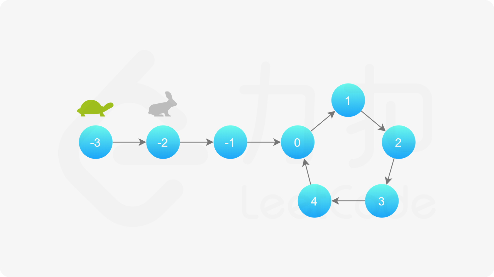
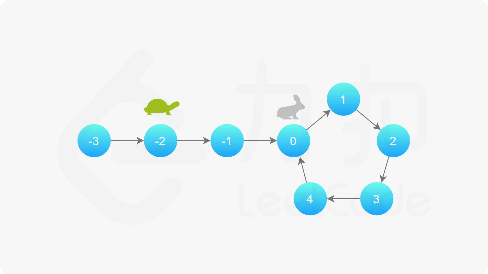
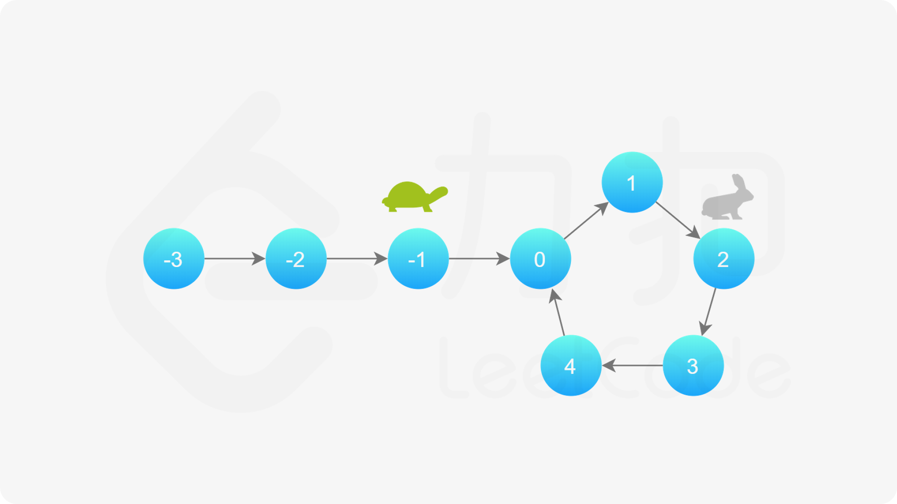
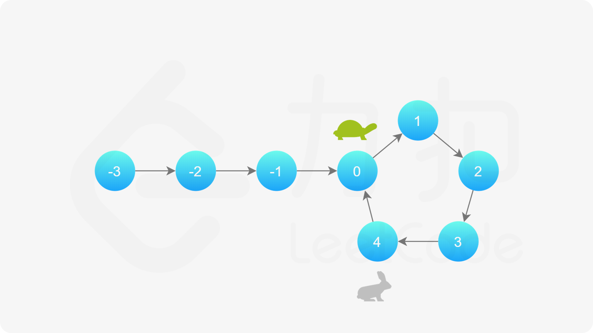
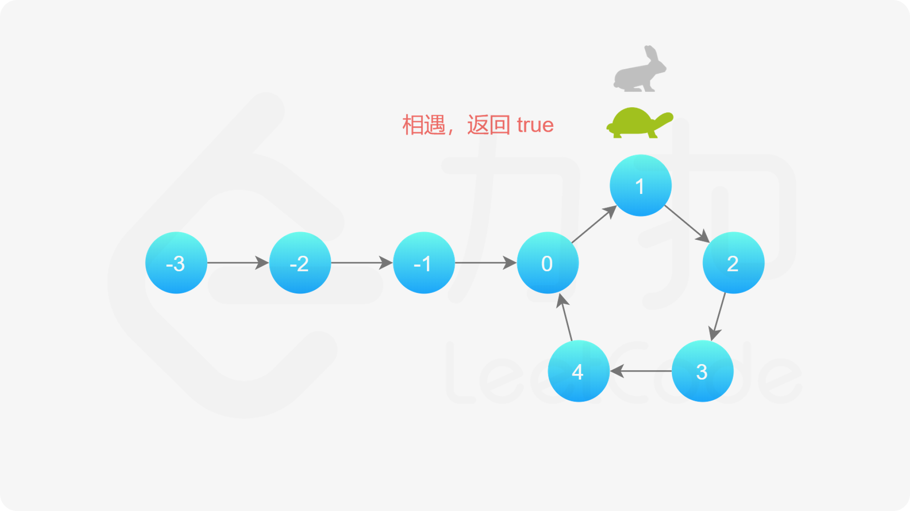

#### [方法二：快慢指针](https://leetcode.cn/problems/linked-list-cycle/solutions/440042/huan-xing-lian-biao-by-leetcode-solution/)

**思路及算法**

本方法需要读者对「Floyd 判圈算法」（又称龟兔赛跑算法）有所了解。

假想「乌龟」和「兔子」在链表上移动，「兔子」跑得快，「乌龟」跑得慢。当「乌龟」和「兔子」从链表上的同一个节点开始移动时，如果该链表中没有环，那么「兔子」将一直处于「乌龟」的前方；如果该链表中有环，那么「兔子」会先于「乌龟」进入环，并且一直在环内移动。等到「乌龟」进入环时，由于「兔子」的速度快，它一定会在某个时刻与乌龟相遇，即套了「乌龟」若干圈。

我们可以根据上述思路来解决本题。具体地，我们定义两个指针，一快一慢。慢指针每次只移动一步，而快指针每次移动两步。初始时，慢指针在位置 `head`，而快指针在位置 `head.next`。这样一来，如果在移动的过程中，快指针反过来追上慢指针，就说明该链表为环形链表。否则快指针将到达链表尾部，该链表不为环形链表。







**细节**

为什么我们要规定初始时慢指针在位置 `head`，快指针在位置 `head.next`，而不是两个指针都在位置 `head`（即与「乌龟」和「兔子」中的叙述相同）？

-   观察下面的代码，我们使用的是 `while` 循环，循环条件先于循环体。由于循环条件一定是判断快慢指针是否重合，如果我们将两个指针初始都置于 `head`，那么 `while` 循环就不会执行。因此，我们可以假想一个在 `head` 之前的虚拟节点，慢指针从虚拟节点移动一步到达 `head`，快指针从虚拟节点移动两步到达 `head.next`，这样我们就可以使用 `while` 循环了。
-   当然，我们也可以使用 `do-while` 循环。此时，我们就可以把快慢指针的初始值都置为 `head`。


**代码**

```java
public class Solution {
    public boolean hasCycle(ListNode head) {
        if (head == null || head.next == null) {
            return false;
        }
        ListNode slow = head;
        ListNode fast = head.next;
        while (slow != fast) {
            if (fast == null || fast.next == null) {
                return false;
            }
            slow = slow.next;
            fast = fast.next.next;
        }
        return true;
    }
}
```

```cpp
class Solution {
public:
    bool hasCycle(ListNode* head) {
        if (head == nullptr || head->next == nullptr) {
            return false;
        }
        ListNode* slow = head;
        ListNode* fast = head->next;
        while (slow != fast) {
            if (fast == nullptr || fast->next == nullptr) {
                return false;
            }
            slow = slow->next;
            fast = fast->next->next;
        }
        return true;
    }
};
```

```python
class Solution:
    def hasCycle(self, head: ListNode) -> bool:
        if not head or not head.next:
            return False
        
        slow = head
        fast = head.next

        while slow != fast:
            if not fast or not fast.next:
                return False
            slow = slow.next
            fast = fast.next.next
        
        return True
```

```go
func hasCycle(head *ListNode) bool {
    if head == nil || head.Next == nil {
        return false
    }
    slow, fast := head, head.Next
    for fast != slow {
        if fast == nil || fast.Next == nil {
            return false
        }
        slow = slow.Next
        fast = fast.Next.Next
    }
    return true
}
```

```c
bool hasCycle(struct ListNode* head) {
    if (head == NULL || head->next == NULL) {
        return false;
    }
    struct ListNode* slow = head;
    struct ListNode* fast = head->next;
    while (slow != fast) {
        if (fast == NULL || fast->next == NULL) {
            return false;
        }
        slow = slow->next;
        fast = fast->next->next;
    }
    return true;
}
```

**复杂度分析**

-   时间复杂度：$O(N)$，其中 $N$ 是链表中的节点数。
    -   当链表中不存在环时，快指针将先于慢指针到达链表尾部，链表中每个节点至多被访问两次。
    -   当链表中存在环时，每一轮移动后，快慢指针的距离将减小一。而初始距离为环的长度，因此至多移动 $N$ 轮。
-   空间复杂度：$O(1)$。我们只使用了两个指针的额外空间。
