### [二叉树的前序遍历](https://leetcode.cn/problems/binary-tree-preorder-traversal/solutions/461821/er-cha-shu-de-qian-xu-bian-li-by-leetcode-solution/)

#### 方法一：递归

**思路与算法**

首先我们需要了解什么是二叉树的前序遍历：按照访问根节点——左子树——右子树的方式遍历这棵树，而在访问左子树或者右子树的时候，我们按照同样的方式遍历，直到遍历完整棵树。因此整个遍历过程天然具有递归的性质，我们可以直接用递归函数来模拟这一过程。

定义 `preorder(root)` 表示当前遍历到 `root` 节点的答案。按照定义，我们只要首先将 `root` 节点的值加入答案，然后递归调用 `preorder(root.left)` 来遍历 `root` 节点的左子树，最后递归调用 `preorder(root.right)` 来遍历 `root` 节点的右子树即可，递归终止的条件为碰到空节点。

**代码**

```c++
class Solution {
public:
    void preorder(TreeNode *root, vector<int> &res) {
        if (root == nullptr) {
            return;
        }
        res.push_back(root->val);
        preorder(root->left, res);
        preorder(root->right, res);
    }

    vector<int> preorderTraversal(TreeNode *root) {
        vector<int> res;
        preorder(root, res);
        return res;
    }
};
```

```java
class Solution {
    public List<Integer> preorderTraversal(TreeNode root) {
        List<Integer> res = new ArrayList<Integer>();
        preorder(root, res);
        return res;
    }

    public void preorder(TreeNode root, List<Integer> res) {
        if (root == null) {
            return;
        }
        res.add(root.val);
        preorder(root.left, res);
        preorder(root.right, res);
    }
}
```

```python
class Solution:
    def preorderTraversal(self, root: TreeNode) -> List[int]:
        def preorder(root: TreeNode):
            if not root:
                return
            res.append(root.val)
            preorder(root.left)
            preorder(root.right)
        
        res = list()
        preorder(root)
        return res
```

```go
func preorderTraversal(root *TreeNode) (vals []int) {
    var preorder func(*TreeNode)
    preorder = func(node *TreeNode) {
        if node == nil {
            return
        }
        vals = append(vals, node.Val)
        preorder(node.Left)
        preorder(node.Right)
    }
    preorder(root)
    return
}
```

```c
void preorder(struct TreeNode* root, int* res, int* resSize) {
    if (root == NULL) {
        return;
    }
    res[(*resSize)++] = root->val;
    preorder(root->left, res, resSize);
    preorder(root->right, res, resSize);
}

int* preorderTraversal(struct TreeNode* root, int* returnSize) {
    int* res = malloc(sizeof(int) * 2000);
    *returnSize = 0;
    preorder(root, res, returnSize);
    return res;
}
```

**复杂度分析**

- 时间复杂度：$O(n)$，其中 $n$ 是二叉树的节点数。每一个节点恰好被遍历一次。
- 空间复杂度：$O(n)$，为递归过程中栈的开销，平均情况下为 $O(log⁡n)$，最坏情况下树呈现链状，为 $O(n)$。

#### 方法二：迭代

**思路与算法**

我们也可以用迭代的方式实现方法一的递归函数，两种方式是等价的，区别在于递归的时候隐式地维护了一个栈，而我们在迭代的时候需要显式地将这个栈模拟出来，其余的实现与细节都相同，具体可以参考下面的代码。

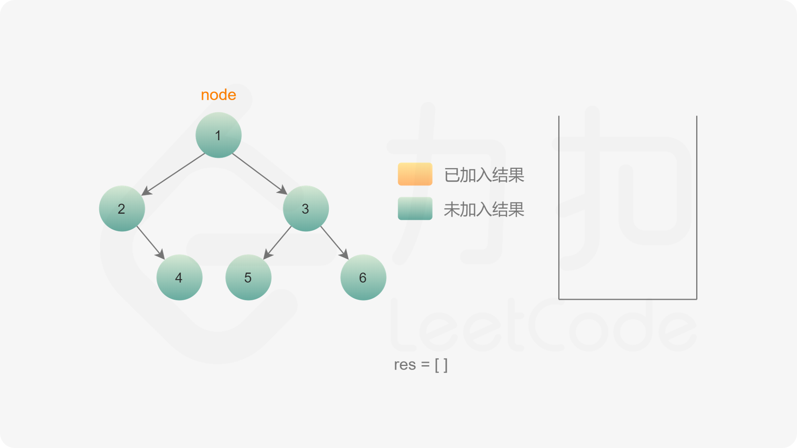
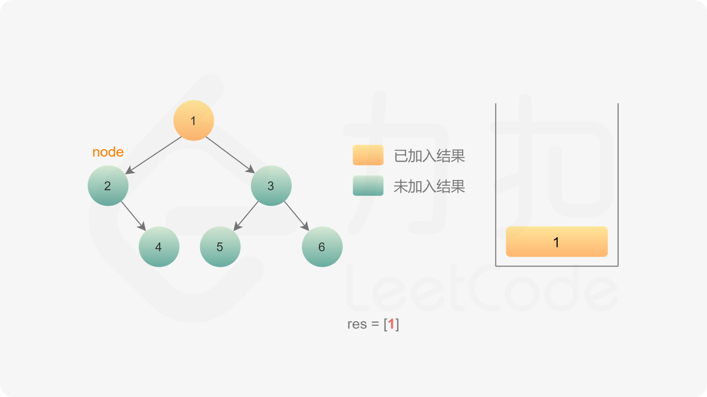
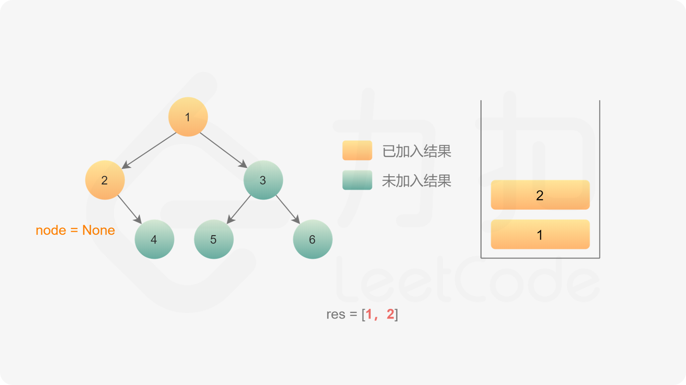


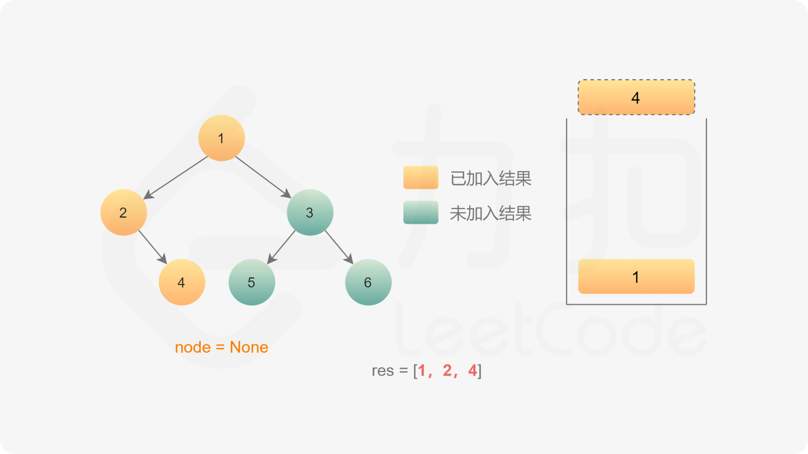
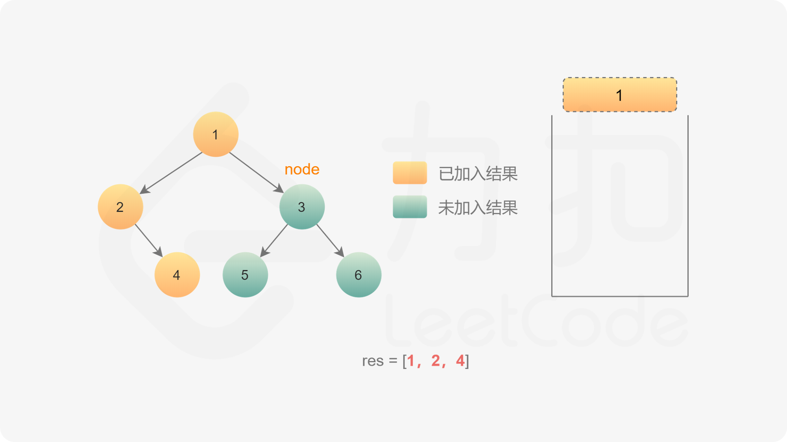
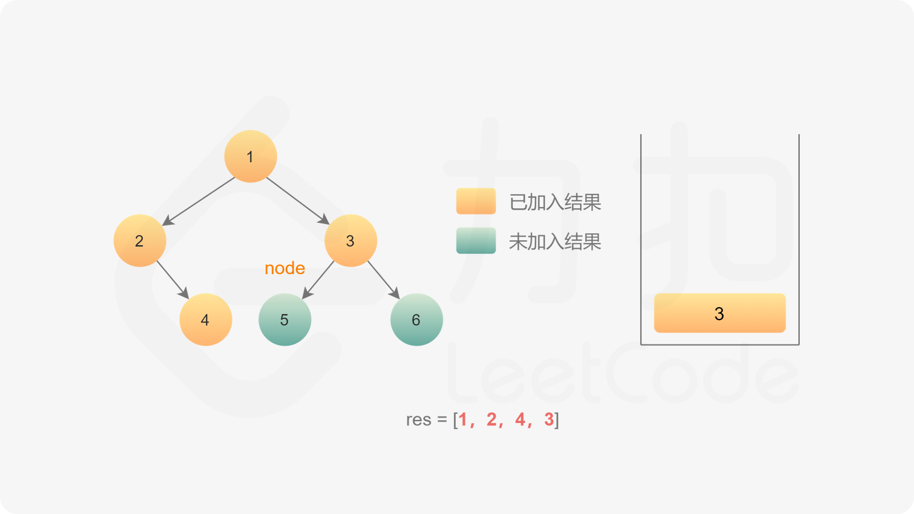
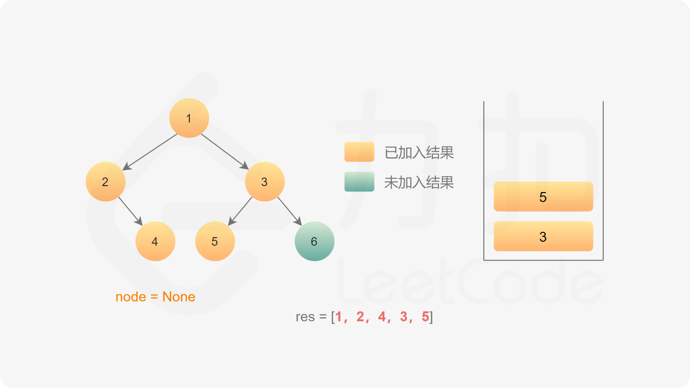
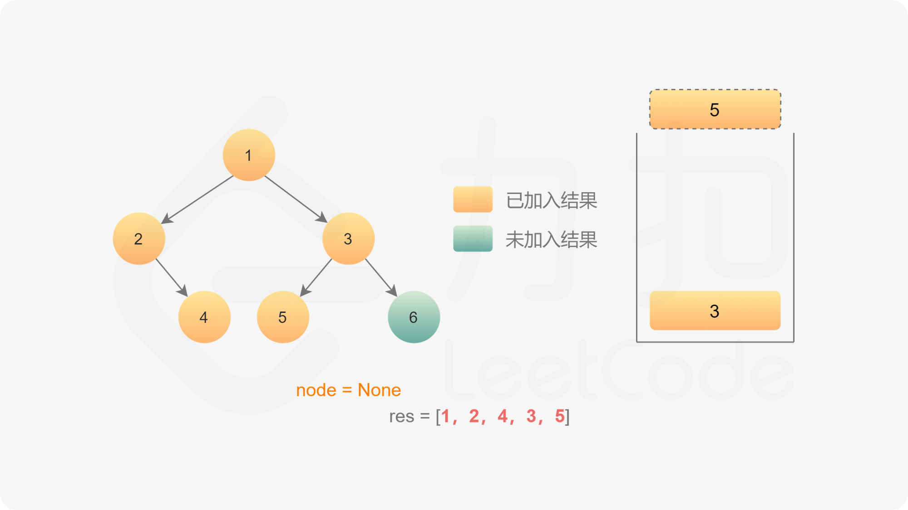

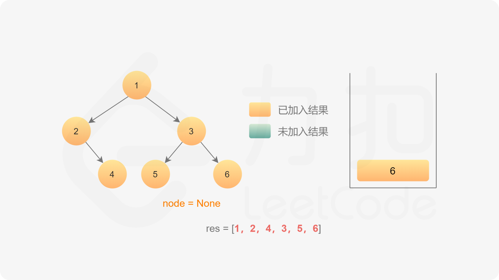
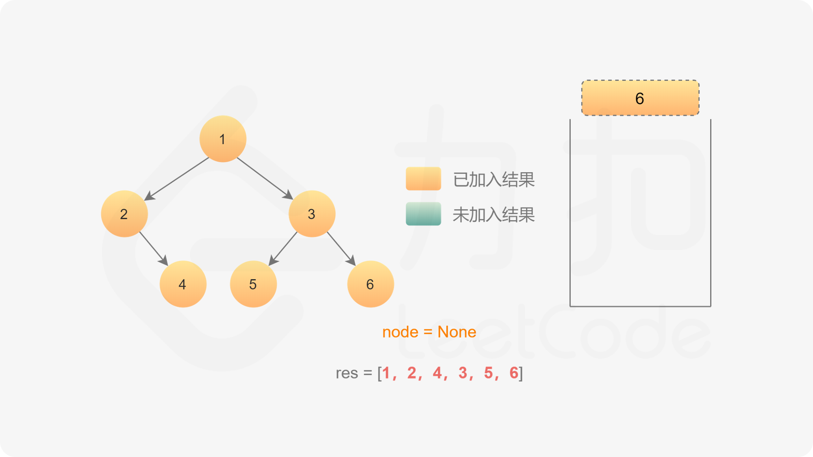
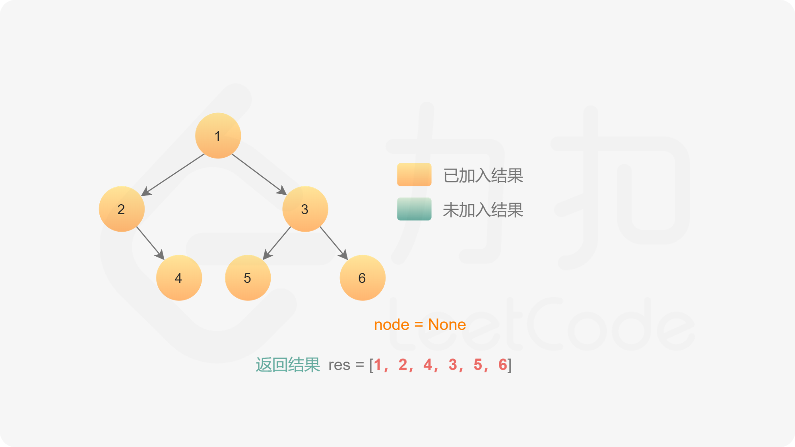

**代码**

```c++
class Solution {
public:
    vector<int> preorderTraversal(TreeNode* root) {
        vector<int> res;
        if (root == nullptr) {
            return res;
        }

        stack<TreeNode*> stk;
        TreeNode* node = root;
        while (!stk.empty() || node != nullptr) {
            while (node != nullptr) {
                res.emplace_back(node->val);
                stk.emplace(node);
                node = node->left;
            }
            node = stk.top();
            stk.pop();
            node = node->right;
        }
        return res;
    }
};
```

```java
class Solution {
    public List<Integer> preorderTraversal(TreeNode root) {
        List<Integer> res = new ArrayList<Integer>();
        if (root == null) {
            return res;
        }

        Deque<TreeNode> stack = new LinkedList<TreeNode>();
        TreeNode node = root;
        while (!stack.isEmpty() || node != null) {
            while (node != null) {
                res.add(node.val);
                stack.push(node);
                node = node.left;
            }
            node = stack.pop();
            node = node.right;
        }
        return res;
    }
}
```

```python
class Solution:
    def preorderTraversal(self, root: TreeNode) -> List[int]:
        res = list()
        if not root:
            return res
        
        stack = []
        node = root
        while stack or node:
            while node:
                res.append(node.val)
                stack.append(node)
                node = node.left
            node = stack.pop()
            node = node.right
        return res
```

```go
func preorderTraversal(root *TreeNode) (vals []int) {
    stack := []*TreeNode{}
    node := root
    for node != nil || len(stack) > 0 {
        for node != nil {
            vals = append(vals, node.Val)
            stack = append(stack, node)
            node = node.Left
        }
        node = stack[len(stack)-1].Right
        stack = stack[:len(stack)-1]
    }
    return
}
```

```c
int* preorderTraversal(struct TreeNode* root, int* returnSize) {
    int* res = malloc(sizeof(int) * 2000);
    *returnSize = 0;
    if (root == NULL) {
        return res;
    }

    struct TreeNode* stk[2000];
    struct TreeNode* node = root;
    int stk_top = 0;
    while (stk_top > 0 || node != NULL) {
        while (node != NULL) {
            res[(*returnSize)++] = node->val;
            stk[stk_top++] = node;
            node = node->left;
        }
        node = stk[--stk_top];
        node = node->right;
    }
    return res;
}
```

**复杂度分析**

- 时间复杂度：$O(n)$，其中 $n$ 是二叉树的节点数。每一个节点恰好被遍历一次。
- 空间复杂度：$O(n)$，为迭代过程中显式栈的开销，平均情况下为 $O(log⁡n)$，最坏情况下树呈现链状，为 $O(n)$。

#### 方法三：Morris 遍历

**思路与算法**

有一种巧妙的方法可以在线性时间内，只占用常数空间来实现前序遍历。这种方法由 J. H. Morris 在 1979 年的论文「Traversing Binary Trees Simply and Cheaply」中首次提出，因此被称为 Morris 遍历。

Morris 遍历的核心思想是利用树的大量空闲指针，实现空间开销的极限缩减。其前序遍历规则总结如下：

1. 新建临时节点，令该节点为 `root`；
2. 如果当前节点的左子节点为空，将当前节点加入答案，并遍历当前节点的右子节点；
3. 如果当前节点的左子节点不为空，在当前节点的左子树中找到当前节点在中序遍历下的前驱节点：
    - 如果前驱节点的右子节点为空，将前驱节点的右子节点设置为当前节点。然后将当前节点加入答案，并将前驱节点的右子节点更新为当前节点。当前节点更新为当前节点的左子节点。
    - 如果前驱节点的右子节点为当前节点，将它的右子节点重新设为空。当前节点更新为当前节点的右子节点。
4. 重复步骤 2 和步骤 3，直到遍历结束。

这样我们利用 Morris 遍历的方法，前序遍历该二叉树，即可实现线性时间与常数空间的遍历。

**代码**

```c++
class Solution {
public:
    vector<int> preorderTraversal(TreeNode *root) {
        vector<int> res;
        if (root == nullptr) {
            return res;
        }

        TreeNode *p1 = root, *p2 = nullptr;

        while (p1 != nullptr) {
            p2 = p1->left;
            if (p2 != nullptr) {
                while (p2->right != nullptr && p2->right != p1) {
                    p2 = p2->right;
                }
                if (p2->right == nullptr) {
                    res.emplace_back(p1->val);
                    p2->right = p1;
                    p1 = p1->left;
                    continue;
                } else {
                    p2->right = nullptr;
                }
            } else {
                res.emplace_back(p1->val);
            }
            p1 = p1->right;
        }
        return res;
    }
};
```

```java
class Solution {
    public List<Integer> preorderTraversal(TreeNode root) {
        List<Integer> res = new ArrayList<Integer>();
        if (root == null) {
            return res;
        }

        TreeNode p1 = root, p2 = null;

        while (p1 != null) {
            p2 = p1.left;
            if (p2 != null) {
                while (p2.right != null && p2.right != p1) {
                    p2 = p2.right;
                }
                if (p2.right == null) {
                    res.add(p1.val);
                    p2.right = p1;
                    p1 = p1.left;
                    continue;
                } else {
                    p2.right = null;
                }
            } else {
                res.add(p1.val);
            }
            p1 = p1.right;
        }
        return res;
    }
}
```

```python
class Solution:
    def preorderTraversal(self, root: TreeNode) -> List[int]:
        res = list()
        if not root:
            return res
        
        p1 = root
        while p1:
            p2 = p1.left
            if p2:
                while p2.right and p2.right != p1:
                    p2 = p2.right
                if not p2.right:
                    res.append(p1.val)
                    p2.right = p1
                    p1 = p1.left
                    continue
                else:
                    p2.right = None
            else:
                res.append(p1.val)
            p1 = p1.right
        
        return res
```

```go
func preorderTraversal(root *TreeNode) (vals []int) {
    var p1, p2 *TreeNode = root, nil
    for p1 != nil {
        p2 = p1.Left
        if p2 != nil {
            for p2.Right != nil && p2.Right != p1 {
                p2 = p2.Right
            }
            if p2.Right == nil {
                vals = append(vals, p1.Val)
                p2.Right = p1
                p1 = p1.Left
                continue
            }
            p2.Right = nil
        } else {
            vals = append(vals, p1.Val)
        }
        p1 = p1.Right
    }
    return
}
```

```c
int* preorderTraversal(struct TreeNode* root, int* returnSize) {
    int* res = malloc(sizeof(int) * 2000);
    *returnSize = 0;
    if (root == NULL) {
        return res;
    }

    struct TreeNode *p1 = root, *p2 = NULL;

    while (p1 != NULL) {
        p2 = p1->left;
        if (p2 != NULL) {
            while (p2->right != NULL && p2->right != p1) {
                p2 = p2->right;
            }
            if (p2->right == NULL) {
                res[(*returnSize)++] = p1->val;
                p2->right = p1;
                p1 = p1->left;
                continue;
            } else {
                p2->right = NULL;
            }
        } else {
            res[(*returnSize)++] = p1->val;
        }
        p1 = p1->right;
    }
    return res;
}
```

**复杂度分析**

- 时间复杂度：$O(n)$，其中 $n$ 是二叉树的节点数。没有左子树的节点只被访问一次，有左子树的节点被访问两次。
- 空间复杂度：$O(1)$。只操作已经存在的指针（树的空闲指针），因此只需要常数的额外空间。
