### [对链表进行插入排序](https://leetcode.cn/problems/insertion-sort-list/solutions/491124/dui-lian-biao-jin-xing-cha-ru-pai-xu-by-leetcode-s/?envType=problem-list-v2&envId=04xjKEs9)

#### 方法一：从前往后找插入点

插入排序的基本思想是，维护一个有序序列，初始时有序序列只有一个元素，每次将一个新的元素插入到有序序列中，将有序序列的长度增加 $1$，直到全部元素都加入到有序序列中。

如果是数组的插入排序，则数组的前面部分是有序序列，每次找到有序序列后面的第一个元素（待插入元素）的插入位置，将有序序列中的插入位置后面的元素都往后移动一位，然后将待插入元素置于插入位置。

对于链表而言，插入元素时只要更新相邻节点的指针即可，不需要像数组一样将插入位置后面的元素往后移动，因此插入操作的时间复杂度是 $O(1)$，但是找到插入位置需要遍历链表中的节点，时间复杂度是 $O(n)$，因此链表插入排序的总时间复杂度仍然是 $O(n^2)$，其中 $n$ 是链表的长度。

对于单向链表而言，只有指向后一个节点的指针，因此需要从链表的头节点开始往后遍历链表中的节点，寻找插入位置。

对链表进行插入排序的具体过程如下。

1. 首先判断给定的链表是否为空，若为空，则不需要进行排序，直接返回。
1. 创建哑节点 `dummyHead`，令 `dummyHead.next = head`。引入哑节点是为了便于在 `head` 节点之前插入节点。
1. 维护 `lastSorted` 为链表的已排序部分的最后一个节点，初始时 `lastSorted = head`。
1. 维护 `curr` 为待插入的元素，初始时 `curr = head.next`。
1. 比较 `lastSorted` 和 `curr` 的节点值。
   - 若 `lastSorted.val <= curr.val`，说明 `curr` 应该位于 `lastSorted` 之后，将 `lastSorted` 后移一位，`curr` 变成新的 `lastSorted`。
   - 否则，从链表的头节点开始往后遍历链表中的节点，寻找插入 `curr` 的位置。令 `prev` 为插入 `curr` 的位置的前一个节点，进行如下操作，完成对 `curr` 的插入：
    ```c
    lastSorted.next = curr.next
    curr.next = prev.next
    prev.next = curr
    ```
1. 令 `curr = lastSorted.next`，此时 `curr` 为下一个待插入的元素。
1. 重复第 $5$ 步和第 $6$ 步，直到 `curr` 变成空，排序结束。
1. 返回 `dummyHead.next`，为排序后的链表的头节点。

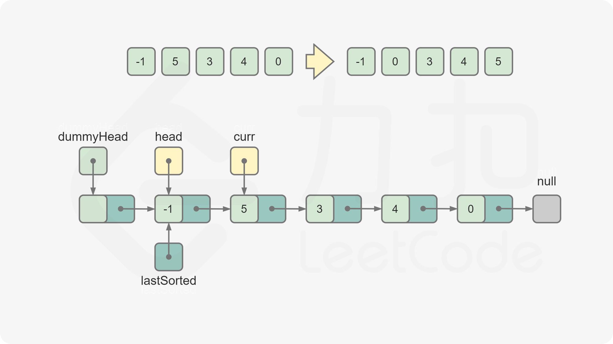
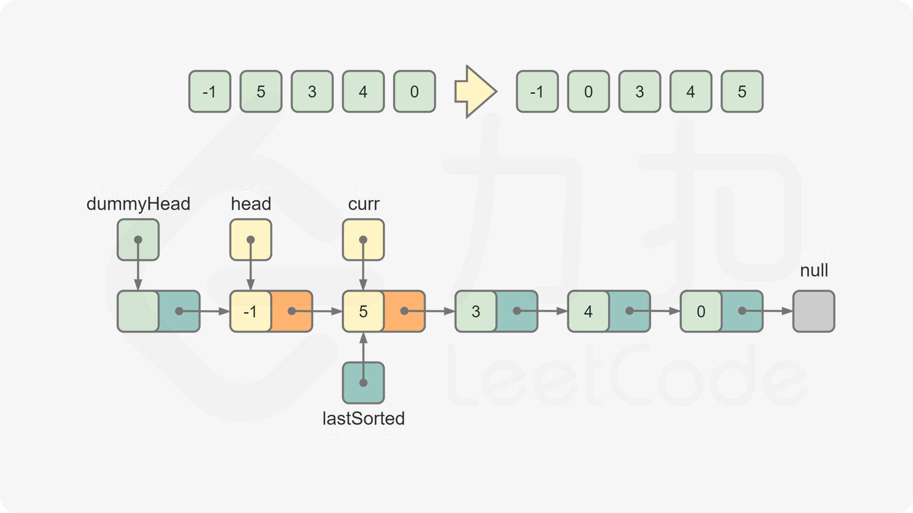
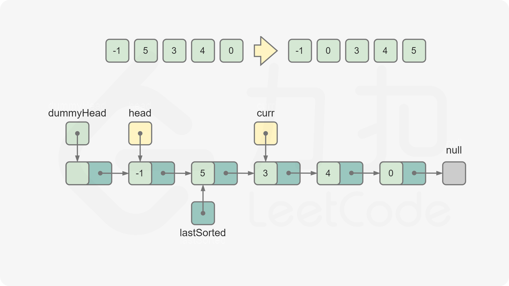
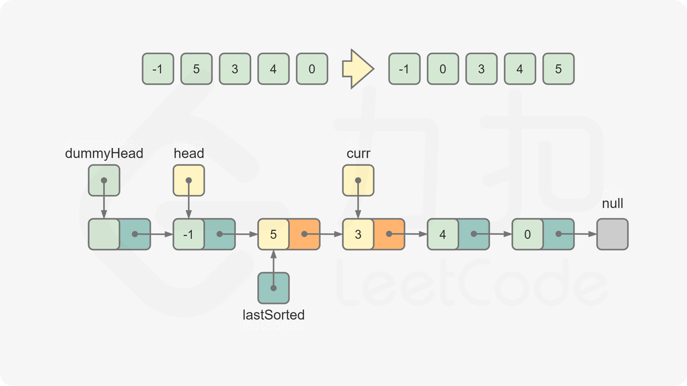
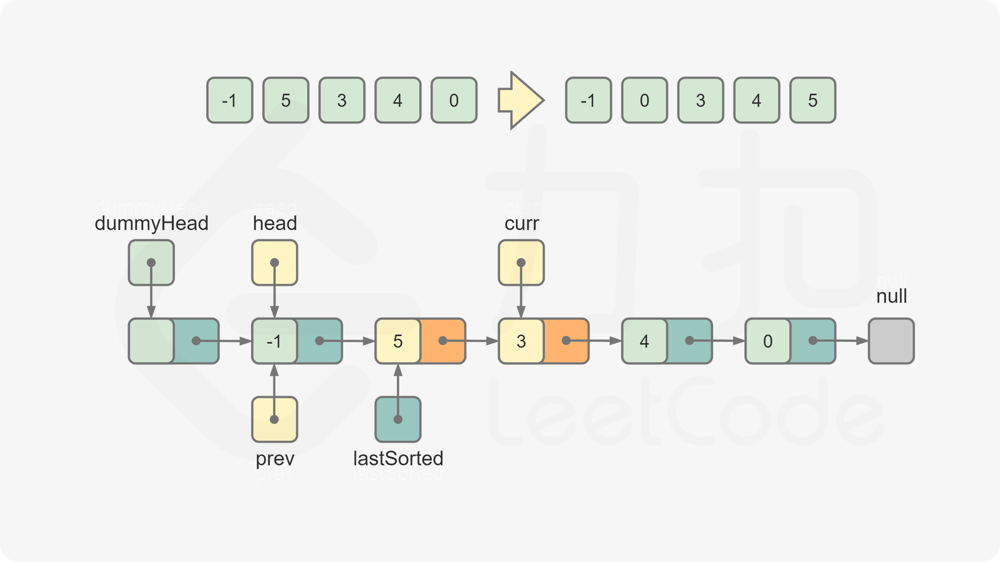
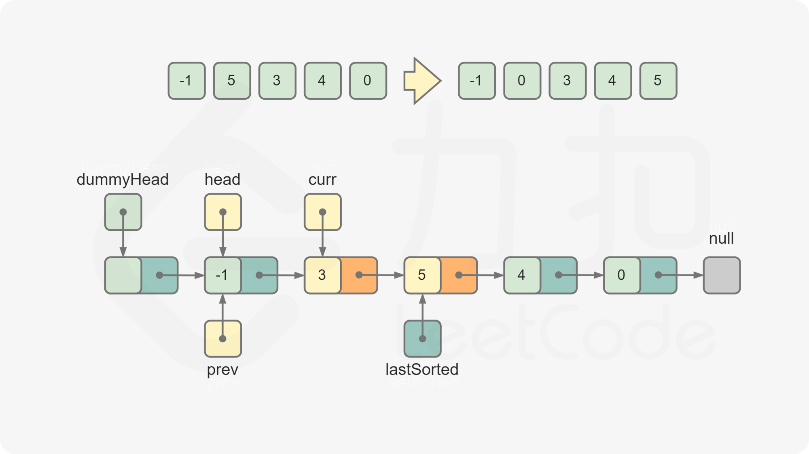
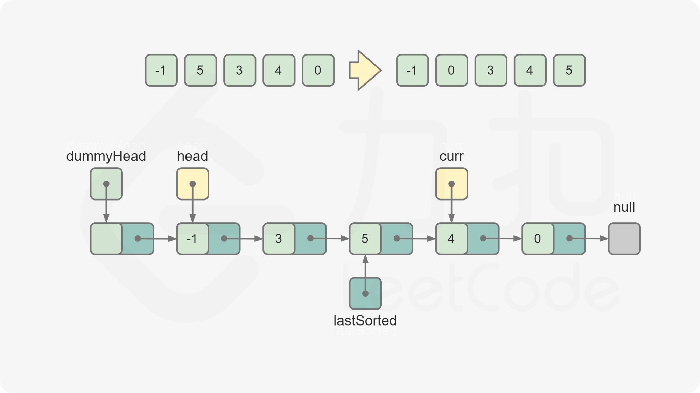
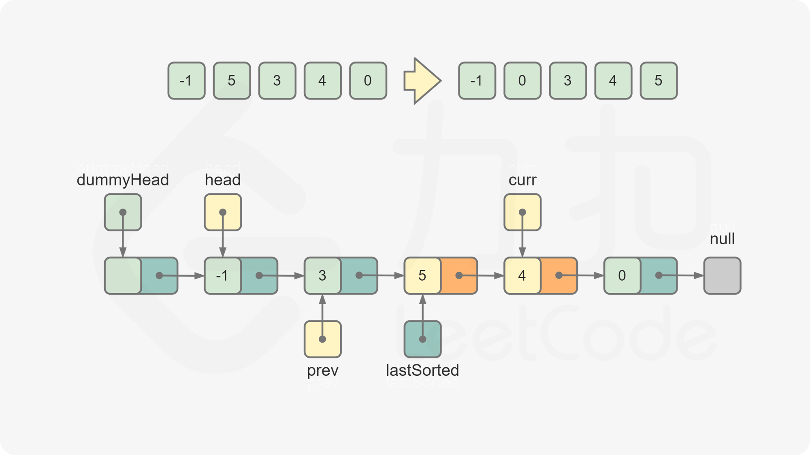
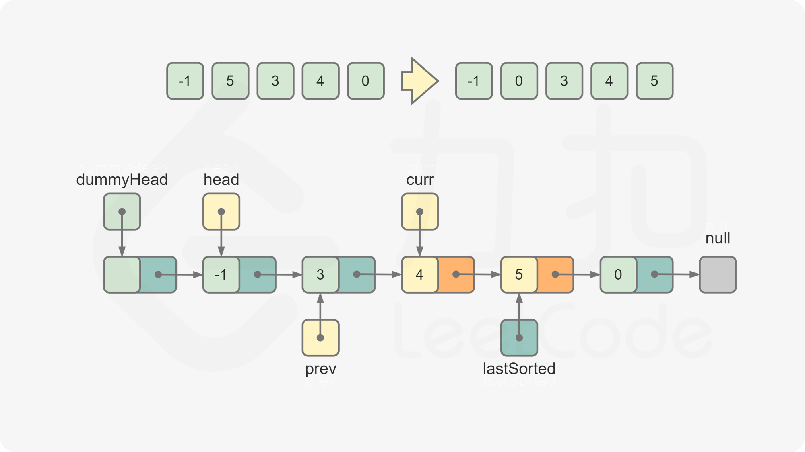
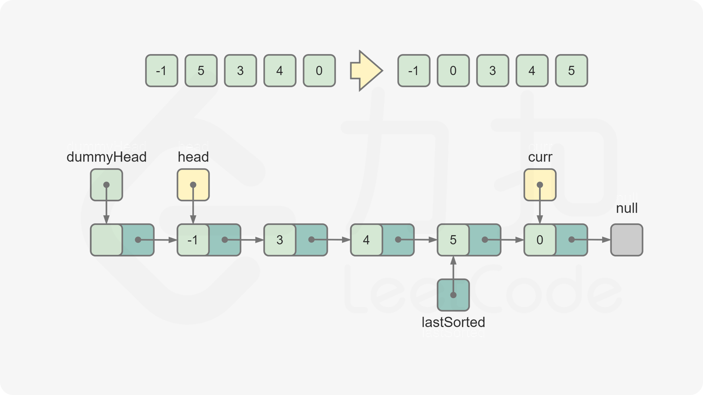
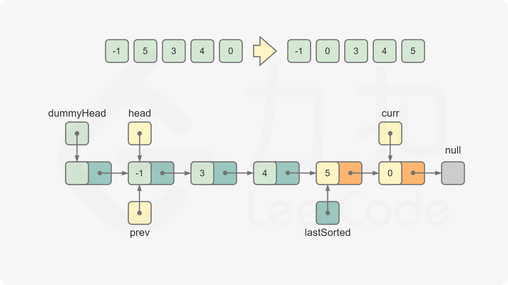
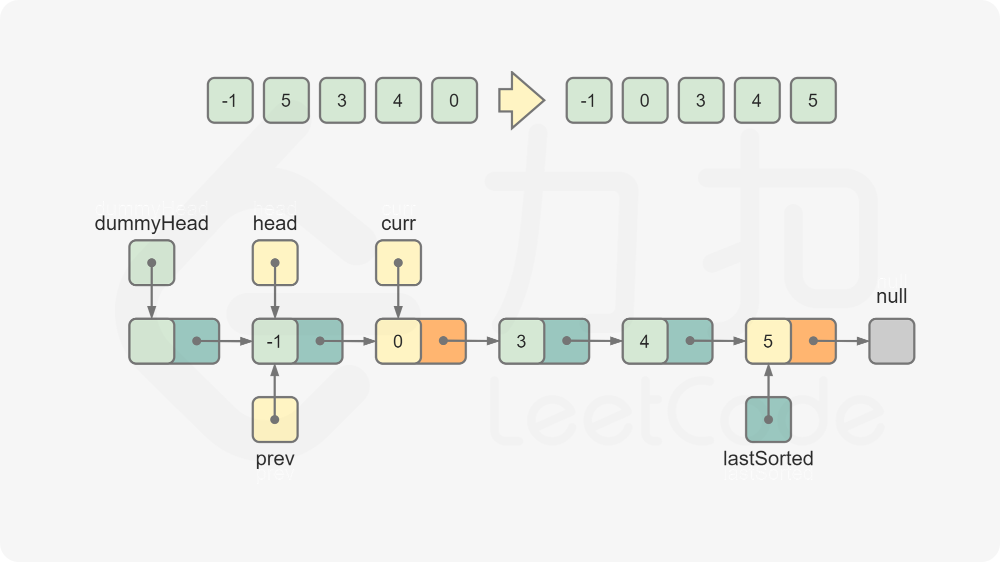
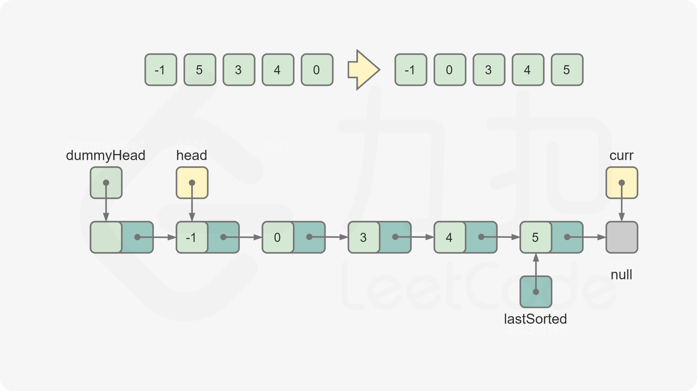
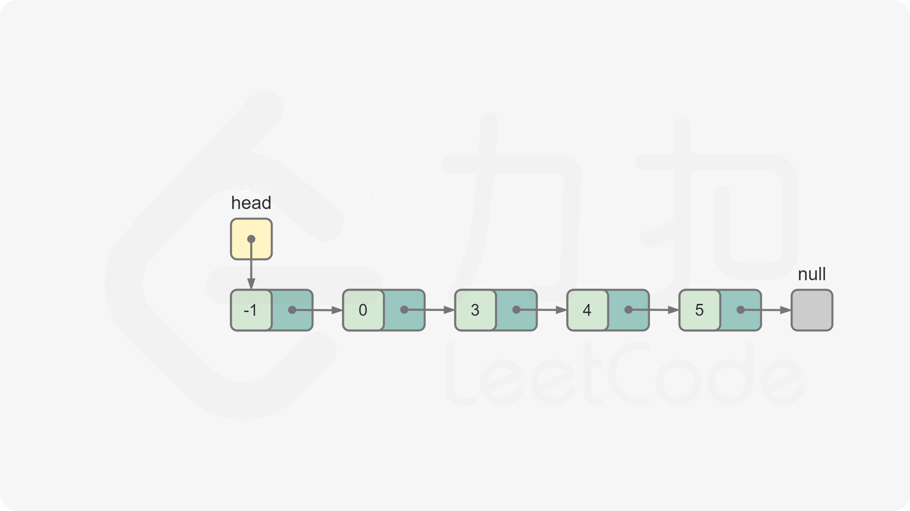

```Java
class Solution {
    public ListNode insertionSortList(ListNode head) {
        if (head == null) {
            return head;
        }
        ListNode dummyHead = new ListNode(0);
        dummyHead.next = head;
        ListNode lastSorted = head, curr = head.next;
        while (curr != null) {
            if (lastSorted.val <= curr.val) {
                lastSorted = lastSorted.next;
            } else {
                ListNode prev = dummyHead;
                while (prev.next.val <= curr.val) {
                    prev = prev.next;
                }
                lastSorted.next = curr.next;
                curr.next = prev.next;
                prev.next = curr;
            }
            curr = lastSorted.next;
        }
        return dummyHead.next;
    }
}
```

```JavaScript
var insertionSortList = function(head) {
    if (head === null) {
        return head;
    }
    const dummyHead = new ListNode(0);
    dummyHead.next = head;
    let lastSorted = head, curr = head.next;
    while (curr !== null) {
        if (lastSorted.val <= curr.val) {
            lastSorted = lastSorted.next;
        } else {
            let prev = dummyHead;
            while (prev.next.val <= curr.val) {
                prev = prev.next;
            }
            lastSorted.next = curr.next;
            curr.next = prev.next;
            prev.next = curr;
        }
        curr = lastSorted.next;
    }
    return dummyHead.next;
};
```

```C++
class Solution {
public:
    ListNode* insertionSortList(ListNode* head) {
        if (head == nullptr) {
            return head;
        }
        ListNode* dummyHead = new ListNode(0);
        dummyHead->next = head;
        ListNode* lastSorted = head;
        ListNode* curr = head->next;
        while (curr != nullptr) {
            if (lastSorted->val <= curr->val) {
                lastSorted = lastSorted->next;
            } else {
                ListNode *prev = dummyHead;
                while (prev->next->val <= curr->val) {
                    prev = prev->next;
                }
                lastSorted->next = curr->next;
                curr->next = prev->next;
                prev->next = curr;
            }
            curr = lastSorted->next;
        }
        return dummyHead->next;
    }
};
```

```Python
class Solution:
    def insertionSortList(self, head: ListNode) -> ListNode:
        if not head:
            return head
        
        dummyHead = ListNode(0)
        dummyHead.next = head
        lastSorted = head
        curr = head.next

        while curr:
            if lastSorted.val <= curr.val:
                lastSorted = lastSorted.next
            else:
                prev = dummyHead
                while prev.next.val <= curr.val:
                    prev = prev.next
                lastSorted.next = curr.next
                curr.next = prev.next
                prev.next = curr
            curr = lastSorted.next
        
        return dummyHead.next
```

```Go
func insertionSortList(head *ListNode) *ListNode {
    if head == nil {
        return nil
    }
    dummyHead := &ListNode{Next: head}
    lastSorted, curr := head, head.Next
    for curr != nil {
        if lastSorted.Val <= curr.Val {
            lastSorted = lastSorted.Next
        } else {
            prev := dummyHead
            for prev.Next.Val <= curr.Val {
                prev = prev.Next
            }
            lastSorted.Next = curr.Next
            curr.Next = prev.Next
            prev.Next = curr
        }
        curr = lastSorted.Next
    }
    return dummyHead.Next
}
```

```C
struct ListNode *insertionSortList(struct ListNode *head) {
    if (head == NULL) {
        return head;
    }
    struct ListNode *dummyHead = malloc(sizeof(struct ListNode));
    dummyHead->val = 0;
    dummyHead->next = head;
    struct ListNode *lastSorted = head;
    struct ListNode *curr = head->next;
    while (curr != NULL) {
        if (lastSorted->val <= curr->val) {
            lastSorted = lastSorted->next;
        } else {
            struct ListNode *prev = dummyHead;
            while (prev->next->val <= curr->val) {
                prev = prev->next;
            }
            lastSorted->next = curr->next;
            curr->next = prev->next;
            prev->next = curr;
        }
        curr = lastSorted->next;
    }
    return dummyHead->next;
}
```

**复杂度分析**

- 时间复杂度：$O(n^2)$，其中 $n$ 是链表的长度。
- 空间复杂度：$O(1)$。
