### [逆波兰表达式求值](https://leetcode.cn/problems/evaluate-reverse-polish-notation/solutions/667892/ni-bo-lan-biao-da-shi-qiu-zhi-by-leetcod-wue9/)

#### 前言

逆波兰表达式由波兰的逻辑学家卢卡西维兹提出。逆波兰表达式的特点是：没有括号，运算符总是放在和它相关的操作数之后。因此，逆波兰表达式也称后缀表达式。

#### 方法一：栈

逆波兰表达式严格遵循「从左到右」的运算。计算逆波兰表达式的值时，使用一个栈存储操作数，从左到右遍历逆波兰表达式，进行如下操作：

- 如果遇到操作数，则将操作数入栈；
- 如果遇到运算符，则将两个操作数出栈，其中先出栈的是右操作数，后出栈的是左操作数，使用运算符对两个操作数进行运算，将运算得到的新操作数入栈。

整个逆波兰表达式遍历完毕之后，栈内只有一个元素，该元素即为逆波兰表达式的值。

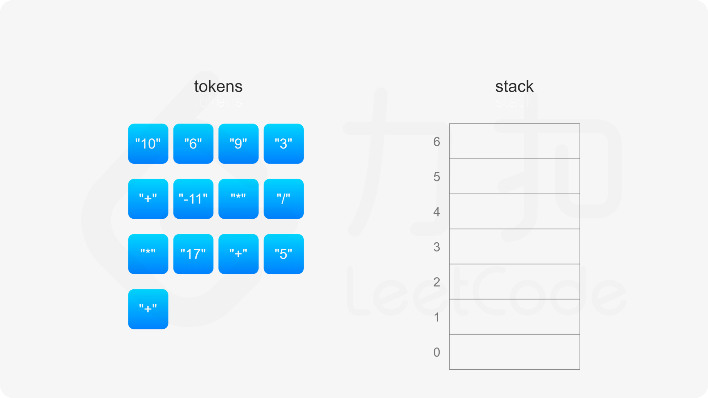
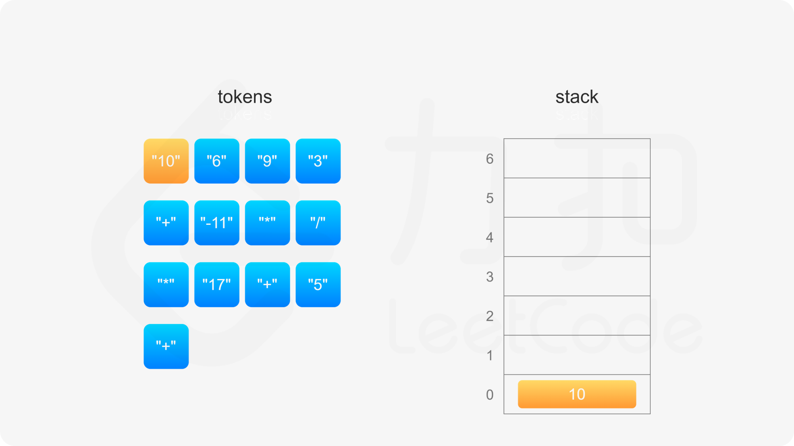
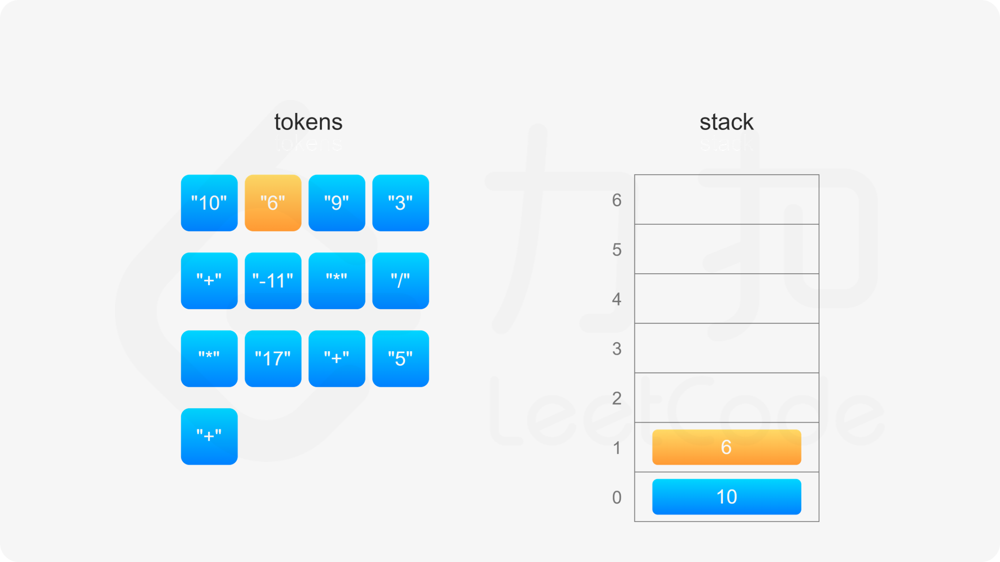
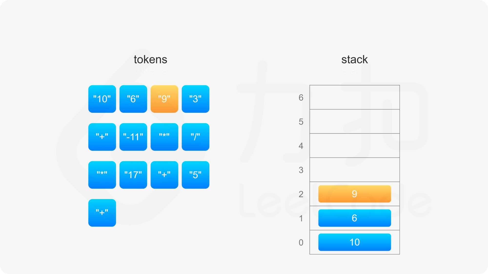
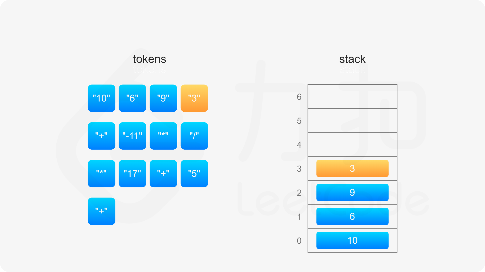
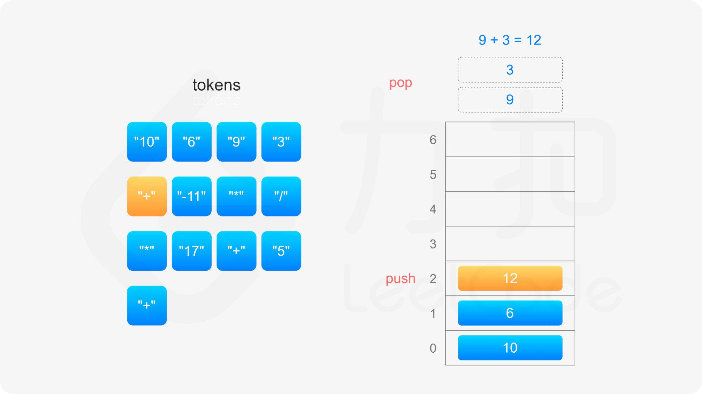
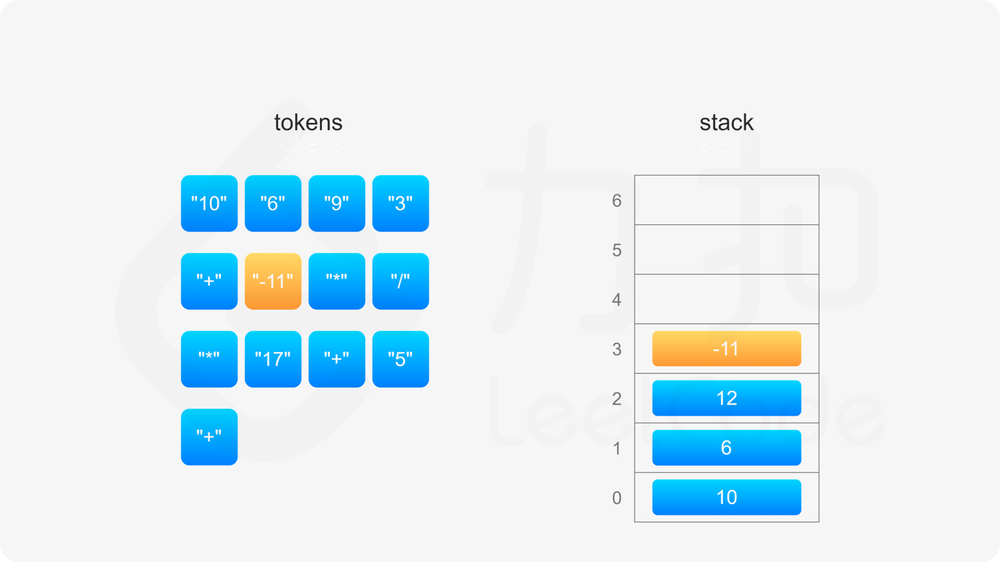
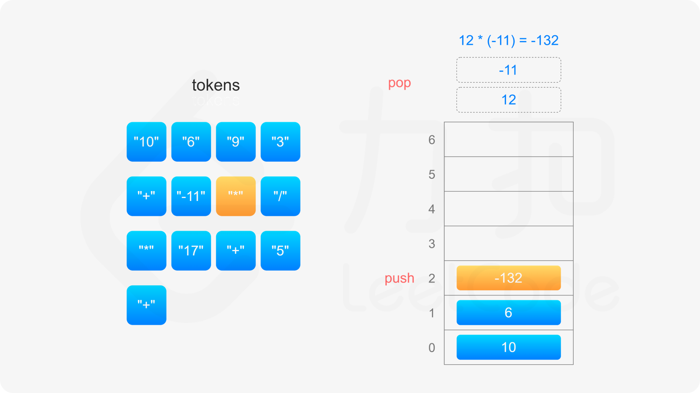
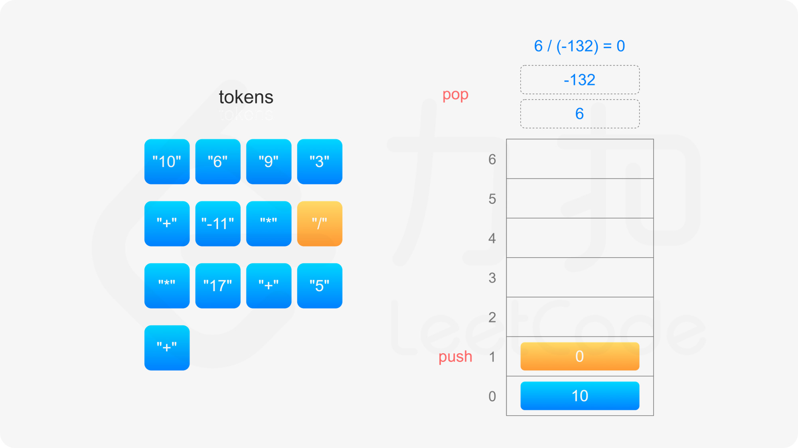
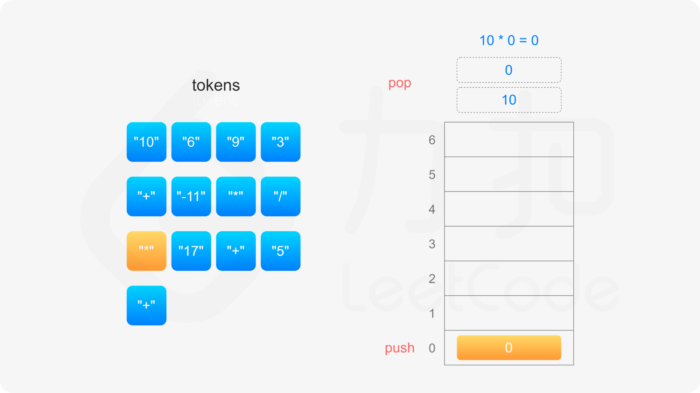
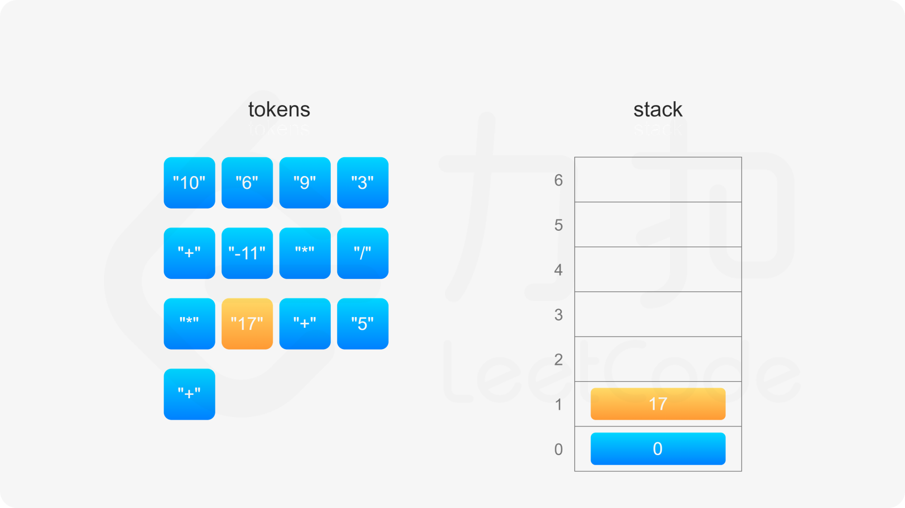
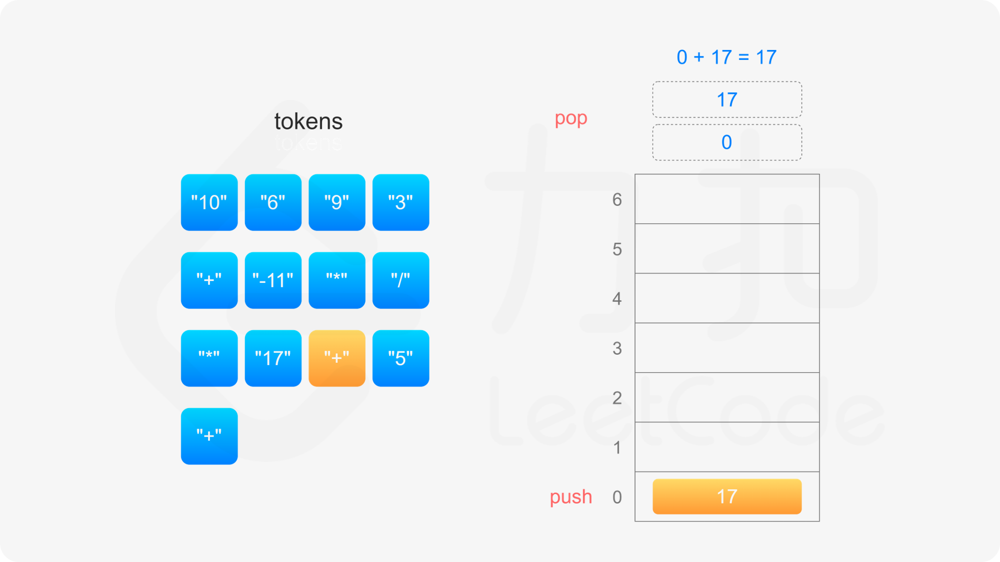
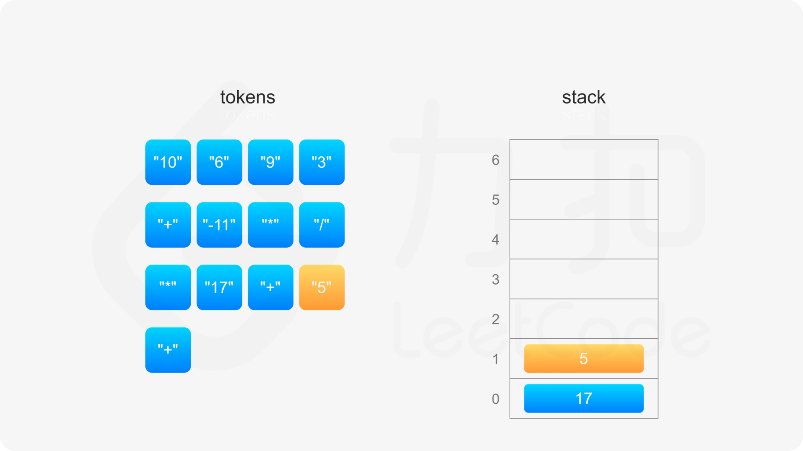
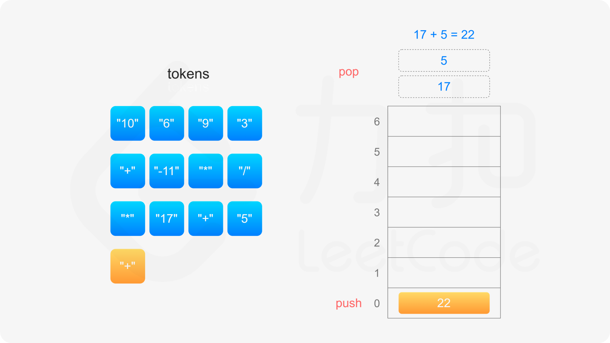
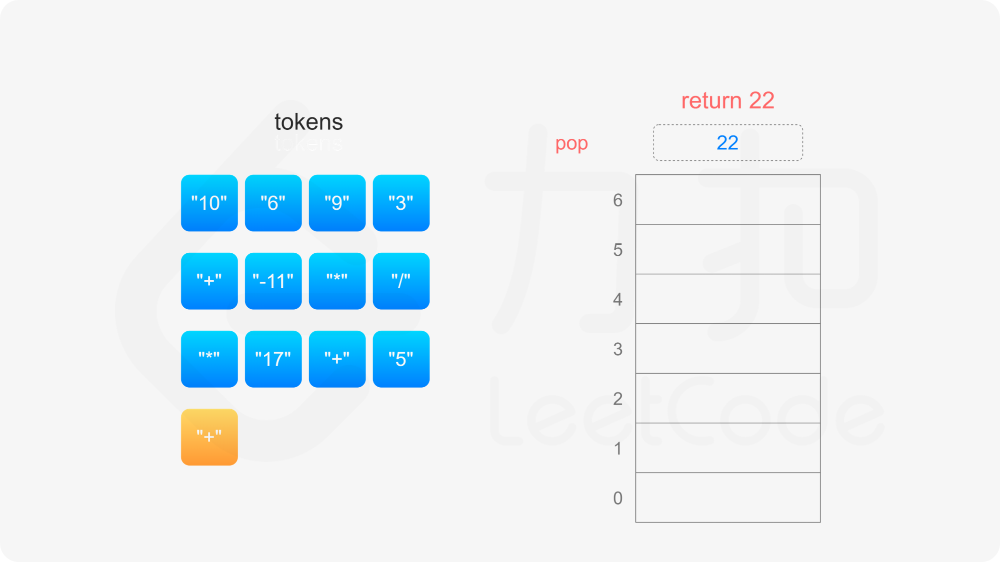

```Java
class Solution {
    public int evalRPN(String[] tokens) {
        Deque<Integer> stack = new LinkedList<Integer>();
        int n = tokens.length;
        for (int i = 0; i < n; i++) {
            String token = tokens[i];
            if (isNumber(token)) {
                stack.push(Integer.parseInt(token));
            } else {
                int num2 = stack.pop();
                int num1 = stack.pop();
                switch (token) {
                    case "+":
                        stack.push(num1 + num2);
                        break;
                    case "-":
                        stack.push(num1 - num2);
                        break;
                    case "*":
                        stack.push(num1 * num2);
                        break;
                    case "/":
                        stack.push(num1 / num2);
                        break;
                    default:
                }
            }
        }
        return stack.pop();
    }

    public boolean isNumber(String token) {
        return !("+".equals(token) || "-".equals(token) || "*".equals(token) || "/".equals(token));
    }
}
```

```JavaScript
var evalRPN = function(tokens) {
    const stack = [];
    const n = tokens.length;
    for (let i = 0; i < n; i++) {
        const token = tokens[i];
        if (isNumber(token)) {
            stack.push(parseInt(token));
        } else {
            const num2 = stack.pop();
            const num1 = stack.pop();
            if (token === '+') {
                stack.push(num1 + num2);
            } else if (token === '-') {
                stack.push(num1 - num2);
            } else if (token === '*') {
                stack.push(num1 * num2);
            } else if (token === '/') {
                stack.push(num1 / num2 > 0 ? Math.floor(num1 / num2) : Math.ceil(num1 / num2));
            }
        }
    }
    return stack.pop();
};

const isNumber = (token) => {
    return !('+' === token || '-' === token || '*' === token || '/' === token );
}
```

```Go
func evalRPN(tokens []string) int {
    stack := []int{}
    for _, token := range tokens {
        val, err := strconv.Atoi(token)
        if err == nil {
            stack = append(stack, val)
        } else {
            num1, num2 := stack[len(stack)-2], stack[len(stack)-1]
            stack = stack[:len(stack)-2]
            switch token {
            case "+":
                stack = append(stack, num1+num2)
            case "-":
                stack = append(stack, num1-num2)
            case "*":
                stack = append(stack, num1*num2)
            default:
                stack = append(stack, num1/num2)
            }
        }
    }
    return stack[0]
}
```

```Python
class Solution:
    def evalRPN(self, tokens: List[str]) -> int:
        op_to_binary_fn = {
            "+": add,
            "-": sub,
            "*": mul,
            "/": lambda x, y: int(x / y),   # 需要注意 python 中负数除法的表现与题目不一致
        }

        stack = list()
        for token in tokens:
            try:
                num = int(token)
            except ValueError:
                num2 = stack.pop()
                num1 = stack.pop()
                num = op_to_binary_fn[token](num1, num2)
            finally:
                stack.append(num)
            
        return stack[0]
```

```C++
class Solution {
public:
    int evalRPN(vector<string>& tokens) {
        stack<int> stk;
        int n = tokens.size();
        for (int i = 0; i < n; i++) {
            string& token = tokens[i];
            if (isNumber(token)) {
                stk.push(atoi(token.c_str()));
            } else {
                int num2 = stk.top();
                stk.pop();
                int num1 = stk.top();
                stk.pop();
                switch (token[0]) {
                    case '+':
                        stk.push(num1 + num2);
                        break;
                    case '-':
                        stk.push(num1 - num2);
                        break;
                    case '*':
                        stk.push(num1 * num2);
                        break;
                    case '/':
                        stk.push(num1 / num2);
                        break;
                }
            }
        }
        return stk.top();
    }

    bool isNumber(string& token) {
        return !(token == "+" || token == "-" || token == "*" || token == "/");
    }
};
```

```C
bool isNumber(char* token) {
    return strlen(token) > 1 || ('0' <= token[0] && token[0] <= '9');
}

int evalRPN(char** tokens, int tokensSize) {
    int n = tokensSize;
    int stk[n], top = 0;
    for (int i = 0; i < n; i++) {
        char* token = tokens[i];
        if (isNumber(token)) {
            stk[top++] = atoi(token);
        } else {
            int num2 = stk[--top];
            int num1 = stk[--top];
            switch (token[0]) {
                case '+':
                    stk[top++] = num1 + num2;
                    break;
                case '-':
                    stk[top++] = num1 - num2;
                    break;
                case '*':
                    stk[top++] = num1 * num2;
                    break;
                case '/':
                    stk[top++] = num1 / num2;
                    break;
            }
        }
    }
    return stk[top - 1];
}
```

**复杂度分析**

- 时间复杂度：$O(n)$，其中 $n$ 是数组 $tokens$ 的长度。需要遍历数组 $tokens$ 一次，计算逆波兰表达式的值。
- 空间复杂度：$O(n)$，其中 $n$ 是数组 $tokens$ 的长度。使用栈存储计算过程中的数，栈内元素个数不会超过逆波兰表达式的长度。

#### 方法二：数组模拟栈

方法一使用栈存储操作数。也可以使用一个数组模拟栈操作。

如果使用数组代替栈，则需要预先定义数组的长度。对于长度为 $n$ 的逆波兰表达式，显然栈内元素个数不会超过 $n$，但是将数组的长度定义为 $n$ 仍然超过了栈内元素个数的上界。那么，栈内元素最多可能有多少个？

对于一个有效的逆波兰表达式，其长度 $n$ 一定是奇数，且操作数的个数一定比运算符的个数多 $1$ 个，即包含 $\dfrac{n+1}{2}$ 个操作数和 $\dfrac{n-1}{2}$ 个运算符。考虑遇到操作数和运算符时，栈内元素个数分别会如何变化：

- 如果遇到操作数，则将操作数入栈，因此栈内元素增加 $1$ 个；
- 如果遇到运算符，则将两个操作数出栈，然后将一个新操作数入栈，因此栈内元素先减少 $2$ 个再增加 $1$ 个，结果是栈内元素减少 $1$ 个。

由此可以得到操作数和运算符与栈内元素个数变化的关系：遇到操作数时，栈内元素增加 $1$ 个；遇到运算符时，栈内元素减少 $1$ 个。

最坏情况下，$\dfrac{n+1}{2}$ 个操作数都在表达式的前面，$\dfrac{n-1}{2}$ 个运算符都在表达式的后面，此时栈内元素最多为 $\dfrac{n+1}{2}$ 个。在其余情况下，栈内元素总是少于 $\dfrac{n+1}{2}$ 个。因此，在任何情况下，栈内元素最多可能有 $\dfrac{n+1}{2}$ 个，将数组的长度定义为 $\dfrac{n+1}{2}$ 即可。

具体实现方面，创建数组 $stack$ 模拟栈，数组下标 $0$ 的位置对应栈底，定义 $index$ 表示栈顶元素的下标位置，初始时栈为空，$index=-1$。当遇到操作数和运算符时，进行如下操作：

- 如果遇到操作数，则将 $index$ 的值加 $1$，然后将操作数赋给 $stack[index]$；
- 如果遇到运算符，则将 $index$ 的值减 $1$，此时 $stack[index]$ 和 $stack[index+1]$ 的元素分别是左操作数和右操作数，使用运算符对两个操作数进行运算，将运算得到的新操作数赋给 $stack[index]$。

整个逆波兰表达式遍历完毕之后，栈内只有一个元素，因此 $index=0$，此时 $stack[index]$ 即为逆波兰表达式的值。

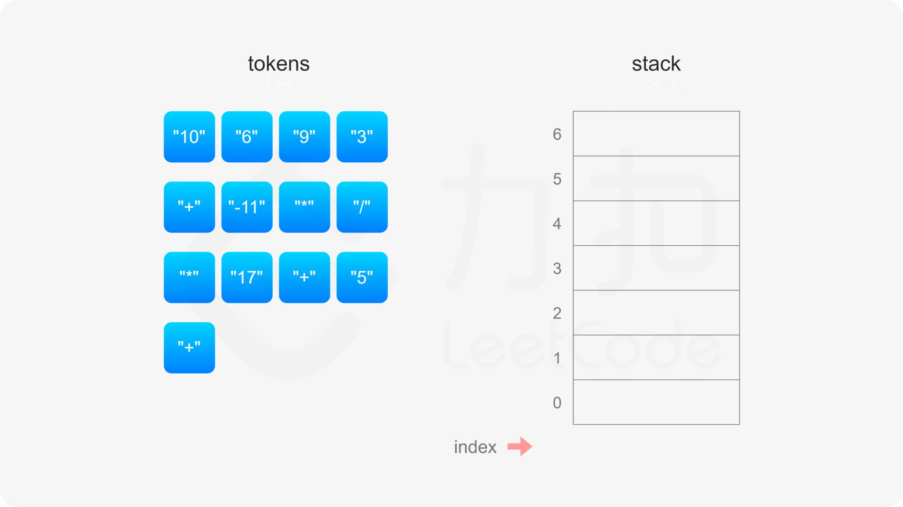
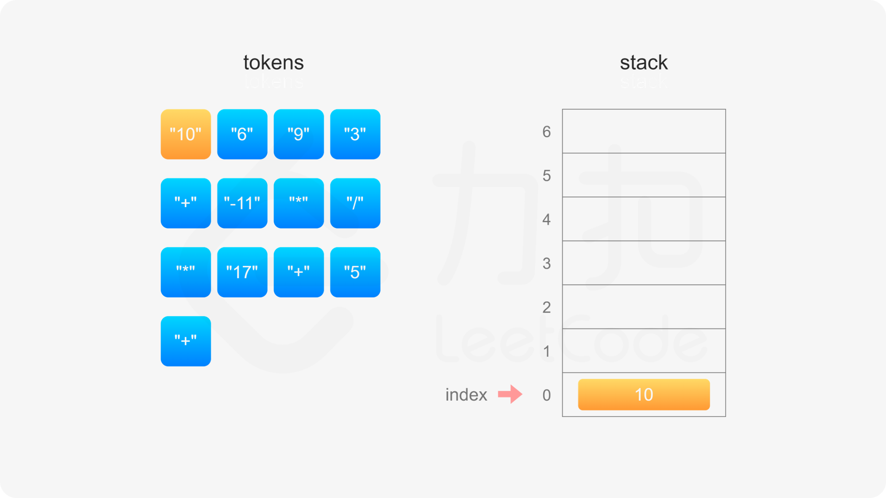
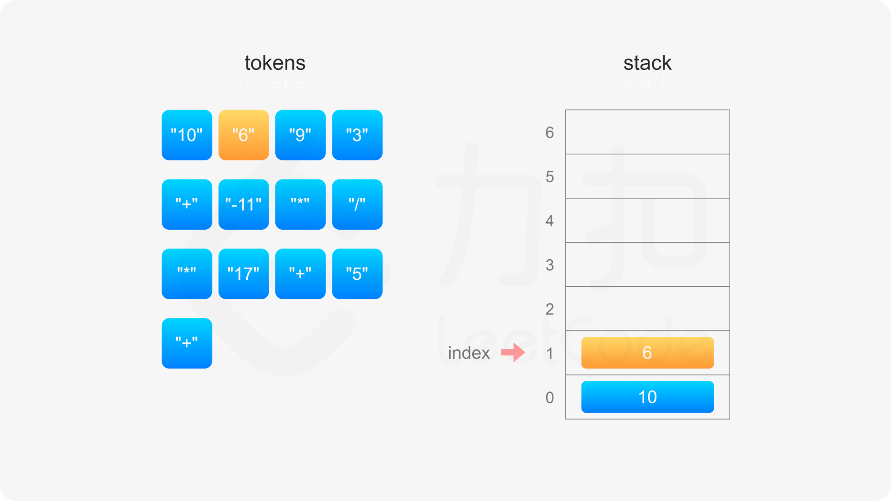
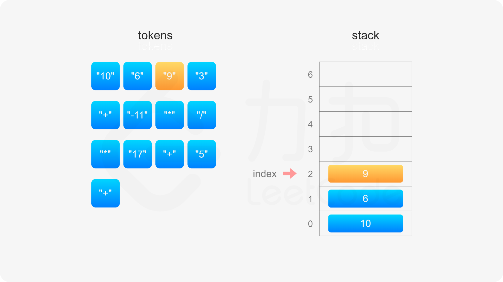
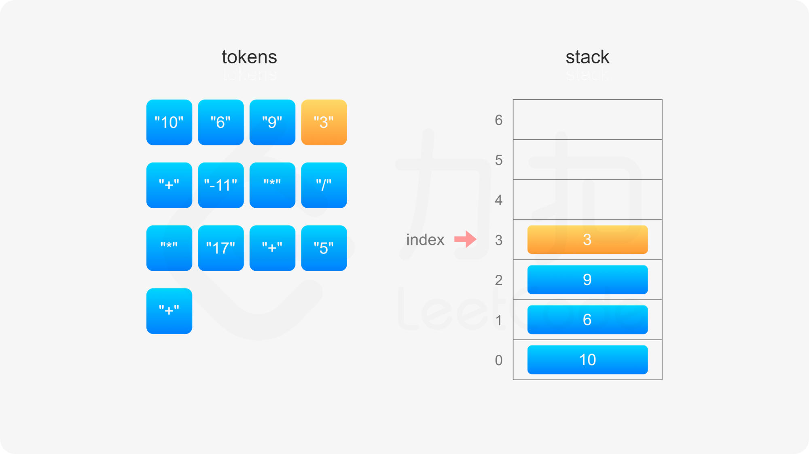
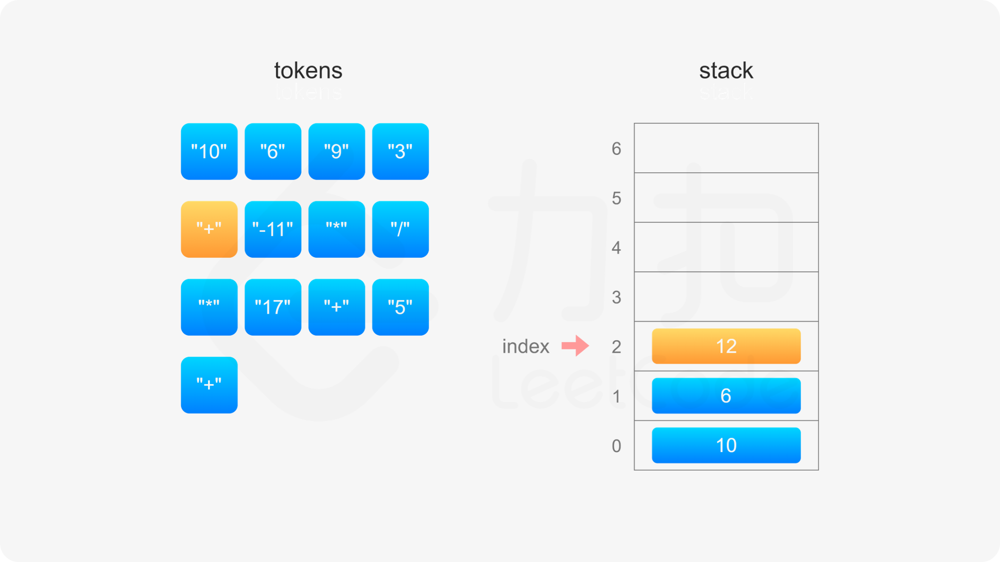
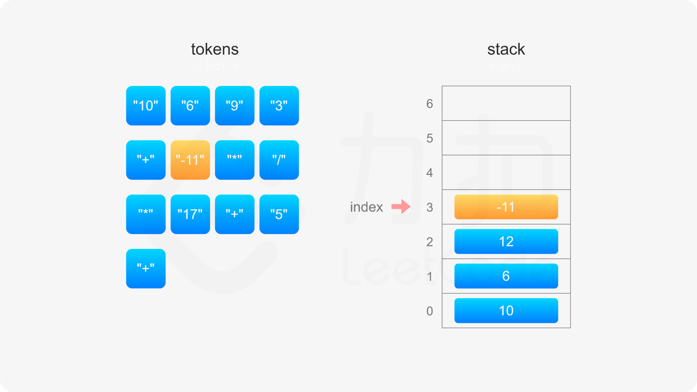
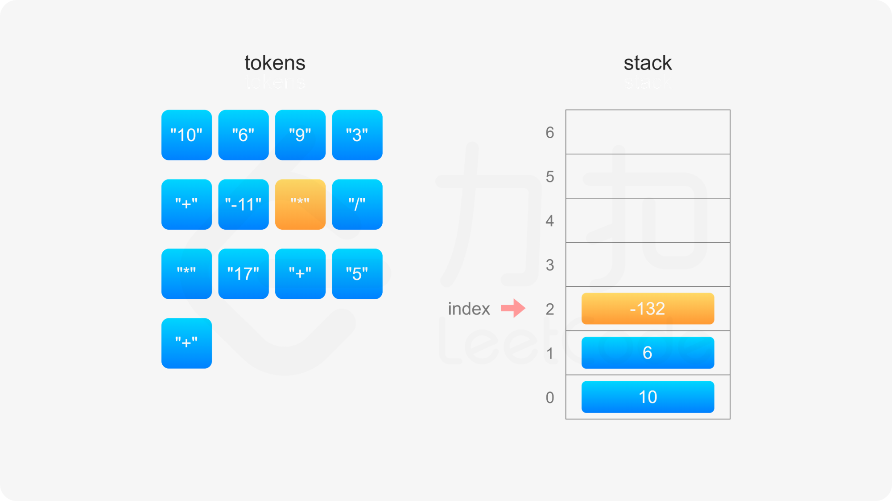
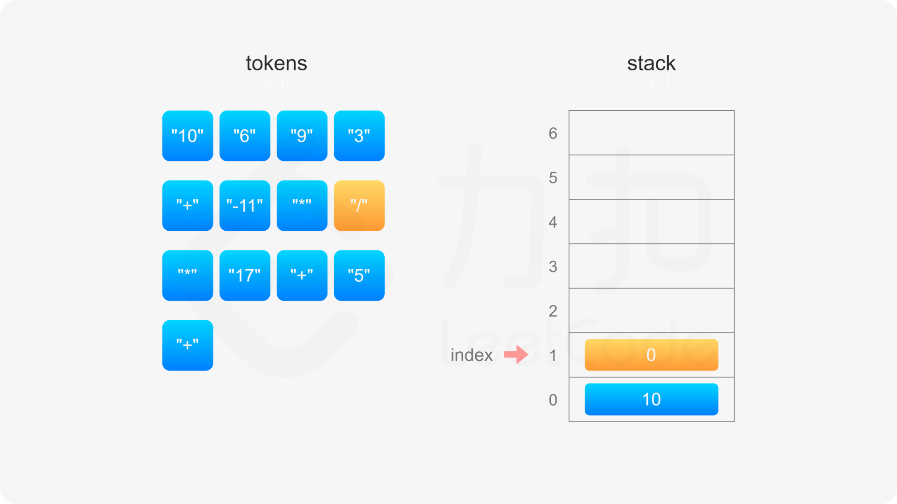
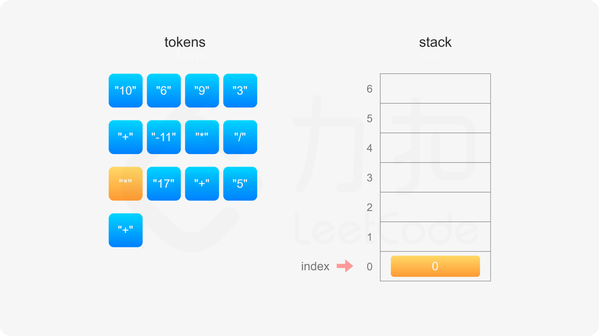
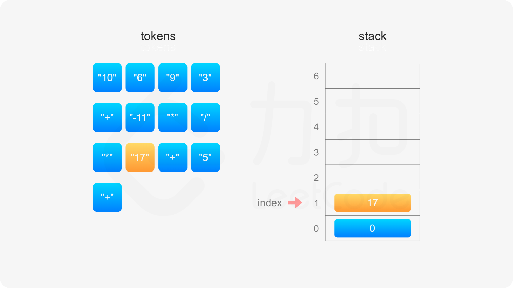
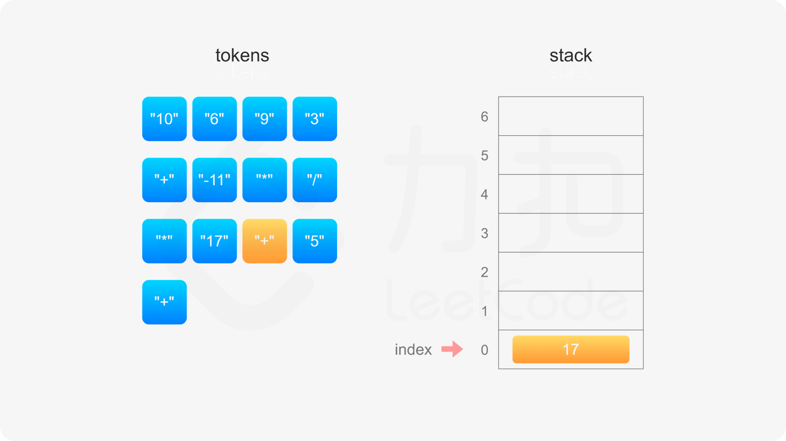
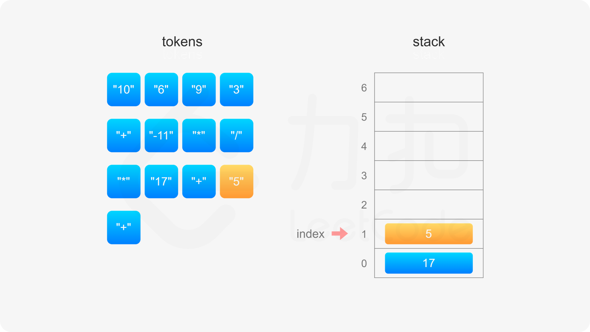
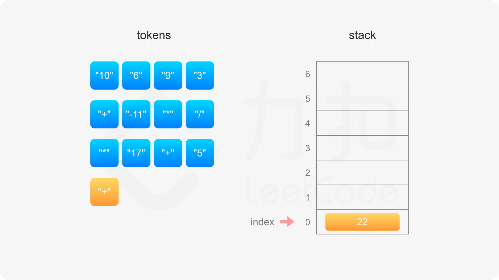
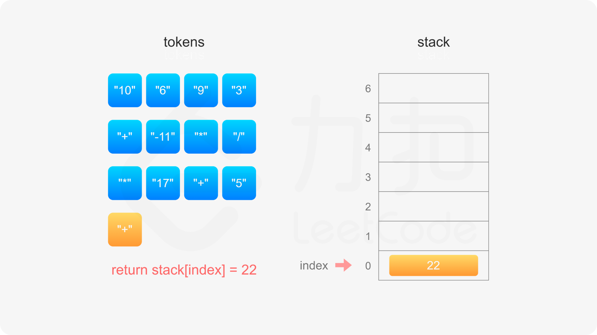

```Java
class Solution {
    public int evalRPN(String[] tokens) {
        int n = tokens.length;
        int[] stack = new int[(n + 1) / 2];
        int index = -1;
        for (int i = 0; i < n; i++) {
            String token = tokens[i];
            switch (token) {
                case "+":
                    index--;
                    stack[index] += stack[index + 1];
                    break;
                case "-":
                    index--;
                    stack[index] -= stack[index + 1];
                    break;
                case "*":
                    index--;
                    stack[index] *= stack[index + 1];
                    break;
                case "/":
                    index--;
                    stack[index] /= stack[index + 1];
                    break;
                default:
                    index++;
                    stack[index] = Integer.parseInt(token);
            }
        }
        return stack[index];
    }
}
```

```JavaScript
var evalRPN = function(tokens) {
    const n = tokens.length;
    const stack = new Array(Math.floor((n + 1) / 2)).fill(0);
    let index = -1;
    for (let i = 0; i < n; i++) {
        const token = tokens[i];
        if (token === '+') {
            index--;
            stack[index] += stack[index + 1];
        } else if (token === '-') {
            index--;
            stack[index] -= stack[index + 1];
        } else if (token === '*') {
            index--;
            stack[index] *= stack[index + 1];
        } else if (token === '/') {
            index--;
            stack[index] = stack[index] / stack[index + 1] > 0 ? Math.floor(stack[index] / stack[index + 1]) : Math.ceil(stack[index] / stack[index + 1]);
        } else {
            index++;
            stack[index] = parseInt(token);
        }
    }
    return stack[index];
}; 
```

```Go
func evalRPN(tokens []string) int {
    stack := make([]int, (len(tokens)+1)/2)
    index := -1
    for _, token := range tokens {
        val, err := strconv.Atoi(token)
        if err == nil {
            index++
            stack[index] = val
        } else {
            index--
            switch token {
            case "+":
                stack[index] += stack[index+1]
            case "-":
                stack[index] -= stack[index+1]
            case "*":
                stack[index] *= stack[index+1]
            default:
                stack[index] /= stack[index+1]
            }
        }
    }
    return stack[0]
}
```

```Python
class Solution:
    def evalRPN(self, tokens: List[str]) -> int:
        op_to_binary_fn = {
            "+": add,
            "-": sub,
            "*": mul,
            "/": lambda x, y: int(x / y),   # 需要注意 python 中负数除法的表现与题目不一致
        }

        n = len(tokens)
        stack = [0] * ((n + 1) // 2)
        index = -1
        for token in tokens:
            try:
                num = int(token)
                index += 1
                stack[index] = num
            except ValueError:
                index -= 1
                stack[index] = op_to_binary_fn[token](stack[index], stack[index + 1])
            
        return stack[0]
```

```C++
class Solution {
public:
    int evalRPN(vector<string>& tokens) {
        int n = tokens.size();
        vector<int> stk((n + 1) / 2);
        int index = -1;
        for (int i = 0; i < n; i++) {
            string& token = tokens[i];
            if (token.length() > 1 || isdigit(token[0])) {
                index++;
                stk[index] = atoi(token.c_str());
            } else {
                switch (token[0]) {
                    case '+':
                        index--;
                        stk[index] += stk[index + 1];
                        break;
                    case '-':
                        index--;
                        stk[index] -= stk[index + 1];
                        break;
                    case '*':
                        index--;
                        stk[index] *= stk[index + 1];
                        break;
                    case '/':
                        index--;
                        stk[index] /= stk[index + 1];
                        break;
                }
            }
        }
        return stk[index];
    }
};
```

```C
int evalRPN(char** tokens, int tokensSize) {
    int n = tokensSize;
    int stk[(n + 1) / 2];
    memset(stk, 0, sizeof(stk));
    int index = -1;
    for (int i = 0; i < n; i++) {
        char* token = tokens[i];
        if (strlen(token) > 1 || isdigit(token[0])) {
            index++;
            stk[index] = atoi(token);
        } else {
            switch (token[0]) {
                case '+':
                    index--;
                    stk[index] += stk[index + 1];
                    break;
                case '-':
                    index--;
                    stk[index] -= stk[index + 1];
                    break;
                case '*':
                    index--;
                    stk[index] *= stk[index + 1];
                    break;
                case '/':
                    index--;
                    stk[index] /= stk[index + 1];
                    break;
            }
        }
    }
    return stk[index];
}
```

**复杂度分析**

- 时间复杂度：$O(n)$，其中 $n$ 是数组 $tokens$ 的长度。需要遍历数组 $tokens$ 一次，计算逆波兰表达式的值。
- 空间复杂度：$O(n)$，其中 $n$ 是数组 $tokens$ 的长度。需要创建长度为 $\dfrac{n+1}{2}$ 的数组模拟栈操作。
