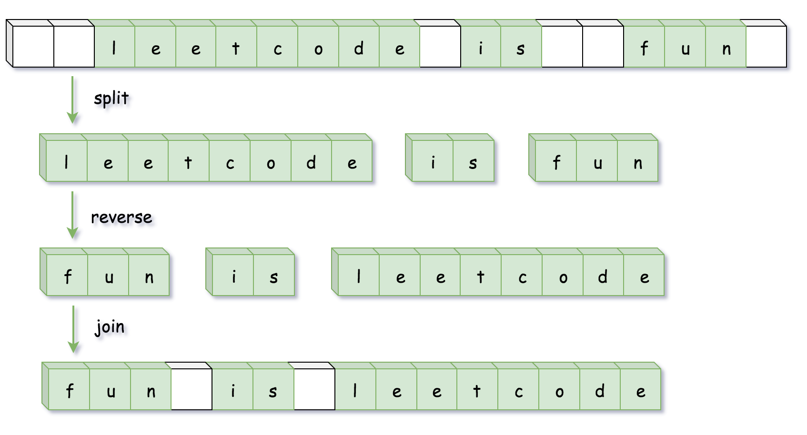

#### [方法一：使用语言特性](https://leetcode.cn/problems/reverse-words-in-a-string/solutions/194450/fan-zhuan-zi-fu-chuan-li-de-dan-ci-by-leetcode-sol/)

**思路和算法**

很多语言对字符串提供了 `split`（拆分），`reverse`（翻转）和 `join`（连接）等方法，因此我们可以简单的调用内置的 API 完成操作：

1.  使用 `split` 将字符串按空格分割成字符串数组；
2.  使用 `reverse` 将字符串数组进行反转；
3.  使用 `join` 方法将字符串数组拼成一个字符串。



```python
class Solution:
    def reverseWords(self, s: str) -> str:
        return " ".join(reversed(s.split()))
```

```java
class Solution {
    public String reverseWords(String s) {
        // 除去开头和末尾的空白字符
        s = s.trim();
        // 正则匹配连续的空白字符作为分隔符分割
        List<String> wordList = Arrays.asList(s.split("\\s+"));
        Collections.reverse(wordList);
        return String.join(" ", wordList);
    }
}
```

```javascript
var reverseWords = function(s) {
    return s.trim().split(/\s+/).reverse().join(' ');
};
```

**复杂度分析**

-   时间复杂度：$O(n)$，其中 $n$ 为输入字符串的长度。
-   空间复杂度：$O(n)$，用来存储字符串分割之后的结果。
