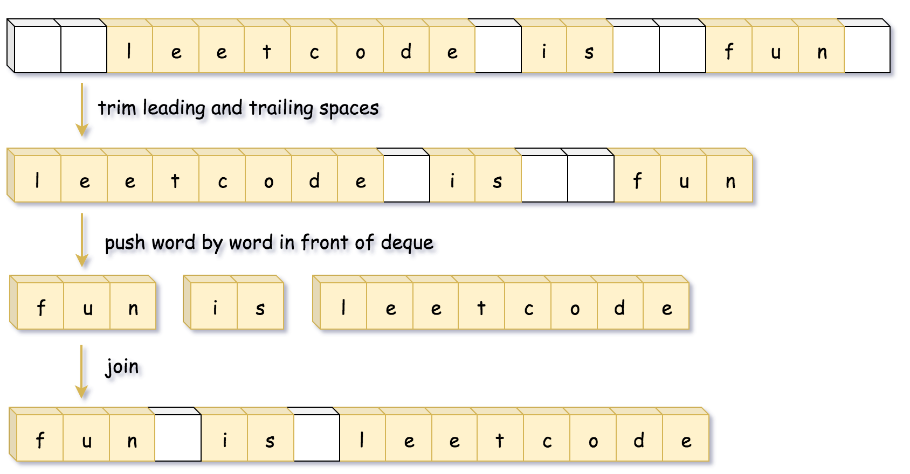

#### [方法三：双端队列](https://leetcode.cn/problems/reverse-words-in-a-string/solutions/194450/fan-zhuan-zi-fu-chuan-li-de-dan-ci-by-leetcode-sol/)

**思路和算法**

由于双端队列支持从队列头部插入的方法，因此我们可以沿着字符串一个一个单词处理，然后将单词压入队列的头部，再将队列转成字符串即可。



```python
class Solution:
    def reverseWords(self, s: str) -> str:
        left, right = 0, len(s) - 1
        # 去掉字符串开头的空白字符
        while left <= right and s[left] == ' ':
            left += 1
        
        # 去掉字符串末尾的空白字符
        while left <= right and s[right] == ' ':
            right -= 1
            
        d, word = collections.deque(), []
        # 将单词 push 到队列的头部
        while left <= right:
            if s[left] == ' ' and word:
                d.appendleft(''.join(word))
                word = []
            elif s[left] != ' ':
                word.append(s[left])
            left += 1
        d.appendleft(''.join(word))
        
        return ' '.join(d)
```

```java
class Solution {
    public String reverseWords(String s) {
        int left = 0, right = s.length() - 1;
        // 去掉字符串开头的空白字符
        while (left <= right && s.charAt(left) == ' ') {
            ++left;
        }

        // 去掉字符串末尾的空白字符
        while (left <= right && s.charAt(right) == ' ') {
            --right;
        }

        Deque<String> d = new ArrayDeque<String>();
        StringBuilder word = new StringBuilder();
        
        while (left <= right) {
            char c = s.charAt(left);
            if ((word.length() != 0) && (c == ' ')) {
                // 将单词 push 到队列的头部
                d.offerFirst(word.toString());
                word.setLength(0);
            } else if (c != ' ') {
                word.append(c);
            }
            ++left;
        }
        d.offerFirst(word.toString());

        return String.join(" ", d);
    }
}
```

```cpp
class Solution {
public:
    string reverseWords(string s) {
        int left = 0, right = s.size() - 1;
        // 去掉字符串开头的空白字符
        while (left <= right && s[left] == ' ') ++left;

        // 去掉字符串末尾的空白字符
        while (left <= right && s[right] == ' ') --right;

        deque<string> d;
        string word;

        while (left <= right) {
            char c = s[left];
            if (word.size() && c == ' ') {
                // 将单词 push 到队列的头部
                d.push_front(move(word));
                word = "";
            }
            else if (c != ' ') {
                word += c;
            }
            ++left;
        }
        d.push_front(move(word));
        
        string ans;
        while (!d.empty()) {
            ans += d.front();
            d.pop_front();
            if (!d.empty()) ans += ' ';
        }
        return ans;
    }
};
```

**复杂度分析**

-   时间复杂度：$O(n)$，其中 $n$ 为输入字符串的长度。
-   空间复杂度：$O(n)$，双端队列存储单词需要 $O(n)$ 的空间。
