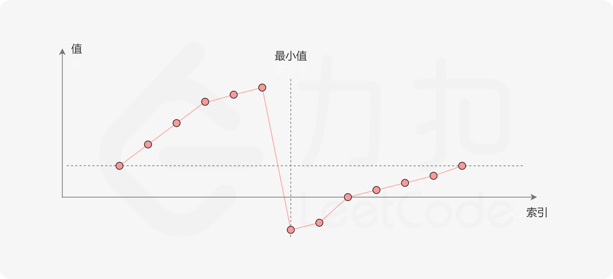
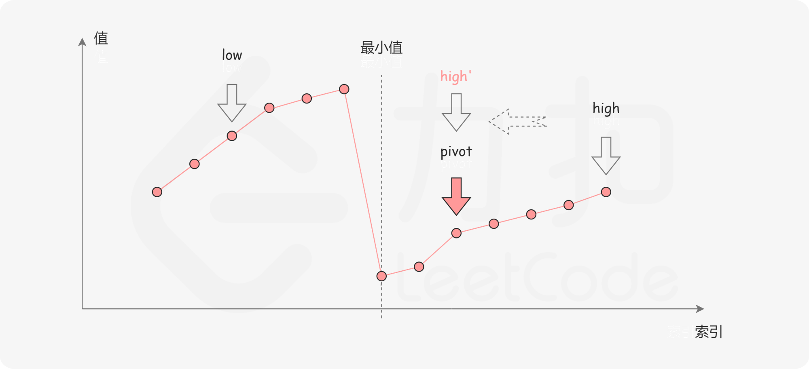
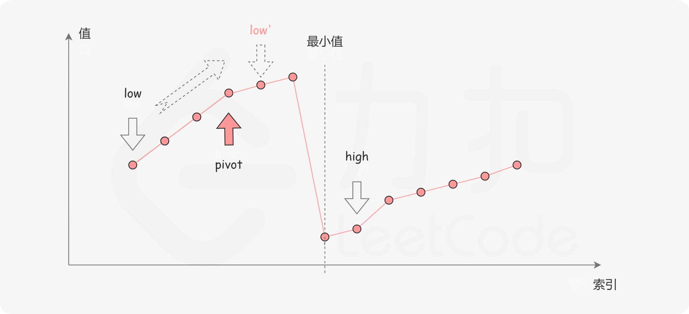

### [寻找旋转排序数组中的最小值](https://leetcode.cn/problems/find-minimum-in-rotated-sorted-array/solutions/698479/xun-zhao-xuan-zhuan-pai-xu-shu-zu-zhong-5irwp/)

#### 方法一：二分查找

**思路与算法**

一个不包含重复元素的升序数组在经过旋转之后，可以得到下面可视化的折线图：



其中横轴表示数组元素的下标，纵轴表示数组元素的值。图中标出了最小值的位置，是我们需要查找的目标。

我们考虑**数组中的最后一个元素 x**：在最小值右侧的元素（不包括最后一个元素本身），它们的值一定都严格小于 $x$；而在最小值左侧的元素，它们的值一定都严格大于 $x$。因此，我们可以根据这一条性质，通过二分查找的方法找出最小值。

在二分查找的每一步中，左边界为 $low$，右边界为 $high$，区间的中点为 $pivot$，最小值就在该区间内。我们将中轴元素 $nums[pivot]$ 与右边界元素 $nums[high]$ 进行比较，可能会有以下的三种情况：

第一种情况是 $nums[pivot]<nums[high]$。如下图所示，这说明 $nums[pivot]$ 是最小值右侧的元素，因此我们可以忽略二分查找区间的右半部分。



第二种情况是 $nums[pivot]>nums[high]$。如下图所示，这说明 $nums[pivot]$ 是最小值左侧的元素，因此我们可以忽略二分查找区间的左半部分。



由于数组不包含重复元素，并且只要当前的区间长度不为 $1$，$pivot$ 就不会与 $high$ 重合；而如果当前的区间长度为 $1$，这说明我们已经可以结束二分查找了。因此不会存在 $nums[pivot]=nums[high]$ 的情况。

当二分查找结束时，我们就得到了最小值所在的位置。

```C++
class Solution {
public:
    int findMin(vector<int>& nums) {
        int low = 0;
        int high = nums.size() - 1;
        while (low < high) {
            int pivot = low + (high - low) / 2;
            if (nums[pivot] < nums[high]) {
                high = pivot;
            }
            else {
                low = pivot + 1;
            }
        }
        return nums[low];
    }
};
```

```Java
class Solution {
    public int findMin(int[] nums) {
        int low = 0;
        int high = nums.length - 1;
        while (low < high) {
            int pivot = low + (high - low) / 2;
            if (nums[pivot] < nums[high]) {
                high = pivot;
            } else {
                low = pivot + 1;
            }
        }
        return nums[low];
    }
}
```

```Python
class Solution:
    def findMin(self, nums: List[int]) -> int:
        low, high = 0, len(nums) - 1
        while low < high:
            pivot = low + (high - low) // 2
            if nums[pivot] < nums[high]:
                high = pivot
            else:
                low = pivot + 1
        return nums[low]
```

```C
int findMin(int* nums, int numsSize) {
    int low = 0;
    int high = numsSize - 1;
    while (low < high) {
        int pivot = low + (high - low) / 2;
        if (nums[pivot] < nums[high]) {
            high = pivot;
        } else {
            low = pivot + 1;
        }
    }
    return nums[low];
}
```

```Go
func findMin(nums []int) int {
    low, high := 0, len(nums) - 1
    for low < high {
        pivot := low + (high - low) / 2
        if nums[pivot] < nums[high] {
            high = pivot
        } else {
            low = pivot + 1
        }
    }
    return nums[low]
}
```

```JavaScript
var findMin = function(nums) {
    let low = 0;
    let high = nums.length - 1;
    while (low < high) {
        const pivot = low + Math.floor((high - low) / 2);
        if (nums[pivot] < nums[high]) {
            high = pivot;
        } else {
            low = pivot + 1;
        }
    }
    return nums[low];
};
```

**复杂度分析**

- 时间复杂度：时间复杂度为 $O(\log n)$，其中 $n$ 是数组 $nums$ 的长度。在二分查找的过程中，每一步会忽略一半的区间，因此时间复杂度为 $O(\log n)$。
- 空间复杂度：$O(1)$。
