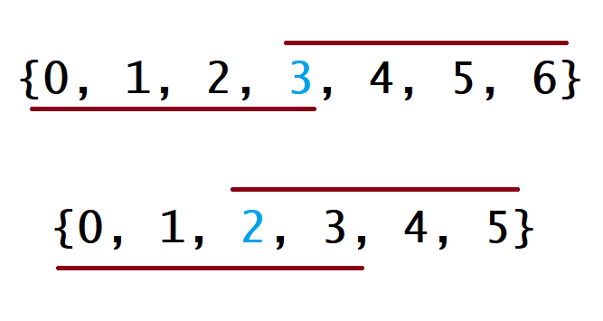

#### [方法二：排序](https://leetcode.cn/problems/majority-element/solution/duo-shu-yuan-su-by-leetcode-solution//#方法二：排序)

**思路**

如果将数组 `nums` 中的所有元素按照单调递增或单调递减的顺序排序，那么下标为 $\lfloor \dfrac{n}{2} \rfloor$ 的元素（下标从 `0` 开始）一定是众数。

**算法**

对于这种算法，我们先将 `nums` 数组排序，然后返回上文所说的下标对应的元素。下面的图中解释了为什么这种策略是有效的。在下图中，第一个例子是 $n$ 为奇数的情况，第二个例子是 $n$ 为偶数的情况。



对于每种情况，数组下面的线表示如果众数是数组中的最小值时覆盖的下标，数组下面的线表示如果众数是数组中的最大值时覆盖的下标。对于其他的情况，这条线会在这两种极端情况的中间。对于这两种极端情况，它们会在下标为 $\lfloor \dfrac{n}{2} \rfloor$ 的地方有重叠。因此，无论众数是多少，返回 $\lfloor \dfrac{n}{2} \rfloor$ 下标对应的值都是正确的。

```java
class Solution {
    public int majorityElement(int[] nums) {
        Arrays.sort(nums);
        return nums[nums.length / 2];
    }
}
```

```python
class Solution:
    def majorityElement(self, nums: List[int]) -> int:
        nums.sort()
        return nums[len(nums) // 2]
```

```cpp
class Solution {
public:
    int majorityElement(vector<int>& nums) {
        sort(nums.begin(), nums.end());
        return nums[nums.size() / 2];
    }
};
```

**复杂度分析**

-   时间复杂度：$O(n\log n)$。将数组排序的时间复杂度为 $O(n\log n)$。
-   空间复杂度：$O(\log ⁡n)$。如果使用语言自带的排序算法，需要使用 $O(\log n)$。如果自己编写堆排序，则只需要使用 $O(1)$ 的额外空间。
